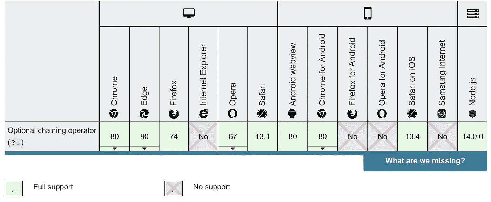

# 这个技巧改变了我在 JavaScript 中访问嵌套对象的方式

> 原文：<https://levelup.gitconnected.com/this-trick-changed-the-way-i-access-nested-objects-in-javascript-bc8ead3a7015>


由[米尔蒂亚迪斯·弗拉基迪斯](https://unsplash.com/@_miltiadis_?utm_source=medium&utm_medium=referral)在 [Unsplash](https://unsplash.com?utm_source=medium&utm_medium=referral) 拍摄的照片

## 一个简单却超级有用的技巧

了解 JavaScript 书中的所有技巧几乎是不可能的。我就是活生生的例子。当我最近翻阅一些 JavaScript 文档来阅读某个主题时，我偶然发现了 JavaScript 中一个我以前从未见过的非常有趣的特性。

虽然我知道 JavaScript 因其许多技巧而闻名——其中一些技巧比另一些更为人所知。我可能不是唯一一个不知道这个技巧的人，所以我想和你分享一下。它完全改变了我访问嵌套对象的方式。

希望这个技巧对你和对我一样有帮助。

# 诀窍是

这一招叫做*可选链接*。其实是一个运营商。可选的链接操作符的写法类似于`?.`。

我听到你在想:*“好的，太好了。是什么，我为什么要用这个？”*

根据 Mozilla web 文档，这就是可选链接操作符的作用:

> 可选的链接操作符允许读取位于连接对象链深处的属性值，而不必明确验证链中的每个引用是否有效。

简而言之，可选的链接操作符极大地简化了访问嵌套值的方式。

让我们直接进入一个例子，帮助您更好地理解可选链接操作符的作用。

假设我们有一个名为 *house* 的对象，看起来像这样:

```
const house = {
  price: 1000000,
  currency: 'USD',
  address: {
    city: 'New York',
    street: 'Main street',
    postal_code: '1234 AB',
    state: {
      name: 'New York',
      abbreviation: 'N.Y.'
    }
  },
  owner: {
    name: "John Doe"
  }
}
```

通常，我们会通过以下方式访问该对象的属性:

```
const currency = house.currency
const price = house.price
const owner = house.owner.name
```

这些是从对象中读取值的基础。但是房子没有主人会怎么样呢？最后一行代码会触发一个错误，因为我们无法读取 undefined 的属性名称。

为了解决这个问题，您应该这样做:

```
const owner = house.owner ? house.owner.name : null
```

或者，如果您真的很喜欢，您可以使用无效合并运算符:

```
const owner = house.owner.name ?? null
```

这段代码的问题是，一旦房子对象没有所有者，它就不起作用。看看下面的例子。

```
const house = {
  price: 1000000,
  currency: 'USD',
  address: {
    city: 'New York',
    street: 'Main street',
    postal_code: '1234 AB',
    state: {
      name: 'New York',
      abbreviation: 'N.Y.'
    }
  },
  owner: null
}
```

使用 nullish 合并运算符将导致错误，因为它无法读取属性*名称*的 *null* 。

使用三元运算符的第一个示例仍然有效。虽然它非常冗长，如果您必须检查一个或两个更深层次的属性，代码会变得非常不可读——因为您必须检查每个属性是否存在。

例如，检查州名如下:

```
const state = house.address && house.address.state ? house.address.state.name : null
```

如你所见，这段代码太长了，很快就变得不可读了。

这就是可选的链接操作符发挥作用的地方。有了这个操作符，就不需要检查某些属性是否存在，这将保持代码的整洁和易于理解。如果一个属性不存在，*未定义的*将被返回。这是操作者在运行时的样子。

```
const city = house?.address?.city // "New York"
const nonExisting = house?.roof?.material // Undefined
const houseNumber = house?.address?.number // Undefined
const state = house?.address?.state?.abbreviation // "N.Y."
```

看到这段代码有多干净了吗？！

在第一个例子中，我们试图从存储在*地址*属性中的*城市*属性中获取值。因为这个属性存在，所以返回城市属性的值。就像使用`house.address.city`来获取值一样。

在第二个例子中，我们试图得到屋顶的材质。但是，*房屋*对象上没有*屋顶*属性，导致*未定义*被返回。对于*门牌号*房产也是如此。虽然*房子*对象有一个*地址*属性，但是这个属性不包含一个*号码*属性——这就是为什么*未定义*也会在这里返回。

您还可以使用可选的 chaining 运算符以动态方式检查属性。为了做到这一点，你必须使用括号符号:

```
const someProperty = obj?.['property-' + propertyName]
```

使用可选链接操作符的最后一种方法是与 nullish 合并操作符结合使用。例如，当必须为变量设置默认值时。

```
const ownerName = house?.owner?.name ?? "Unknown owner"
```

# 功能

到目前为止，我们只在对象中使用了可选的链接操作符。但是也可以将这个操作符与函数结合使用。

当试图调用可能不存在的方法时，可以使用 chaining 运算符。看起来是这样的:

```
const result = someObject.customMethod?.();
```

# 和睦相处

与任何现代 JavaScript 特性一样，一些旧浏览器(比如 Internet Explorer)不支持可选的链接特性。现代浏览器如 Chrome、Firefox、Opera 和 Safari 都支持可选链接。

这不应该阻止你使用可选的链接。在旧浏览器中使用可选链接时，您可以添加聚合填充。



[来源](https://developer.mozilla.org/en-US/docs/Web/JavaScript/Reference/Operators/Optional_chaining)

# 包装它

可选的 chaining 操作符允许您访问深度嵌套的对象，而不必验证每个嵌套引用是否有效。可选的链接操作符最好的地方在于它以优雅的方式完成了这项工作。这不仅适用于对象。您还可以使用可选的链接操作符来尝试调用可能不存在的方法。

然而，你应该记住，可选链接在 Internet Explorer 中并不是开箱即用的，就像许多其他现代 JavaScript 特性一样。这些旧的浏览器需要一个多填充来使可选的链接工作。

编码快乐！