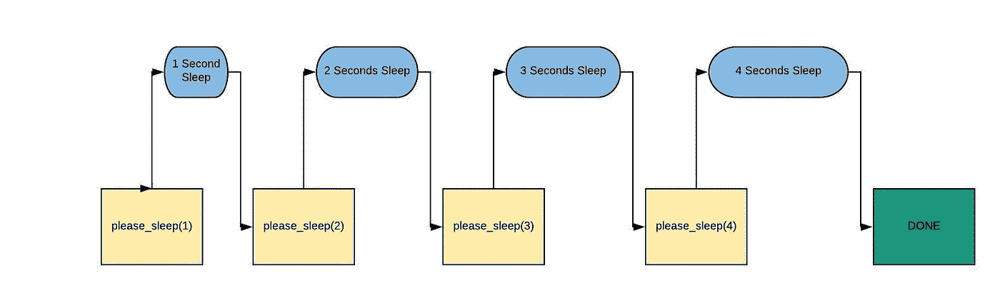
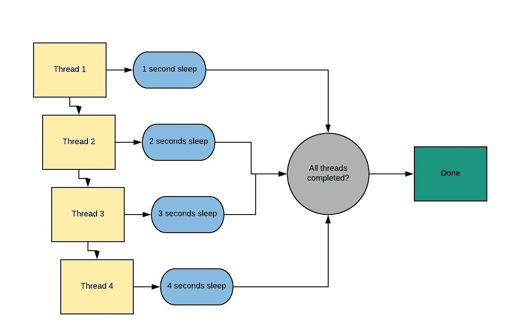
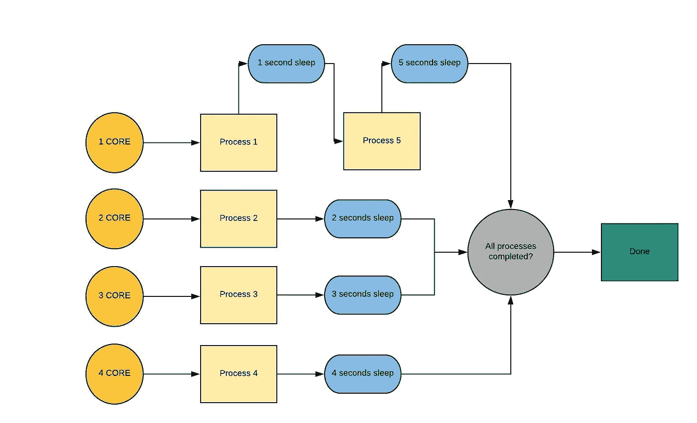
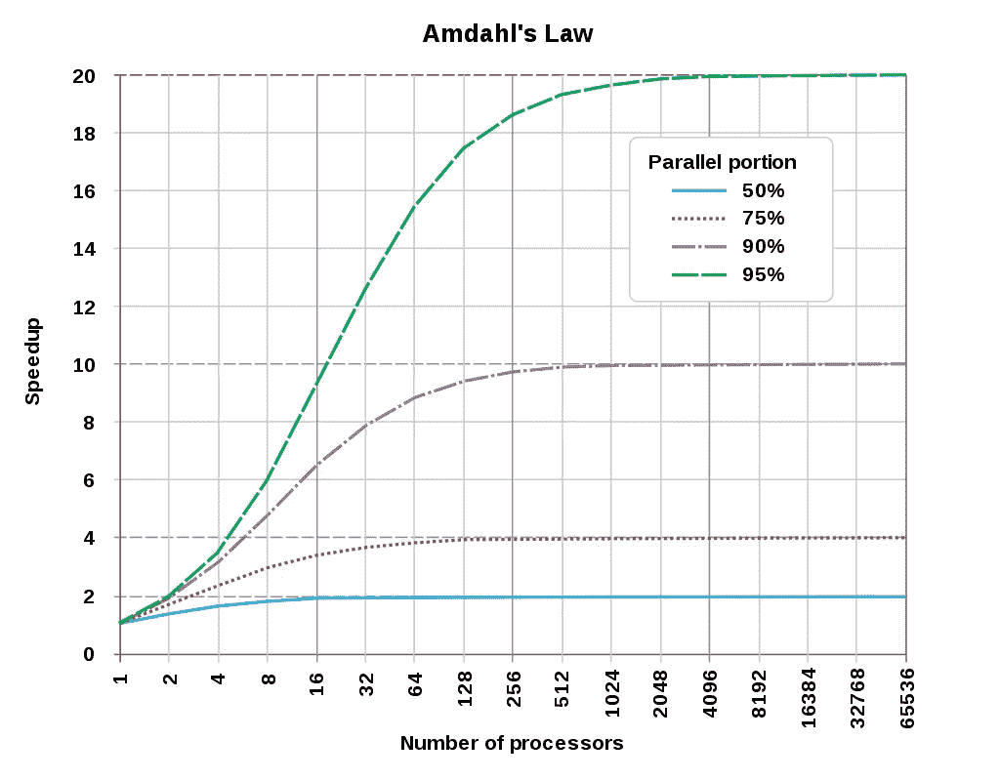

# Python 中的线程和多处理模块

> 原文：<https://levelup.gitconnected.com/threading-and-multiprocessing-modules-in-python-14363c13fe9d>

> 本文提供了 python 中的[线程](https://docs.python.org/3/library/threading.html)和[多重处理](https://docs.python.org/3/library/multiprocessing.html)模块背后的基本思想。


线程背后的基本思想是在程序中执行一系列这样的指令，这些指令可以独立于其他代码执行。

那么线程化和多处理有什么区别呢？当我们想要同时运行不同的任务时，我们通常使用线程，当我们想要执行基于进程的并行时，则使用多处理。

## 受计算和 I/O 限制的任务

在计算范围内，计算的进展速度完全取决于 CPU 的性能，而在 I/O 范围内，进程的进展速度受到输入和输出系统速度的限制。

在受计算约束的任务中，程序大部分时间只是使用 CPU，即进行计算。一个沉迷于处理数字的程序更有可能是一个计算密集型的任务。

与所需的计算量相比，处理大量磁盘数据的任务(例如，计算文件中的行数)很可能会受到 I/O 的限制。

## Python 的 GIL 问题

一般来说，Python 只使用一个线程来执行写好的语句集。这意味着在 python 中一次只能执行一个线程。python 中单线程进程和多线程进程的性能是一样的，这是因为 python 中的 [GIL](https://wiki.python.org/moin/GlobalInterpreterLock) (全局解释器锁)。我们不能在 python 中实现多线程，因为我们有一个全局解释器锁，它限制线程并作为一个单独的线程工作。

**进程**加速 CPU 密集型的 Python 操作，因为它们受益于多核并避免了 GIL，而**线程**最适合 IO 任务或涉及外部系统的任务，因为线程可以更有效地组合它们的工作。流程需要处理它们的结果来组合它们，这需要时间。

**由于 GIL，线程**在 python 中对 CPU 密集型任务没有提供任何好处。

## 为什么是 GIL？

线程模块使用线程，多处理模块使用进程。区别在于线程运行在同一个内存空间，而进程有各自独立的内存。这使得在具有多重处理的进程之间共享对象有点困难，因此通常通过酸洗对象来实现。由于线程使用相同的内存，因此必须采取预防措施，否则两个线程将同时写入相同的内存。这就是全局解释器锁的用途。

如果我们运行一个 python 脚本，它只是执行一个简单的睡眠任务(这肯定会很耗时，哈哈哈！)那么脚本应该是这样的。

```
import timestart = time.perf_counter()def please_sleep(n):
    print("Sleeping for {} seconds".format(n))
    time.sleep(n)
    print("Done Sleeping")for i in range(1,5):
   please_sleep(i)finish = time.perf_counter()print("Finished in {} seconds".format(finish-start))
```

我们得到了我们都期望的结果


该脚本的工作流程如下所示:



*让我们从线程模块*开始

# 线程模块

线程的工作流程可以描述如下:



我们首先需要导入线程模块(显然！)

为了使用线程复制上面提到的脚本，我们需要创建多个线程，这可以通过多次执行简单的**线程**方法来完成。其语法如下所示

```
thread1 = threading.Thread(target = method_name, args = [list of arguments])
```

一旦我们创建了线程，我们需要使用 **start** 方法来启动它们

```
thread1.start()
```

让我们举一个简单的例子，先创建 2 个线程，然后我们将尝试复制上面的脚本

```
import time
import threadingstart = time.perf_counter()def please_sleep(n):
    print("Sleeping for {} seconds".format(n))
    time.sleep(n)
    print("Done Sleeping")t1 = threading.Thread(target = please_sleep, args = [1])
t2 = threading.Thread(target = please_sleep, args = [2])t1.start()
t2.start()finish = time.perf_counter()print("Finished in {} seconds".format(finish-start))
```

根据工作流，我们现在应该认为这段代码应该执行大约 2 秒钟。现在让我们看看输出。


哎呀，这是意料之外的，对吧？发生这种行为是因为在两个线程都启动后，当线程都在休眠时，我们的脚本同时运行，并继续执行脚本的其余部分。从而立即计算出结束时间。

为了防止这种情况，我们应该使用 **join** 方法。当调用 **join** 方法时，调用线程(在我们的例子中是主线程)被阻塞，直到调用它的线程对象(please_sleep 方法)被终止。我们可以以类似于 **start** 方法的方式调用它

```
thread1.join()
```

现在让我们用我们学过的概念复制主脚本。

```
import time
import threadingstart = time.perf_counter()def please_sleep(n):
    print("Sleeping for {} seconds".format(n))
    time.sleep(n)
    print("Done Sleeping for {} seconds".format(n))threads = []for i in range(1,5):
    t = threading.Thread(target = please_sleep, args = [i])
    t.start()
    threads.append(t)for t in threads:
    t.join()finish = time.perf_counter()print("Finished in {} seconds".format(finish-start))
```

这将打印出预期的结果。


因此，我们在将近 4 秒内成功地执行了这 4 项任务，而这些任务原本需要将近 10 秒。

*使用多处理模块可以完成这项任务吗？是的，让我们看一看。*

# 多重处理模块

我的机器上有 4 个内核，所以我将参照我的机器进行说明。这是多重处理的工作流程。



开始一个过程的过程😛类似于螺纹。这里我们首先导入多处理模块，然后调用 **Process** 方法，后面跟着一个 start 方法。

```
process1 = multiprocessing.Process(target = method_name, args = [list of arguments])
process1.start()
```

与进程相比，线程更加轻量级，开销也更低。因此，生成进程比生成线程要慢一些。让我们借助一个例子来看看。

```
import time
import multiprocessingstart = time.perf_counter()def please_sleep(n):
    print("Sleeping for {} seconds".format(n))
    time.sleep(n)
    print("Done Sleeping for {} seconds".format(n))p1 = multiprocessing.Process(target = please_sleep, args = [1])
p2 = multiprocessing.Process(target = please_sleep, args = [2])p1.start()
p2.start()finish = time.perf_counter()print("Finished in {} seconds".format(finish-start))
```

下面描述的输出显示，在整个脚本运行之后，进程已经启动。这证明了我们的上述声明。


此处的 **join** 方法还防止在调用后执行进一步的脚本，直到流程完成。它可以作为

```
process1.join()
```

现在让我们创建一个脚本，它使用多线程来并行化该方法。

```
import time
import multiprocessingstart = time.perf_counter()def please_sleep(n):
    print("Sleeping for {} seconds".format(n))
    time.sleep(n)
    print("Done Sleeping for {} seconds".format(n))processes = []for i in range(1,6):
    p = multiprocessing.Process(target = please_sleep, args = [i])
    p.start()
    processes.append(p)for p in processes:
    p.join()finish = time.perf_counter()print("Finished in {} seconds".format(finish-start))
```

输出将根据工作流程。


使用并行总是伴随着效率的损失，也就是说，它利用了更多的资源，因此并行执行的计算的总时间通常比串行更快。在[阿姆达尔定律](https://en.wikipedia.org/wiki/Amdahl%27s_law)的帮助下，我们可以说，多处理器并行计算只对高度可并行化的程序有用。



这张图片取自[维基百科](https://en.wikipedia.org/wiki/Amdahl%27s_law#/media/File:AmdahlsLaw.svg)

我很欣赏你的耐心，谢谢你坚持到现在。

欢迎建议！

谢谢😺