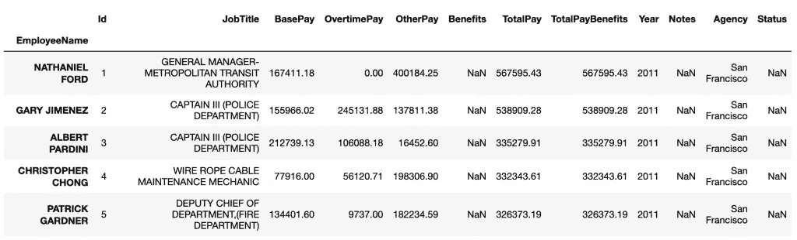
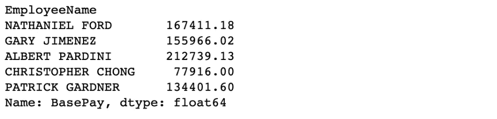
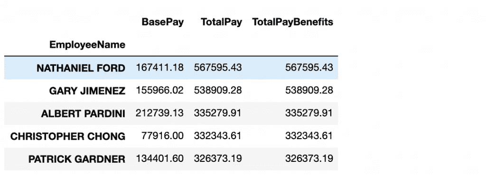
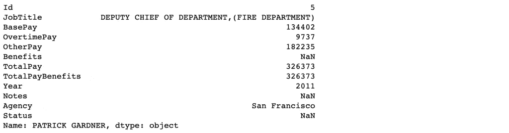
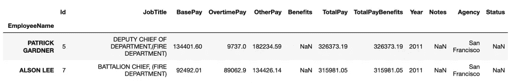
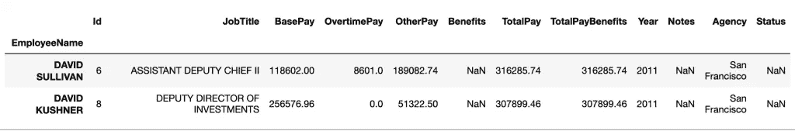
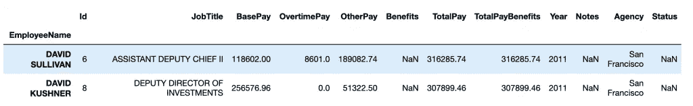
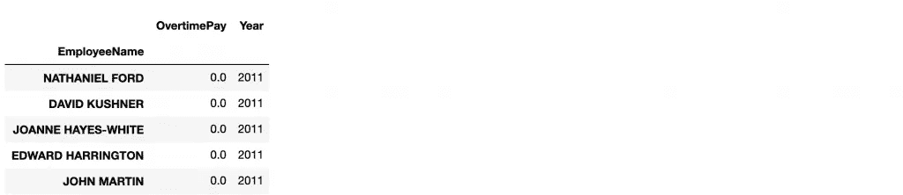
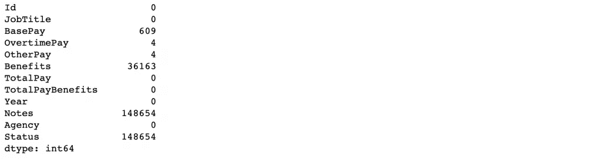
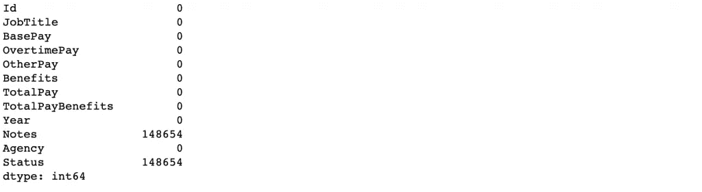

# 熊猫的三种基本数据分析方法

> 原文：<https://levelup.gitconnected.com/three-basic-data-analyzing-methods-in-pandas-ea2cd6c26b4d>

熊猫基础知识将永远帮助你！


迈克尔·佩恩在 [Unsplash](https://unsplash.com/s/photos/panda?utm_source=unsplash&utm_medium=referral&utm_content=creditCopyText) 上的照片

Python 是数据科学中最流行的脚本语言之一。语法简单而优雅，Python 为科学计算提供了极好的库。用 Python 做数据科学最重要的库之一是 Pandas。这篇博文是关于我在处理熊猫数据分析时遇到的三种有用的技术。

# 1.子集选择

“子集选择”听起来可能很可怕，但它只是选择特定的数据，即数据帧中的一些行和列。我们可以使用以下三种方法进行索引:

1.  `DataFrame[ ]`:该功能也称为索引操作符
2.  `DataFrame.loc[ ]`:该功能用于标签
3.  `DataFrame.iloc[ ]`:该功能用于基于位置或整数

如果我们看到一些例子，就更容易理解了。为此，我采用了 [Kaggle 的 SF 薪水数据集](https://www.kaggle.com/kaggle/sf-salaries)。现在让我们导入熊猫和一些必要的库，并读取数据帧。

现在我们将选择一些行和列。

## 使用[ ]索引数据帧:

```
# importing pandas package 
import pandas as pd

# making data frame from csv file 
df = pd.read_csv("Salaries.csv", index_col= "EmployeeName") 

# Show first 5 data points of the dataframe
df.head()
```

数据看起来像这样:



```
# retrieving columns by indexing operator 
base_pay = df["BasePay"] 
base_pay.head()
```



为了选择多个列，我们需要在索引操作符中传递一个列列表。

```
columns= df[['BasePay', 'TotalPay', 'TotalPayBenefits']]
columns.head()
```



## 使用索引数据帧。位置[ ]:

在这种方法中，我们可以通过标签选择特定的行或列或两者。这意味着它可以同时选择行和列的子集。一些例子将使这一陈述变得清楚。

```
row= df.loc["PATRICK GARDNER"]
row
```



它向我们展示了通过使用`.loc[]`方法获取雇员的姓名，我们就获得了关于该行的所有信息。为了选择多行，我们应该将所有的行标签放在一个列表中，并将其传递给`.loc[]`方法。

但是如果我们想以这样的方式传递行和列标签，我们需要创建两个单独的列表:

`Dataframe.loc[[“row1”, “row2”], [“column1”, “column2”]]`

让我们看看这是什么意思。

```
row_column= df.loc[["PATRICK GARDNER","ALSON LEE"], ["BasePay", "TotalPayBenefits"]]
row_column
```


但是如果我们想要选择这两行的所有列，那么我们需要使用':'符号，如下所示-

```
new_row_column= df.loc[["PATRICK GARDNER","ALSON LEE"], :]
new_row_column
```



## 使用索引数据帧。iloc[ ]:

`DataFrame.iloc[]`与前面的方法非常相似，只是它通过指定整数位置来选择行和列。我们需要放置我们想要检索的行或列的整数位置。让我们看一些使用这种方法选择单行和多行和多列的例子。

```
single_row= df.iloc[5]
single_row
```


```
multiple_row= df.iloc[[5, 7]]
multiple_row
```



```
single_row_column= df.iloc[[5],[3]]
single_row_column
```


```
multiple_row_column= df.iloc[[5,7], [3,7]]
multiple_row_column
```


类似于`.loc[]`方法，我们需要使用':'符号来选择所有的行或列。

```
all_columns_two_rows= df.iloc[[5,7], :]
all_columns_two_rows
```



# 2.布尔选择

布尔索引允许我们使用数据的值从数据帧中检索数据。我们可以不使用行或列标签/整数位置，而是使用实际值来过滤数据，以获得所需的信息。一个例子可以说明这一点:

比如说，我们想抓住 2011 年没有拿到任何加班费的员工，我们可以通过:

```
new_df= df.loc[(df["OvertimePay"]== 0.0) & (df["Year"]== 2011), ["OvertimePay", "Year"]]
new_df.head()
```



# 3.输入缺失值

`fillna( )`是一种可以帮助你轻松填充缺失值的方法。它可用于通过不同的方法更新缺失值，如“回填”、“向前填充”等。让我们检查我们正在处理的数据帧中缺少的值。

```
df.isnull().sum()
```



我们看到在不同的列中有许多丢失的值。在真实情况下，如果有缺失值，它会妨碍实现任何模型和获得正确的预测。因此，我们总是发现自己在分析数据时需要输入缺失值。让我们估算“基本工资”、“加班工资”、“其他工资”和“福利”栏中的值。

```
df["BasePay"].fillna(method= 'ffill', inplace= True)
df["OvertimePay"].fillna(method= 'ffill', inplace= True)
df["OtherPay"].fillna(method= 'ffill', inplace= True)
df["Benefits"].fillna(method= 'bfill', inplace= True)
```

你可以查看熊猫 [**。fillna()**](https://pandas.pydata.org/pandas-docs/stable/reference/api/pandas.DataFrame.fillna.html) 文档来了解关于方法参数的更多信息。

现在让我们检查这些列中是否有任何缺失值:

```
df.isnull().sum()
```



所以我们看到所有缺失的值都被填满了。

在本文中，我们已经看到了 Pandas 的一些功能，这些功能可以使数据分析和预处理更容易，并且在执行特征工程时很有帮助。为了充分利用数据分析，我们还需要掌握其他一些重要的功能。

这个故事也发表在我个人的 [**博客**](https://muniah.com/) 。

附言:这些方法是我在 Udemy 的课程“Python for Data Science and Machine learning boot camp”做练习时学到的。