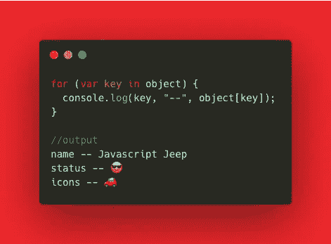
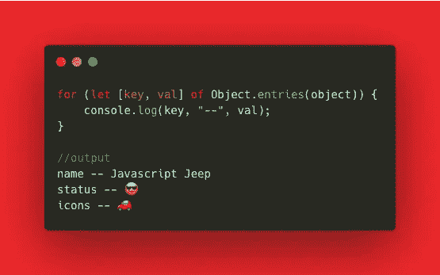
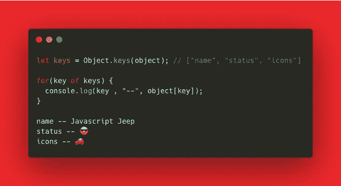

# 遍历 JavaScript 对象的三种不同方式

> 原文：<https://levelup.gitconnected.com/three-different-ways-to-loop-through-javascript-object-b9b3d2714a1f>

了解如何在 Javascript 中遍历对象。

```
var object = { name : "Javascript Jeep", status : "😎", icons : "🚗"}
```

使用`for..in`



有了 ES6，我们可以使用`**Object.entries**` 循环遍历对象的每个条目。`**Object.entries**` 方法返回一个`**[key, value]**` **数组。**



我们也可以使用`**Object.keys**` 返回一个填充了对象键的数组。使用这个数组我们可以遍历对象。



如果你知道一些其他的方法来循环对象，请留下你的评论。

如果你发现这个有用的惊喜🎁我这里的[](https://www.paypal.me/jagathishSaravanan?source=post_page---------------------------)****。****

****开心就分享😃 😆 🙂。****

****跟随** [**Javascript Jeep🚙**](https://medium.com/u/f9ffc26e7e69?source=post_page---------------------------) **如果你觉得值得。****

**[](https://gitconnected.com/learn/javascript) [## 学习 JavaScript -最佳 JavaScript 教程(2019) | gitconnected

### JavaScript 是世界上最流行的编程语言之一——它随处可见。JavaScript 是一种…

gitconnected.com](https://gitconnected.com/learn/javascript)**