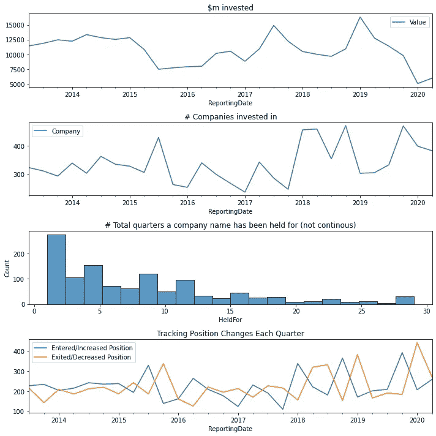

# 从 SEC 13F-HR 文档中抓取和可视化对冲基金数据的三个简单步骤

> 原文：<https://levelup.gitconnected.com/three-easy-steps-to-web-scrape-and-visualize-hedge-fund-data-from-sec-13f-hr-documents-5f45df22b1e9>

## Web 抓取和数据可视化

## 使用 Selenium 和 BeautifulSoup4 进行基本的网页抓取，以确定 Bridgewater 的投资趋势。


我肯定我不是第一个告诉你这个的人，但是网上有一个数据宝库，你可以用它来回答你可能有的任何问题。例如，如果我们想知道一些金融界最聪明的人是如何在过去十年中驾驭美国股票市场的，会怎么样？Bridgewater 就是一个很好的例子，幸运的是，他们被要求在一份名为 13F-HR 的 SEC 季度报告中公开记录他们所持股份的名称和规模。

> 美国证券交易委员会(SEC)的表格 **13F** 是一份季度报告，要求所有管理资产至少 1 亿美元的机构投资经理提交。它披露了他们的股票持有情况，并能提供一些关于精明的资金在市场上做什么的见解。

我们要抓取的 URL 是这里的，我们将只抓取第一页，所以这次不用担心分页循环。对于许多网站来说，javascript 元素用于在加载时将数据从服务器借入表中——这意味着如果我们只是使用 BeautifulSoup4 (BS4)来读取 https 请求的响应，我们想要的数据都不会被加载进来。这意味着我们需要使用一个方便的浏览器驱动程序(意思是可以在网络浏览器中做任何事情的机器人)来加载我们想要的页面: [Selenium](https://selenium-python.readthedocs.io/) 。你可以用 conda 来安装它，但是你也需要为你想使用的任何浏览器准备驱动程序包。我用 Chrome 进行网络抓取，所以我去找了最新的 chromedriver，并把可执行文件的位置添加到我电脑的环境路径变量中。

首先，我将创建一个空的数据帧来存储所有季度 13F 表单的链接，然后我将遍历这些链接，将我需要的数据解析成最终的数据帧。

设置如下所示:

第 13 行启动了一个驱动程序，所以你会看到一个机器人控制的 Chrome 实例在你的屏幕上弹出。第 23 行将您想要的 URL 加载到页面中。页面加载后，我们希望运行:

```
soup = BeautifulSoup(
    driver.page_source, "html.parser"
)
```

这会将 html 加载到一个 soup 对象中，这允许 BS4 轻松地搜索不同的 html 标签和其他关键元素。如果您想查看 html，只需运行`soup.prettify()`，注意这样做会将它转换成一个字符串。现在，我们准备好`ctrl+shift+J`来检查 html 中我们需要解析的内容。BS4 有两个关键函数，您需要使用它们来获得您想要的任何数据:

1.  `soup.find_all(tag,{'id':’id_name'})`这将给你一个包含你指定的标识符的标签的所有匹配的数组。
2.  `soup.find(tag,{'id':’id_name'})`这将给你**一个特定标签的第一个**匹配，该标签带有你指定的标识符。

我们将使用这两个函数来创建 Documents 表中所有季度报告行的数组，然后遍历它们来填充我们的`all_q`数据框架。

您可以在这里看到，我在第 6 行和第 7 行的末尾添加了一个`.text`,将 soup 对象转换为我的 dataframe 的字符串。`[‘href']`自动返回一个字符串，所以不需要在那里放一个`.text`。接下来，我们将浏览这个数据框架中的每个链接，运行`driver.get(url)`，获取页面源代码，然后获取持有数据。我用 if 语句按索引对它进行了拆分，因为语句的格式在这些年里已经发生了变化。

现在我们已经保存了我们的数据，我们需要做的就是一些熊猫数据框架的操作，我们可以看到自 2009 年以来的持有量和趋势。

我创建了四个枢纽来创建四个独立的图表，每个图表分配给一个`(ax1,ax2,ax3,ax4)`。如果您熟悉基本的 Python、Pandas 和 Matplotlib，逻辑应该不会那么混乱。

最终，我们以这张图表作为输出结果:



布里奇沃特控股公司自 2009 年以来的分析

看到基金如何随着时间的推移投资和进入/退出市场是非常有趣的，特别是在 2016 年左右和 2019 年年中，当时存在关键的经济/市场不确定性。

任何对冲基金、交易所交易基金/指数基金等等都可以做到这一点，所以尽情享受将他们的策略和你对自己投资组合的见解结合起来的乐趣吧！