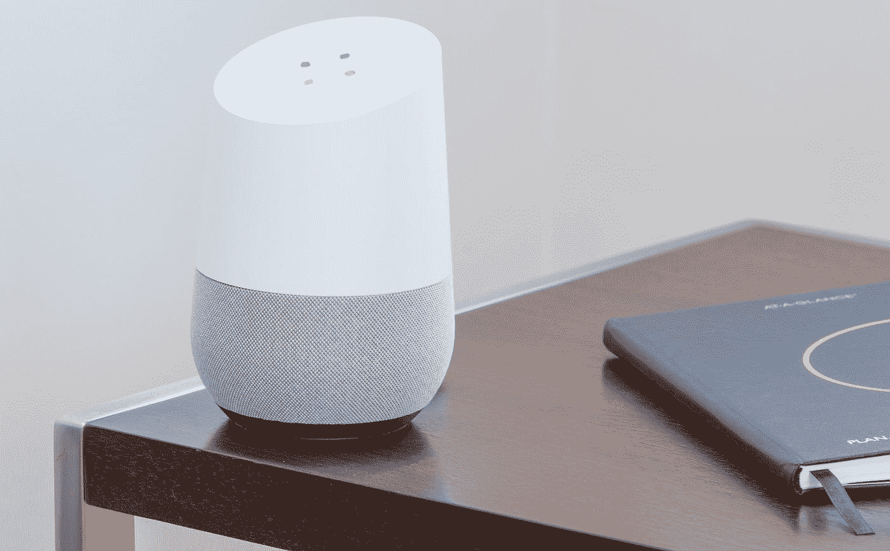

# 2020 年软件工程的三大趋势

> 原文：<https://levelup.gitconnected.com/three-niche-trends-in-software-engineering-for-2020-9c0771423b43>

## 忘掉那些陈词滥调吧:一些真正的选择，让你的职业在短期内多样化

由 [Austin Distel](https://unsplash.com/@austindistel?utm_source=medium&utm_medium=referral) 在 [Unsplash](https://unsplash.com?utm_source=medium&utm_medium=referral) 上拍摄

你需要不断学习才能在软件工程中生存并跟上潮流。在我之前的文章 [*停止喂养自我*](https://medium.com/swlh/stop-feeding-the-ego-3ccd6edb3ad5) 中，我们研究了为什么会出现这种情况，以及如何解决。然而，有一个问题没有得到回答。

> 如何从几乎每天都出现的大量新框架和技术中选择关注的内容？

软件工程是一个广阔而开放的领域，有成百上千的框架可以花无数的时间去学习，有些是相关的，有需求的，有些则不那么相关。因此，毫不奇怪，选择关注什么是一项艰巨的任务，尤其是对于刚开始涉足该领域或在某个特定领域工作多年后希望改变方向的人来说。

今天，我们将探讨三个我认为值得探索的领域，以拓展一个人的技能。它们受到当前行业趋势的启发，但又足够具体，可以立即付诸实施。我特意在这里做了详细说明。当网上有大量关于这些主题的文章时，我不想泛泛地谈论人工智能、AR / VR 和区块链。我想提供一些有用的信息来帮助你今天开始学习新的东西。

介绍够了，让我们直接开始吧！

*在我们开始之前，请注意:我在结尾处添加了一个参考资料部分，在那里您可以找到整篇文章中提到的所有框架和技术的链接。*

# 语音助手

托马斯·科尔诺斯基在 [Unsplash](https://unsplash.com?utm_source=medium&utm_medium=referral) 上拍摄的照片

如今语音助手无处不在。*谷歌助手*、 *Siri* 和 *Alexa* 在过去五年左右的时间里已经成为家喻户晓的名字，特别是得益于智能音箱和其他家用设备的兴起，不管有没有屏幕。他们每天都变得越来越好。

这一广泛领域的工作范围从改进实际的助理技术，到整合现有服务和开发新的助理技能，根据您的偏好和能力为您提供了广泛的选择。

这些助手背后的技术进步是由 ***人工智能*** 和 ***深度学习*** 驱动的，涵盖了文本到语音、语音到文本以及句子分析和识别等各个方面。如果你决定走这条路，你可能想在申请该领域的大公司之一(亚马逊、谷歌、苹果、百度、微软等)的工作之前，开始熟悉**和该领域的最新发展。).或者，您可以尝试一些开源实现，如 ***Mycroft。艾*** 。**

**除了核心助手开发，在将第三方服务 整合到这些助手中 ***也有很多机会。Google Assistant、Siri 和 Alexa 的 SDK 都是现成的，并且有据可查。它们的操作在技术上与使用其他 SDK/API 没有任何不同，尽管熟悉语音交互的具体概念无疑会给你在该领域寻找工作带来优势。*****

# **无密码认证**

****

**照片由 [NeONBRAND](https://unsplash.com/@neonbrand?utm_source=medium&utm_medium=referral) 在 [Unsplash](https://unsplash.com?utm_source=medium&utm_medium=referral) 上拍摄**

**密码已过时。这是任何身份验证策略中最薄弱的环节，也是最终用户登录工作流程中最令人沮丧的方面。谁想记住各种在线身份的大量凭证列表呢？密码管理器会有所帮助，但也会带来额外的风险。**

**好消息是，密码可以被更难破解的替代认证手段取代，例如直接在最终用户选择的智能手机上执行的生物识别验证。这些技术包括指纹、面部和虹膜识别，可单独使用或与预先设定的密码结合使用，以进一步确认用户的身份。**

**随着世界逐渐远离加密密码，工程师有机会专注于生物识别的验证方面，或者这种身份验证方法与第三方服务的实施/集成。**

**同样，您的选择会有所不同，这取决于您是希望成为认证等式中的*生产者方*还是*消费者方*。对于前者，就像我们看到的语音助手一样，大部分工作都涉及到 ***AI /深度学习*** ，这次同时涵盖了递归和 ***卷积神经网络*** 。后者对于面部和指纹识别尤其如此，因为在这两种情况下都涉及图像分类，并且在这一领域的研究非常热烈。**

**就生物识别领域的潜在雇主而言，选择相当广泛，从谷歌和苹果基于智能手机的解决方案，一直到医疗和执法等特定市场的[***cross match***](https://www.crossmatch.com/)和 [***身份自动化***](https://www.identityautomation.com/) 。**

**在*消费者方面*，显而易见的起点是苹果和谷歌分别针对 iOS 和 Android 的生物识别的 SDK 文档。**

# **静态网站生成**

****

**照片由[潘卡杰·帕特尔](https://unsplash.com/@pankajpatel?utm_source=medium&utm_medium=referral)在 [Unsplash](https://unsplash.com?utm_source=medium&utm_medium=referral) 上拍摄**

**或许不如前两者那么吸引人，但内容丰富的网站的创建和管理仍然有很高的需求，因为越来越多的公司利用内容向他们想要的客户群推销自己。**

**传统上， *Wordpress* 一直是创建这类网站的首选平台，而且它今天仍然很强大。然而，Wordpress 是一个由 PHP 驱动的复杂的 CMS 系统，需要持续的维护和更新来管理潜在的安全威胁。**

**另一个最近越来越受欢迎的选择是静态网站的程序化生成。这些服务具有快速和高度可扩展的优势，因为它们可以通过 CDN 提供服务，并且降低了安全风险，因为它们不需要 PHP 或执行 web 服务器本身之外的任何其他服务器端代码。**

**生成这类网站的一些流行工具包括 ***NextJS*** ， ***GatsbyJS*** 和 ***Hugo*** 。**

**前两个是基于脸书的流行 web 开发框架*，Hugo 是基于谷歌的 ***Go*** 语言。***

**框架本身非常容易学习，尤其是如果你有底层技术(Javascript / React 或 Go)的背景知识，并且可以与纯前端框架结合，如 ***Bootstrap*** 和 ***排版。JS*** 快速扭转一个看起来很专业的网站。**

**我最喜欢的是 ***GatsbyJS*** ，感谢它的 ***React*** 基础、 ***GraphQL*** 数据查询和大量可用的插件，包括一个允许你使用 Markdown 文档作为网页数据源的插件。**

**事实上，我认为 *GatsbyJS* 对于来自传统前端 web 开发背景的人来说，也是一个非常好的 React 和 GraphQL 入门，对于希望提升技能的工程师来说，这是一个有效的选择，也许最终会进入复杂的 web 应用程序开发。**

# **离别的想法**

**我希望你觉得这篇快速阅读很有用，并希望你今天能有所启发去学习新的东西。**

**不管你选择学什么，从这个列表或其他，重要的是你在做的时候有乐趣。没有什么比专攻你不感兴趣的领域更糟糕的了，也许是因为现在或将来高薪的诱惑。**

**最终，你会感到厌倦，你的代码质量会受到影响，也许这就是为什么你现在正在阅读这篇文章。如果是这样的话，我不会责怪你，因为我自己以前也经历过，但我有一个发人深省的想法:你还在等什么来扭转你的职业生涯？**

> **教育是我们通向未来的护照，因为明天只属于今天为之做准备的人。—马尔科姆·Ⅹ，1964 年**

**直到下一篇文章，继续发展你的激情！**

# **参考资料/进一步阅读**

## **语音助手**

*   **递归神经网络的最新进展，Hojjat Salehinejad 等人[ [PDF](https://arxiv.org/pdf/1801.01078.pdf) ]**
*   **迈克罗夫特。AI，开源语音助手[ [网站](https://mycroft.ai/) ]**
*   **面向开发者的 Siri，苹果[ [网站](https://developer.apple.com/siri/) ]**
*   **Alexa Voice SDK，亚马逊[ [网站](https://developer.amazon.com/alexa-voice-service/sdk) ]**
*   **在谷歌、谷歌[ [网站](https://developers.google.com/actions/)上的操作**

## **无密码认证**

*   **PoreNet:用于高分辨率指纹识别的基于 CNN 的毛孔描述符，Vijay Anand 和 Vivek Kanhangad，IEEE [ [PDF](https://arxiv.org/pdf/1905.06981.pdf)**
*   **安卓生物识别 SDK，谷歌[ [网站](https://source.android.com/security/biometric)**
*   **LocalAuthentication，苹果[ [网站](https://developer.apple.com/documentation/localauthentication)**

## **静态网站生成**

*   **NextJS —可扩展的生产级 React 应用程序[ [网站](https://nextjs.org/) ]**
*   **GatsbyJS——React[[网站](https://www.gatsbyjs.org/) ]的高速现代站点生成器**
*   **Hugo——Hugo 是最流行的开源静态站点生成器之一**