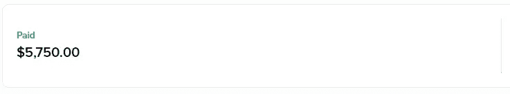

# 三个品质帮助我将自由职业者的工资从每小时 5 美元增加到每小时 50 美元

> 原文：<https://levelup.gitconnected.com/three-qualities-that-helped-me-to-increase-my-freelancing-rate-from-5-an-hour-to-50-an-hour-5a52f79fbced>

克里斯托夫·高尔在 [Unsplash](https://unsplash.com/s/photos/freelancing?utm_source=unsplash&utm_medium=referral&utm_content=creditCopyText) 上拍摄的照片

我从 2020 年 4 月左右开始做自由职业者，主要是全栈软件开发者。如果我没记错的话，我在 2020 年 4 月对一场演出收取 5 美元一小时，从 2021 年 11 月起，我开始收取 50 美元一小时。我非常感激，更幸运的是，我能够来到这里。

首先，我分享了我在 Toptal 上从一个客户那里得到的最新付款的一个片段，这笔付款是几个月来总共 115 个小时的工作。我分享这个，因为如果它能激励某人，我会很喜欢，它也能向你们保证我已经应用了我将要给出的建议。另外，请把它当作一个数字，仅此而已。

最高工资

接下来，我将分享三个具体的品质，我相信它们帮助我在 18 个月内将收入提高了 10 倍。我会在这里长话短说，但如果你想深入讨论任何事情，请随时联系我们。

## 1.永远为工作敞开大门，永远

对我来说非常有效的一件事是，我不断地与潜在客户交谈。它有助于我了解目前市场上人才短缺的情况，需要什么技能，并让我了解当前的薪酬水平。此外，当我与那些向我寻求潜在机会的人交谈时，他们向我保证，我的技能很受欢迎，我不会很快失业。因此，我能够更好地评估未来的机会，并且不会对项目感到绝望。此外，这些联系也使我能够帮助我的自由职业者同事，到目前为止，我已经能够将项目/工作传递给其他四个开发人员。

> 机会总是向那些敞开大门并准备好一旦机会到来就抓住它的人而来。

## 2.在公共场合谈论你的进步和失败

自由职业界没有年度最佳员工奖，也没有晋升和年度加薪。作为一名自由职业者，评估你所带来的价值是你的工作。拥有社交媒体的存在是至关重要的，不幸的是，我们已经到了被关注的关键时刻，但你需要积极地发帖、写作、交谈，甚至有时吹嘘自己。自由职业者的数量不断增加，想要脱颖而出，最好的方法就是打造自己的品牌。谈论你的学习，你正在做的不同项目，如何与客户互动，你认为你可以在哪里增加最大价值，等等。自由职业是一门生意，如果不建立一个有效的网络，生意就无法发展。

> 一个好的网络会在你无法想象的时间和方式上帮助你。

## 3.认为

我一直在想这个问题，但这个问题将决定你最终是平凡还是传奇。相信你自己，相信你的技能，相信这个世界。要求世界上最好的，不仅仅是经济上的，而是整体上的，永远不要满足于一个客户，他很粗鲁但是报酬很高。等待，更加努力地工作，绝望地相信更好的客户就在那里，是他们找到你的时候了。当我开始时，我觉得如果我达到每小时 20 美元，那将是巨大的，这将是有人愿意付给一个有三年经验的印度开发者的最高工资。但是当我达到 20 美元的时候，我知道这不是结束，我不应该限制自己，除非我是世界上收入最高的开发者。

> 如果你希望某事发生，你首先需要相信它能发生。

我最近一次徒步旅行的照片

总而言之，永远要对机会保持开放，建立一个强大的个人品牌，并且不可救药地相信美好的事物就在几步之外。

此外，如果你是一名开发人员/设计师，我想补充的是，我的研究告诉我，现在在 web3 世界中存在超级人才短缺，区块链空间正在变得疯狂，那里对人力资源的需求正在变得疯狂。我自己有几个职位空缺，所以如果你在加密领域工作，并对更多/新的工作[开放，请联系](https://www.linkedin.com/in/bhavya-y-mehta/)。

最后，感谢你花时间阅读这篇文章，如果你正在寻找一份自由职业者的工作，或者只是想开始，或者对我的文章有建议，请在下面发表评论。此外，如果你想了解更多关于 Toptal 的信息并与我联系，你可以通过 [Instagram](https://www.instagram.com/iambhavyamehta/) 或 [LinkedIn](https://www.linkedin.com/in/bhavya-y-mehta/) 联系我。