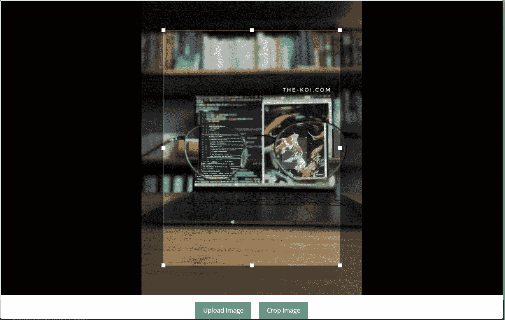

# 在 vue.js 中裁剪图像的三个简单步骤。

> 原文：<https://levelup.gitconnected.com/three-simple-steps-to-crop-images-in-vue-js-3f23a018cf3b>


摘自我的博客 the-koi.com

## 有时，你不仅想上传图像，而且还想将它们转换成适合的形状，例如，一个预定义的框。我们都从 twitter 这样的平台上了解到这一点。

为此，我们将创建另一个组件，用户可以在其中调整图像以满足其需求。所有这一切都将通过一个名为 [vue advanced cropper](https://norserium.github.io/vue-advanced-cropper/introduction/getting-started.html) 的库来实现，它们拥有这个名字所承诺的东西。所以让我们开始吧！

# 如何在 vue 中裁剪图像？

为了在 vue 中**裁剪图像，你可以使用一个叫做 **vue-image-cropper** 的强大软件包。你只需要首先**上传一张图片**并将其传递给组件，然后**执行其裁剪方法**并**保存结果**。搞定了。**

我把所有关于 vue image cropper 的知识打包成一个三步指南。

# 步骤 1:安装 vue 高级裁剪器

```
npm install -S vue-advanced-cropper
```

# 步骤 2:构建图像裁剪器组件



组件的外观示例

以下是这个 vue-advanced-cropper 示例的 vue 模板:

```
<cropper 
        ref="cropper" 
        class="example-cropper" 
        :src="image" />
<drop-zone
          v-model="image"
          :label="upload"
          :location="location"
          @uploaded="newImagesUploaded"
          class="pb-15"
        />
```

要裁剪您的图像，您首先需要像任何其他组件及其 CSS 一样导入图像裁剪器组件。

```
import { Cropper } from "vue-advanced-cropper";
    import "vue-advanced-cropper/dist/style.css";
    export default {
      name: "vueImageCropperExample",
      components: {
        Cropper
      },
      ...
```

作为一个图像源，你可以使用任何你想要的东西，我已经使用了本教程[中优雅的拖放组件](https://www.the-koi.com/projects/upload-images-from-vue/)，叫做 dropZone。您也可以使用原始的 HTML 输入。

然后给收割者一个参考。或者，您可以向 cropper 组件添加一些样式，就像我对 example-cropper 类所做的那样。

你也可以添加其他的[主题](https://norserium.github.io/vue-advanced-cropper/guides/theming.html#basics)到裁剪器中，只需要将想要的 CSS 文件导入到你的组件中。

# 步骤 3:裁剪图像并保存结果

```
methods: {
        cropImage() {
          const result = this.$refs.cropper.getResult();
          const newTab = window.open();
          // for testing open the result in a new tab
          newTab.document.body.innerHTML = `</img>`;
        }
      }
    };
```

要在 vue 中裁剪您的图像，使用*这个*。$ refs . cropper . get result()；

要在 vue 中裁剪您的图像，使用*这个*。$ refs . cropper . get result()；

这将访问 cropper 组件并从中获取裁剪后的图像！

我用下面的裁剪图像方法来做这个。从 vue-advanced-cropper 中取出图像后，我保存了它，为了测试，你可以简单地在一个新标签中打开它或者再次下载它。

就是这样！在[文档](https://norserium.github.io/vue-advanced-cropper/introduction/getting-started.html)中，有很多方法可以扩展你的裁剪器来满足你的需求！

实现这一点只需要几分钟，您将最终得到一个实用而优雅的 vue 图像裁剪组件。

下面你可以找到这个 vue 高级裁剪器例子的完整代码，请随意复制和使用它！

```
<template>
    <v-card width="auto">
      <div class="example">
        <cropper ref="cropper" class="example-cropper" :src="image" />
        <drop-zone
          v-model="image"
          :label="upload"
          :location="location"
          @uploaded="newImagesUploaded"
          class="pb-15"
        />
        <div class="button-wrapper">
          <span class="button" @click="cropImage">Crop image</span>
        </div>
      </div></v-card
    >
  </template>

    <script>
    import { Cropper } from "vue-advanced-cropper";
    import "vue-advanced-cropper/dist/style.css";
    export default {
      name: "vueImageCropperExample",
      components: {
        Cropper
      },
      props: {},
      data() {
        return {
          image:
            "https://images.pexels.com/photos/4218687/pexels-photo-4218687.jpeg?auto=compress&cs=tinysrgb&dpr=2&h=650&w=940"
        };
      },
      methods: {
        cropImage() {
          const result = this.$refs.cropper.getResult();
          const newTab = window.open();
          // for testing open the result in a new tab
          newTab.document.body.innerHTML = `</img>`;
        }
      }
    };
    </script>

    <style>
    .example-cropper {
      border: solid 1px #eee;
      min-height: 300px;
      width: 100%;
      height: 85vh;
    }

    .button-wrapper {
      display: flex;
      justify-content: center;
      margin-top: 17px;
    }

    .button {
      color: white;
      font-size: 16px;
      padding: 10px 20px;
      background: #35b392;
      cursor: pointer;
      transition: background 0.5s;
      font-family: Open Sans, Arial;
      margin: 0 10px;
    }

    .button:hover {
      background: #38d890;
    }

    .button input {
      display: none;
    }
    </style>
```

# 可选步骤 4:使用 axios 将图像上传到 API

裁剪完成后，您可能希望将裁剪后的图像上传到 API。

上传这些图片最简单的方法是使用 axios。Axios 是一个了不起的 JavaScript 网络库，每个前端开发人员都应该知道。所有主流前端框架都有版本，Vue 也是如此。

要使用 axios 上传我们的图像，我们只需访问结果并将其转换为 Blob(二进制大对象)。我们正在从图像裁剪器的画布元素中创建 blob。确保指定正确的文件格式来保存底部的 blob！我喜欢用 png。然后，我们将这个 blob 传递给一个带有一些附加参数的 formData 对象。然后这个 blob 可以被发送到你的 API 或者 S3 桶或者任何你想保存它的地方！

```
const { canvas } = this.$refs.cropper.getResult();
      if (canvas) {
        const formData = new FormData();
        canvas.toBlob(async blob => {
          formData.append(
            "File",
            blob,
            "myImageName.png"
          );
          // add optional stuff like an path to save the image
          formData.append("path", "/theKoiIsAwesome");
          // You can use axios, fetch and other libraries instead here
			let config = {
            headers: {
              "Content-Type": "multipart/form-data"
            }
          };
          let res = axios.post(`${ImageResource}`, formData, config);
          console.log("[save bg img]", result);
          // Perhaps you should add the setting appropriate file format here
        }, "image/png");
      }
```

# 结论

Vue advanced cropper 是一个令人难以置信的库，可以轻松地为您的 Vue 项目构建防弹图像裁剪功能。这个库不仅易于使用，而且具有高度的可扩展性和可定制性。文档也很容易理解，有很多例子。

我希望我能帮助你，节省你一些时间。

快乐编码，

亚历克斯

*最初发表于*[T5【https://www.the-koi.com】](https://www.the-koi.com/projects/vue-crop-images-the-elegant-way/)*。*

# 参考

[vue 高级收割机](https://norserium.github.io/vue-advanced-cropper/introduction/getting-started.html)

[axios](https://axios-http.com/)