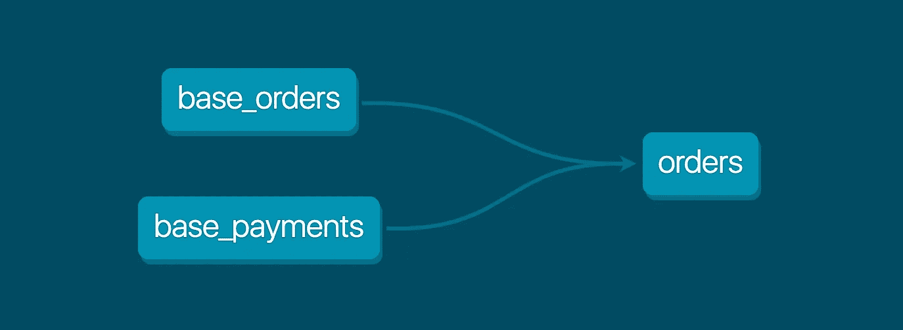

# 三种技术将提高你的编码技能

> 原文：<https://levelup.gitconnected.com/three-techniques-that-will-improve-your-coding-skills-23b47487ede4>

## 编码

也许你刚刚进入了一个训练营。你的 Python 技能有点粗糙或者你只是想升级。如果这些你听起来很熟悉，那么你来对地方了。今天我想谈一谈如何使用特定的方法、单元测试、一些基本的 CI/CD 等等来提升你的编码技能。


凯文·卡纳斯在 [Unsplash](https://unsplash.com?utm_source=medium&utm_medium=referral) 上的照片

你准备好了吗？因为我已经准备好让你学习并成为一名更好的程序员！

*本文是系列文章的一部分——下面是* [*概述文章*](https://dutchengineer.medium.com/let-me-show-you-to-your-biggest-adventure-yet-in-the-data-science-world-4cc16a83479a) *。*

**测试驱动开发(TDD)和单元测试**

我将使用单元测试库，因为它很容易上手，但是也有其他库可以使用，比如 pytest。

假设你想创建一个函数，去掉字符串中的数字。在编写函数之前，我将编写一个类似下面这样的测试，这样我就可以在 helper.py 中创建新函数的同时测试它。

```
**import** **unittest
from helper import remove_numeric****class** **TestRemoveNumeric**(unittest.TestCase):

    **def** test_remove_numerical(self):
        self.assertEqual(remove_numeric('foo123'), 'foo')**if** __name__ == '__main__':
    unittest.main()
```

这就是测试驱动的开发。这种特殊的方法有几个主要的好处。它迫使我让函数有一个焦点。每当我在做一个项目时，我都希望将所有这些不同的特性添加到一个函数中，以使程序正常工作。这些额外的“特性”防止了代码的可重用性和复杂性，所以保持函数有一个目标允许我重用它并容易地测试它。

接下来，我想重点谈谈 SQL 代码的可测试性，这是我们在数据科学领域使用的另一种重要语言。

dbt 是一个相当新的工具，它使得 SQL 单元测试变得非常容易。每个表或视图都是一个模型；这些模型在 YAML 文件中定义，如下所示。

```
version: 2

models:
  - name: Account
    columns:
      - name: AccountID
        tests:
             - unique
```

还有许多其他测试也可以很容易地运行:

*   非空值
*   在另一个模型中有对应值的值
*   值的列表

我也可以很容易地创建我自己的单元测试。

可以从这些模型中生成文档，这些模型可以显示表格和风险敞口或从这些表格中提取的仪表板之间的相关性，如下所示。



*简单 dbt 项目的 DAG 在*上找到了[https://docs.getdbt.com/docs/introduction](https://docs.getdbt.com/docs/introduction)

上面的图像过于简单。但是下一次你不会问为什么这个表在这里，因为你可以很容易地查找表、列和类型。

我们已经通过了 python 和 SQL 的测试。当其他人添加代码时，添加这些测试将使持续集成部分更加顺利。自然地，这将我们引向持续集成和部署。

这里有很多我们可以使用的工具。大多数工具可以是无代码或低代码工具，如 azure 管道和 AWS 代码管道，而其他工具可以使用 GitLab CI/CD 或 Github 操作中使用的 YAML 文件进行完全定制。下面是 GitLab YAML 的一个例子。它首先确定阶段，称为构建和测试。

```
stages: - build - testbuild_stg: stage: build script: - echo "We are currently in the build stage”test_stg: stage: test script: - python3 -m unittest test.py
```

在这种情况下，构建阶段只是打印出一条语句。然而，我通常让它构建一个我刚刚创建的 python 代码的 docker 文件。第二阶段 test 将实际运行测试。当添加新代码时，这些测试仍然必须通过，这就是我们如何限制副作用的数量。

通过将这些从 YAML 的登台和生产环境中分离出来，您现在有了一个持续集成和部署系统的小例子。

通过实现测试驱动的开发，为 python 和 SQL 添加单元测试，并在持续集成和部署方面变得更好，你很快就会成为一名更好的程序员。

接下来你想看什么？统计？可视化？或者也许..完全不同的东西？在这里给我留言或者在 LinkedIn 上给我发消息！