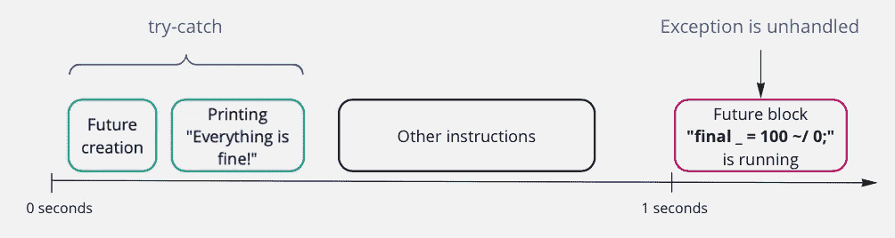
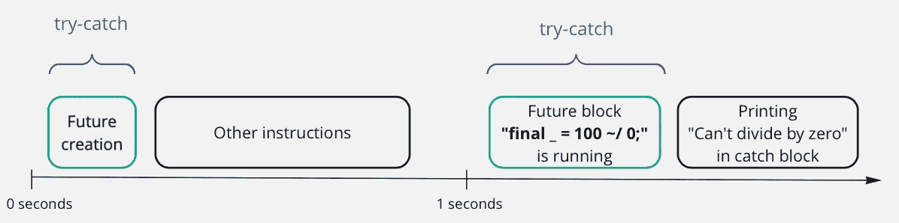
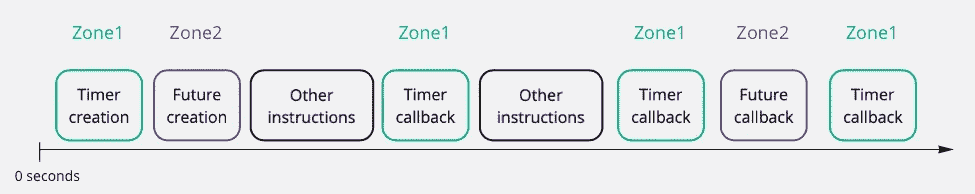

# 关于 Dart 和 Flutter 中的异常处理，你不知道的三件事

> 原文：<https://levelup.gitconnected.com/three-things-you-didnt-know-about-exception-handling-in-dart-and-flutter-d021e1458f08>


本·赫尔希在 [Unsplash](https://unsplash.com?utm_source=medium&utm_medium=referral) 上的照片

很抱歉这篇文章的标题是 clickbait，我正在尝试不同的风格…但我不想让你失望，我会提供所有这三样东西:)

**什么是例外？**

有两种类型的异常定义:

1.  **一个例外是一项操作无法履行其合同**
2.  **异常是一种意外的行为**

第一个定义似乎可以包括第二个定义，因为意外行为可能是运营无法履行合同的原因之一。其他原因可能包括或多或少的预期问题，如连接丢失、文件损坏等。

作为一个例子，让我们考虑这个函数:

这个函数返回我们账户中剩余的钱。为了做到这一点，该函数应该访问我们的后端并请求帐户余额，此操作可能会因为各种原因而失败-网络故障、服务器故障、前端和后端之间的合同被更改等。所有这些原因都会导致我们的操作无法履行其合同。然而，所有这些问题都是可以预见的，我们可以将它们添加到合同中。我们唯一不能期待的就是意料之外的行为:)。例如，我们预料到了所有的问题，除了一个:当后端在某些情况下返回文本“负数”而不是我们帐户的余额时——所以这对我们来说是意想不到的(这是一个完全人为的例子，但只是给你一个想法)。

我们对我们的系统了解得越多，一些意外行为发生的可能性就越小。

下一个问题是，在所有这些特殊情况下，我们将怎么办。我们是否希望对每种情况做出不同的反应，或者我们可能不太关心服务器是否停机或返回一些意外的数据？这是我们系统设计的问题，但无论如何，我们需要一种方法来单独捕捉这些异常或作为一般的异常情况，以便我们能够做出相应的响应。

**不同语言的异常处理**

在不同的编程语言中，对上述考虑因素的考虑是不同的。让我们考虑 Go、Rust 和 Dart 用于处理异常的三种方法(我不是 Go 和 Rust 方面的专家，所以如果您发现代码有问题，请随意评论)。

省道:

去吧:

生锈:

1.  在 C++和 Dart 中使用的最常见的方法是主要关注快乐路径。所以代码非常容易阅读，并且没有被许多错误分支污染。另一方面，不太清楚哪个代码块会导致错误，以及会导致什么类型的错误。例如，在上面的例子中，如果你查看函数 *getRemainingAmount* 内部，你很可能无法判断它是否会抛出异常。
2.  在 Go 中，一切都围绕着错误处理展开。因此，除了值之外，函数还应该返回一个必须在函数调用后立即处理的错误。如果函数不能产生错误，它应该只返回一个结果，并且，它将清楚地表明函数是无错误的。没有办法默默地忽略一个错误，希望上游代码会处理它——当然，您可以忽略一个错误，但该错误不会自动传播到上游，您必须显式地这样做。
3.  在 Rust 中，有第三种处理异常/错误的方式。它看起来类似于 Go:函数可以返回带有值或错误的类型，然后您可以使用模式匹配来了解它是值还是错误，以及返回了哪种错误。这不是强制性的，但没有其他方法抛出异常(除了 *panic* 但这是另一个故事)，所以你可能想从所有可能导致错误的函数中返回任一类型。代码看起来非常可读，你不能不处理它就把异常/错误传递到上游(除非异常类型与上游函数中的完全相同)。

这三种方法中的任何一种都可以用在 Dart 的代码中，你可以返回一个带有值和错误的对象，或者返回带有值或错误的结果，或者使用传统的 *try-catch* 块和 Dart 提供的其他现成选项。

让我们探索一下 Dart 为我们提供了哪些异常处理选项。

**飞镖和颤振中的异常处理**

我们需要使用异常处理的情况有哪些？

1.  同步码
2.  异步代码
3.  定时器
4.  流
5.  颤振 app 整体

**同步码**

Dart 中处理异常的主要工具是 *try-catch-finally* 构造——和许多其他语言一样。

为了捕捉代码块中的所有异常，您将代码包装在 *try* 块中，并使用多个 *on-catch* 指令来处理一些特定的异常，然后使用 *catch* 来处理所有其他意外异常，最后使用 *finally* 来运行应该在 *try* 块和任何 *catch* 块中的代码之后调用的代码。即使你从 *try* 或 *catch* 块返回或者在 *catch* 块中重新抛出异常，最后*中的代码也会被调用。*

指令*重新抛出*帮助你在处理之后抛出同样的异常，这样上游代码会处理它。

输出:

```
Cant divide to zero
Clean-up done 1Format exceptions FormatException: format is wrong
Clean-up done 2Allocate something 3
Unknown exceptions: Other error occurred, with stack: 
#0      main (file:///Users/user/Downloads/dart_sample/bin/sync_exceptions.dart:26:5)
#1      _startIsolate.<anonymous closure> (dart:isolate-patch/isolate_patch.dart:299:32)
#2      _RawReceivePortImpl._handleMessage (dart:isolate-patch/isolate_patch.dart:168:12)Clean-up something 3
Unhandled exception:
Other error occurred
#0      main (file:///Users/user/Downloads/dart_sample/bin/sync_exceptions.dart:26:5)
#1      _startIsolate.<anonymous closure> (dart:isolate-patch/isolate_patch.dart:299:32)
#2      _RawReceivePortImpl._handleMessage (dart:isolate-patch/isolate_patch.dart:168:12)
```

我们可以看到，所有三个 *try-catch* 块都捕获了异常，在第三个块中，异常在清理完成后被重新抛出。

对于处理同步代码块中的异常来说，这已经足够了。你可以在这里查看更多细节——https://dart.dev/guides/language/language-tour#catch

**异步代码**

让我们考虑这个例子:

输出:

```
Everything is fine!
Clean-up done
Unhandled exception:
IntegerDivisionByZeroException
#0      int.~/ (dart:core-patch/integers.dart:22:7)
#1      main.<anonymous closure> (file:///Users/user/Downloads/dart_sample/bin/async_exceptions.dart:6:21)
#2      new Future.delayed.<anonymous closure> (dart:async/future.dart:325:39)
#3      Timer._createTimer.<anonymous closure> (dart:async-patch/timer_patch.dart:18:15)
#4      _Timer._runTimers (dart:isolate-patch/timer_impl.dart:397:19)
#5      _Timer._handleMessage (dart:isolate-patch/timer_impl.dart:428:5)
#6      _RawReceivePortImpl._handleMessage (dart:isolate-patch/isolate_patch.dart:168:12)
```

我们希望在将来处理延迟一秒钟的异常。该代码未能捕获异常是很自然的，因为 *try-catch* 块中的代码只是安排在 *try-catch* 完成工作后一秒调用*计算*(期货回调/平仓)。

在时间轴上看起来大概是这样的:



捕获异步代码中的异常

怎么修？有许多方法可以解决这个问题，例如，在*未来*之前添加*等待*指令。它强制在 *try-catch* 内部调用*计算*，这样 *try* 块将能够成功捕获并处理异常。

输出:

```
Cant divide to zero
Clean-up done
```

现在它工作正常了，我们设法捕捉到了异常，并在之后进行了清理。

我们可以这样表示新代码:



如果我们有一个期货链呢？完全没问题， *try-catch* 会捕捉所有的异常，只要我们在第一个之前插入*wait*。

输出:

```
Its ok so far
Cant divide to zero
Clean-up done
```

如果你不喜欢上面捕捉异常的方式，你可以使用点语法和 *catchError* 函数。

输出:

```
Its ok so far
Cant divide to zero
Clean-up done
```

在上面的代码中， *catchError* 是 *catch* 块的模拟， *whenComplete* 是 *finally* 块的模拟。函数 *catchError* 捕捉位于它上面的所有代码中的异常，因此如果您怀疑*在 Complete* 时会抛出异常，您可以在它之后再添加一个 *catchError* 。

输出:

```
Its ok so far
Cant divide to zero
Clean-up done
Oh, error in the finally block
```

您可以使用 *catchError* 函数的 *test* 参数进行异常匹配。

输出:

```
Its fie so far
Then started
All other exceptions: random exception
Clean-up done
```

看起来不是超级可读吧？这就是为什么 Dart 代码风格建议在这种情况下使用 *await (* [代码风格指南](https://dart.dev/guides/language/effective-dart/usage#prefer-asyncawait-over-using-raw-futures))和 *try-catch* 。它可能看起来像这样:

输出:

```
Its fie so far
Then started
All other exceptions: random exception
Clean-up done
```

从我个人的角度来说，要清晰的多，可读性强。

此外，它还有一个优势——它可以处理同步和异步代码，因此如果您需要在两个异步调用之间进行一些计算，您不必创建额外的同步 *Future* (就像您在使用*点*语法的情况下所做的那样)，只需将这些代码添加到 *try* 块中。

哦，这很简单，对吧？这段代码呢？

```
Everything is fine!
Clean-up done
Timer runs.
Unhandled exception:
Exception: [Timer] Bad thing happens!
#0      main.<anonymous closure> (file:///Users/user/Downloads/dart_sample/bin/async_exceptions.dart:7:7)
#1      Timer._createTimer.<anonymous closure> (dart:async-patch/timer_patch.dart:18:15)
#2      _Timer._runTimers (dart:isolate-patch/timer_impl.dart:397:19)
#3      _Timer._handleMessage (dart:isolate-patch/timer_impl.dart:428:5)
#4      _RawReceivePortImpl._handleMessage (dart:isolate-patch/isolate_patch.dart:168:12)
```

:((笑中带哭)。是啊，计时器里也会发生不好的事情。上面的代码不能很好地处理这些不好的事情，因为定时器的*回调*将被调用，而不是在 *try-catch* 块中，我们不能用 *await* 指令来修复它，因为我们不能等待定时器。

一个显而易见的解决方案是在定时器回调中添加 *try-catch* ，但是如果我们不想用异常处理来污染回调，或者在定时器回调中有一个非常复杂的异步逻辑，并且我们想在运行定时器的地方处理来自那个逻辑的异常？

**区域和运行区域防护**

*runZonedGuarded* 可以帮你解决这个问题以及更复杂的情况！

*Zones (*

它是如何工作的？计时器中的每个*回调*或*计算*、*微任务、*和*期货*被包装到 Z *one* 中的一个特殊*处理程序*中。*处理程序*将*回调*包装在 try-catch 中，如果 *catch* 被触发，则*区域*会调用一个未捕获的错误处理程序，您可以在其中处理这些错误。

每段代码都在某个*区域*中运行，即使你没有创建你的自定义*区域*它也会在*根区域*中被调用，这意味着我们无论如何都是安全的！

让我们看看如何解决计时器的问题:

输出:

```
Everything is fine!
Timer runs.
Exception handled Exception: [Timer] Bad thing happens!, 
#0      main.<anonymous closure>.<anonymous closure> (file:///Users/user/Downloads/dart_sample/bin/async_exceptions.dart:7:7)
#1      _rootRun (dart:async/zone.dart:1182:47)
#2      _CustomZone.run (dart:async/zone.dart:1093:19)
#3      _CustomZone.runGuarded (dart:async/zone.dart:997:7)
#4      _CustomZone.bindCallbackGuarded.<anonymous closure> (dart:async/zone.dart:1037:23)
#5      _rootRun (dart:async/zone.dart:1190:13)
#6      _CustomZone.run (dart:async/zone.dart:1093:19)
#7      _CustomZone.bindCallback.<anonymous closure> (dart:async/zone.dart:1021:23)
#8      Timer._createTimer.<anonymous closure> (dart:async-patch/timer_patch.dart:18:15)
#9      _Timer._runTimers (dart:isolate-patch/timer_impl.dart:397:19)
#10     _Timer._handleMessage (dart:isolate-patch/timer_impl.dart:428:5)
#11     _RawReceivePortImpl._handleMessage (dart:isolate-patch/isolate_patch.dart:168:12)
```

轻松点。只需将您的代码包装到 **runZonedGuarded** 中，并添加一个错误处理程序。没有异常可以挤过这个构造…直到我们不会在错误处理程序本身中抛出异常，因为错误处理程序是在父区域中调用的，所以要小心。

您可以注意到堆栈跟踪变得更长了，因为现在*异步* *回调*被包装到我们的 *_CustomZone* 处理程序中。

Zones 是一个非常强大的工具，可以帮助你将复杂异步逻辑的某些部分与应用程序的其他部分隔离开来。正如我们将在后面看到的，当你使用流和处理 Flutter 应用程序中未处理的异常时，它也非常有用。

如果我们试图描述区域中的异常处理，它可能是这样的:



在 about 图像中，我们可以看到，如果我们将这些回调安排在*区域*内，那么所有的异步回调都被*区域*的异常处理所覆盖。

此外， *Zones* 帮助您拦截计时器和打印操作符的创建，并在区域的上下文中保存一些参数(这是一个字典，您可以在创建它时传递给区域)。据我所知，所有那些先进的东西主要用于测试。

这是一个我们如何使用*嵌套区域*和*区域的*上下文参数的例子——我添加了参数*区域名称*,在这里我写下*区域*的名称，并在输出中显示出来。

输出:

```
Current zone start in: Instance of '_RootZone'
Current zone inside runZoned: Instance of '_CustomZone' with name First zone
Current zone (1) inside runZoned: Instance of '_CustomZone' with name Second zone
Everything is fine!
Timer runs.
Current zone inside catch: Instance of '_RootZone' with name null
Exception handled Exception: [Timer] Bad thing happens!, 
#0      main.<anonymous closure>.<anonymous closure> (file:///Users/user/Downloads/dart_sample/bin/async_exceptions.dart:10:7)
#1      _rootRun (dart:async/zone.dart:1182:47)
#2      _CustomZone.run (dart:async/zone.dart:1093:19)
#3      _CustomZone.runGuarded (dart:async/zone.dart:997:7)
#4      _CustomZone.bindCallbackGuarded.<anonymous closure> (dart:async/zone.dart:1037:23)
#5      _rootRun (dart:async/zone.dart:1190:13)
#6      _CustomZone.run (dart:async/zone.dart:1093:19)
#7      _CustomZone.bindCallback.<anonymous closure> (dart:async/zone.dart:1021:23)
#8      Timer._createTimer.<anonymous closure> (dart:async-patch/timer_patch.dart:18:15)
#9      _Timer._runTimers (dart:isolate-patch/timer_impl.dart:397:19)
#10     _Timer._handleMessage (dart:isolate-patch/timer_impl.dart:428:5)
#11     _RawReceivePortImpl._handleMessage (dart:isolate-patch/isolate_patch.dart:168:12)Timer 1 runs. 
Current zone (1) inside catch: Instance of '_CustomZone' with name First zone
Exception handled (1) Exception: [Timer 1] Bad thing happens!, 
#0      main.<anonymous closure>.<anonymous closure>.<anonymous closure> (file:///Users/user/Downloads/dart_sample/bin/async_exceptions.dart:18:11)
#1      _rootRun (dart:async/zone.dart:1182:47)
#2      _CustomZone.run (dart:async/zone.dart:1093:19)
#3      _CustomZone.runGuarded (dart:async/zone.dart:997:7)
#4      _CustomZone.bindCallbackGuarded.<anonymous closure> (dart:async/zone.dart:1037:23)
#5      _rootRun (dart:async/zone.dart:1190:13)
#6      _CustomZone.run (dart:async/zone.dart:1093:19)
#7      _CustomZone.bindCallback.<anonymous closure> (dart:async/zone.dart:1021:23)
#8      Timer._createTimer.<anonymous closure> (dart:async-patch/timer_patch.dart:18:15)
#9      _Timer._runTimers (dart:isolate-patch/timer_impl.dart:397:19)
#10     _Timer._handleMessage (dart:isolate-patch/timer_impl.dart:428:5)
#11     _RawReceivePortImpl._handleMessage (dart:isolate-patch/isolate_patch.dart:168:12)
```

从上面的例子中，您可以看到使用*嵌套区域*将您的代码划分为*无错误区域*是非常方便的，并且可能使用*区域的* *上下文*来保存如此有用的信息以用于日志记录目的。

**流中的错误处理**

我承诺揭示当我们使用流时，区域如何帮助处理异常。

让我们考虑一个简单的代码，其中一段代码向流发出一些事件，另一段代码使用它们。

输出:

```
43
Unhandled exception:
[Listener] Bad thing happens!
#0      startListener.<anonymous closure> (file:///Users/artemgoncharov/Downloads/dart_sample/bin/streams_exceptions.dart:23:7)
#1      _RootZone.runUnaryGuarded (dart:async/zone.dart:1384:10)
#2      _BufferingStreamSubscription._sendData (dart:async/stream_impl.dart:357:11)
#3      _DelayedData.perform (dart:async/stream_impl.dart:611:14)
#4      _StreamImplEvents.handleNext (dart:async/stream_impl.dart:730:11)
#5      _PendingEvents.schedule.<anonymous closure> (dart:async/stream_impl.dart:687:7)
#6      _microtaskLoop (dart:async/schedule_microtask.dart:41:21)
#7      _startMicrotaskLoop (dart:async/schedule_microtask.dart:50:5)
#8      _runPendingImmediateCallback (dart:isolate-patch/isolate_patch.dart:118:13)
#9      _Timer._runTimers (dart:isolate-patch/timer_impl.dart:404:11)
#10     _Timer._handleMessage (dart:isolate-patch/timer_impl.dart:428:5)
#11     _RawReceivePortImpl._handleMessage (dart:isolate-patch/isolate_patch.dart:168:12)
44
```

我知道这段代码一点也不完美:)但是它演示了这个问题——我们在监听器中会有一个未处理的异常。一个显而易见的解决方案是在侦听器中添加 *try-catch* 。同样，这可能很难，因为可能有多个侦听器和一些异步逻辑，我们可能希望在一个地方处理来自侦听器和业务逻辑的所有异常。

我们将侦听器创建封装到一个*区域*中，将生产者创建封装到另一个区域中，现在我们可以从两端处理所有异常，并在一个非常方便的地方记录和/或恢复它们:

输出:

```
43
44
CONSUMER ZONE Exception handled: [Listener] Bad thing happens!, #0      startListener.<anonymous closure> (file:///Users/user/Downloads/dart_sample/bin/streams_exceptions.dart:35:7)
#1      _rootRunUnary (dart:async/zone.dart:1206:13)
#2      _CustomZone.runUnary (dart:async/zone.dart:1100:19)
#3      _CustomZone.runUnaryGuarded (dart:async/zone.dart:1005:7)
#4      _BufferingStreamSubscription._sendData (dart:async/stream_impl.dart:357:11)
#5      _DelayedData.perform (dart:async/stream_impl.dart:611:14)
#6      _StreamImplEvents.handleNext (dart:async/stream_impl.dart:730:11)
#7      _PendingEvents.schedule.<anonymous closure> (dart:async/stream_impl.dart:687:7)
#8      _rootRun (dart:async/zone.dart:1182:47)
#9      _CustomZone.run (dart:async/zone.dart:1093:19)
#10     _CustomZone.runGuarded (dart:async/zone.dart:997:7)
#11     _CustomZone.bindCallbackGuarded.<anonymous closure> (dart:async/zone.dart:1037:23)
#12     _rootRun (dart:async/zone.dart:1190:13)
#13     _CustomZone.run (dart:async/zone.dart:1093:19)
#14     _CustomZone.runGuarded (dart:async/zone.dart:997:7)
#15     _CustomZone.bindCallbackGuarded.<anonymous closure> (dart:async/zone.dart:1037:23)
#16     _microtaskLoop (dart:async/schedule_microtask.dart:41:21)
#17     _startMicrotaskLoop (dart:async/schedule_microtask.dart:50:5)
#18     _runPendingImmediateCallback (dart:isolate-patch/isolate_patch.dart:118:13)
#19     _Timer._runTimers (dart:isolate-patch/timer_impl.dart:404:11)
#20     _Timer._handleMessage (dart:isolate-patch/timer_impl.dart:428:5)
#21     _RawReceivePortImpl._handleMessage (dart:isolate-patch/isolate_patch.dart:168:12)45
PRODUCER ZONE Exception handled: [Stream] Bad thing happens!, #0      getStream.<anonymous closure> (file:///Users/user/Downloads/dart_sample/bin/streams_exceptions.dart:24:18)
#1      _rootRunUnary (dart:async/zone.dart:1198:47)
#2      _CustomZone.runUnary (dart:async/zone.dart:1100:19)
#3      _CustomZone.runUnaryGuarded (dart:async/zone.dart:1005:7)
#4      _CustomZone.bindUnaryCallbackGuarded.<anonymous closure> (dart:async/zone.dart:1042:26)
#5      _rootRunUnary (dart:async/zone.dart:1206:13)
#6      _CustomZone.runUnary (dart:async/zone.dart:1100:19)
#7      _CustomZone.bindUnaryCallback.<anonymous closure> (dart:async/zone.dart:1026:26)
#8      _Timer._runTimers (dart:isolate-patch/timer_impl.dart:397:19)
#9      _Timer._handleMessage (dart:isolate-patch/timer_impl.dart:428:5)
#10     _RawReceivePortImpl._handleMessage (dart:isolate-patch/isolate_patch.dart:168:12)47
48
49
50
```

**警告！**我并不是说我们必须在错误可能出现的地方放弃处理错误，我只是说有时将复杂的特性包装到区域中非常有用，以便捕捉并正确记录有时会挤过我们所有下游堡垒的错误。

乐观地说，我将进入最后一个话题:*未处理的异常*。

**未处理的异常**

正如我们之前看到的，所有的*未处理异常*都被调用代码的*区域*拦截。因此，如果您想记录您的 *flutter* 应用程序中未处理的异常，您只需将您的 *runApp* 调用包装到 *runZoneGuarded* 中，并在错误处理程序中添加日志记录。如果您在 *main* 函数中做了其他事情——创建提供者或单件——您可能也想将它们包装到 *runZonedGuarded* 中。

这有助于您了解应用程序中任何未处理的异常。

你可能会争辩说，当你调试你的应用程序时，你可以在终端中看到它们。这对于调试来说非常方便，但是有两个细微差别:

1.  如果你直接在设备上调试你的应用程序(不是在*模拟器*上)，你将不会在*异步*代码中看到异常(除非你使用 *runZonedGuarded*
2.  在发布版本中，我敢肯定，你想知道所有的*未处理的异常*，即使看起来应用运行良好。因此，您需要添加 *runZonedGuarded* 并将所有异常记录到您的后端或 *Firebase/Sentry* 或您用于远程日志记录的任何系统

然而， *runZoneGuarded* 不能帮助你处理已经被 Flutter 框架处理的异常。

所有这些异常都可以使用 *FlutterError.onError* 回调来记录。如果你在这个回调函数中添加了日志，那么任何时候 Flutter 捕捉到一个渲染错误或者小部件中的任何错误，它都会到达这个回调函数并被你记录下来。在添加 onError 回调之前，不要忘记使用*【widgetsflutterbinding . ensure initialized()***。**

****总结****

**简洁似乎不是我的特色之一，但我希望这篇文章仍然有用，能够对你有所帮助。**

**此外，如果你还没有忘记书名中的三个东西，它们是:**

1.  **在不同的语言中有许多处理异常的方法， *try-catch* 不是唯一的一种，而且，这取决于你的设计你想要使用什么样的异常处理方法——在 Dart 中你可以实现其中的许多方法**
2.  **使用 *runZoneGuarded* 来捕捉复杂的*异步代码*、*流、*以及整个 *Flutter* app 中的异常**
3.  ***如果你在真实的设备上调试你的 app，异步代码中未处理的异常*可能会被默默吞下(不在终端中打印)**

**这篇文章是在我在新加坡 Flutter Meetup 的演讲之后写的，你可以在这里找到:**

**[](https://www.meetup.com/Singapore-Flutter-Meetup/events/276139032/) [## 颤振聚会#6

### 在线加入下一次颤振聚会！议程:*下午 1:00:Colin 的“@协议-构建下一代注重隐私的应用程序”…

www.meetup.com](https://www.meetup.com/Singapore-Flutter-Meetup/events/276139032/) 

meetup 的主持人是一个很厉害的家伙:[德国 Saprykin](https://medium.com/u/ad77da678494?source=post_page-----d021e1458f08--------------------------------) ，他在扑闪方面超级懂行，好心帮我评论这篇文章。

谢谢你，德国人，邀请我参加会议并评论这篇文章！

其他令人惊讶的与会者还有布雷特·摩根和科林·康斯特布尔 T20。谢谢，伙计们非常有趣的介绍！

**来源列表**

[https://API . flutter . dev](https://api.flutter.dev)

[https://dart.dev/get-dart](https://dart.dev/get-dart)

[https://github.com/flutter/flutter](https://github.com/flutter/flutter)

[](https://github.com/dart-lang/sdk) [## dart-lang/sdk

### Dart 是:针对 UI 优化的:使用专门针对用户界面创建需求的编程语言进行开发…

github.com](https://github.com/dart-lang/sdk)**