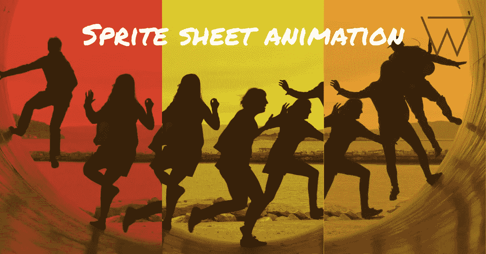
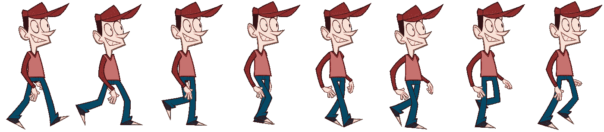

# 使用 CSS 或 JS 制作精灵图片动画的三种方法

> 原文：<https://levelup.gitconnected.com/three-ways-to-animate-sprite-sheet-image-a5c000f0c579>



一个**精灵表**是一个包含几个图像或精灵的图像文件。你可以在构建游戏或制作几层动画时使用它。将小图像合并到一个大图像文件中不仅可以提高游戏性能，还可以减少内存使用，加快游戏的启动时间。

对于这个例子，我们将使用下面的精灵表:



# **1。使用 JavaScript 方法**

HTML:

```
<div id="sprite-container">
  <div id="sprite-image">
  </div>
</div>
```

CSS:

```
#sprite-image {
  height: 325px;
  width: 184px;
  background: url("...link to the above image...")
    0px 0px;
}
```

上面的 CSS 代码将显示 sprite 表中的第一个图像或 sprite。

> 注意，每个 sprite 的高度是 325px，宽度是 184px。(每个子画面的宽度=子画面的总宽度/子画面的总数)

JavaScript:

演示:

# 2.仅使用 CSS

使用 CSS **steps()** 很容易控制动画持续时间内渲染的关键帧数量。它根据我们设置的值将 sprite 表分成相等的部分，称为步骤。

让我们使用**步骤()**来创建一个简单的精灵表动画。

HTML:

```
<div id="sprite-container">
  <div id="sprite-image">
  </div>
</div>
```

CSS:

```
#sprite-image {
  height: 325px;
  width: 184px;
  background: url("...link to the above image...")
    0px 0px;
  animation: play 0.8s steps(8) infinite;
}
@keyframes play {
  100% {
    background-position: -1472px;
  }
}
```

由于子画面包含 8 个图像子画面，因此步骤数为 8。我们正在动画精灵表的背景位置。sprite 工作表的总宽度为 1472 像素，从右向左显示动画。

演示:

# 3.使用 Phaser 3

Phaser 是一个快速、免费、有趣的开源 HTML5 游戏框架，提供跨桌面和移动 web 浏览器的 WebGL 和 Canvas 渲染。游戏可以通过使用第三方工具编译到 iOS、Android 和原生应用程序。可以使用 JavaScript 或 TypeScript 进行开发。要了解有关阶段框架的更多信息，您可以[单击此处。](https://phaser.io/learn)

代码:

演示:

*(版权声明:此图片仅用于教育目的，摘自* [*此处*](https://www.codeandweb.com/blog/2014/11/05/animate-sprites-in-css-with-texturepacker) *)。*