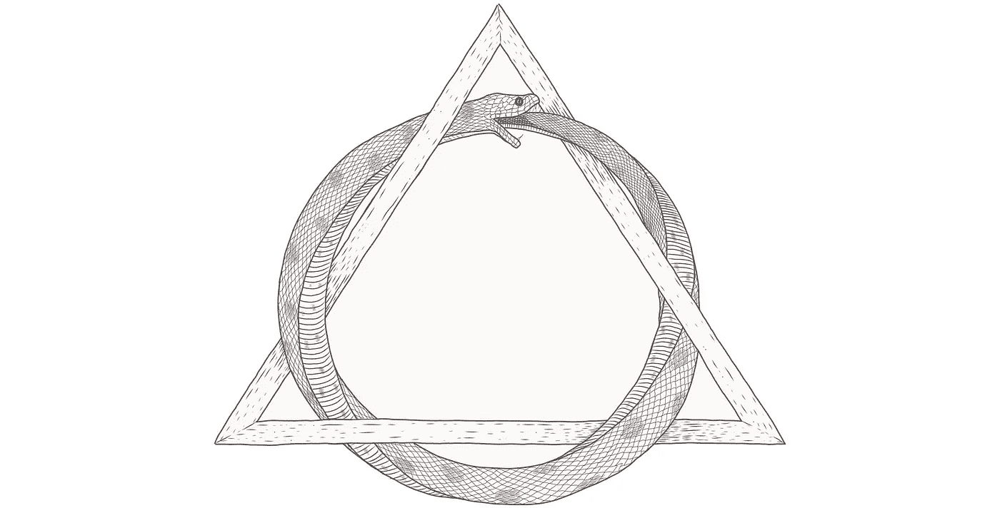

# 形成无限循环的三种方法

> 原文：<https://levelup.gitconnected.com/three-ways-to-make-an-infinite-loop-3d073fac5547>


## 编程技能

我们的项目有很多失败的可能。最迂回的方式之一是当什么都没有发生时，我们被留下来盯着一个空白的屏幕，因为它静静地循环。

虽然无限循环通常很容易发现，但是要修复它们却非常困难。更糟糕的是，有不同的方法可以意外地使某个东西成为一个无限循环。在这篇文章中，我演示了三种完全不同的方法，使用 OCaml 作为媒介，因为它有助于小而清晰的演示。


# 循环通过控制流

实现循环最常见的方法是通过递归函数。没有终止的递归称为*共递归*——现在你可以纠正这个笑话“要理解递归，必须先理解递归”，因为那显然应该是共递归。

在 OCaml 中，(共)递归函数很容易识别，因为 OCaml 要求我们输入`rec`关键字来创建它们。最简单的连写体函数如下所示:

```
let rec loop1 () = loop1 ()
```

OCaml 要求递归函数使用`rec`,相互递归函数使用`and`。这通常使得意外的并发很少发生，也更容易追踪。



# 循环遍历类型

一种不太常见但更微妙的循环类型可以通过使用递归类型来实现，特别是捕获函数的类型。在这个最小的例子中，我们有一个 one 草书类型，其中一个构造函数包装了一个函数。为了使它成为一个无限循环，我们把它喂给自己:

```
type loop_type =
  | Ref of (loop_type -> unit)let loop2 () =
  let inner r =
    match r with
      | Ref f -> f r in
  inner (Ref inner)
```

注意，在这段代码中没有提到`rec`，所以我们很容易相信没有循环。发现这些危险区域的方法是寻找被捕获的函数。

上面的类型几乎与流的类型相同。众所周知，流是永无止境的，因此认识到这一点可以让我们更清楚如何用它来进行无限循环。


# 在堆中循环

另一种完全创建无限循环的方法是通过引用。我们可以把这个想象成两个人互相指指点点。该示例首先在堆中存储一个哑函数，然后立即用一个解引用自身的函数覆盖它，从而实现递归:

```
let loop3 () =
  let r = ref (fun () -> ()) in
  r := (fun () -> !r ());
  !r ()
```

再次注意这里没有提到`rec`甚至`type`。我没有技巧来帮助找到这些问题，尤其是在面向对象编程中，它们确实发生得相对频繁。我能给的唯一建议是意识到这一点，并在你与无限循环斗争时将其纳入鉴别诊断。

# 结论

我们已经看到了无限循环发生的三种完全不同的方式。开发人员在诊断应用程序中的循环时，需要了解这三点。

当无限循环源于全局不变量时，它会更加危险。在我的书中，我广泛讨论了本地化不变量的优点，并演示了如何做到这一点:

[](https://www.manning.com/books/five-lines-of-code)