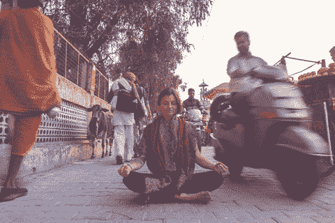
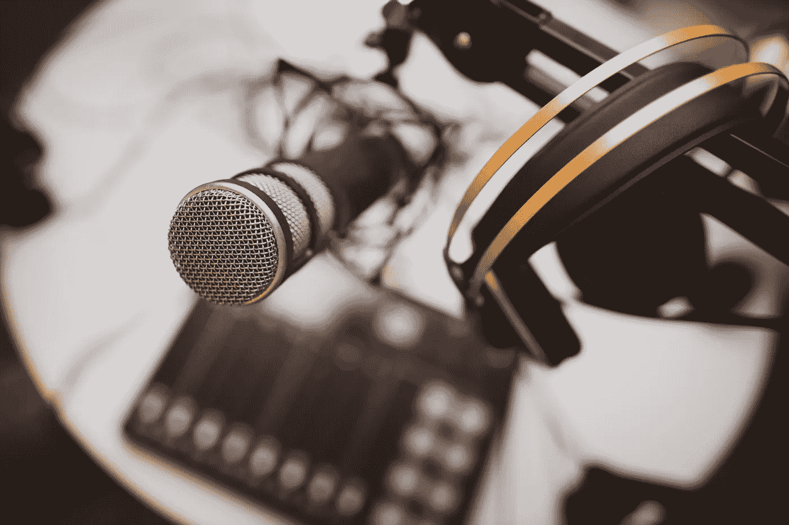
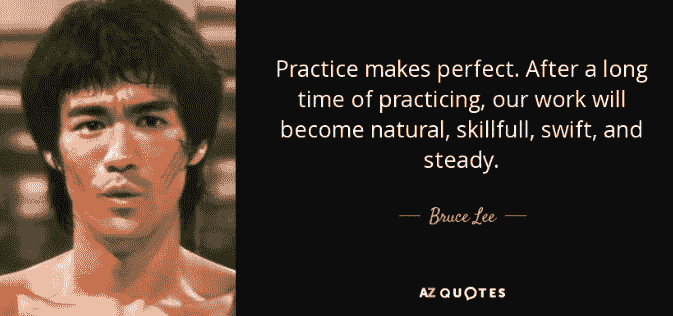

# 三种最大化火车通勤时间的方法

> 原文：<https://levelup.gitconnected.com/three-ways-to-maximize-the-time-on-your-train-commute-5c914c6833a2>

## 利用通勤时间提升自我和生产力的实用步骤

马德琳·拉格斯代尔在 [Unsplash](https://unsplash.com/s/photos/reading-train?utm_source=unsplash&utm_medium=referral&utm_content=creditCopyText) 上的照片

我生在纽约，长在纽约，地铁一直是我生活中很重要的一部分。我上下班的时间一般在 30 到 45 分钟之间，这取决于一天中的时间和延误(对于 MTA 来说，这似乎太多了)。在这篇文章中，我将介绍三种最大化利用时间的方法，来帮助提高生产力、自我完善以及身心健康。最后，我还将介绍如何对这三种方法进行优先排序，这样你就可以有效且一致地实施它们。在我继续讲下去之前，这里还有一些关于我的信息。

我这辈子都在坐地铁。我的全职工作是软件工程师。我热爱我的工作，但有时会让人不知所措。我通常写代码，但这一次我将探索如何最大限度地利用我的通勤时间，以确保我在情绪、智力和身体上处于最佳状态。第一种方式是冥想。

# 沉思

虽然我有一些冥想的经验，但我没有火车上卧室的宁静和隐私。话虽如此，我还是找到了一些在火车上实现有效冥想的技巧。

## 配置

在理想的情况下，我坐着，闭着眼睛，双手放在膝盖上，或者一只手放在另一只手上，不要紧握或者十指交叉。这会造成紧张。火车不是很拥挤，我可以直视前方，平静地呼吸。

我说的是理想，不是典型。

通常，我是站着的，而火车上挤满了人。在这种情况下，我用一只手臂站在身体两侧(因为另一只手很可能紧紧抓住不放)。我仍然可以闭上眼睛，但是我撅着嘴点点头，所以上面的嘴唇比下面的稍微突出一点。这让我可以像坐着一样呼吸，而不会对着别人呼吸。这让我想到冥想的下一部分，呼吸。

## 吸气

我用鼻子慢慢吸气，利用了我从我的演员/歌手女友那里学到的一个技巧，你试着把*呼吸进你的屁股*。本质上，当我吸气时，我试图限制我的上半部，试图将空气向下引导到我腹部的下部，而不是上部/肺部。如果做得好，它创造了一种空气进入我的下背部/臀部的感觉(尽管在解剖学上不准确)。

*注:我不限制我腹部上半部***。如果感觉不舒服，我会放松上半身。**

## *呼气*

*我尽可能长时间地呼气，尝试至少 10 秒钟。我紧闭双唇，尽可能缓慢地呼出空气，特别是在呼气的最后部分，空气完全离开身体。*

*我发现这种呼吸方式对我有益，即使我没有冥想。它帮助我放松，降低我的心率，甚至帮助我减轻头痛和恶心。我也觉得它改善了我的呼吸。*

## *音乐*

**

*我倾向于听没有歌词或明确的乐器/结构的平静的声音。这种音乐最有助于我沉浸在冥想中。我尽量不把声音听得太大，这样火车的任何颠簸/骚动就不会那么令人吃惊，就像人们撞到我/让我移动一样。我在帖子的底部列出了几首对我很有效的歌曲。*

*虽然我已经概述了冥想时的呼吸方式和音乐选择，但当谈到我最大限度地利用通勤的第二种方式时，我会同时利用这两种方式。*

# *阅读*

*我从来都不怎么爱读书。在过去的一年里，我真的尝试去读更多的书。我读的内容各不相同，但几乎都是一本书(有时是博客帖子或其他文章)。最近，我读了《蝇王》(我的高中英语老师会非常自豪)，但我也读了关于创业、自我完善、历史分析等方面的书。文学的类型对我来说并不重要，重要的是我能保持投入。*

**

*我尽量不去关注花了多长时间阅读，这是我整个学术生涯中的一个自我意识点。重要的是我能内化我正在阅读的东西。起初，我有点走过场，只是阅读页面上的文字，并试图通过这本书的进展。现在，我发现自己读得更快了，有时读得如此入迷，以至于我几乎错过了火车上的车站！*

***免责声明:我不对任何错过的列车停靠站负责。**

*为了快乐而阅读很重要，但它也是我最大限度利用通勤时间的最终方式的一部分。*

# *学问*

*根据这篇文章，一些世界上最忙、最成功的人尝试每周学习 5 个小时。那就是每周五天每天学习一小时。让我们算一下。5 小时，除以 5 天，除以 2(我上下班的路程)就是 30 分钟。我的通勤似乎是学习新事物的好时机。那我怎么在火车上学习呢？一种方法是我阅读。*

*由于我是一名软件工程师，我通过阅读书籍来了解更多关于软件及其相关业务的知识，如 [*为什么创业失败*](https://www.amazon.com/Why-Startups-Fail-Yours-Succeed-ebook/dp/B006RM2KOY#targetText=Why%20Startups%20Fail%20is%20for,to%20venture%2Dbacked%20technology%20entrepreneurs.&targetText=But%20entrepreneurs%20often%20make%20the%20same%20avoidable%20mistakes%20over%20and%20over.) *，* [*可重用面向对象设计模式的元素*](https://springframework.guru/gang-of-four-design-patterns/)[*《孙子兵法》*](https://www.amazon.com/Art-War-Sun-Tzu/dp/1599869772) *。**

*在这三本书中，我会说*元素*对我来说是最难读的，因为它非常密集，而且是硬拷贝，所以这本书本身相当大。*为什么创业失败*和*孙子兵法*都是很好的读物，并没有压倒性的优势(我都读过两遍)。如果你对阅读不太感兴趣，还有其他方法可以随时随地学习。*

## *视频(教程)*

*排队看视频教程，在上下班的路上看，是学习新事物的有效方法。通过观察某人积极地完成某件事，我获得了与我自己完成这件事相似的(尽管没有那么好)体验。当我在火车上的时候也很方便，因为我不用担心拿东西，翻页等。一旦我加载了一个视频，除了音量调节和偶尔的倒带/快进之外，几乎没有任何交互。如果你是一个更注重听觉的学习者，next 媒体可能是你最好的选择。*

## *聆听(播客)*

**

*乔纳森·法伯在 [Unsplash](https://unsplash.com/s/photos/podcast?utm_source=unsplash&utm_medium=referral&utm_content=creditCopyText) 上拍摄的照片*

*对我来说，这是三种方法中最无效的。听到有人说话并不能像阅读和视频一样让我沉浸在学习过程中。对于书来说，我真的是盯着文字，然后把它们消化掉。对于视频，我必须观看才能看到过程。我发现这些方法很吸引人，而我可以更被动地倾听。我不反对播客。我知道有些人永远也吃不够，它们对我来说没那么有效。*

*也就是说，我发现励志演讲有助于了解目标、成就和克服障碍。学习一项技能、理论或流程是有益的。了解自己和他人也是如此。现在你知道**你可以做什么**来最大化你的通勤时间，现在你可以告诉**如何**对它们进行优先排序。*

# *优化*

*知道阅读、冥想和学习是有益的并不是开创性的信息。事实上，我知道一些人已经尝试了这些(和其他)方法，但是发现他们很难坚持下去。我可以提供见解，说明我如何不仅能够有效地实施这些方法，而且能够始终如一地让这些好处每天都能体验到。*

## *实践*

*如果你没有明显感觉更好/更有效率，那是完全正常的。即使是现在，当我觉得我没有充分利用我的通勤时间时，我有时也会感到沮丧。有时我不能完全沉浸在一本书里，或者我读的页数比昨天少。有时候，我旁边的人比我认为的公共交通工具舒服多了一点点*,冥想被证明是困难的。**

**

*那我要怎么通过这一关？*

*首先，我提醒自己，总有另一天。仅仅因为我今天没有感受到全部的好处并不意味着我明天也不会。当我发现这些调整特别难以承诺时，这确实在一开始帮助了我。*

*第二，尝试本身会强化行为。我不喜欢这句话*假装直到你做到*，但是通过练习一些事情，即使你没有感觉到全部的好处，你也在强化这个行为，并且很快它可能变成潜意识。在你的潜意识中有了这种行为，你的意识可以将更多的精力集中在你的冥想、阅读或学习上。*

**

*图片由 [AZ 报价](https://www.azquotes.com/quotes/topics/practice-makes-perfect.html)提供*

*当划分你的意识和潜意识时，有很多令人信服的信息解释了能力的价值。不久，这些方法将成为一种习惯，成为你日常生活的一部分。*

*虽然练习对强化和完善你的最大化方法很重要，但重要的是要注意练习不是简单的重复。你可以越来越多地练习这些方法，但重要的是尝试并使你练习的方法多样化。*

## *使不同*

*你可以这样想:如果你一遍又一遍地看同一个教程，最终都是熟悉的知识，你不会从中获得任何新的东西。这与三种方法有什么关系？本质上，如果你有一个更喜欢的方法是可以的，但是你也应该尝试其他的方法。*

*你不必一次做完所有的事情，或者每天都做不同的事情。但是不要把自己局限在一种方法上。通过多样化你的方法，你允许自己带着新的欣赏重新审视每一种方法，并防止情绪、智力和精神的停滞。*

*对我来说，我倾向于读完一本书。最近读完一本书后，我会让自己反思我所读的内容，然后用接下来的一周左右时间进行冥想。这几乎就像是对完成完成一本书的任务的奖励。在我决定下一步想学什么之前，我会给自己时间去欣赏我读过的东西，给自己的身心充电。*

*然后在我完成了一个教程或者阅读了一些我感兴趣的文献之后，我会回到冥想。我使用冥想作为其他两种方法之间的过渡，这两种方法强调智力刺激。这是两者之间的一种休息，让我有时间反思，这样我就不会觉得自己在死记硬背。*

> *“[冥想是]关于意识的训练和获得健康的视角感。你没有试图关闭你的想法或感觉。你正在学习不带判断地观察它们。”—顶部空间*

*对于什么时候做什么，我没有一个计算好的时间表，但我通常会做一周的冥想，在阅读一本书来消遣和学习一些东西之间。有时候，如果我觉得还没有准备好去学习一本新书或一个新话题，我会坚持一个多星期，但我总是尝试给自己至少一个星期的冥想时间。*

# *摘要*

*冥想对精神、情感和身体健康都有好处。无论我是坐在还是站在火车上，我都会播放平静的音乐，闭上眼睛，深呼吸。我慢慢地吸气到下腹部，然后呼气至少十秒钟。我感觉更放松，更少烦躁，冥想帮助我解决了头痛、恶心甚至呼吸的问题。*

***阅读**在多个层面也是有益的。我发现它让我更加自信，更有口才，并有助于记忆信息。另外，现在我真的很喜欢阅读，我可以迷失在故事中，最终发现新事物。这让我们开始学习。*

***学习**极大地利用了我的通勤时间。如果目标是每周积极学习 5 个小时，那么利用我每天两次 30 多分钟的通勤时间来学习是最理想和最有成效的。我大部分的学习是通过书本或视频完成的，但我也听励志演讲并从中学习。*

*这三种方法也可以很好地互相补充。我曾经在一些场合进行过冥想练习，同时从我正在阅读的一本书中学到一些新的东西。我发现这三种方法都提高了我的注意力和情绪，帮助我成长为个人和专业人士，并最终以积极的方式丰富了我的生活。同时被困在拥挤且可能晚点的火车上。*

*如果你喜欢这篇文章，或者需要澄清或者更深入的解释，请在评论中告诉我。不要忘记分享和留下掌声！*

## *冥想音乐*

*[*在这里将你的免费中级会员升级为付费会员*](https://matt-croak.medium.com/membership) *，每月只需 5 美元，你就可以收到来自各种出版物上数千名作家的无限量、无广告的故事。这是一个附属链接，你的会员资格的一部分帮助我为我创造的内容获得奖励。谢谢大家！**

# *参考*

* [## 如果你每周不花 5 个小时学习，你就是不负责任的

### 为什么世界上最忙的人，前总统巴拉克·奥巴马在任时每天阅读一小时？为什么…

qz.com](https://qz.com/work/1124490/5-hour-rule-if-youre-not-spending-5-hours-per-week-learning-youre-being-irresponsible/)  [## 能力的四个阶段

### 在心理学中，能力的四个阶段，或“有意识的能力”学习模型，与学习者的学习能力有关

en.wikipedia.org](https://en.wikipedia.org/wiki/Four_stages_of_competence)  [## 什么是冥想？

### 学习冥想就像学习其他技能一样。把它想象成锻炼你从未真正锻炼过的肌肉…

www.headspace.com](https://www.headspace.com/meditation-101/what-is-meditation)*