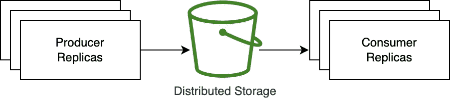
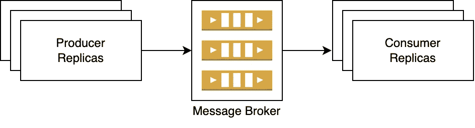
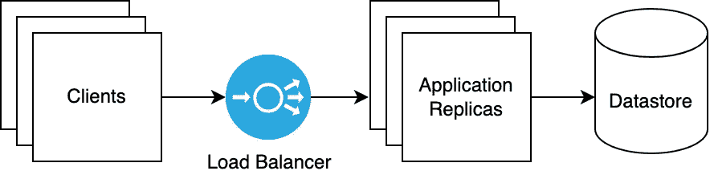

# 吞吐量与延迟

> 原文：<https://levelup.gitconnected.com/throughput-vs-latency-1b4f5b38c3d>

**延迟**是在任何给定的系统中，一个动作(由用户或机器发起)产生预期效果(其响应或输出)所需的时间。在计算机网络中，它最常被引用，指的是一个请求在网络上完成单向或双向(返回)行程所需的时间。在网络请求的上下文中，延迟通常在低端以毫秒计，在高端以秒计。一个请求(和延迟度量)可能只是通过网络连接的许多机器上的更大操作的一小部分(具有更高的延迟)。对于不面向用户的工作负载，可接受的延迟可以用分钟、小时或更长时间来衡量。

**低延迟的三个关键是:**

1.  从动作的源到数据或计算的目的地的物理(或地理)短途旅行。
2.  在请求的行程中对任何数据的最小计算(数据应该预先计算)。
3.  在数据存储中查找数据的时间最短(例如，通过在数据库中使用良好的索引)。这在技术上也是计算。

**吞吐量**是指每秒传输的*数据*的数量。增加*信息*的吞吐量而不增加*数据*的吞吐量的一个技巧是聚合数据(即将来自多个消息/记录的值合并为一个)。如果数据是一个时间序列，那么在这个过程中你会丢失分辨率(例如，60 个独立的 1 秒记录变成一个 1 分钟记录)。

**吞吐量通常以三种方式之一来衡量:**

1.  每秒请求数(每个请求的数据越多，通常每秒请求数越少)。
2.  每秒的消息数或事务数(可以按请求进行批处理)。
3.  每秒的数据量(MB/s、GB/s 等…每秒的请求越多，通常每秒的数据量就越少)。

在本帖中，我们将探讨 5 种不同的架构，它们满足在不同延迟和吞吐量要求下处理数据的不同用例。这里提到的架构属于数据中心内的数据管道领域。未提及的架构属于音频/视频聊天和游戏领域——所有这些都可以通过点对点通信来处理。高频交易是这里没有提到的另一个用例(1 毫秒的延迟被认为是慢的)。不同吞吐量和延迟的分类大致基于以下几点:

**吞吐量(每秒记录/消息数):**
高:> 100，000(此级别的吞吐量通常通过批处理实现)
中:10，000–100，000
低:< 10，000

**延迟(秒):**
高:> 10
中:1–10
低:< 1

为每个类别(低、中、高)设置具体的延迟和吞吐量阈值是很困难的，因为简单的测试基准(如本文中链接的那些)并不能完美地代表这里提到的工具在现实世界中的使用情况。例如， [Apache Kafka 性能指标评测经常显示出 10ms](https://www.confluent.io/blog/kafka-fastest-messaging-system/) 以下的延迟，但是，这些性能指标评测配置被测工具，使其在给定测试中表现最佳。每个真实使用案例都需要自己独特的配置平衡，以便为给定的工作负载集提供延迟与吞吐量之间的最佳平衡。一个用例产生的吞吐量可能与另一个大不相同。严格来说，这并不是上述工具配置的结果，也是围绕这些工具的截然不同的系统设计和工作负载的结果。

# 目录

*   [高吞吐量和中高延迟(大消息/文件)](#6921)
*   [高吞吐量和中低延迟(小消息/文件)](#5d07)
*   [中等吞吐量和中低延迟(小消息/文件)](#86e5)
*   [高吞吐量和低延迟](#0919)
*   [低吞吐量和低延迟](#b657)

# 高吞吐量和中高延迟(大消息/文件)

高吞吐量可以通过多种方式实现——只需构建一个足够宽的管道(或平行管道),尽可能减少瓶颈。用例的*所需延迟*和*消息/文件大小*可以帮助缩小正确选择的范围。给定对于大的消息/文件从*兆字节到千兆字节或更多*所需的*秒到几分钟或更多*的延迟，分布式文件系统(如 AWS S3)为机器之间的数据处理提供了非常简单但有效的中间有状态资源。

*一个非常简单的高级设计，当需要跟踪哪些文件被处理时，它会变得稍微复杂一些(这里没有显示)。*

# 缩放比例

像 AWS S3 这样的云管理对象存储为您处理这些性能问题。生产者和消费者节点的伸缩取决于用于管理自动伸缩的用例和框架。

# 高吞吐量和中低延迟(小消息/文件)

服务之间的异步通信支持更高的吞吐量，同时减少了任何一个服务空闲等待响应的机会。这正是 Apache Kafka 和 AWS Kinesis 等消息代理大放异彩的地方，它们提供了一个中间的持久存储，使得构建一个**可靠的**、高吞吐量、中低延迟的管道比服务之间的直接通信更容易。重点是*可靠*，因为有一个中间持久存储允许消费者、生产者和相关服务在不太理想的状态下运行，连接问题的可能性更小，特别是在高吞吐量的用例中。在这种不太理想的情况下，延迟会显著增加。

*虽然这个图在高层次上非常简单，但是如果您使用的消息代理像 Apache Kafka 或 AWS Kinesis 一样强大，那么您很可能拥有一个围绕它们的复杂服务网络。*

# 缩放比例

扩展消费者和生产者节点与上面使用分布式文件系统的解决方案一样简单，但是，根据为 message broker 选择的解决方案，扩展可能不那么容易。[扩展 Kafka message brokers 传统上是一项手动任务](https://www.confluent.io/blog/remove-kafka-brokers-from-any-cluster-the-easy-way/)，然而[托管解决方案确实使其变得更加容易](https://www.confluent.io/blog/elastically-auto-scaling-confluent-on-kubernetes/)。AWS Kinesis 在需要设置的[附加组件的帮助下提供自动缩放。](https://github.com/awslabs/amazon-kinesis-scaling-utils)

## 链接:

*   [什么时候不用阿帕奇卡夫卡](https://www.kai-waehner.de/blog/2022/01/04/when-not-to-use-apache-kafka/)
*   [配置 Kafka 以最小化延迟](https://www.confluent.io/blog/configure-kafka-to-minimize-latency/)
*   [使用 Lambda 消费 Amazon Kinesis 数据流的最佳实践](https://aws.amazon.com/blogs/big-data/best-practices-for-consuming-amazon-kinesis-data-streams-using-aws-lambda/)
*   [AWS Kinesis 简介](https://docs.aws.amazon.com/streams/latest/dev/introduction.html)

# 中等吞吐量和中低延迟(小消息/文件)

Apache Kafka 和 AWS Kinesis 带来了配置消息代理或碎片(分别)以及生产者和消费者库的管理开销。Kafka 比 Kinesis 有更多的配置开销，但可以调整为 performant。如果吞吐量要求没有高达每秒 100，000 条消息，则存在更简单的解决方案。RabbitMQ 和 AWS SQS 是消息队列，它们是上述异步消息流发电站的更简单的解决方案。

*高级设计与上面的消息代理完全相同，但是实现和配置有很大不同。*

# 缩放比例

AWS SQS 管理自己的自动缩放，而 [RabbitMQ 需要配置](https://github.com/rabbitmq/rabbitmq-sharding)。

## 链接:

*   [什么时候用 RabbitMQ 或者 Apache Kafka](https://www.cloudamqp.com/blog/when-to-use-rabbitmq-or-apache-kafka.html)
*   [对比 AWS Kinesis 和 SQS](https://sookocheff.com/post/aws/comparing-kinesis-and-sqs/)

# 高吞吐量和低延迟

如果你正在用这些需求来构建一些东西，那么你很可能不是这个博客的预期读者！

虽然 Apache Kafka 和 AWS Kinesis 能够实现相当低的延迟(包括<1sec), they both add the overhead of an additional network hop and disk write/read which could be eliminated with direct synchronous communication between client and server. There’s not a single (or set of designs) to satisfy the infinite use cases that require high throughput and low latency, however, below are some tools and designs that can help achieve the holy grail of high throughput and low latency:

*   [AWS 网络负载平衡器](https://aws.amazon.com/blogs/aws/new-network-load-balancer-effortless-scaling-to-millions-of-requests-per-second/)
*   [分片数据存储及其基于单元架构的周边服务](https://www.youtube.com/watch?v=HUwz8uko7HY)
*   [对数据进行适当的索引，以快速找到和检索搜索目标，如谷歌搜索中使用的 Q-Gram 索引](https://seqan.readthedocs.io/en/master/Tutorial/DataStructures/Indices/QgramIndex.html)

# 低吞吐量和低延迟

这是最容易解决的问题，因为数据不需要分布，也没有任何网络或处理瓶颈需要担心。如果吞吐量较低，则不需要实施缓存，但随着吞吐量的增加，为了减轻主数据存储区的压力，这是首先要做的事情。简单的客户机-服务器设计符合要求。

*跨多个计算实例复制服务器的应用程序逻辑*

# 缩放比例

任何云平台都可以轻松实现自动扩展。

# 最后的话

本文中的延迟测量是在数据中心内从生产者到消费者进行的。网站需要特别考虑其客户在全球的[分布](https://networkengineering.stackexchange.com/a/59145/84401)。使用 cdn 从世界各地的数据中心分发静态内容是解决地理延迟问题的典型的第一步。可以采取进一步的措施，在关于[高水平对低水平](https://welcometosoftware.com/high-level-vs-low-level)的帖子中会涉及到。

# 分级编码

感谢您成为我们社区的一员！在你离开之前:

*   👏为故事鼓掌，跟着作者走👉
*   📰查看[升级编码出版物](https://levelup.gitconnected.com/?utm_source=pub&utm_medium=post)中的更多内容
*   🔔关注我们:[Twitter](https://twitter.com/gitconnected)|[LinkedIn](https://www.linkedin.com/company/gitconnected)|[时事通讯](https://newsletter.levelup.dev)

🚀👉 [**加入升级人才集体，找到一份神奇的工作**](https://jobs.levelup.dev/talent/welcome?referral=true)