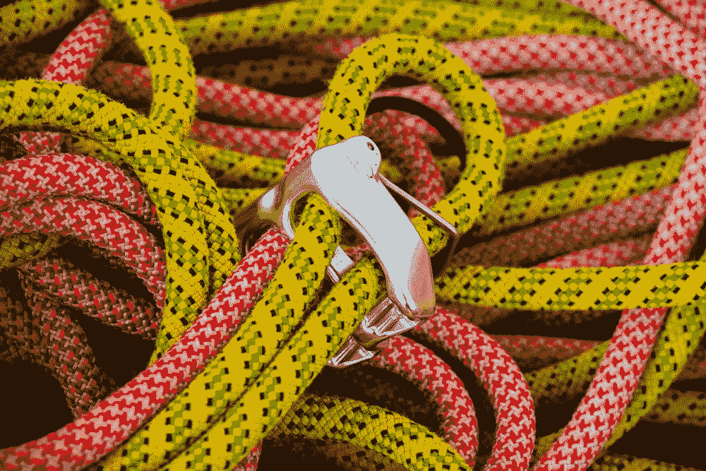
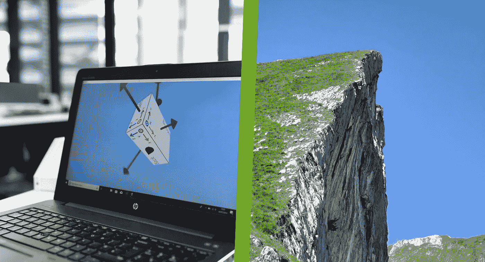

# 编码的时候把自己绑起来。

> 原文：<https://levelup.gitconnected.com/tie-yourself-in-when-coding-c73acd49eea5>

开发软件的工作流程就像用攀爬工具爬墙一样。请继续阅读，了解相似之处:

来自[https://unsplash.com/photos/CqVHbSEYmAM](https://unsplash.com/photos/CqVHbSEYmAM)的绳索

## 设置

在攀岩和编程这两个学科中，你首先必须设置好环境。

*   攀岩的时候，你需要穿上安全带，检查每一个装备，确定一个安全的锚。
*   与编程时设置系统类似，安装所有需要的库，并为软件结构编写一些样板代码。

## 规划

在你安装好装备和软件之后，接下来的事情就是寻找一条路线并开始攀爬，或者开始编写软件。在这两种情况下，你必须非常小心和有条不紊，以避免任何可能代价高昂的错误。

> 爬山和编程都需要很多解决问题的技巧。

在找到正确的路线之前，你经常要尝试不同的路线或方法。编码也是如此，你必须尝试不同的算法或方法来解决问题，然后才能找到正确的方法。

## 连续

你可以从小处着手，也许从一些简单的路线或者编码一些小的特性开始。随着你越来越适应，你尝试更难的路线或者你开始在你的软件中更难的部分工作。

关键是不断进步，即使很慢。最终，通过足够的练习，你将能够翻墙或者编写你想要的软件。

## 焦点

这两个学科都需要高度的专注和专注。

*   如果你在爬山时注意力不集中，你可能会摔倒并严重受伤。
*   如果你在编码时失去了注意力，你可能会在软件中引入错误。

在这两种情况下，如果你坚持不懈，专注于你的目标，你最终会到达顶端或完成项目。而且两种情况下的成就感是一样的。

## 成功

当你到达墙的顶端时，你就完成了攀登。在编程中，那将是你的代码无错运行并产生预期结果的时刻。

笔记本电脑从 https://unsplash.com/photos/nwifBnhRcP8 的[到 的照片由我拍摄](https://unsplash.com/photos/nwifBnhRcP8)

然后，你花一点时间去欣赏风景和成就感。当攀登的时候，那将会是从墙的顶端欣赏风景。在编程中，需要花一点时间来测试你的代码，看看它是否能像预期的那样工作。

# 分级编码

感谢您成为我们社区的一员！更多内容见[级编码出版物](https://levelup.gitconnected.com/)。
跟随:[推特](https://twitter.com/gitconnected)，[领英](https://www.linkedin.com/company/gitconnected)，[通迅](https://newsletter.levelup.dev/)
**升一级正在改造理工大招聘➡️** [**加入我们的人才集体**](https://jobs.levelup.dev/talent/welcome?referral=true)