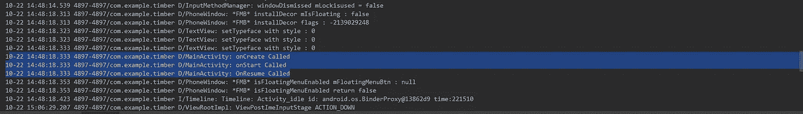

# timber——Android 的日志库

> 原文：<https://levelup.gitconnected.com/timber-a-logging-library-for-android-56c431cd7300>

## 为懒人记录日志


在本文中，我将向您展示如何使用 [Timber](https://github.com/JakeWharton/timber) 在 Android 默认日志的基础上获取应用程序的日志。

# 1)木材

在您的应用程序中，使用以下语法获取日志。

## 默认方式:

```
Log.*d*(*TAG*, "something: ");
```

## 使用木材:

```
Timber.*d*("something Called");
```

在**默认方式中，**你总是需要写`TAG`，它可以是你的活动的名字。但是在**木材中，** `TAG`将由库本身定义。

# 2)将木材添加到您的应用程序

为了将 timber 集成到您的应用程序中，它必须在应用程序启动时进行初始化。因此，您需要创建一个基础应用程序类。

1.  `onCreate()`的有限木材
2.  `Timber.DebugTree()`在调试模式下打印日志。
3.  你也可以在你的应用的发布模式中添加日志，只需在`onCreate()`中添加`Timber.ReleaseTree()`。

最后，是时候在`AndroidManifest`中添加这个应用程序类了，这样当应用程序启动时，应用程序类将首先初始化。

现在让我们去我们的`MainActivity.java`班，看看`Timber`的魔力。我只是为了学习的目的使它变得简单。你可以在你的复杂应用中添加木材，但是现在，我只是使用 android 生命周期方法来获取日志。

让我们运行应用程序，看看我们会在`logcat`中得到什么。



你可以清楚地看到`D/MainActivity:`已经被库本身添加为`TAG`，这样你就可以很容易地找到关于你的活动的日志。

**关注**[**CodixLab**](https://medium.com/codixlab)**了解更多科技知识。**

觉得这篇文章有用？下面是我阅读量最大的文章:

*   [想成为数据科学家？遵循此路线图](https://medium.com/dataseries/roadmap-to-becoming-a-successful-data-scientist-34564e887327)
*   想要成为一名成功的 Android 开发者吗？遵循此路线图
*   [全屏底片](https://medium.com/better-programming/bottom-sheet-android-340703e114d2)
*   [如何使 RecyclerView 项目可扩展？](https://medium.com/better-programming/recyclerview-expanded-1c1be424282c)
*   想要制作具有更多选项的动画浮动操作按钮？
*   [用漂亮的动画制作 RecyclerView！](https://medium.com/better-programming/android-recyclerview-with-beautiful-animations-5e9b34dbb0fa)