# 时间和空间复杂性

> 原文：<https://levelup.gitconnected.com/time-and-space-complexity-725dcba31902>

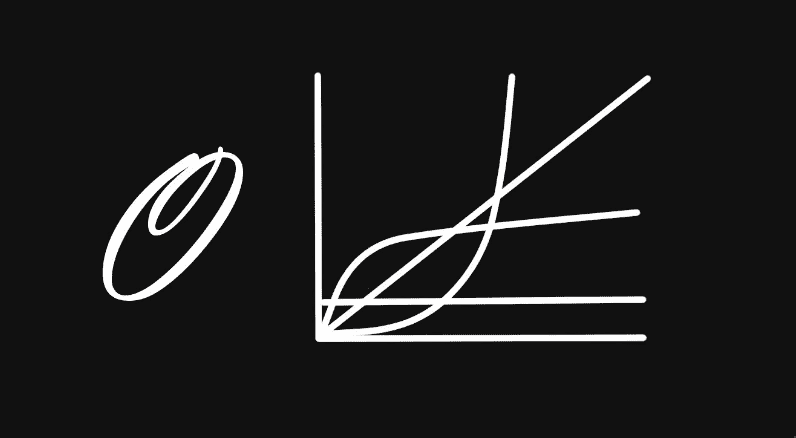

基础知识和大的 *O* 符号。

## 为什么要看这个？

3 个原因:我最近在一次编码挑战中失败了，不是因为我的答案错了，而是因为执行时间太长了。了解时间和空间的复杂性可能会有所帮助，这也是编码面试中的一个常见问题。

作为一个自学成才的程序员，我经常会遇到下面的陈述`**“you should use X instead of Y because it has *O(1)* instead of *O(n)”***` ***，*** 所以我希望在这篇文章结束时，你和我都能完全理解这些类型的陈述，也许是主要原因，这本身就是一个有趣的话题，我会尝试用简单的术语来解释它。

```
🔺 To some extent, you can probably ignore time and space complexity depending on your coding needs and uses, modern languages and ample processing and storage power increasingly take care of these things, yet for some applications and situations it seems we never have enough of either... I also say to some extent because we all intuitively know that a slow or memory intensive program is a bad thing, but we might not be interested in optimizing beyond getting the thing to work. On the other hand as mentioned time and space complexity problems are quite popular in coding interviews and can save a business a lot of money in things like bandwidth and storage.
```

> 时间(和空间)就是金钱

## 什么？！

时间和空间都是有限的资源，这是生活和编写软件中的硬道理；我们耗尽了时间(*我们真的会死*)而空间——无论是虚拟的，比如在记忆中还是在现实生活中(*你住在哪里*)都是非常珍贵的…

第一级直观定义很简单——我们想知道我们的代码运行需要多长时间，解决方案将使用多少空间，我们想知道在两种情况下一个解决方案是否比另一个更好，并进行归纳。

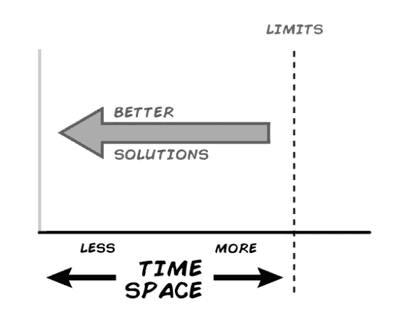

请注意，纵轴现在是空的，我们将立即填充内容。

## 复杂性

回答问题`**How long is this going to take**` 和 `**how** **much space is this going to require**` 会变得复杂，因为我们都有不同的设置和变量。假设你正在做饭和购物。烹饪需要多长时间，你的购物车需要多大空间？嗯，这取决于你做的菜和其他因素，比如你家里有什么设备，你想为多少人服务。考虑几种晚餐情况:

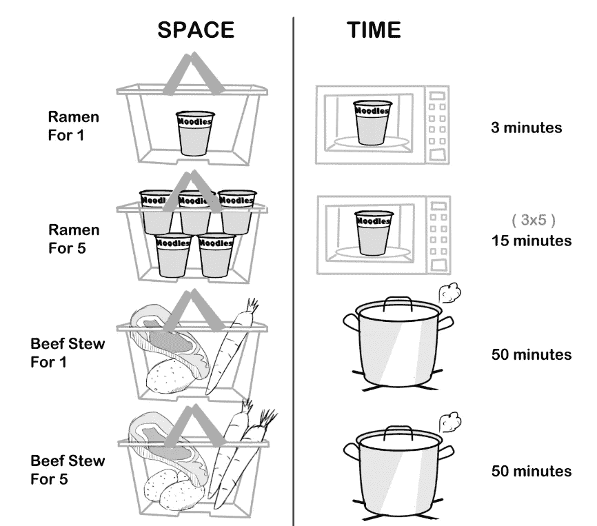

一份或五份炖牛肉会在购物篮中占用更多的空间，烹饪时间也更长，而拉面则有不同的关系，每份额外的拉面晚餐都会在购物篮中占用一个额外的空间，并多花 3 分钟来制作(*除非你有额外的微波炉*)。这最后一点(*用微波炉*加热东西)可以被认为是我们的基本操作…

```
From the wiki on [**Time Complexity**](https://en.wikipedia.org/wiki/Time_complexity):"Time complexity is commonly estimated by counting the number of elementary operations performed by the algorithm, supposing that each elementary operation takes a fixed amount of time to perform."
```

时间和空间的复杂性帮助我们比较和概括这些类型的情况。让我们将复杂性等式的左边形式化:


右边呢？我们可以指定任何我们想要的单位，可以是分、秒、面杯、立方英寸等等。这在特定的情况下很好，但是我们不能确定一种类型或一类的解决方案、算法或食物是否比另一种更有效。我们需要缩小和概括，让我们详细阐述一下…

```
👋👋 Hi there 👋👋 all my content is free for Medium subscribers, if you are already a subscriber I wanted to say thank you ! 🎉 If not and you are considering subscribing, you can use my membership referral link, you will be supporting this and other high quality content, Thank you !**⭐️⭐** [**Subscribe to Medium !**](https://k3no.medium.com/membership) **⭐️⭐️**
```

## 行为、关系和运营

假设我们在晚餐菜单上增加了速冻晚餐。唯一不同的是，我们的电视餐用微波炉烹饪需要大约 6 分钟:

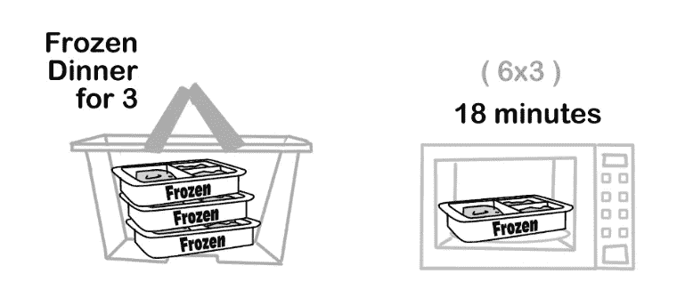

你可能会注意到，你篮子里的烹饪时间和空间以一种非常类似于拉面的方式增加，如果我们绘制它们，就会很清楚:

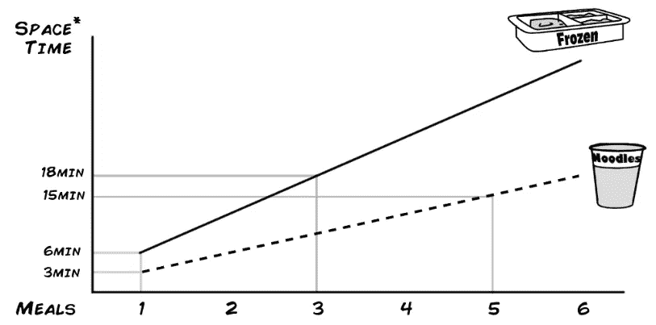

*这里只标绘了时间，可以标绘空间关系，得到 2 条相似的线。

我们在这里处理的是线性关系。其含义是，时间和空间以基于进餐或投入的数量的线性速率增长，并且这种增长是以固定的速率进行的。复杂性等式的右边需要描述这些类型的关系:

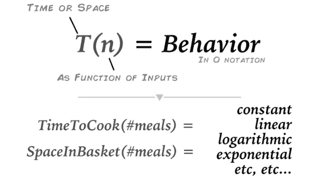

```
**Note:** Time and Space Complexity at this level describe the relationship between Inputs and rate of operations/space taken, you still need to find the specific inputs, operations and space units, keeping with the food analogy I can tell you that all the products in this aisle at the supermarket will require you the same time to cook for 1 or 5 people (this would be constant time - pasta, rice for instance ), but I can't tell you how long exactly. You'd need to read the labels for that.
```

## 行为和 O 符号(又名大 O 符号)

符号是一种数学惯例，用来描述这些关系。我可以简单地告诉你，拉面和冷冻晚餐的时间复杂度为`***O*(*n*)**`，而不是像上面那样绘制线条。

```
Or if you are looking for a more formal definition ( from the wiki on [**O-Notation**](https://en.wikipedia.org/wiki/Big_O_notation))**"Big O notation** is a mathematical notation that describes the [limiting behavior](https://en.wikipedia.org/wiki/Asymptotic_analysis) of a [function](https://en.wikipedia.org/wiki/Function_(mathematics)) when the [argument](https://en.wikipedia.org/wiki/Argument_of_a_function) tends towards a particular value or infinity." 
```

绘制`**O(n)**` 的一般化形式与我们之前的图的关系有望使跳转更容易理解:

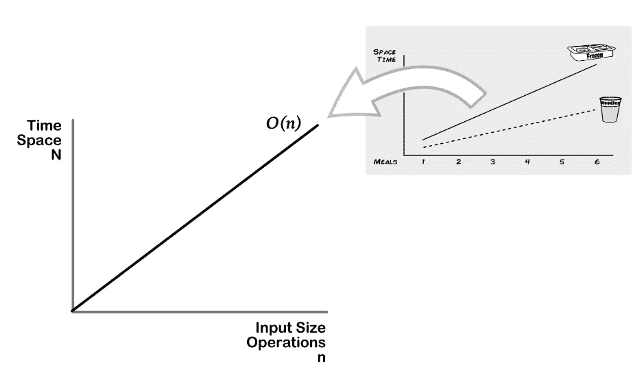

```
**Whats the worst case ?** An additional notion in Time and Space Complexity is the worst case assumption, this means that when someone tells you this algorithm or situation has O(n) complexity it usually also means that at worst it will behave in a linear fashion, your actual results might be better but not worse.
```

## 复杂性类型的常用符号:

虽然你肯定能计算出描述不同符号行为的方程式，但对于我们这些凡人来说(*特别是如果刚刚开始的话*)，现在列出常见的可能更方便:

**对数复杂度/时间** `**T(n) = O(log n)**` 先增加后稳定，变化较小:

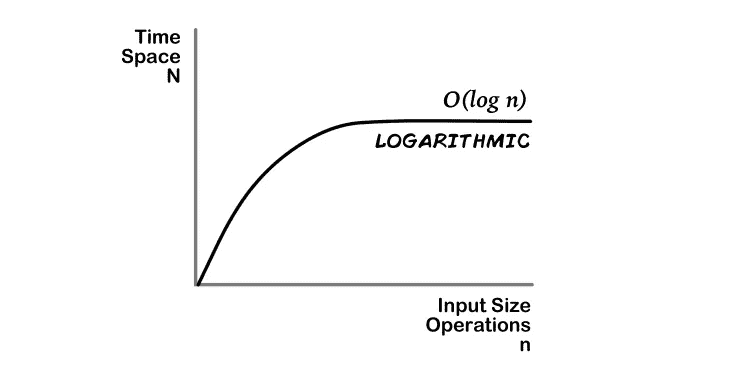

**恒定的复杂度/时间** `**T(n) = O(1)**` 一个或多个最多需要相同数量的时间或空间:

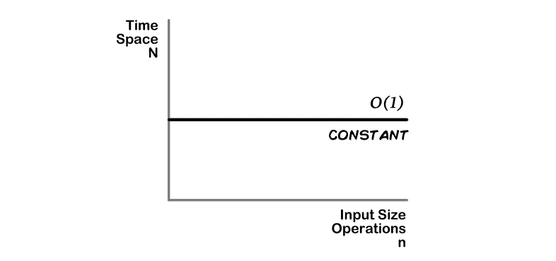

**`**T(n) = O(n)**`**线性复杂度/时间我们的老朋友，在这里时间和空间以一个最坏的固定/线性速率增加:****

****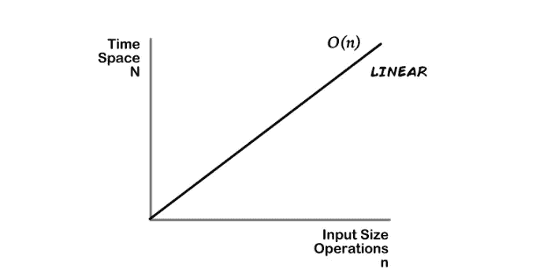****

******二次** `**T(n) = O(n^2),**` **&多项式** `**T(n) = O(n^k)**` **。**一般来说，随着输入的增加，时间会以某个更大的速率变长，该速率与指数、二次曲线的^2、多项式的^K 以及两者之间的一切相关:****

****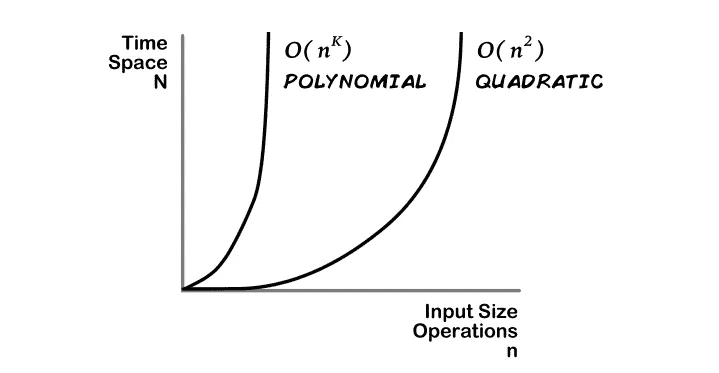****

******指数** `**T(n) = O(2^n)**` **&阶乘** `**T(n) = O(n!)**` **复杂度/时间****迅速增加，直到时间和空间需求趋于无穷大。******

******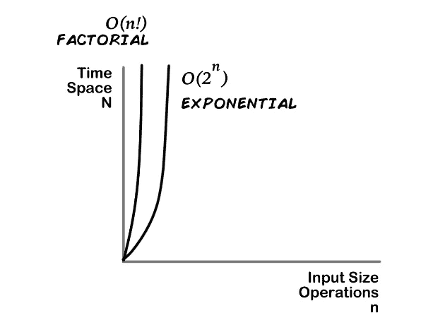******

```
****There are many other Complexities, in fact you can represent even a [squiggly line](https://en.wikipedia.org/wiki/Big_O_notation#/media/File:Big-O-notation.png) in O notation, the above cover some of the most common cases but there are a lot of intermediate cases, we'll briefly cover what to do about these cases in the following sections, but if you want a more exhaustive list I recommend the wiki:[https://en.wikipedia.org/wiki/Time_complexity](https://en.wikipedia.org/wiki/Time_complexity)
[https://en.wikipedia.org/wiki/Computational_complexity_of_mathematical_operations](https://en.wikipedia.org/wiki/Computational_complexity_of_mathematical_operations)****
```

## ******为什么这对您的代码很重要******

******到目前为止，我几乎没有提到过编程。这些都是理论和膳食，但是你写的代码中的复杂性的应用是真实的。我们通常想知道算法、方法、类等的复杂性，而不是吃饭。基本上，我们希望将代码划分为基本操作，并使用那些给我们带来最佳性能的操作。******

```
****What's and [**Algorithm**](https://en.wikipedia.org/wiki/Algorithm) ?"A **finite** sequence of [well-defined](https://en.wikipedia.org/wiki/Well-defined), computer-implementable instructions."For you and me writing code this could mean using a built in language method, a function, a class or even the whole program, but ideally you'd want to use low or good complexities through your code.****
```

## ********代码的复杂性:********

******这篇 [**评论**](https://medium.com/@dorel101/great-article-5fe82d60b289) 是我在最近写的一篇文章上留下的在 [**书库&排队。**](/stacks-and-queues-in-python-b2e8b4dbd876)******

```
**"It’s important to note that using a list as a stack suits great with O(1) for pushing and popping , but as a queue , you have to go with **O(1)** and **O(n)!** "**
```

****除了这个案例的细节，重要的一点是，我们现在可以理解它的大部分了`**O(1)**`是常数时间(**好**)`**O(n)!**`是指数时间(**坏**)。****

****但是你是怎么知道这些小花絮的呢？好吧，你可以自己计算它们，但更多的时候，这些是文档和其他帖子的一部分，比如 python 的 deque 库中的这一部分:****

```
**From [**Deque**](https://docs.python.org/3/library/collections.html#collections.deque.maxlen)

Indexed access is **O(1)** at both ends but slows to **O(n)** in the middle. For fast random access, use lists instead.**
```

****所以基本上，如果你有一个很大的列表，并且想随机访问一些东西，你最好使用列表而不是队列。****

****这里有一个网站列出了一堆算法和它们的复杂性(*如果你喜欢复杂性*，你甚至可以订购一张方便的海报)。****

****[](https://www.bigocheatsheet.com) [## 了解你的复杂性！

### 你好。这个网页涵盖了计算机科学中常用算法的空间和时间复杂性。当…

www.bigocheatsheet.com](https://www.bigocheatsheet.com) 

获得您自己的代码的复杂性或测试某些内置方法超出了本介绍的范围，但是基本上您想要计算操作并分析它们如何随时间或空间而变化:

```
# Pseudo code:function a(n){ 
   var count = 0 # Or measure the space saved into memory.
    Operation_to_test(n){ 
     increment count by a certain ratio}
    return count;
}# Then tabulate or plot count vs n and match to an existing distribution.
```

要查看更真实的案例，请点击此处:

[](https://dev.to/b0nbon1/understanding-big-o-notation-with-javascript-25mc) [## 用 JavaScript 理解 Big-O 符号

### Big-O 符号衡量算法的最坏情况复杂度。在 Big-O 记数法中，n 代表…

开发到](https://dev.to/b0nbon1/understanding-big-o-notation-with-javascript-25mc) 

## 在面试中使用

根据我的经验，你可能会遇到两种类型的面试问题，一种是理论性的问题，问你对于给定的问题，哪种算法或解决方案更好。我希望现在你已经很好地理解了基本知识，所以按顺序列出它们会更容易理解，然后回答只是找到你的具体情况的问题。

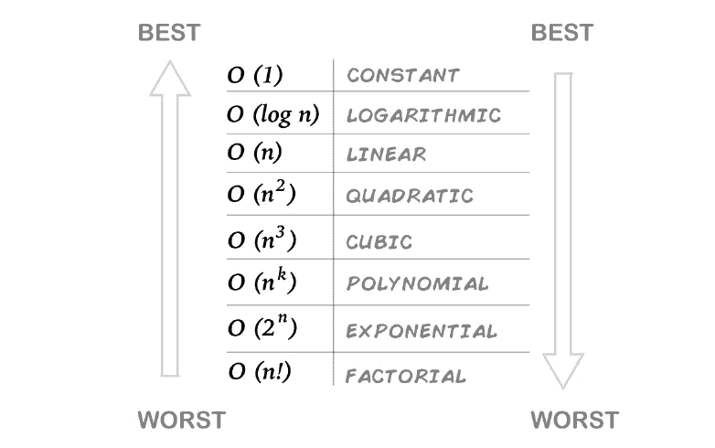

第二类问题要求你描述给定一段代码的时间或空间复杂度。你可以像前面提到的那样计算手术次数，但恐怕实践是你最好的选择。这里有两个地方有一些示例问题:

[](https://www.geeksforgeeks.org/practice-questions-time-complexity-analysis/) [## 时间复杂性分析练习题

### 输出:3。O(N + M)时间，O(1)空间解释:第一个循环是 O(N)，第二个循环是 O(M)。既然我们不…

www.geeksforgeeks.org](https://www.geeksforgeeks.org/practice-questions-time-complexity-analysis/)  [## 算法的时间复杂度

### 对于任何一个确定的问题，都可以有 N 个解。一般来说是这样的。如果我有问题和我讨论…

www.studytonight.com](https://www.studytonight.com/data-structures/time-complexity-of-algorithms) 

## 结论

我一直在推迟学习 O-记数法和时间复杂性，因为它总是感觉像是太深入学术 CS 的东西，只在面试中有用( [*，我仍然发现它坏了*](https://medium.com/@k3no/hire-me-not-34552237988b) )。

我仍然认为它是一个边缘学科，除非你有任务或者需要频繁地优化你的代码，在这种情况下，它突然变成了一项重要的技能。然而，仅仅了解它和一些符号，我认为就能让你以适度的时间投入成为一名更好的程序员。

也许这里最有用的东西是这样一个概念，即事物在现实生活和代码中以不同的速度增长，有一种语言来描述这一点，以及在这个框架内测量代码的方法。

我希望这个简短的介绍能帮助你开始了解时间和空间复杂性。

感谢阅读。****