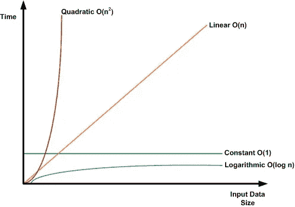

# 时间复杂性:构建更好软件的指南

> 原文：<https://levelup.gitconnected.com/time-complexity-a-guide-to-building-better-software-f8fe633cead>

# 什么是时间复杂度？

时间复杂性是一种描述软件功能内部算法运行时间的数学方法。它用于指示算法的运行时间如何随着输入大小的增加而增加。这篇博文将讨论大 O 符号以及它如何影响软件应用。我们还将提供一些例子来帮助你更好地理解这个概念。

这种方法是一种渐进的方式，可以理解某种算法如何随着时间的推移影响应用程序。并不能准确显示一个应用程序完成一个问题需要多长时间，但是可以给你一个大概的概念。

这类似于了解你的汽车每加仑行驶的英里数，以确定你在一次给定的旅行中将如何花费燃料。并非所有的行程或输入都是相同的大小，大 O 符号有助于我们理解应用程序中的时间和内存开销。

计算机科学中有 4 种常见的算法，从最快到最慢。

# 常数— 0(1)

恒定的时间复杂度意味着只需一步就能完成。例如数学运算、访问数组的索引、推入和弹出堆栈以及保留函数的值。

示例:

`let num = 10`
`function addNum(num){
return num + 2
}`

`const result = addNum(19)`

# 线性— O(n)

线性时间复杂度被认为是非常高效的，并且经常是算法设计者的目标。然而，这可能很难实现，尤其是对于大而复杂的输入。设计算法时，考虑最坏情况和最好情况是很重要的。最坏的情况是处理时间最长的输入，而最好的情况是处理速度最快的输入。对于具有线性时间复杂度的算法，最坏情况和最好情况将总是花费大约相同的时间。这使得它们非常一致和可预测，这在许多应用中是有价值的。

具有线性时间复杂度的函数的一些例子是

*   For 循环
*   。forEach() (JavaScript)
*   。map() (JavaScript)
*   。filter() (JavaScript)

我发现只有当你需要遍历数据结构中的每个值时，这个算法才是有用的。

# 二次——O(n)

二次时间复杂度将算法运行所需的时间描述为输入大小的函数。换句话说，它衡量的是相对于给定的数据量，算法完成任务需要多长时间。二次时间算法采用大小为 n 的输入，需要 O(n)次运算才能完成。这意味着，随着输入大小的增加，完成任务所需的操作数量会以与输入大小的平方成正比的速度增加。二次时间算法通常用于排序和搜索等任务，在这些任务中，输入大小相对较小，所需的操作数量也不会过多。然而，对于较大的输入大小，二次时间算法可能会变得非常慢，使它们无法用于许多实际应用。

# 对数— O(对数 n)

对数时间复杂度是指当输入大小增加时，运行所需的时间只增加一个常量。也就是说，如果输入大小增加一倍，运行时只会增加一个很小的常量。因此，对数时间复杂度非常有效，并且通常比其他类型的时间复杂度更受欢迎。

但是，应该注意的是，对数时间复杂度仍然会受到特定输入值的影响。例如，如果输入值已经排序，那么运行时间会更短。因此，在确定算法的时间复杂度时，考虑输入大小和输入值非常重要

# 结论

如上所述，您可以在不掌握大 o 的情况下进行编码。请记住，这只是一个估计值，因为计算的运行时间可能会根据实际情况(如处理速度和使用的语言)而有所不同。然而，这不应该阻止您学习更多关于大 O 符号的知识——这样做可以为您理解设计算法时什么是重要的，什么是不重要的提供有用的背景。

## 在网上和我联系！

*   [和我一起工作](https://digyt.co)
*   [个人博客](http://www.christopherclemmons.com/)
*   电子邮件:christopher.clemmons2020@gmail.com