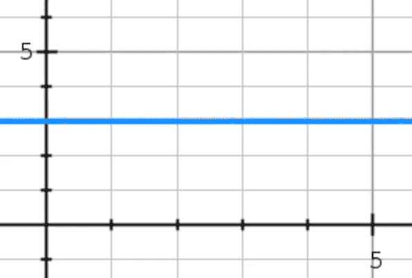
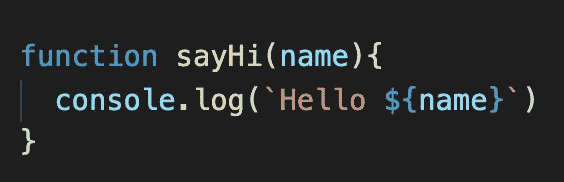
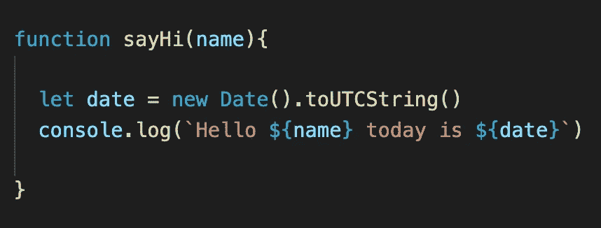
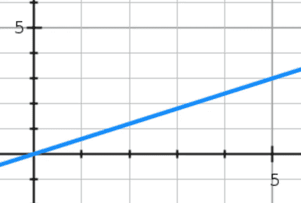
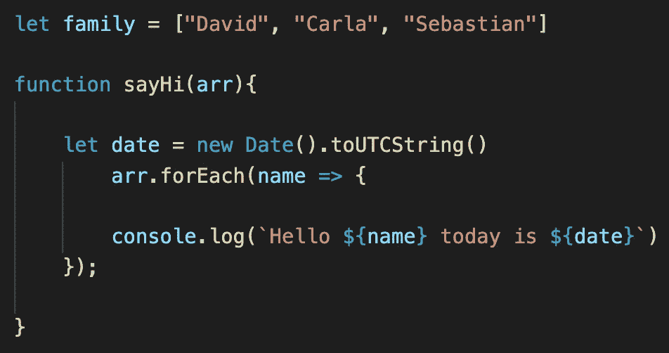
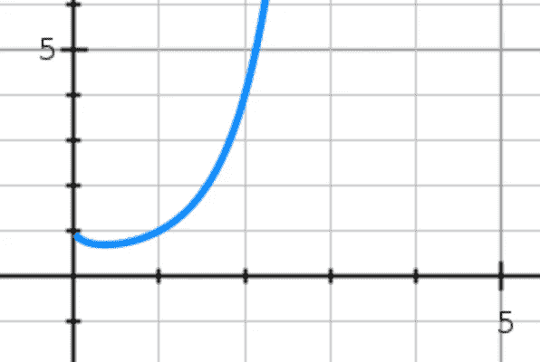
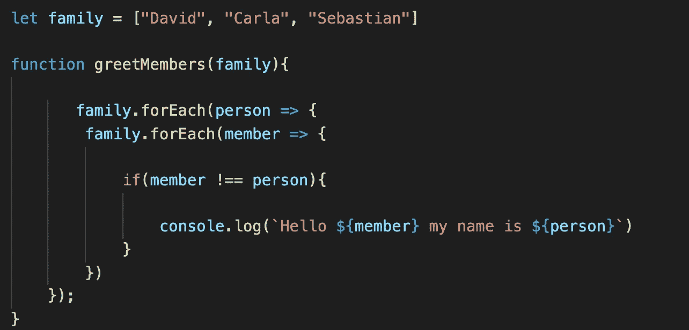

# 时间复杂性和 BigO 符号(线性时间、常数时间和二次时间)

> 原文：<https://levelup.gitconnected.com/time-complexity-and-bigo-notation-linear-time-constant-time-and-quadratic-time-686c279ecd88>

## 时间复杂性和 BigO 综述

## 介绍

时间复杂性和 BigO 符号是编程中的两个重要概念。我记得第一次听到“BigO”这个词，我以为是某种巧克力棒或者糖果。但遗憾的是，BigO 并不美味，但在编程时记住这两个概念是非常重要的。

这些概念用于构建运行速度更快的更高效的代码。还有一个叫做空间复杂度的东西，这是另一个重要的概念，在编程时应该牢记在心。空间复杂度表示一个函数执行时将使用的内存量。空间复杂性也使用 BigO 符号，但在这篇博客中，我将更多地讨论时间复杂性。因此，没有进一步的原因，让我们开始吧！

时间复杂度是我们描述一个函数或算法在给定输入的情况下执行所需时间的方式。BigO 是时间复杂性的“工具”或可视化表示，BigO 符号就像一把测量时间的尺子。

在我们进入一些代码之前，让我们看看存在的不同类型的时间复杂度。所以我们有三种主要的时间复杂度:常数时间，线性时间和二次时间。还有对数时间、阶乘时间和指数时间，但我会在另一篇博客中详述，因为它们有点复杂。

## 恒定时间

首先让我们看看什么是恒定时间，以及我们如何在恒定时间内构造函数。恒定时间代表**一个函数，在给定不同输入的情况下，该函数不会花费更长时间或更多步骤来产生结果。**

这里我们可以看到，如果函数的输入为 5，时间将与 1、2、3 和 4 相同

我们用 BigO 符号表示它的方式是“O(1)”，因为无论输入是什么，函数必须执行的步骤数都是相同的，所以是“O(1)”。值得注意的是，当我们谈论 BigO 时，我们想要测量算法的结构。有一种叫做“丢弃常数”的东西，简单地说就是，如果一个函数需要两步才能产生结果，但是无论输入是什么，步骤的数量都是相同的，那么这个函数仍然会被认为是“O(1)”而不是“O(2)”，因为我们指的是 BigO 的行为，而不是数量。让我们看看能否用一个简单的例子，用一些代码来表示。

在这里，我们有一个简单的函数，将迎接任何人把他们的名字，无论输入是大还是小，计算机将只需要做一步来执行这个函数，所以它的常数时间。假设我们有一个相同功能的变体。

这里我们有相同的函数，但我们添加了更多的捕捉，现在我们希望我们的函数说日期，但不要担心，这个函数仍然被认为是常数时间，因为无论输入是什么，步骤总是两个，但我们会表示为“O(1)”而不是“O(2)”。

## 线性时间

然后我们有线性时间。线性时间表示一个函数，如果输入较大，**将花费较长的时间，因此输入越大，花费的时间也越长。**

这里我们可以看到，对于输入中的每个元素，我们增加了相同的时间

我们用 BigO 符号表示这一点的方式是“O(n)”。那么括号内的“n”是什么呢，“n”代表函数完成任务所需的进程或输入的数量，但是如果一个任务需要 100 步，我们就不会把它表示为“O(100(n)”，我们会去掉常数，简单地说它是“O(n)”。假设我们有和以前一样的功能，但是现在我们想和所有的家人打招呼！

现在我们可以看到，我们正在迭代一个元素数组，假设卡拉结婚了，大卫有了双胞胎，那么这个家庭又多了三个成员，所以如果我们再次运行这个函数，输入将是 6，而不是 3，所以这个函数现在必须再迭代 3 次，这样会多花一点时间。这些重要的时间变化需要大量的数据，因此如果我们测试并观察 3 次迭代和 6 次迭代之间的时间差，可能不会超过 1 毫秒，但假设我们正在处理 1000000 个家庭的名字。这种差异会更加显著。

## 二次时间

最后，我们有二次时间。二次时间代表一个函数，其**性能与给定**输入的平方成正比。

这里我们可以看到，当我们增加输入时，时间量迅速增加

我们用 BigO 符号表示它的方式是“O(n)”注意，“n”是平方的，这意味着现在输入在给出结果之前将被处理两次，听起来有点多余，对吗？因此应该避免这种类型的时间，因为它是根据输入增加最多的时间。现在让我们说，我们想让我们的函数，让每个成员，每个家庭成员，和所有其他家庭成员握手。

这是一个二次函数的例子。我们可以看到，在另一个循环中有一个循环，导致时间呈指数增长。让“family”的数组迭代两次，我们称之为“O(n)”，因为输入在一个函数中经历了两个不同的过程，所以如果数组增加，那么迭代将花费两倍的时间，以此类推。还有三次方时间复杂度，这是相同的，但是有三个循环，因此数组的增长是 3。

## 结论

所以我们开始了，时间复杂度和 BigO 符号的快速概述。关于这些概念还有更多要学的，我可能会在一个单独的博客中写，但这是对基础和最实用知识的一个很好的概述。感谢您的阅读，我希望这篇博客能帮助您更好地理解这些概念).