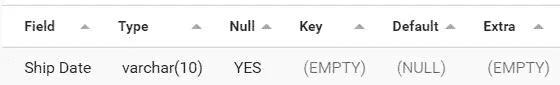
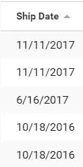
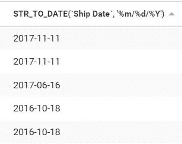
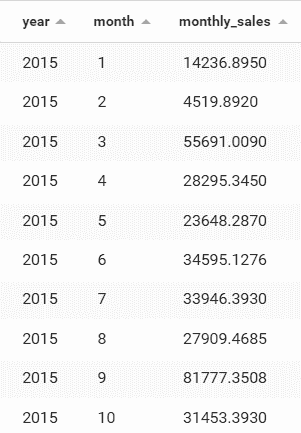
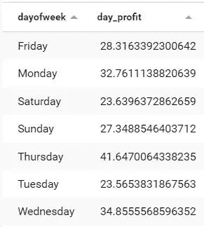
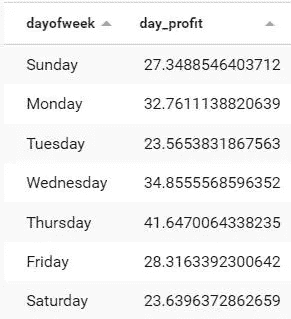
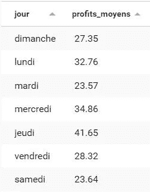

# 如何用 SQL 分析时间序列

> 原文：<https://levelup.gitconnected.com/time-series-analysis-with-mysql-8-346c81a9c258>

## 从理论到实践，充分说明。

时间序列分析是数据分析中最常见和最令人兴奋的问题之一。我从来没有在一次技术面试中不提到这个话题。

我们希望了解我们周围的事物是如何工作的，并检测是否有任何模式，任何季节性可以让我们预测甚至预期未来的价值:

*   比特币的价格会涨吗？
*   五月份我应该能生产多少电？
*   我一年的预期收入是多少？
*   为什么 2 月份报名的客户退订往往比别人快？

这篇文章将教你如何用 SQL 操作你的时间序列数据。

> 本文中提供的例子已经在 MySQL 8 数据库上进行了测试。

因为题目是(非常！)宽泛，我们将重点解决三个问题:

*   将字符串转换为日期；
*   按时间性将事件分组；
*   提取信息以评估季节性；


[绿色变色龙](https://unsplash.com/@craftedbygc?utm_source=medium&utm_medium=referral)拍摄

> 您可以通过[下载 SQL 文件](https://gist.github.com/mickaelandrieu/538fa3ba5ca24c8cc6afb3b65ce89eb6)来检索所使用的数据库，从而测试本文中提供的示例。

# 如何将字符串转换为日期

如果您已经阅读了本系列的前几篇文章，并开始研究示例数据库，您可能已经注意到“Ship Date”字段不是类型 **DATE** 而是类型 **VARCHAR** :

```
SHOW COLUMNS FROM super_store WHERE Field = "Ship Date"
```



不幸的是，如果您的数据输入不正确，日期功能将不可用。
第一个测试是通过估计日期格式来评估该字段的转换:

```
SELECT `Ship Date` FROM super_store LIMIT 5
```



好的，它看起来像月/日/年格式

快速查找格式的方法:

*   一天的最大值是 31(1–31)；
*   一个月的最大值是 12(1–12)；
*   一年的最大值是 99(如果是 2 位数，则为 0–99)；

选择足够多的线条以避免疑问，如果需要，在一张纸上写下图案。

> 在本例中，日期的格式如下:“年/月/日”

要将字符串转换成日期，使用 [STR_TO_DATE](https://dev.mysql.com/doc/refman/8.0/en/date-and-time-functions.html#function_str-to-date) 函数，该函数需要知道日期格式规则，为此，使用 [MySQL formats](https://dev.mysql.com/doc/refman/8.0/en/date-and-time-functions.html#function_date-format) 。

有哪些常见的例子:

*   %d 代表一天；
*   %m 代表月份；
*   %Y 以 4 位数格式表示年份(或%y 以 2 位数格式表示)

在这几个元素的帮助下，您告诉函数如何格式化字符串，有点像编程中的正则表达式:

```
SELECT STR_TO_DATE(`Ship Date`, '%m/%d/%Y') FROM super_store LIMIT 5
```



日期格式现在是 YYYY-DD-MM🤨

剩下的工作就是添加一个 DATE 类型的列并插入数据:

```
ALTER TABLE super_store ADD COLUMN shipped_at DATE;
UPDATE super_store SET shipped_at = STR_TO_DATE(`Ship Date`, '%m/%d/%Y');
```

问题解决了！继续下一个🤓

# 如何按时间性对事件进行分组

回到让你忙了很多文章的超级商店订单分析怎么样(如果你坚持阅读我的文章，它会让你多活一会儿🙃)?

您的营销/业务团队总会对一些基本统计数据感兴趣:

*   日、月、年(少一点，这个)销量；
*   在经典模型中，客户的两个订单之间的时间间隔；
*   在现代商业模式中终止前的订阅月数；

一旦**根据客户类型、产品类型或任何其他社会生态人口统计标准对客户**进行了细分，您就可以更好地了解客户及其对销售或营销部门的需求。

然而，当我们思考时间时，我们可以用两种方式来评价它:暂时性和季节性。

例如，按月对所有订单进行分组。

人们可以考虑独立于一年的一月份的销售额(季节性)，或者相反，按月收集并评估一年内的销售进度(暂时性)。

> 很明显，这两个聚合回答的问题不一样！

如果您想要查看一周中的某一天或一年中的某一个月的销售额是否超过或低于预期，您将不得不忽略数据中的部分信息(即月份或日期)。

让我们讨论一下[可用的几个函数](https://dev.mysql.com/doc/refman/8.0/en/date-and-time-functions.html)来帮助你进行时间序列分析。

[月](https://dev.mysql.com/doc/refman/8.0/en/date-and-time-functions.html#function_month)和[年](https://dev.mysql.com/doc/refman/8.0/en/date-and-time-functions.html#function_year)函数仅检索日期的月份和年份。

## 每月销售额，按年份(时间)



月销售额？✅

## 2016 年 8 月的利润？

> 呃…为什么我们必须在订单日期使用 MIN()函数？*🤨*

这并不总是必要的，因为它取决于数据库配置。从理论上讲，如果使用 GROUP BY 进行聚合，则每个未“分组”的选定列都应该使用聚合函数进行聚合。

这里你已经按年、月、日分组，所以最小值(或最大值，或平均值！)值完全相同，因为实际上在您进行的分组中只有一个不同的订单日期值。

如果你现在不这样做并养成习惯，总有一天，你会得到这样的错误信息😛：

```
Expression #1 of SELECT list is not in GROUP BY clause and contains nonaggregated column 'super_store.super_store.Order Date' which is not functionally dependent on columns in GROUP BY clause; this is incompatible with sql_mode=only_full_group_by
```

反正我们已经解决问题了！继续看最后一个🤓

# 如何评价季节性

有什么特殊的月份或日子吗？

为了获得一周中的某一天，我们可以研究一下 [DAYOFWEEK](https://dev.mysql.com/doc/refman/8.0/en/date-and-time-functions.html#function_dayofweek) 和 [DAYNAME](https://dev.mysql.com/doc/refman/8.0/en/date-and-time-functions.html#function_dayname) 函数:

*   第一个返回一个整数和 1 到 7；
*   第二个返回从“周一”到“周日”的日子名称(唉，不是从周一到周日，是从周日到周六)；


如果目标是把这个给不懂 SQL 的人看，那么用天的名字会更好，但遗憾的是，天的顺序不会是正确的，可能会产生误导！



周五，周一，周六，周日… WTF？😮

诀窍是使用 **DAYNAME** 函数进行显示，使用 **DAYOFWEEK** 进行排序:



我们开始吧🙂

> 但是太恶心了！我们不能直接用法语或我们想要的语言来写吗😟？

如果您已经正确配置了应用程序和数据库服务器，可能已经是这样了。

如果没有，您必须更改系统变量的值，并赋予它您的区域设置值[**LC _ time _ names**](https://dev.mysql.com/doc/refman/8.0/en/server-system-variables.html#sysvar_lc_time_names)(它不会改变出现的顺序) :



全部用法语，以便更好地理解结果📊

周四是表现最好的一天，周二和周六利润最差。

我不会在月级别开发[相同的练习，因为这是完全相同的逻辑，只是使用了](https://gist.github.com/mickaelandrieu/d65f8af59cf3392707a379b5b5b2f163) [**MONTHNAME**](https://dev.mysql.com/doc/refman/8.0/en/date-and-time-functions.html#function_monthname) 和 **MONTH** 函数！

我以给你一个挑战来结束这篇文章:在法国，你将如何重新组织这些行，以便一周中的每一天都是“自然”的顺序？

不要犹豫，在评论里给我你的答案吧！

如果你喜欢这篇文章，请关注[我](https://medium.com/@mickael-andrieu/)，我会在发布我的后续文章时通知你！

[](https://mickael-andrieu.medium.com/membership) [## 通过我的推荐链接加入 Medium-mickal Andrieu

### 作为一个媒体会员，你的会员费的一部分会给你阅读的作家，你可以完全接触到每一个故事…

mickael-andrieu.medium.com](https://mickael-andrieu.medium.com/membership) 

# 分级编码

感谢您成为我们社区的一员！在你离开之前:

*   👏为故事鼓掌，跟着作者走👉
*   📰查看[级编码出版物](https://levelup.gitconnected.com/?utm_source=pub&utm_medium=post)中的更多内容
*   🔔关注我们:[推特](https://twitter.com/gitconnected) | [LinkedIn](https://www.linkedin.com/company/gitconnected) | [时事通讯](https://newsletter.levelup.dev)

🚀👉 [**将像你这样的开发人员安置在顶级创业公司和科技公司**](https://jobs.levelup.dev/talent/welcome?referral=true)