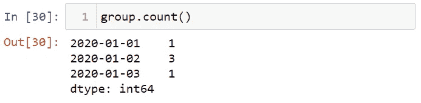

# 7 分钟内与熊猫的时间序列

> 原文：<https://levelup.gitconnected.com/time-series-basics-with-pandas-f74cab9923bb>

## 使用熊猫开始时间序列的简单指南。

约翰·施诺布里奇在 [Unsplash](https://unsplash.com?utm_source=medium&utm_medium=referral) 上的照片

时间序列是在给定时间段内按顺序出现的一系列数据点。随着时间的推移测量或观察到的值是时间序列结构。金融、经济等不同领域的时间序列数据是一种重要的数据结构。Pandas 对于处理日期、时间和时间索引数据非常有用。在这篇文章中，我将讨论以下主题，

*   什么是时间序列？
*   为什么要用熊猫做时间序列分析？
*   如何创建时间序列？
*   时间序列数据结构
*   如何使用 date_range 方法？
*   你应该知道的重要方法

在开始之前，请不要忘记订阅[我们的 youtube 频道](https://www.youtube.com/channel/UCFU9Go20p01kC64w-tmFORw)，在那里我创建了关于人工智能、数据科学、机器学习和深度学习的内容。

让我们开始吧！

# 什么是时间序列？

许多时间序列是固定频率的，这意味着时间序列中的数据点由固定的间隔组成，如每分钟、每天或 1 周。时间序列也可以由不规则的间隔组成。时间序列数据可以由时间中的日期组成。这就是所谓的时间戳。例如，日期(如 2019 年 4 月 15 日 10:00)带有时间戳。

# 为什么要用熊猫做时间序列分析？

Python 有 datetime 之类的模块，可以对日期和时间执行操作，但是由于 Pandas 库有许多有用的工具，所以它更多地用于时间序列数据分析。此外，pandas 还协调库之间的关系，用于时间序列分析。

当数据被打上时间戳时，Pandas 的时间序列工具非常有用。Timestamp 相当于 python 的 Datetime。这种类型用于组成 DatetimeIndex 的条目，以及 pandas 中其他面向时间序列的数据结构。最简单的时间序列是由时间戳索引的序列结构。

# 如何简单地创建一个时间序列？

为了展示如何创建时间序列，首先，让我们导入 Pandas、Numpy 和 datetime。

让我们创建一个包含日期的日期变量。

使用这个日期对象，让我创建一个序列。

给你。我们来看看这个变量的指数。

如您所见，这个变量的索引数据结构是 DatatimeIndex。

# 时间序列数据结构

您可以使用三种数据结构来处理时间序列。第一个是时间戳。时间戳引用特定的时刻(例如，2022 年 6 月 5 日晚上 8:00)。这个结构类似于 Python 的 datetime 模块。但是更有用。与此结构相关联的索引结构是 *DatetimeIndex* 。

对于时间段*，* Pandas 提供了时间段结构。该期间由一个带有开始和结束日期的时间跨度组成。这种结构基于固定的间隔日期。与该类型相关的索引结构是*周期索引*。

对于时间增量或持续时间，Pandas 提供了时间增量结构。显示两个日期之间的时间。与该结构相关联的索引结构是 *TimedeltaIndex* 。

这些结构中最常用的是时间戳和 DatetimeIndex 对象。要将单个日期转换为时间戳，可以使用 to_datetime 方法。

to_datetime 方法将不同格式的日期序列转换为 DatetimeIndex 对象。让我给你看看这个。

可以使用 to_period 方法将 DatetimeIndex 转换为 PeriodIndex，以便添加频率代码。例如，“D”表示每日频率。

你可以从一个日期减去另一个日期。

# 用 date_range 方法创建时间序列

熊猫有各种功能来创建一个日期系列。可以对时间戳使用 date_range 方法，对周期使用 period_range 方法，对时间增量数据使用 timedelta_range 方法。

date_range 方法用于获取固定频率的 DatetimeIndex。如您所知，python 中的 range 方法和 numpy 中的 arange 方法采用起点、终点和步数参数。同样，date_range 方法使用开始日期、结束日期和周期来创建日期序列。比如说；

此外，您可以将日期范围与 period 参数一起使用。为此，您只需输入开始日期。

创建日期范围时，也可以使用 freq 参数。默认情况下，date_range 方法的频率是每天一次。如果您想将频率作为小时，您可以使用代表小时的“H”值。

若要创建时间序列，还可以使用 period_range 和 timedelta_range 方法。

让我们创建一个以一小时为增量的时间序列，

时间序列可以像熊猫中的序列结构一样被索引和选择。例如，让我们将 ts 时间序列的索引 1 赋给一个变量。

现在，让我们来看看这张邮票的价值。

您可以使用日期索引来选择值。

或者

你可以像玩球一样玩长时间系列。让我给你看看这个。

我们来看看 2020 年的数值。

你可以用一个月来写今年。

你可以把时间序列切片。

# 时间序列的重要方法

为了展示如何使用时间序列的重要方法，让我再次打印 ts 变量。

您可以使用 truncate 方法查看两个日期之间的值。例如，让我们看看 2020 年 1 月 15 日之前的日期。

到目前为止，您已经看到了由一个列组成的时间序列。现在，我将向您展示如何使用数据框。首先，让我们用 date_range 方法创建一个名为 date 的变量。

让我们创建一个数据框来索引这个日期变量。

让我们看看这个数据集中 2020 年第 10 个月的值。

在某些情况下，日期可以重复。

您可以使用 is_unique 属性检查数据中是否有重复索引。

False 表示有重复的索引。让我们将重复的日期分组。

让我们用计数法找出重复的日期。

让我们来看看分组日期的含义。

# 结论

时间序列是一系列数据点，其中每个数据点都与一个时间戳相关联。在这篇文章中，我谈到了时间序列。就是这样。感谢您的阅读。我希望你喜欢它。你可以在这里找到这个笔记本[。](https://github.com/TirendazAcademy/PANDAS-TUTORIAL/blob/main/23-Time%20Series%20Basics%20with%20Pandas.ipynb)

别忘了在[YouTube](https://www.youtube.com/channel/UCFU9Go20p01kC64w-tmFORw)|[GitHub](https://github.com/tirendazacademy)|[Twitter](https://twitter.com/TirendazAcademy)|[ka ggle](https://www.kaggle.com/tirendazacademy)|[LinkedIn](https://www.linkedin.com/in/tirendaz-academy)上关注我们

 [## 成为机器学习专家的 6 个步骤

### 成为机器学习专家需要知道的一切。

medium.com](https://medium.com/geekculture/6-steps-to-become-a-machine-learning-expert-5a1f155f7207)  [## 8 个最好的 Seaborn 可视化

### 使用企鹅数据集与 Seaborn 一起动手绘制统计图。

medium.com](https://medium.com/geekculture/8-best-seaborn-visualizations-20143a4b3b2f) 

如果这篇文章有帮助，请点击拍手👏按钮几下，以示支持👇