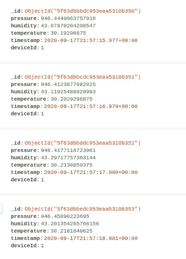

# MongoDB 和 Python 中的时序数据

> 原文：<https://levelup.gitconnected.com/time-series-data-in-mongodb-and-python-fccfb6c1a923>

## 一个提高性能的好模式。

由 [Harishan Kobalasingam](https://unsplash.com/@harishankphotography?utm_source=unsplash&utm_medium=referral&utm_content=creditCopyText) 在 [Unsplash](https://unsplash.com/s/photos/timelapse?utm_source=unsplash&utm_medium=referral&utm_content=creditCopyText) 上拍摄的照片

[MongoDB](https://www.mongodb.com/) 是一个文档数据库，可以直接用 JSON 格式存储数据。使用 MongoDB 启动和创建应用程序非常简单。然而，它是一个强大的工具。

你可以用它来存储时间序列数据。

# 介绍

简单来说，时间序列就是一系列按时间顺序排列的数据。它可以是常数，即每个条目之间的间隔相等(秒、分、小时)，也可以有不同的时间间隔。重要的事实是，每个条目都有一个与之关联的有序时间戳。

现实世界中有许多使用时间序列数据的情况:

*   获取湿度、温度和压力数据的气象站。你想知道一个给定的温度是什么时候获得的，所以你预测你是否必须穿夹克出门。
*   股票市场分析师，他利用一段时间内的所有股票价格进行分析并识别机会。
*   一辆一级方程式赛车，每秒发送遥测信息，如速度、油耗、温度，因此工程师可以计算并告诉车手下一步该做什么。

在 Mongo 数据库中有一些存储它们的方法，我们将逐一介绍。

# 单一文件

第一种方法是将每个获取的数据作为单个文档存储到数据库中。也就是说，每个时间戳(或时间间隔)将对应于数据库中的一个条目。

想象一下，我们有一个每秒产生传感器数据的天气系统。该示例包含温度、湿度和压力等数据，以及天气 id。

每次获取信息时，传感器都会将其发送到数据库，数据库会将其存储为单个文档。

图片作者。

如你所见，有一些重复的或者无用的信息，比如`_id`和`deviceId`。对于每一秒，这两个信息将被存储，一次又一次，增加了集合的大小。

对于我们的场景，它将在一个小时内创建 3600 个文档，即每天 86400 个文档！这将影响性能和磁盘使用。

使用 Python 插入它很简单:

# 时间段文档

由于我们的数据是均匀分布的，我们可以按时间对它们进行分组。在这种情况下，每分钟一个文档。我们有一个包含 60 个对象的数组，每个对象包含来自传感器的样本。

图片作者。

如果与前一个选项相比，我们有更多的字段:

*   `d` : *日期时间*获取数据样本的时刻的信息。如果我们愿意，可以是不同的小组时间，如几小时或几天。这将取决于我们的数据或应用程序的频率。
*   `nsamples`:该分钟采集的样本数。
*   `samples`:包含传感器所有样本的数组。因为我们已经有了时间戳信息，并且数据是均匀分布的，所以我们可以忽略它，只存储实际的传感器数据。

这些额外的字段帮助我们以后查询数据，并作为一种更好地聚合数据的方式。

要用 Python 插入它，我们必须修改我们的数据:

我们使用`update_one`功能，而不是`insert_one`。它将找到具有等于 1 的`deviceId`和相同的`minute`的文档，并将数据插入到`samples`字段。

如果没有找到具有这些特征的文档(即新的一分钟)，将创建一个新文档。

> **注意**:确保将标志`upsert=True`传递给该函数，否则不会创建新文档。

# 大小-桶文档

有些数据是以不规则的时间间隔生成的，有些传感器可以提供比其他传感器更多的数据。

在这种情况下，基于大小的存储桶可能比基于时间的存储桶更好。因此，您根据数组的大小而不是时间来更新并向文档中插入一个新样本。

图片作者。

我们的文档中还有两个信息，有助于以后的查询和聚合:

*   `first`:插入`samples`字段的第一个数据的时间戳；
*   `last`:最后插入`samples`字段的数据的时间戳；

> **注**:如果需要，我们可以有其他数据，比如最大值和最小值。

插一句，和我们之前的数据差不多。我们必须进行修改，这样才能计算出我们想要的数据:

我们再次使用`update_one`函数，但是现在比较将针对`nsamples`字段:它必须小于 200(我们的桶大小，您可以选择任何您喜欢的值)并且使用相同的`deviceId`。

我们使用操作符`$[min](https://docs.mongodb.com/manual/reference/operator/aggregation/min/)`和`$[max](https://docs.mongodb.com/manual/reference/operator/aggregation/max/)`来自动计算插入的数据时间戳的最小值和最大值。

# 最后的想法

我们来对比一下目前为止我们创作的三个系列。

图片作者。

经过大约一个小时的数据采集，我们有了一些很好的见解:

*   藏品`single`比`time_bucket`多 65%。如果我们获取更多的数据，可能会有更大的差异。
*   由于`size_bucket`集合包含更多信息，因此总大小大于`time_bucket`。但即便如此，也比`single`少了很多。
*   对于均匀分布的数据，就像我们的例子一样，`time_bucket`是一个更好的方法，因为它需要保存的信息更少。

如果您有一个时间序列数据，创建一个基于时间的存储桶，甚至基于大小的存储桶，可以提高磁盘使用率和性能，正如我们在本文中看到的。

使用 Python，很容易将它们插入数据库，几乎不费吹灰之力。

您可以使用 nice [FastAPI](https://fastapi.tiangolo.com/) 框架创建一个 API，正如本文所解释的:

 [## 如何在 MongoDB 中使用 FastAPI

### 提供数据库文档的简单方法。

medium.com](https://medium.com/python-in-plain-english/how-to-use-fastapi-with-mongodb-75b43c8e541d) 

希望你喜欢这篇文章。你可以在这里和 Twitter 上关注我，了解更多类似的内容。