# R 中的 ARIMA 时间序列预测

> 原文：<https://levelup.gitconnected.com/time-series-forecasting-with-arima-in-r-a0d1f8f8b92f>

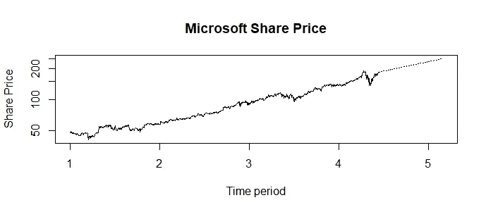

预测和预报，从数据科学的角度来看，是一组可互换的词汇，指的是基于一组历史数据对未来事件的预测。

有许多方法可用于预测，例如回归、简单移动平均，甚至使用库，如 Prophet in R。

 [## R 中的 Prophet 时间序列预测

### 本周早些时候，当我浏览 LinkedIn 时，我看到一个帖子，简要提到了“先知”图书馆…

levelup.gitconnected.com](/time-series-forecasting-with-prophet-in-r-a9ee81dc82e1) 

在这个例子中，我将谈论 ARIMA 预测技术，这是最广泛使用的时间序列预测技术之一。

ARIMA 是首字母缩写，代表*自回归综合移动平均线*。是的，这有点长，但是为了理解这是如何工作的，我们可以从分解 ARIMA 模型的组件开始。

ARIMA 模型可以写成以下形式:ARIMA(p，d，q)，其中

*   AR(p)过程
*   d =倍差
*   q = MA(q)过程

## 氩(磷)过程

阶为 *p* 的自回归过程如下所示:

𝑦𝑡=𝛿+𝜙1𝑦𝑡−1+⋯+𝜙𝑝𝑦𝑡−𝑝+𝜀𝑡

当样本偏自相关函数(PACF)过程在滞后 *p* 后趋于零时，也可以在时间序列图中识别。

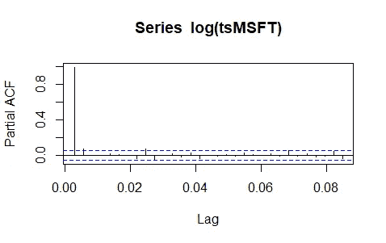

PACF 在滞后 1 之后的滞后截止的例子表明这可能是 AR(1)模型。

## 差分过程

人们还必须确保数据是稳定的，并且在应用 ARIMA 预测之前必须消除趋势。这就是差异派上用场的地方。

差分是一种用于从时间序列中移除趋势模式的方法，差分操作可以写成:

∇𝑦𝑡=(1−𝐵)𝑦𝑡=𝑦𝑡−𝑦𝑡−1

可以对第*阶和第*阶进行差分，直到趋势消除。在大多数情况下，一两个差异足以消除时间序列中的潜在趋势。

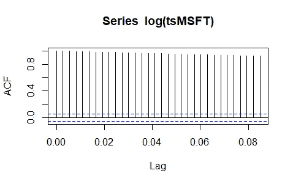

具有指数衰减的 ACF 的例子表明时间序列不是平稳的，没有任何指数衰减的 ACF 的例子表明在应用差分后时间序列是平稳的

## MA(q)过程

订单 *q* 的移动平均过程为:

𝑦𝑡=𝜇+𝜀𝑡−𝜃1𝜀𝑡−1−⋯−𝜃𝑞𝜀𝑡−𝑞

当样本自相关函数(ACF)过程在滞后 *q* 后趋于零时，也可以在时间序列图中识别。

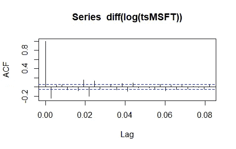

在 ACF 中的 0 滞后之后的滞后截止的例子表明这是 MA(0)模型。

## ARIMA 模型过程

简而言之，ARIMA 模型的应用可以分为以下几个步骤:

1.  使用时间序列图来确定是否需要任何数据转换
2.  查看 ACF 和 PACF，以确定是否需要差分来消除数据中的任何潜在趋势。请记住，ARIMA 只能应用于平稳的时间序列。平稳时间序列是指具有恒定的均值和方差，或者在 ACF 和 PACF 图中没有任何指数衰减。
3.  如果数据是非平稳的，检查数据中是否有季节性。季节性可以解释为受季节性因素影响的时间序列数据，它们**总是固定的，并且具有已知的周期**。例如，圣诞贺卡在节日期间的销售。
4.  对于非季节性数据，取数据的一阶或二阶差。
5.  对于季节性数据，考虑数据中的季节性差异。
6.  最后，在差异之后，通过查看 ACF 和 PACF 图找到适当的 ARIMA(p，D，q)(P，D，Q)s 模型。比较生成的 ARIMA 模型之间差异的一种方法是使用 AIC(赤池信息标准)值。**一般来说，AIC 值越低=模型性能越好。**

## 使用 R 进行 ARIMA 预测的示例

在这个例子中，我将从过去五年中微软股票价格的每日历史数据开始。CSV 数据可以从雅虎财经下载。

我们将使用的库是*预测库和 t 系列*库。

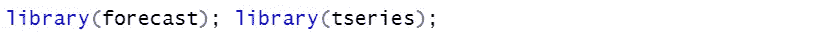

首先，我们将从读取数据并将其转换为单变量时间序列开始。因为我们将基于股票价格的收盘价预测数据，所以我删除了数据中不必要的行。

由于这是一个包含每日收盘数据的数据集，因此频率表示每单位时间的观察次数，设置为 365，因为它表示一年中的每日数据。

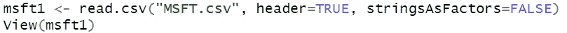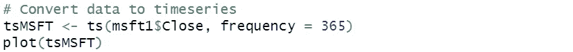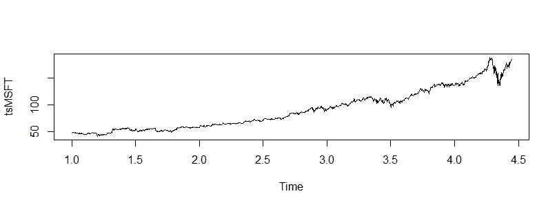

看时间序列图，我们可以看到，随着时间的推移有上升趋势，没有太多的季节性。但是在应用我们的预测之前，我们必须确保时间序列是平稳的。

我们可以这样做，首先用数据的对数去掉不相等的方差，然后对时间序列进行差分。接下来，我们将使用 ADF (Augmented Dickey-Fuller Test)测试时间序列是否是平稳的。

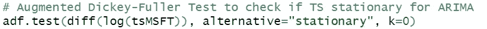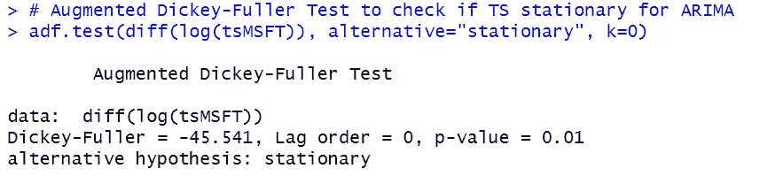

ADF 对我们的时间序列数据的输出

使用假设检验，我们可以看到 ADF 给出的 p 值小于 5%的显著性水平。因此，我们可以拒绝零假设，接受另一个假设，即我们的时间序列是平稳的。

太好了！这让我们可以继续我们的 ARIMA 预测。

为了确定我们的 ARIMA 模型的参数，我们可以看看 ACF 和 PACF 时间序列图的差异。

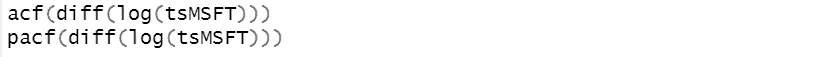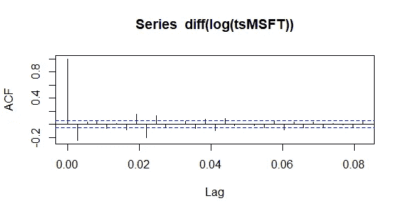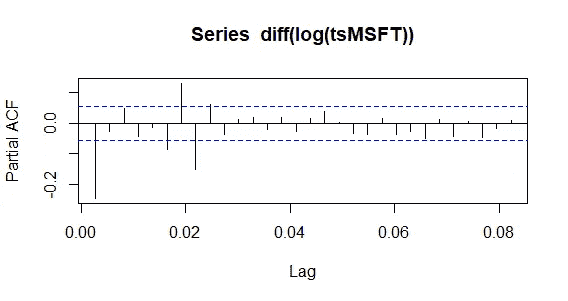

ACF 时间序列图的滞后似乎在滞后 0 之后截止，这很可能代表 MA(0)模型。因此，我们可以建立我们的 ARIMA(0，1，1)模型，还包括季节性因素。

从结果来看，我们的模型的 AIC 为-6668.29，您可以随意试验不同的模型设置，找到 AIC 值最低的那个。这应该是我们预测的最佳模型。

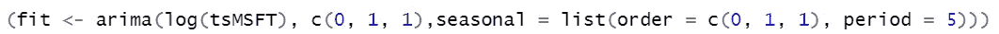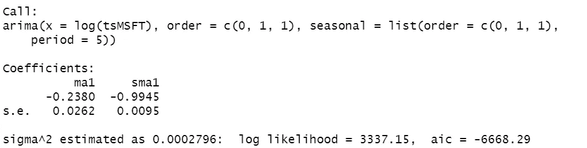

使用周期 5 作为每日数据采样，而不是 365，因为 R 不支持大于 350 个周期的滞后。

接下来，我们将应用我们对下一年或未来大约 52 周的预测，假设每周有 5 个交易日。

其中 2.718 大约是指数常数**的值**，我们将应用它从值中移除对数。(对数倒数)

Log = 'y '允许我们在对数标度上绘制数值。这样可以更好地显示值，因为与线性标尺相比，它们彼此之间的位置不同。

lty = c(1，3)表示原始序列的线型为 1，预测(虚线)时间序列的线型为 3。

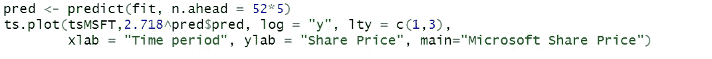

我们对微软股价预测值的最终输出

## 另一个 ARIMA 预测高度季节性数据的例子

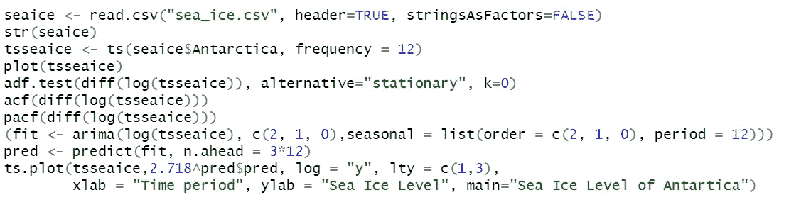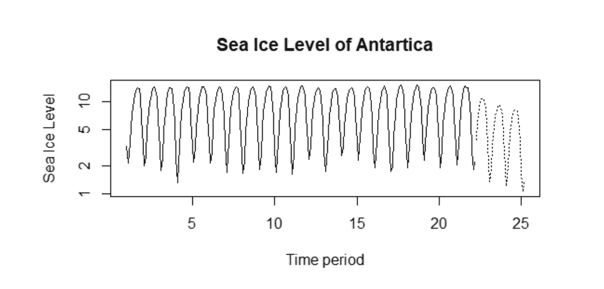

好奇的学习者？释放你在媒体上学习的全部潜力，用不到一杯咖啡的钱支持像我这样的作家。

 [## 通过我的推荐链接加入媒体——杰森·LZP

### 作为一个媒体会员，你的会员费的一部分会给你阅读的作家，你可以完全接触到每一个故事…

lzpdatascience.medium.com](https://lzpdatascience.medium.com/membership) 

刚接触 R 编程，不知道从哪里开始？看看我的电子书一步一步的指南！

 [## 数据科学入门指南(PDF /电子书

### 有一段时间了，我希望每个人都保持安全和健康。本月初，由于封锁，我刚刚…

link.medium.com](https://link.medium.com/NOAyMQqMZbb)