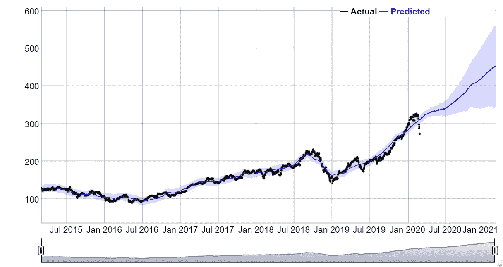
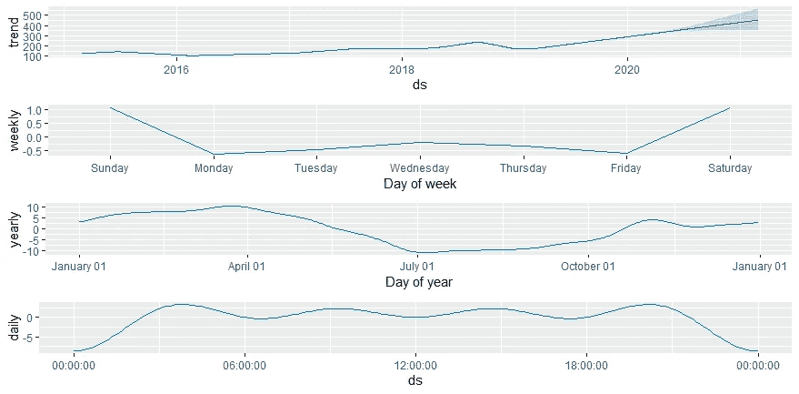

# R 中的 Prophet 时间序列预测

> 原文：<https://levelup.gitconnected.com/time-series-forecasting-with-prophet-in-r-a9ee81dc82e1>

本周早些时候，当我浏览 LinkedIn 的时候，我看到了一个帖子，简要提到了可以用来预测时间序列的“先知”库。

根据 CRAN 文档，该库被描述为一种“自动预测程序”，可用于预测基于加法模型的时间序列数据，其中非线性趋势与每年、每周和每天的季节性以及假日影响相适应。和几个季节的历史数据的时间序列效果最好。

完整文档:【https://cran.r-project.org/web/packages/prophet/prophet.pdf 

作为一个好奇的人，我决定尝试一下，结果如下:

我决定在这个例子中使用一只著名的股票(AAPL ),并计划对它应用预测技术。这是基于股票五年的历史数据的每日频率。我已经从[雅虎财经](https://sg.finance.yahoo.com/quote/AAPL/history?p=AAPL)下载了 CSV 文件。让我们来看看。

探索 R 中的数据集

读取我们的数据集

快速浏览我们的数据集

在继续之前，作为预处理的一部分，让我们快速检查一下丢失的数据。

检查缺少的值

太好了！0 缺少数据，我们可以继续了。 *P.S 缺失值在 R.* 中标记为 NA

在使用这个库时，我意识到一件事，日期必须是 YYYY-MM-DD 格式。它主要只处理两列，一个日期戳和一个“y”列，表示我们想要预测的度量。用于测量的变量也必须严格为数字类型。

我们可以从加载以下库开始进行一些格式化，并加载 prophet 库进行预测。我们必须将列“Date”重命名为“ds ”,并使用“Close”作为我们的度量值，该值必须重命名为“y ”,这样 prophet 才能发挥它的魔力。

删除不需要的列，只保留日期和结束列

将 Date 和 Close 列重命名为 ds 和 y，以便使用 prophet 技术

太好了，现在我们有 0 个丢失的值，并重命名了供库使用的列。我们可以使用以下命令运行我们的预测。

由于我们的时间频率基于每日收盘，我们将应用 365 天或一年的预测周期。然后是预测函数来得到我们的预测。

最后，我们将创建一个包含以下各列的附加向量，即:“yhat”、“yhat_lower”和“yhat_upper”。这些变量分别代表预测值、下预测值和上预测值。

最终预测产量

使用上述代码中的 prophet_plot_ components 函数对趋势、年季节性和周季节性等预测组件进行细分。

细分预测组件

最后，如果你喜欢一个互动的情节，你可以通过应用下面的功能来做到这一点。

我们预测的互动图

你有它！

我很高兴尝试这个库进行时间序列预测。虽然不是代表季节性的最佳数据集，但它绝对是一个软件包，允许人们分解时间序列的组成部分，并允许轻松预测。

好奇的学习者？释放你在媒体上学习的全部潜力，用不到一杯咖啡的钱支持像我这样的作家。

 [## 通过我的推荐链接加入媒体——杰森·LZP

### 作为一个媒体会员，你的会员费的一部分会给你阅读的作家，你可以完全接触到每一个故事…

lzpdatascience.medium.com](https://lzpdatascience.medium.com/membership) 

刚接触 R 编程，不知道从哪里开始？看看我的电子书一步一步的指南！

 [## 数据科学入门指南(PDF /电子书

### 有一段时间了，我希望每个人都保持安全和健康。本月初，由于封锁，我…

lzpdatascience.medium.com](https://lzpdatascience.medium.com/r-for-data-science-a-beginners-guide-pdf-ebook-a5fe11009443)