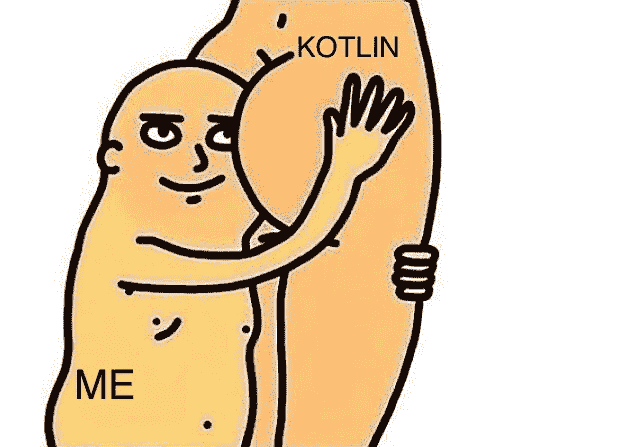
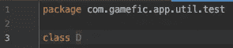
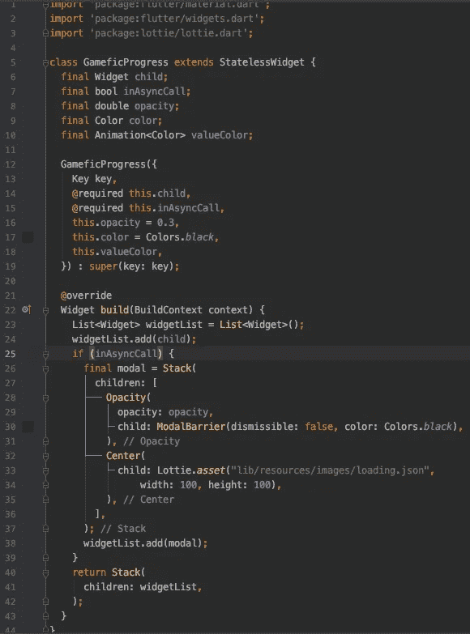
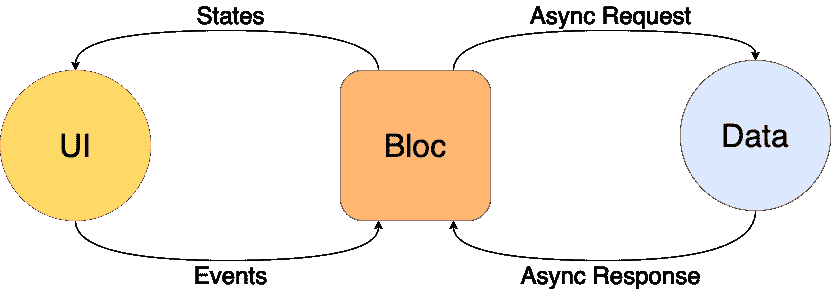

# 漂浮的时间:一个本地 Android 开发者在一周的尝试中对 Flutter 的体验

> 原文：<https://levelup.gitconnected.com/time-to-float-migrating-from-kotlin-to-flutter-7e8395876e02>

你好，我那被隔离的、不确定自己未来的、不知道自己是否会再去酒吧的开发人员们！今天我想和你联系，分享一点我从原生 Kotlin/Swift 开发到移动开发 Flutter 的灾难性经历。

首先，我想确保你知道这篇文章完全是一种偏见，充满了厌恶、痛苦和一点点仇恨。我在这里不是为了支持颤振。我在这里表达我的感受，现在至少有 60%的感受受到了世界上所有混乱的影响。我想弄清楚我有多爱 Kotlin/Swift，我有多希望我可以用它们来编码我生活中的一切，以及 Dart 有多糟糕。

是的，我用 Flutter 作为我心理问题的替罪羊。告我吧。

我喜欢它。

此外，请记住，这整个看法可能会在本周末完全改变。

# 为什么我要用我的生命去做这件事

**生存危机**:我讨厌自己，死亡不可避免。因此，我希望我冰箱里剩下的每一口咕噜咕噜的精酿啤酒都能品尝出最好的味道。为了实现这个目标，我强迫自己的余生变得完全痛苦，结果是啤酒尝起来更好。为了达到那种痛苦，我在这里学习颤动。

**市场需求**:一些笨蛋显然在用它，一些笨蛋雇佣笨蛋用它来开发愚蠢的应用程序，加入他们显然是个好主意，否则不久之后我将无法为自己提供食物或资助我的任何肮脏的嗜好。

**时机**:我们是一个小团队，我们需要一个快速的解决方案来运行 Android 和 iOS。

# 情况

现在，我为一家游戏化公司工作，该公司的客户拥有大型团队，我们需要开发一个经理应用程序，以便这些团队的经理可以轻松访问他们下属的绩效指标。Flutter 作为一种解决方案出现了，我在这篇文章中收集了我们在决定是否使用它之前的一些关注点，这样下一个从事这项工作的人就知道我从哪里停止了。我在考虑，在巴西彻底崩溃之前，我们还有几个星期，我会因为死亡而变得不可救药，这就是为什么我在准备。

乐观情绪到此为止，让我们继续讨论问题吧。

## 视觉布局创建

它根本不存在，这是我所能想象的最悲伤的事情之一。那比你的狗每天看着你去上班，还指望你永远不回来还难过。

Flutter 中的布局是使用 Widgets 构建的，这些 Widgets 是一堆蹩脚的嵌套代码，看起来像是世界上所有可用的意大利面条在奥林匹克游泳池中腐烂了整整一周的计算版本，不是到了有老鼠的地步，而是到了积累后来长出翅膀的小爬行动物的地步。

为了比较，我添加了在 Kotlin 中定义对话框的代码:

它是如此之小，以至于我可以用漫画 Sans 72 把它纹在我的眼睑上，而且还会有多余的空间放一个曼荼罗。

以及在 Dart/Flutter 中定义完全相同的对话框的代码:

这种语言应该被弹劾。

现在你会说“是的，但是第二个对话框有更多的属性，也更完整，这不公平”，但是我会问你:这是真正的要点吗？

号码

这里的重点是夸大，使用不可靠的数据和表达愤怒。记住这一点。

撇开科学分析不谈，Flutter 需要一些严肃的东西，所以它在界面构建方面变得不那么令人讨厌了。幸运的是，上帝亲自派遣了一些善良的灵魂，他们为了人类的更大利益而分享智慧的密码。 [Flutter Studio](https://flutterstudio.app/) 是一款在线工具，它的功能与微波炉、网上银行应用程序或汽车后备箱里的一加仑可乐完全一样，可以清除谋杀受害者的血液:它节省时间。

*旋舞工作室。*为什么人们对功能齐全的跨平台移动框架有惊人的想法，却想不出这样的东西。这就像知道如何做一个完美对称的三层结婚蛋糕，上面满是花哨的装饰品，却不知道如何煎鸡蛋。

Flutter Studio 允许您构建屏幕的大多数可视组件，并将生成的代码导出为文件，您可以将这些文件添加到您的项目中，使用您的业务逻辑、服务调用和动画来完成它们。它给你的祝福是让你不用接触任何脏东西就能构建你的布局。它就像是开发人员的清洁手套。

在冠状病毒的治愈和疫苗之后，我真诚地希望现在生活的所有人类的下一个大进化是 Flutter 平台的内置接口构建器。以及更公平的经济体系。

## HTTP 呼叫

作为一个来自原生 Android 开发并习惯于每天使用翻新的人，这部分体验并不那么有害。一部分是因为随着时间的流逝，你会越来越少地感受到活着的痛苦(因为你已经习惯了)，一部分是因为《T4》在《Flutter》中有了新版本。

不过最常见的 Flutter 的 HTTP 调用库是 [Chopper](https://pub.dev/packages/chopper) 。他们可能从一个类比中得到这个名字，这个类比是关于信息如何被*切碎*成包并在一个 HTTP 请求中从一台计算机发送到另一台计算机，或者因为切碎器使人想起洋葱，这使人想起哭泣，这就是你在 Dart 中编码时所做的。不管怎样，干得漂亮。

Chopper 和 renewal 使用接口和注释来定义端点，两者都有拦截器，并支持每一种主流网络请求/响应处理。通过一些工作和一些像[这些](https://resocoder.com/2019/07/14/chopper-retrofit-for-flutter-3-converters-built-value-integration/#Creating_a_BuiltPost_class)这样的教程，你可以很容易地添加 Json 序列化器，你的 API 层会和其他的一样好。

哦，我在骗谁，放松我的屁股。我花了将近两天的时间才把这玩意修好。

## 设计模式

根据我的研究，Flutter 支持一些在原生移动开发中广泛使用的好的和受欢迎的设计模式，例如[MVVM](https://medium.com/better-programming/mvvm-in-flutter-edd212fd767a)；一些糟糕的、令人讨厌的设计模式主要用于本地移动开发，比如和 MVP 然后还有[阻挡](https://pub.dev/packages/bloc)。

只是一个来自 BloC 库文档的图表，所以你认为我实际上已经研究过了。

集团似乎是最常见、最文明、最开明、最礼貌、最有教养的方式(但这只是因为它看起来像 MVVM，让我想起了 iOS 机制)。虽然用枚举来映射事件对我来说有点奇怪，但是这些概念看起来像小猫一样漂亮。我看到的代码让我想呕吐在这只小猫身上，让它吃掉它。那主要是因为 Dart，不过我会挺过去的。

## 动画片

没做过多少。然而，我确实发现[洛蒂](https://pub.dev/packages/lottie)在 Flutter 中可用，所以你可以放心，你将能够在你的*完全原创*和*非抄袭*应用的成功屏幕上运行你从一个贫穷勤奋的 Dribbble 设计师那里偷来的可爱动画。没人会注意到。

不过，我试着给洛蒂打了一针。在花了大约 3 分钟 1)设置库，2)连接动画代码，3)将它与服务呼叫集成，以及大约 9 个小时 17 分钟 4)试图找出动画文件的正确路径之后，我设法得到了这个不起眼的结果:

看起来很蹩脚，因为这是一个 GIF，但它的工作，相信我。此外，不要介意方形按钮，这是一项正在进行中的工作。

还有一堆内置的动画控件，我没有深入研究，但我已经看到了可用的(过渡，淡入淡出，形状，所有的废话，UX 人认为在他们异想天开的头脑中是可能的，等等)。也潜伏一点，不要把一切都留给我。

# 结论

正如罗伯特·陆德伦或苏珊·科林斯在《饥饿游戏》中所说的(在我五分钟的搜索中找不到这句话的真正作者，我不在乎):“希望是唯一比恐惧更强大的东西”。我希望 Flutter 项目背后的女性和男性正在计划通过在 Flutter 框架中添加一个视觉、语音激活、手绘、气味导向或任何你选择使用的感觉的界面生成器来减少他们给来自 Kotlin/Swift 的人们带来的恐惧，因为我们在 2020 年拍摄了冥王星的高清照片，并在太阳系外发送了一艘航天器，我们甚至失去了它的踪迹，我不相信从头编码仍然是建立他妈的手机应用程序屏幕的最佳方式。你们以为我是什么，开发商吗？看在上帝的份上。

*免责声明:这篇文章中没有任何信息是真实的。除了对自己的厌恶，我不代表也不拥有任何东西。来自谷歌的人或任何其他与这里提到的任何工具相关的人:请不要起诉我。谢谢你给我提供获取食物的方法。我爱你们所有人。*