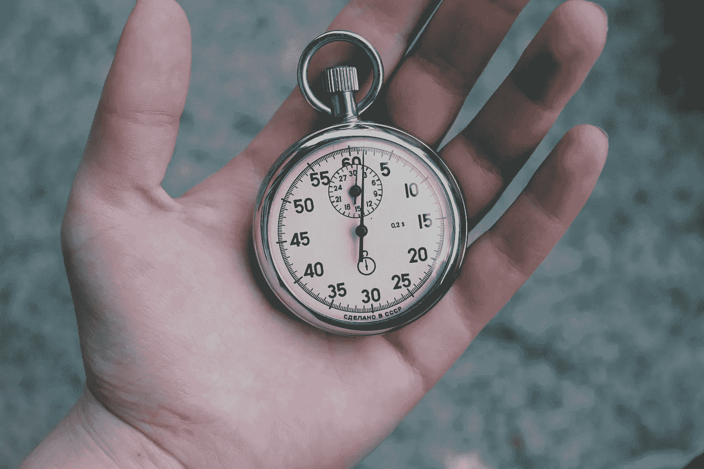

# 使用 Golang 的计时器和跑马灯

> 原文：<https://levelup.gitconnected.com/timer-and-ticker-using-golang-933a6d00a832>

## 计时器和跑马灯让你编写代码，在未来执行，一次或重复。

照片由[维里·伊万诺娃](https://unsplash.com/@veri_ivanova?utm_source=unsplash&utm_medium=referral&utm_content=creditCopyText)在 [Unsplash](https://unsplash.com/s/photos/timer?utm_source=unsplash&utm_medium=referral&utm_content=creditCopyText) 上拍摄

在本教程中，我们将介绍 Go 中的计时器和计时器，以及如何在自己的 Go 应用程序中有效地使用它们。

## 计时器与计时器

**计时器—** 用于一次性任务。它代表未来的单一事件。你告诉定时器你想等多久，它提供了一个通道，到时候会通知。

**滚动条** —当你需要在给定的时间间隔内重复执行一个动作时，滚动条非常有用。我们可以结合使用 tickers 和 goroutines 在应用程序的后台运行这些任务。

## 一个简单的**定时器**

让我们从一个非常简单的计时器开始，它将在 2 秒钟后运行。时间的执行与 goroutine 相关联。使用`***done***` 的目的只是为了控制程序的执行。

代码清单 1.1 — [点击运行](https://play.golang.org/p/jOjaCsnUiZY)

## 圈数前停止计时器

在下面的代码清单中，您可以调用计时器上的`**Stop()**` 方法来停止它的执行。我们已经配置了一个 10 秒后执行的时间，但是第 14 行提前停止了它。

代码清单 1.2 — [点击运行](https://play.golang.org/p/FBIx6SxnaD1)

## 简单的跑马灯

让我们从一个非常简单的开始，我们每 1 秒钟重复运行一个简单的`fmt.Println`语句。

代码清单 1.3 — [点击运行](https://play.golang.org/p/G-F7ioT1vU8)

## 停止跳动

在下面的代码清单中，ticker 被配置为每 1 秒钟执行一次。编写一个 goroutine 来监视是否收到了 ticker 事件，或者 done 通道是否收到了停止它的信号。在向`***done***`通道发送信号之前，在第 24 行，我们已经调用了`*time.Sleep(10*time. Second)*` 让 ticker 执行 10 次。

休眠 10 秒钟后，将执行第 25 行的语句，这将导致停止 ticker。

代码清单 1.4 — [点击运行](https://play.golang.org/p/l1DUFYNk893)

## 背景股票

如果我们有一个希望在后台运行的任务，我们可以将迭代`ticker.C`的`for`循环移到`goroutine`内部，这将允许我们的应用程序执行其他任务。

让我们移动代码来创建 ticker，并将其循环到一个名为`bgTask()`的新函数中，然后，在我们的`main()`函数中，我们将使用`go`关键字调用这个函数作为 goroutine，如下所示

代码清单 1.5 — [点击运行](https://play.golang.org/p/V4KXntZkuVG)

## 结论

我们经常希望在未来的某个时间点执行 Go 代码，或者每隔一段时间重复执行一次。Go 的内置`*timer*`和`*ticker*`功能让这两项任务变得简单。我们可以以一种可控的方式使用这些实现。

目前就这些了…继续学习…..快乐学习😃