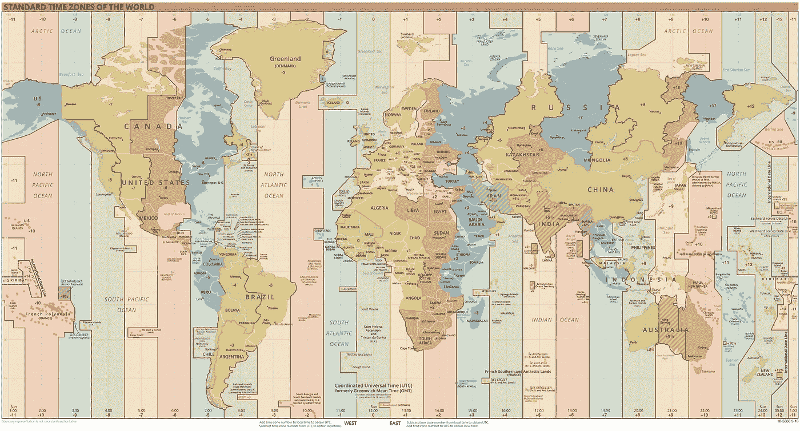

# discord.js 上的时区

> 原文：<https://levelup.gitconnected.com/timezones-on-discord-js-a62a670feeb7>


几周前我创造了一个不和谐机器人。它的想法很简单:用户点击一个按钮，然后机器人会为他们创建一个新的频道，包含一系列问题，可能是网址，选择菜单，号码等。一旦所有的问题都得到回答，机器人就会将它们作为嵌入消息发送到另一个通道。很简单，对吧？然而，有一个小问题。

## **问题**

机器人要求的问题之一是日期和时间。我必须获取消息内容并将其格式化为不一致的时间戳。代码看起来像这样:

```
customParseFormat = require('dayjs/plugin/customParseFormat');
const dayjs = require("dayjs");
dayjs.extend(customParseFormat);/*...*/const filter = m => m.author.id === interaction.user.id && !m.author.bot;
collector = channel.createMessageCollector({ time: 60000, filter });p = new Promise((resolve, reject) => {
    collector.on("collect", m => {
        if(!dayjs(m.content, "DD/MM/YYYY HH:mm").isValid()) return m.delete(); answers.push({name: q.name, value: `<t:${dayjs(m.content, "DD/MM/YYYY HH:mm").unix()}>`});
        resolve(m);
        collector.stop();
        m.delete();
    });
});await p;/*...*/
```

这个机器人对我来说工作得很好，但是当我的客户测试它时，他们得到了一个完全不同的时间！

事实证明，这是因为我们处于不同的时区。所以当我的客户发送一个日期时，机器人照原样解析它，不考虑时差。因为我的时区是 UTC+3，而他们的是 UTC，所以他们的时间总是比他们最初输入的时间差 3 个小时。这当然是个大问题。

## 解决方案

遗憾的是，Discord.js 目前没有提供任何获取用户当地时间的方法。因此，唯一的解决方案是将它作为一个参数，并根据机器人的本地时间增加或减少时间。幸运的是， [**Day.js**](https://day.js.org/en/) 允许您使用输入字符串解析日期，并将解析的日期转换为 unix 时间戳。它还可以让你增加或减少时间。完美！

经过一点点测试，代码最终是这样的:

```
customParseFormat = require('dayjs/plugin/customParseFormat');
const dayjs = require("dayjs");
dayjs.extend(customParseFormat);/*...*/const filter = m => m.author.id === interaction.user.id && !m.author.bot;
collector = channel.createMessageCollector({ time: 60000, filter });p = new Promise((resolve, reject) => {
    collector.on("collect", m => {
        const localOffset = new Date().getTimezoneOffset() / 60;
        let date = m.content.split(" ");
        if(date.length !== 3) return m.delete();const timezone = parseInt(date[date.length - 1]);

        date.pop();
        date = date.join(" ")
        if(!dayjs(date, "DD/MM/YYYY HH:mm").isValid()) return m.delete();answers.push({name: q.name, value: `<t:${dayjs(m.content, "DD/MM/YYYY HH:mm").add(timezone + localOffset, "h").unix()}>`});
        resolve(m);
        collector.stop();
        m.delete();
    });
});await p;/*...*/
```

注意，如果机器人在 UTC 的左边，那么`localOffset`将为正，如果在右边，那么`localOffset`将为负。



标准时区地图(维基百科)

# 分级编码

感谢您成为我们社区的一员！更多内容见[升级编码出版物](https://levelup.gitconnected.com/)。
跟随:[推特](https://twitter.com/gitconnected)，[领英](https://www.linkedin.com/company/gitconnected)，[通迅](https://newsletter.levelup.dev/)
**升一级正在改造理工大招聘➡️** [**加入我们的人才集体**](https://jobs.levelup.dev/talent/welcome?referral=true)