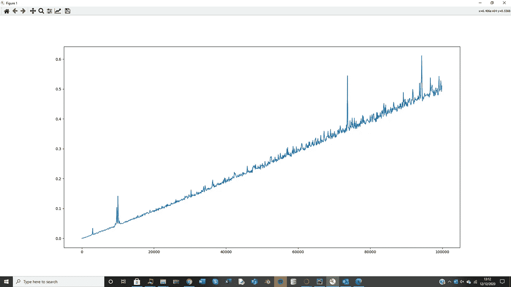
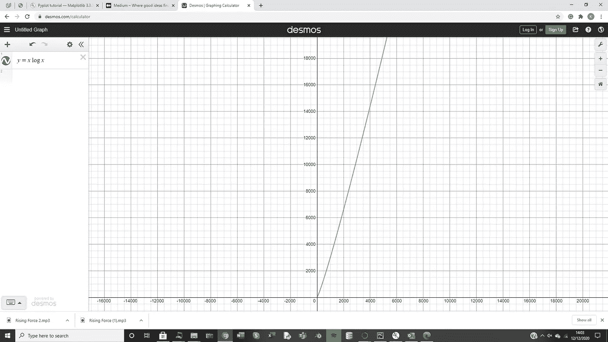

# 计时快速排序

> 原文：<https://levelup.gitconnected.com/timing-quicksort-c87f0c2983ce>



使用 MatPlotLib，我将教你如何制作一个图表，显示 Python 上不同长度的列表的快速排序的速度。

如果你想了解我的快速排序代码，我已经写了一篇单独的文章，但是我将解释如何把它放到一个图上，并把它与快速排序的 O 符号联系起来。正如您在图中看到的(这是我得到的输出图)，存在一些白噪声，特别是对于较大的数据集，这是因为排列特别好或特别差。当元素的数量变得非常小时，获得非常好的输入(因此大多数是立即排序)的机会变得非常小。

```
import random
import time
import matplotlib.pyplot as plt

Input= [i for i in range(1,100000,100)]
endTimes = []
def QuickSort( lists, OrderedLists,index):
    if len(lists)==0:
        return OrderedLists
    UList = []; LList =[]
    pivot = random.choice(lists)
    lists.remove(pivot)
    for i in lists:
        if i>pivot:
            UList.append(i)
        else:
            LList.append(i)
    OrderedLists[index+len(LList)]= pivot
    QuickSort(UList, OrderedLists, index+len(LList)+1)
    QuickSort(LList,OrderedLists,index)
    return OrderedLists

for i in Input:
    Unordered = [random.randint(1,100000) for j in range(i)]
    start=time.time()
    QuickSort(Unordered, ['' for i in range(i)], 0)
    end= time.time()
    endTimes.append(end-start)

plt.plot(Input,endTimes)
plt.show()
```

# 设置

```
import matplotlib.pyplot as plt

Input= [i for i in range(1,100000,100)]
endTimes = []
```

代码中只有两件主要的事情需要讨论，第一件是 matoplotlib 的新导入。这是我们用来绘制图形的库，plt 是一个非常常见的别名。然后，我们创建一个名为 input 的列表，它将保存我们要在程序中尝试的所有元素编号。所以列表会是[1，101，201，301 等等。]因此，我们将制作包含 1 个元素、101 个元素、201 个元素等的列表，并从中获取数据。然后，我们制作一个 endTimes 列表，它最初是空的，但是我们将在测试时用数据填充它。

```
for i in Input:
    Unordered = [random.randint(1,100000) for j in range(i)]
    start=time.time()
    QuickSort(Unordered, ['' for i in range(i)], 0)
    end= time.time()
    endTimes.append(end-start)

plt.plot(Input,endTimes)
plt.show()
```

然后我们遍历输入列表，使用每个值创建一个列表。这是在 list comprehension 中完成的，它生成一个长度为 I(输入列表中的当前数字)的列表，值在 1–100，000 之间。然后，我们启动程序的计时器，该程序将为我们提供我们想要绘制的数据，time.time()方法将获取进程已经运行的总时间，我们稍后将再次使用它来获取时间差。

**注意:在我的快速排序算法中，我通过创建一个新的列表来进行排序，但是在我的快速排序算法文章中，我从一位教授计算机科学的教授那里得到了一个非常深入的评论，他说在真正的快速排序算法中，你会改变无序列表，而不是创建一个全新的有序列表。所以这意味着我的算法不会非常有效。**

当列表排序后，程序将结束函数，然后我们将再次运行 time.time()方法，这将给出一个新的时间，start 和 time 之间的差值就是程序运行的时间。我将这个值添加到 endTimes 值中，这将自动排列这些值的索引。

最后，我们绘制图表，我们通过运行 matplotlib 的绘图方法来完成，这将需要两个参数，即 x 坐标列表和相应的 y 坐标列表，您现在可以通过 out Input 和 endTimes 列表提供这些参数。这将创建一个图表，我们可以使用 plt.show()显示这个图表



快速排序的大 O 是 n logn，这是我在上面画的 Desmos 的图。如你所见，图表趋势趋向于我们上面的线性形状。我们的图表有更多的噪声，因为大 O 是每个例子的最坏情况的度量，而我的测试数据不会每次都是最坏情况的例子。如果您想要一个与上面的 n logn 图相同的线性图，我怀疑您只需要在“for i in Input:”循环中更改列表理解，如下所示:

```
Unordered = [j for j in range(i)][::-1]
```

我没有测试过，但是这一行应该采用一个完全有序的列表，从 1 到列表中的元素数，然后完全反转这个有序列表，这应该是算法的最坏情况。

这是定时快速排序完成！