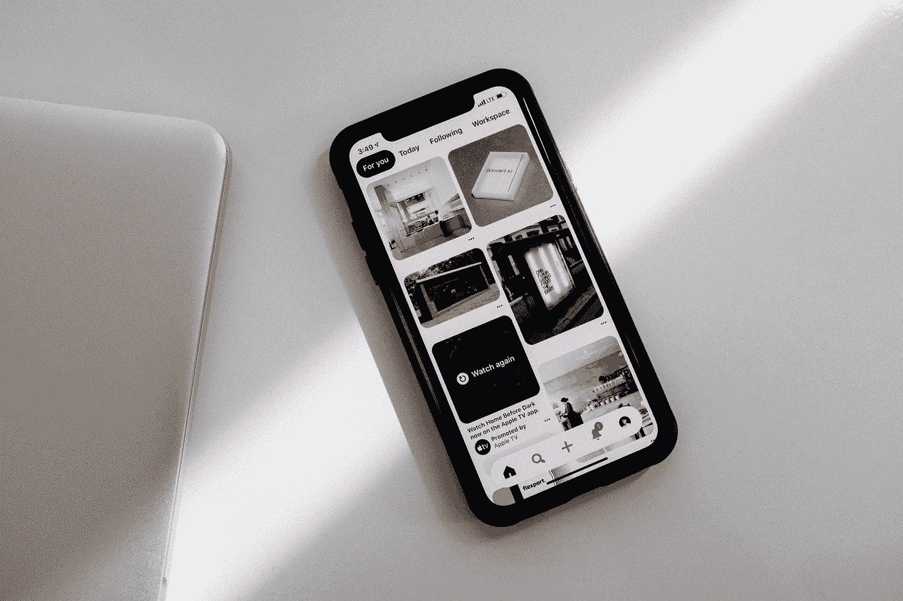

# iOS 提示:用户界面的简单布局

> 原文：<https://levelup.gitconnected.com/tip-for-ios-layout-of-ui-92d017173beb>

> 我的一篇文章受到了很多读者的喜爱，我想它可能会对你有所帮助:
> 
> [***十二招使迅捷少码***](https://medium.com/@zhuyp/12-tips-to-make-swift-more-concise-4f4ed63f3063)

查尔斯·德鲁维奥在 [Unsplash](https://unsplash.com?utm_source=medium&utm_medium=referral) 上拍摄的照片

UI 布局是一个高频的工作，如果找到最合适的方法，可以减少很多工作量。iOS 提供了几种布局方法:

1.当使用框架进行布局时，需要计算位置信息，并且需要配置不同尺寸的屏幕

2.使用 xib/storyboard 进行布局时，复杂视图布局不够灵活，多层视图后续维护困难；

3.使用 iOS 提供的 NSLayoutConstraint，所以代码量越来越复杂

基于以上情况，iOS 提供了 NSLayoutAnchor API，以较少的代码使用 AutoLayout 功能。(NSLayoutAnchor 继承自 NSLayoutConstraint)

例如，如果您需要将视图放在屏幕的底部，同时希望避开安全区域，您可以:

你不需要关心安全区的高度。

NSLayoutAnchor 的简单用法:

从上面可以看出，这是 NSLayoutAnchor 的一个简单应用。值得一提的是，动画的执行可以简单地使用 UIView.animate 进行。

NSLayoutAnchor 已经很有用了，你还在用第三方库吗？

希望这篇文章能帮到你。另外，你还有什么问题吗？欢迎给我留言。

# 请跟我来。让我们在接下来的帖子中见面。

以前的故事:

1.  [**Swift 提示:功能**](https://medium.com/@zhuyp/tip-for-swift-from-async-to-sync-in-function-1-c1337f0d60b3) 中从异步到同步
2.  [**UICollectionView:经常出现的错误**](https://medium.com/@zhuyp/uicollectionview-an-error-that-often-occurs-a494ca70fc4b)
3.  [**12 招使迅捷少码**](https://medium.com/@zhuyp/12-tips-to-make-swift-more-concise-4f4ed63f3063)
4.  [**IOS 还是 IOS？**](https://medium.com/@zhuyp/ios-or-ios-7c7d23905c35)
5.  [**App 中的简单错误系统**](https://medium.com/@zhuyp/simple-error-system-in-app-f72278168634)

> ***关于我:*** *我是 iOS 的开发者，曾经在 XAG 工作。现在我想在 medium 上分享故事，总结自己的经验来帮助别人。如果你有任何问题，请给我反馈，我会积极给你我的答复。目前，我的期望是获得 100 名追随者。需要你的善意支持，谢谢。*