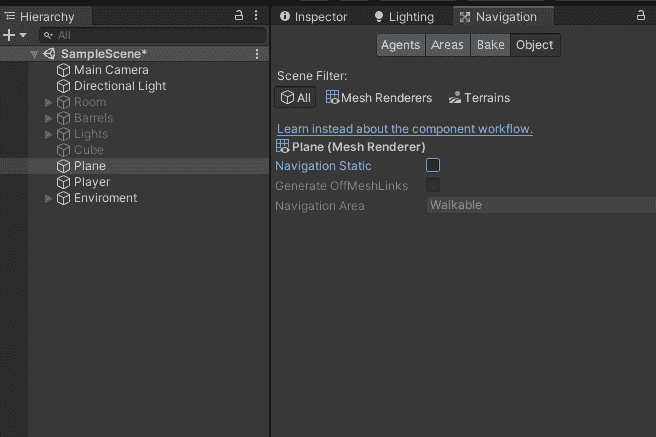
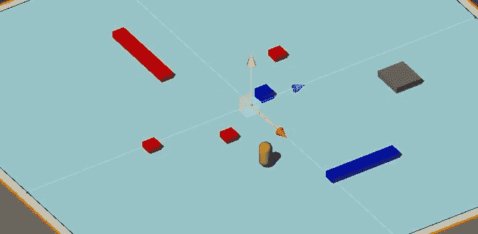
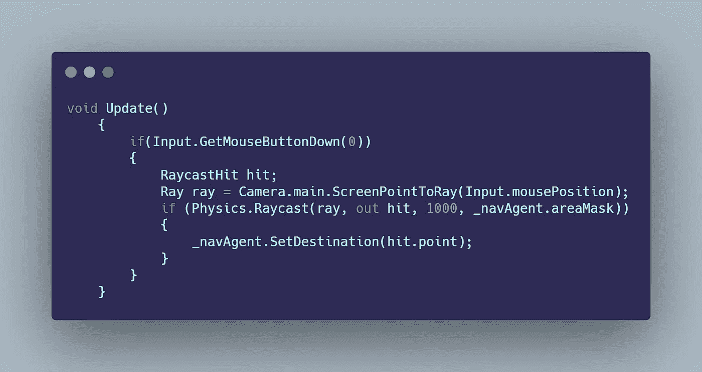

# 日积月累:在 Unity 3D 中创建一个点并单击系统

> 原文：<https://levelup.gitconnected.com/tip-of-the-day-create-a-point-click-system-in-unity-3d-8de30efee5e2>

在许多游戏类型中，如策略游戏或动作游戏，如暗黑破坏神或亡命之徒，使用等轴透视依赖于点击系统来移动玩家。

## 通过几个简单的步骤创建一个点击系统

首先，为了创建这个系统，你需要理解这个导航系统依赖于一个叫做 Navmesh 的网格。基本上，Navmesh 允许玩家或 AI 智能地在场景中导航。所以角色会自动计算到达目的地所需的路径。

设置好你的场景后，打开**窗口> AI >导航**。在导航窗口中，打开*对象标签*，然后在你的层级中选择你的角色将要移动的平面或地形。确保选择*导航静态*，然后打开*烘焙标签*烘焙网格。



您的场景现在应该有一个蓝色高亮显示，显示您的角色可以使用 Navmesh 移动到哪里。为了更精确，选择场景中不会移动且角色不能去的障碍物/对象，使它们成为静态，然后再次烘焙网格。

## 播放器设置

A.在你的玩家游戏对象上，添加一个*导航网格代理组件*。
B .创建一个 C#脚本，添加到播放器中。

C.在脚本中获取您的 NavMeshAgent(您应该使用 **UnityEngine。AI** 命名空间)

```
NavMeshAgent _navAgent;
_navAgent = GetComponent<NavMeshAgent>();
```

//为了实现这一点，我们需要知道鼠标在屏幕上点击的位置，并返回将用于字符目的地的坐标。为此，我们需要使用光线投射。

D.在 Update()中，检查鼠标点击，并声明两个变量，一个用于*射线投射*，另一个用于*射线*。

```
if(Input.GetMouseButtonDown(0))
        {
            RaycastHit hit;
            Ray ray =            Camera.main.ScreenPointToRay(Input.mousePosition);
        }
```

E.现在我们需要使用*物理检查射线是否真的击中了可行走区域网格上的碰撞器。光线投射*法。

```
if (Physics.Raycast(ray, out hit, 1000, _navAgent.areaMask))
            {
                _navAgent.SetDestination(hit.point);
            }
//out hit returns the info of the collision of the ray
//_navAgent.areMask represents the layermask that are walkable
```

最终的导航代码应该是这样的:



如果你愿意，这可以扩展到实例化一个鼠标点击光标直接在目的地，以显示玩家他要去的地方，例如。并且这种方法也可以用于 AI 角色在没有任何输入的情况下导航 NavMesh。

现在，角色应该能够计算出到达目的地的最快路径。

