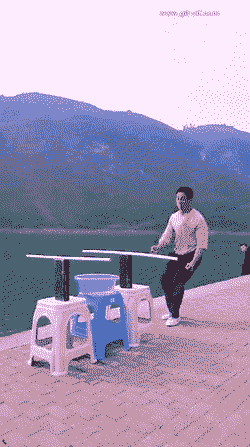
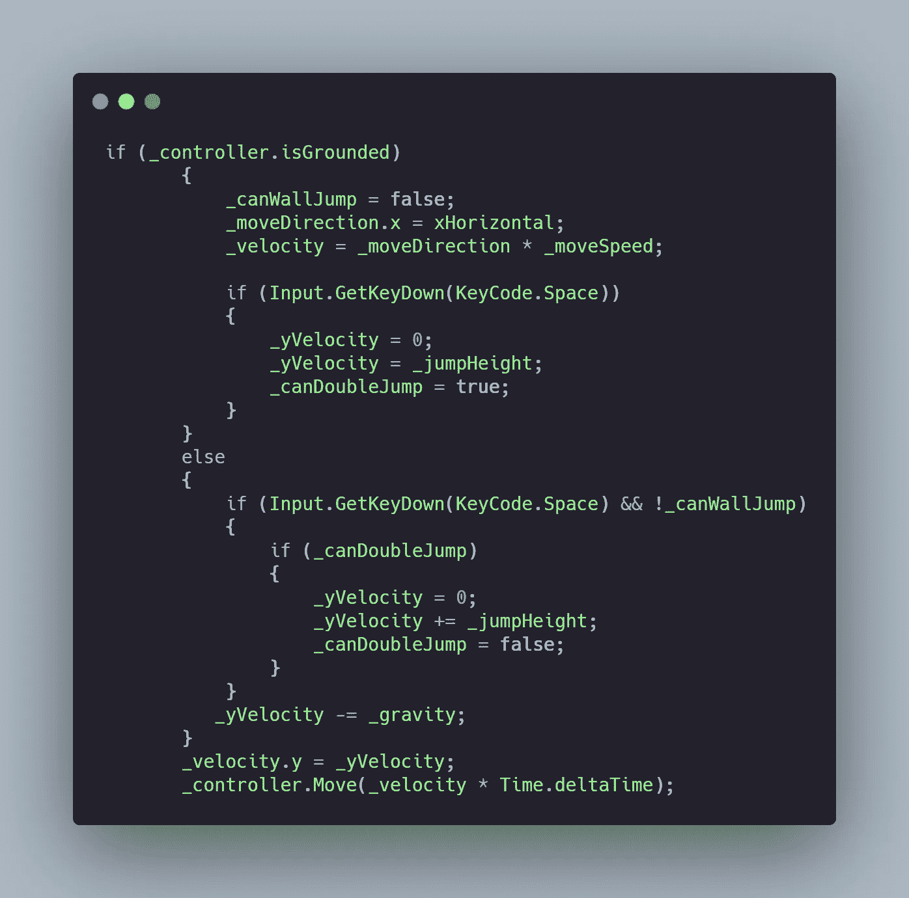
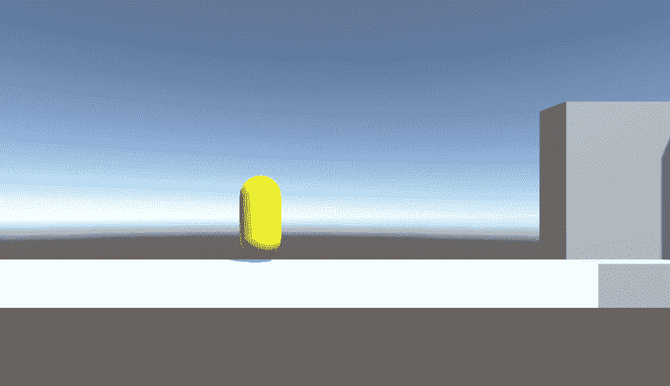

# 日积月累:团结双跳

> 原文：<https://levelup.gitconnected.com/tip-of-the-day-double-jumping-in-unity-2326a7e474a6>

作为关于使用[角色控制器组件](https://novusxdev.medium.com/tip-of-the-day-character-controller-in-unity-4516644f695)创建玩家动作的文章的后续，今天我们将扩展角色控制器并给玩家双跳的能力。



## 怎么双跳？

F 首先，让我们创建一个私有的 bool _canDoubleJump 来控制我们什么时候可以加倍，以及你想给你的玩家多少次“双击”。

```
private bool _canDoubleJump;
```

使用控制器，我们已经检查了玩家是否接触到地面，只有这样他才能跳起来。所以现在我们可以允许玩家双跳。在空中，如果玩家再次跳跃，那么我们在 y 轴上增加玩家的速度，然后阻止他再次双跳。



我们还将 _yVelocity 重置为 0，使其跳跃更加一致。

这是它的样子:

