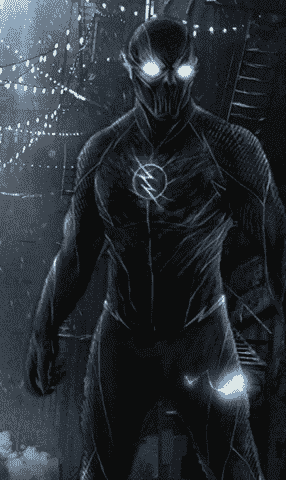
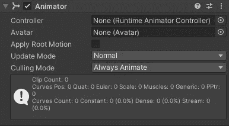
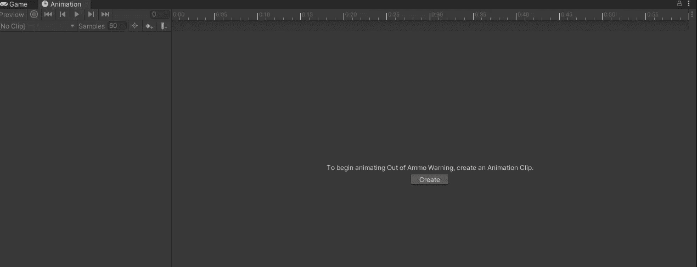
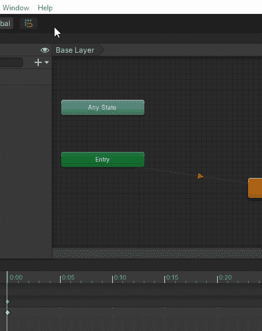
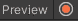
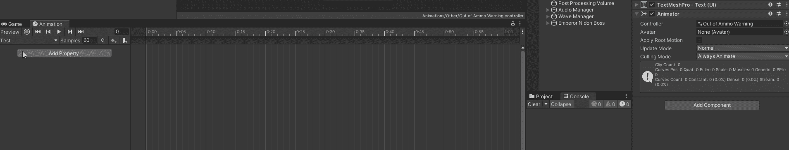
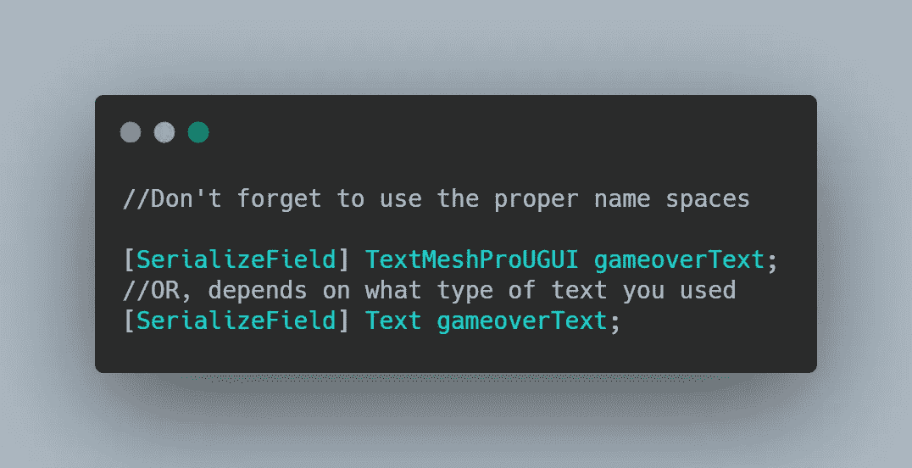
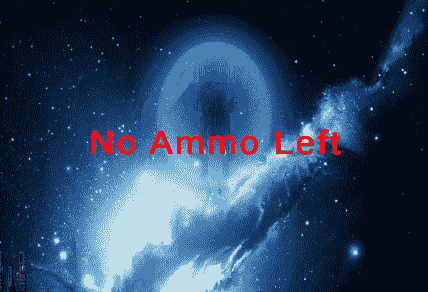

# 日积月累:在 Unity 中回归文本

> 原文：<https://levelup.gitconnected.com/tip-of-the-day-going-retro-with-texts-in-unity-821d8a82c6a>



如果你曾在 80 年代、90 年代甚至现在玩过街机，你肯定见过那些闪烁不定的标题或文字。

> O 目的
> 用两种方法创建统一的闪烁文本

## 方式一:动画师

最简单和最容易的方法是动画文本。

1.  创建你的文本用户界面并附加一个动画组件



2.选择你想要制作动画的文本，在动画标签中(当对象被选中时)点击“创建”，这将允许你创建一个新的动画，保存它。



如果您没有看到动画标签，您需要打开它



红圈是记录

3.按下动画中的录制按钮，停用文本 UI 对象中的文本组件，选择一个间隔(比如 0.25 秒)，激活它，并在 0.5 秒后停用它。动画将循环闪烁您的文本。



## 方式二:编码者

这个方法允许你通过代码实现闪烁效果，下面是如何通过几个简单的步骤来实现

1.  在脚本中，为文本 UI 对象创建一个引用，并将其序列化，以便在检查器中看到它



2.创建一个 IEnumerator 例程，这里我们可以用两种不同的方式来完成。

a)将文本组件设置为您想要的任何字符串，延迟一段时间，然后再次将文本设置为 nothing " "并再次让步。这个方法稍微高效一点。

```
IEnumerator GameOverFlickerRoutine()
    {
        while(true)
        {
            gameoverText.text = "GAME OVER";
            yield return new WaitForSeconds(0.35f);
            gameoverText.text = "";
            yield return new WaitForSeconds(0.35f);
        }
    }
```

b)在检查器中设置文本，在 IEnumerator 中停用文本组件，等待一会儿，激活文本组件，然后再次等待一会儿。

```
IEnumerator GameOverFlickerRoutine()
    {
        while (true)
        {
            gameoverText.GetComponent<TextMeshProUGUI>().enabled = true;
            yield return new WaitForSeconds(0.35f);
            gameoverText.GetComponent<TextMeshProUGUI>().enabled = false;
            yield return new WaitForSeconds(0.35f);
        }
    }
```

请记住，在这两种情况下，您都是在 while(true)循环中完成的，这将允许动画持续运行，只要文本 UI 游戏对象处于活动状态

这是两种情况下的样子



Arcadie 闪烁效果