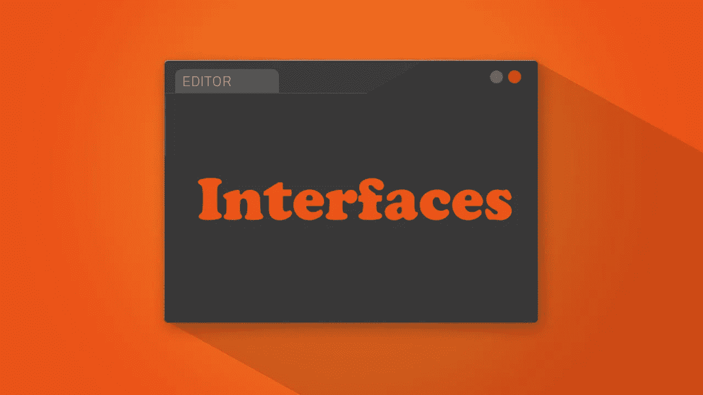
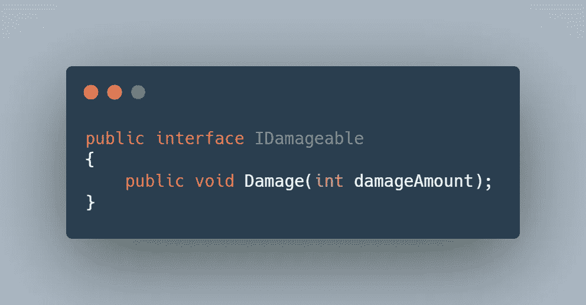
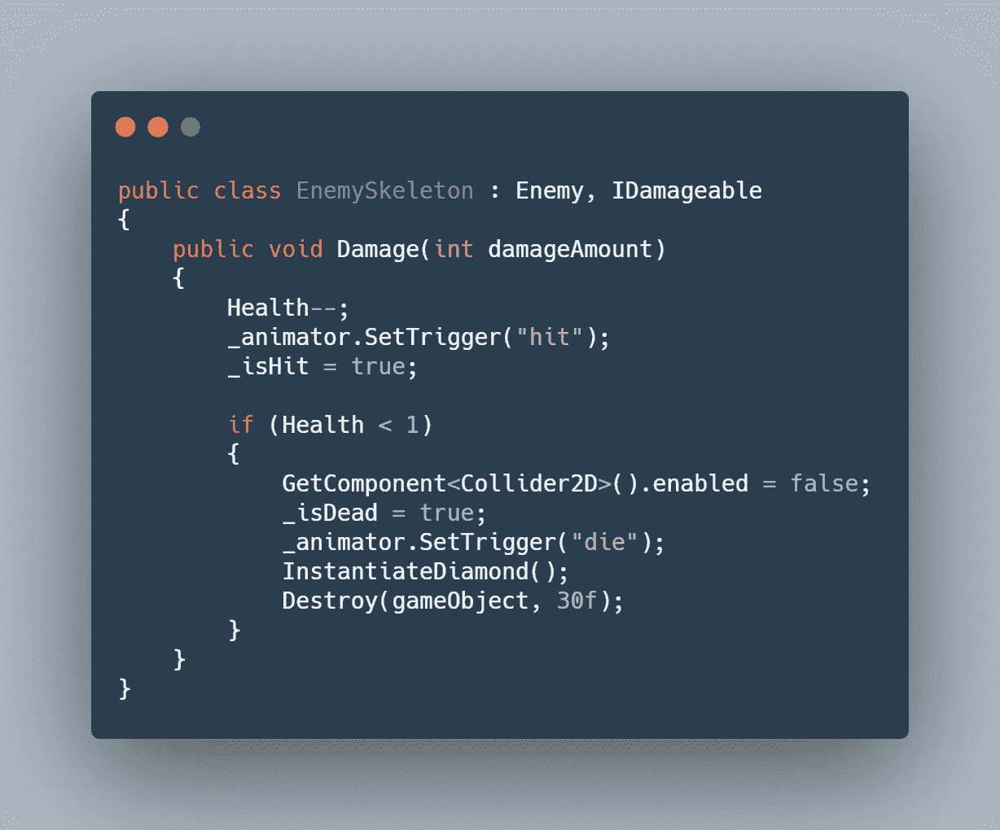
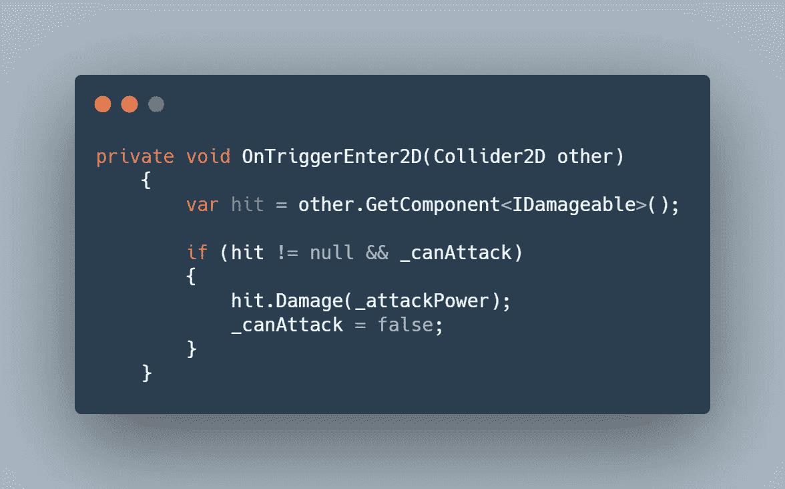
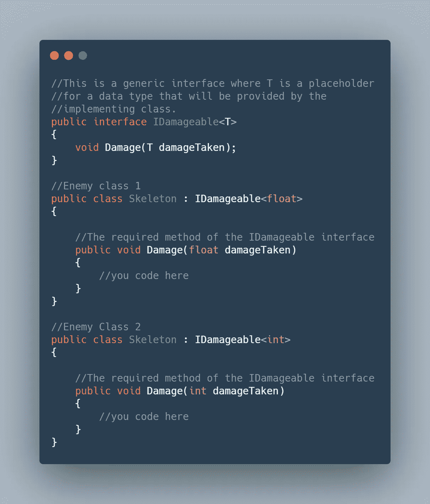

# Unity 接口 101

> 原文：<https://levelup.gitconnected.com/tip-of-the-day-interfaces-101-in-unity-bc0fd1961cf>

当你为你的 Unity 项目写代码时，你很容易把事情复杂化。你开始到处引用脚本，并创建一些非常不必要的依赖关系，如果一个脚本丢失，整个依赖关系链也会随之崩溃。

减少依赖性的一个非常有效的解决方案是使用一种新的脚本类型，称为“ **Interfaces** ”。

> 什么是接口？你如何使用它们？

## 定义

接口是一个类类型，一个保存变量和方法定义的容器，其中方法可以保存参数并且必须是空的。

*接口*不能作为游戏对象的实例添加到场景中，也不能在脚本中引用，只能由脚本继承。

换句话说，接口是一个契约，它包含了可以被任何脚本调用的某些方法。假设你有一个界面 I 和 5 个脚本。脚本 B、C、D 和 E 继承接口 I，而脚本 A 想要联系其他脚本。通常你会为 A 中的每个脚本分配一个变量，并找到保存脚本的游戏对象，B C D & E。但是因为它们继承自 I，所以脚本 A 可以简单地调用接口 I 中的方法，并在这个方法上执行操作，而不知道哪个游戏对象保存脚本 B C D E。

## 现实生活中的例子

在我们的 GameDevHQ 移动项目中([移动项目进展报告:敌人设置统一](https://medium.com/nerd-for-tech/mobile-project-progression-report-enemy-setup-unity-145bbe43f0bc))，我想要一个模块化的攻击系统。我没有引用每一种敌人类型或者场景中任何可以破坏的物体，而是创建了一个包含“*伤害*方法的接口。

创建一个脚本，使其成为一个接口，并创建一个需要 int 的公共方法

在敌方脚本中，我继承了接口并添加了 Damage()方法，并在其中添加了代码。

所以现在，如果我想击中一个敌人或任何易碎的物体，我会简单地得到接口，而不是引用敌人的脚本。

**快速提示**

当你有了场景，你可以在接口中给方法添加参数。但是如果你有 3 个不同的脚本，每个脚本都想为一个方法调用不同的参数类型，那该怎么办呢？例如，一个敌人有一个浮动生命值，另一个有一个 int 生命值。

在这种情况下，我们可以使用一个通用接口，该接口将使用一个通用占位符，并且该占位符可以根据脚本的不同而变化。

# 分级编码

感谢您成为我们社区的一员！[订阅我们的 YouTube 频道](https://www.youtube.com/channel/UC3v9kBR_ab4UHXXdknz8Fbg?sub_confirmation=1)或者加入 [**Skilled.dev 编码面试课程**](https://skilled.dev/) 。

 [## 编写面试问题+获得开发工作

### 掌握编码面试的过程

技术开发](https://skilled.dev)