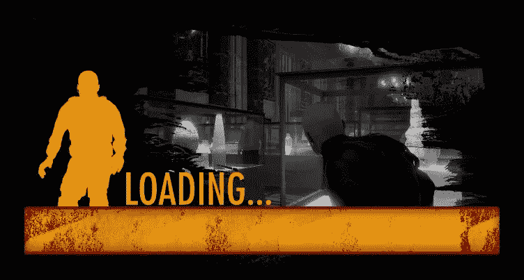
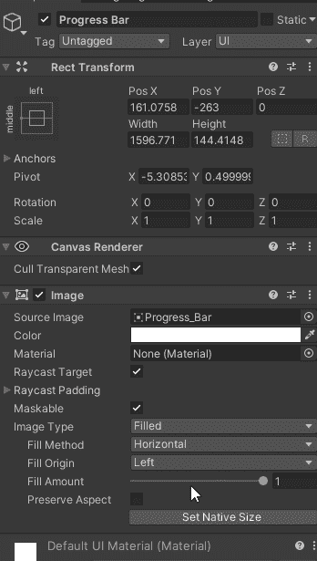
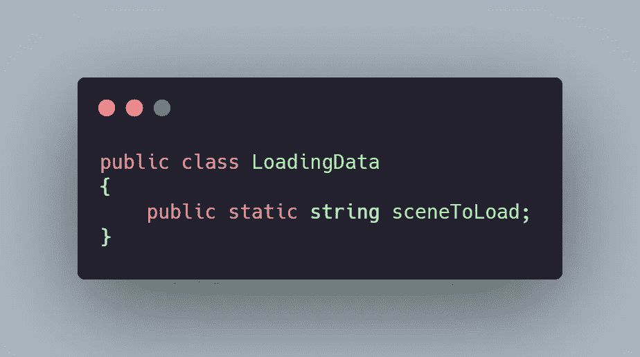
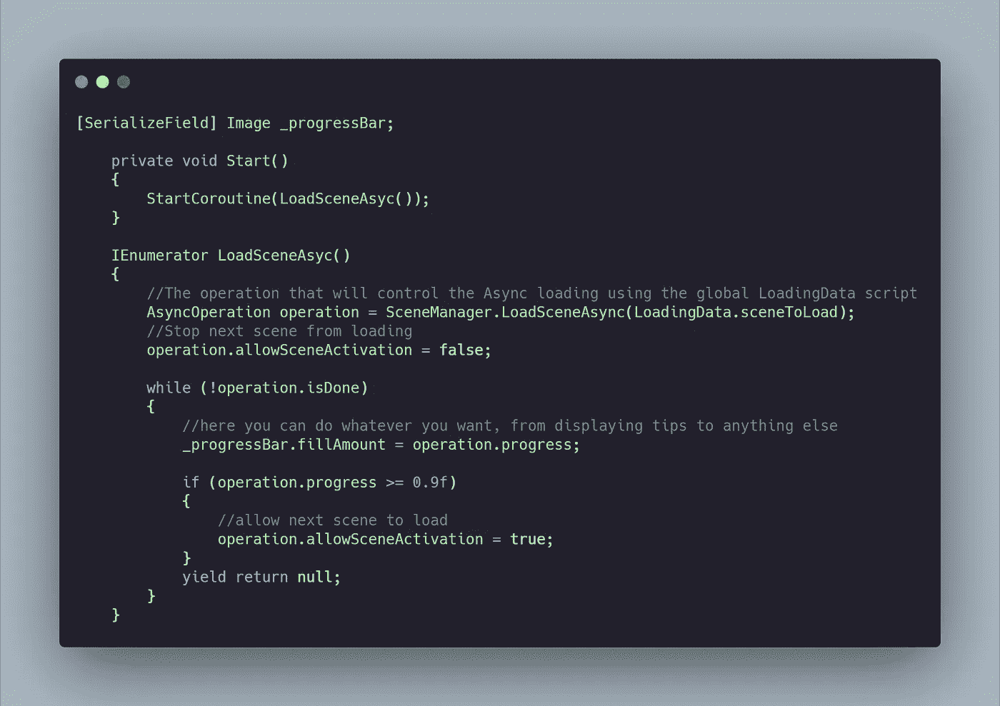
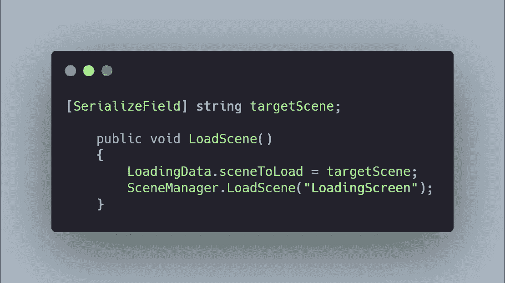

# 日积月累:在 Unity 中加载屏幕

> 原文：<https://levelup.gitconnected.com/tip-of-the-day-loading-screen-in-unity-d25d474e064f>

加载屏幕是任何视频游戏的一个重要部分，它们帮助玩家在下一关加载前呼吸，并允许游戏加载下一关所有必要的资源。

有很多方法可以做到这一点，今天我们将探索创建一个单独的场景专门用于加载场景/屏幕。这样，在装载过程中你将有更多的控制。例如，您可以添加动画、提示等等。

> L 加载屏幕场景

所以创建一个新的场景，“加载场景”，然后创建你的加载 UI。添加要在此场景中加载的任何元素或资源。

这是一个示例场景。

和大多数加载场景一样，我们添加了一个进度条，它会告诉我们加载进度有多远。我们通过创建一个图像，改变图像类型为“*填充*”，填充方法为水平，这样我们可以控制填充量。

*到目前为止还不错，容易吧？不完全是。*

**A .我们将如何控制装载系统？**

首先，为了使这一切成为可能，我们需要使用一个异步操作。这个操作就像一个简单的 SceneManager。但是将允许场景在实际加载下一个场景之前加载资源。

B.现在的主要问题是我们如何告诉加载场景加载哪个场景？

我们需要一个方法，允许在两个不同的场景之间传递变量，这就是为什么我们将使用一个服装静态类，它有一个提议:告诉加载场景接下来加载哪个场景。

> 下面是如何做到这一点:

A.创建一个 C#脚本，并使其成为自定义类(删除 Monobeahaviour，启动并更新)。这将保存一个全局静态字符串，它将告诉下一个场景加载。

C.最后，在您的级别中，创建一个 C#脚本，该脚本将作为加载“加载场景”的触发器，在该脚本中，您将有一个要加载的下一级别的公共字符串，并将其分配给我们在自定义 LoadingData 脚本中创建的全局字符串。

那么，所有这些方法将如何组合在一起呢？

从主菜单或任何级别，使用 LoadingSceneTrigger 脚本快速加载加载屏幕场景，并分配全局字符串 sceneToLoad，以便在加载屏幕场景中使用。这里，场景将自动启动异步操作来加载下一个。'

这种方法将允许您使用一个装载场景，并从长远来看节省您的时间。

这就是你要的，一个简单高效的模块化装载系统。