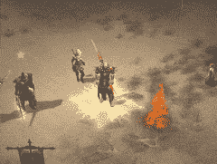
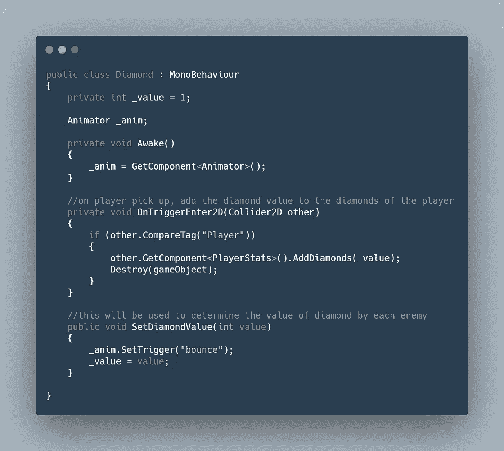
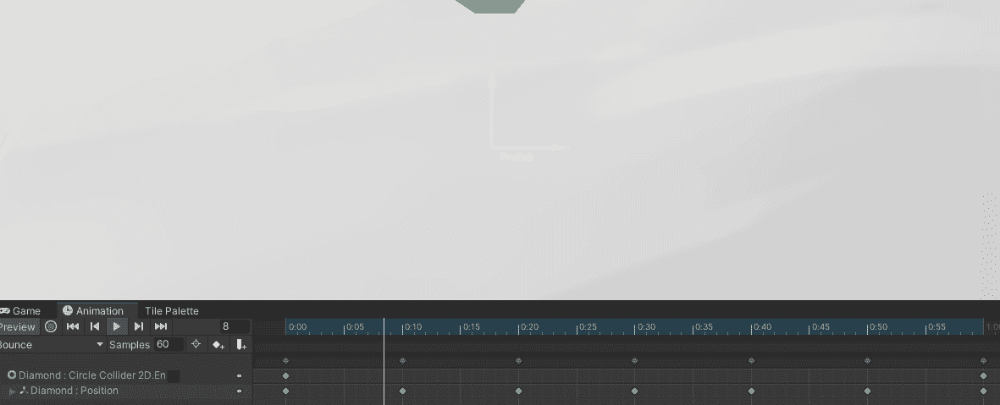
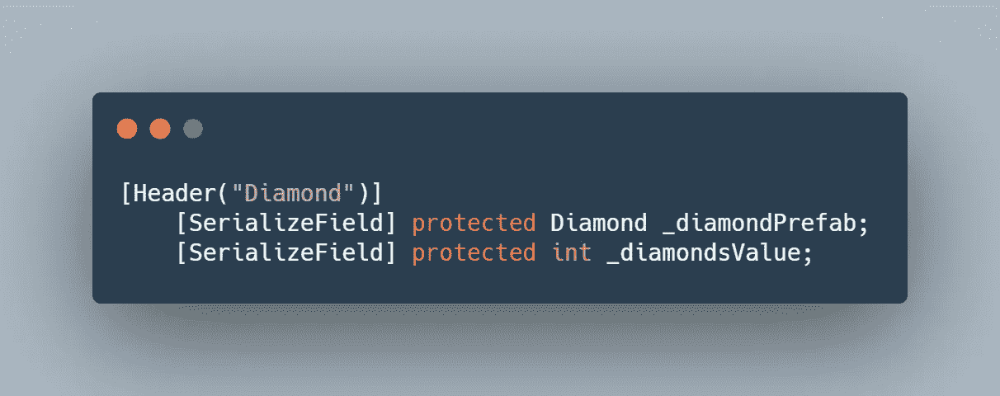
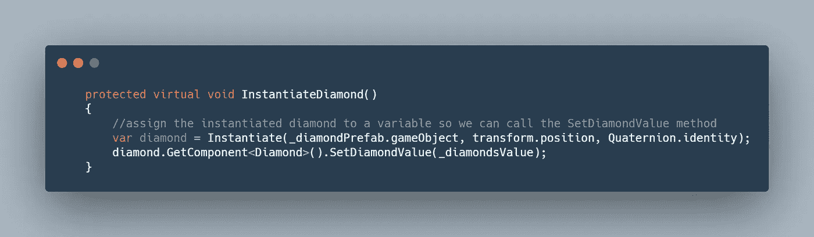
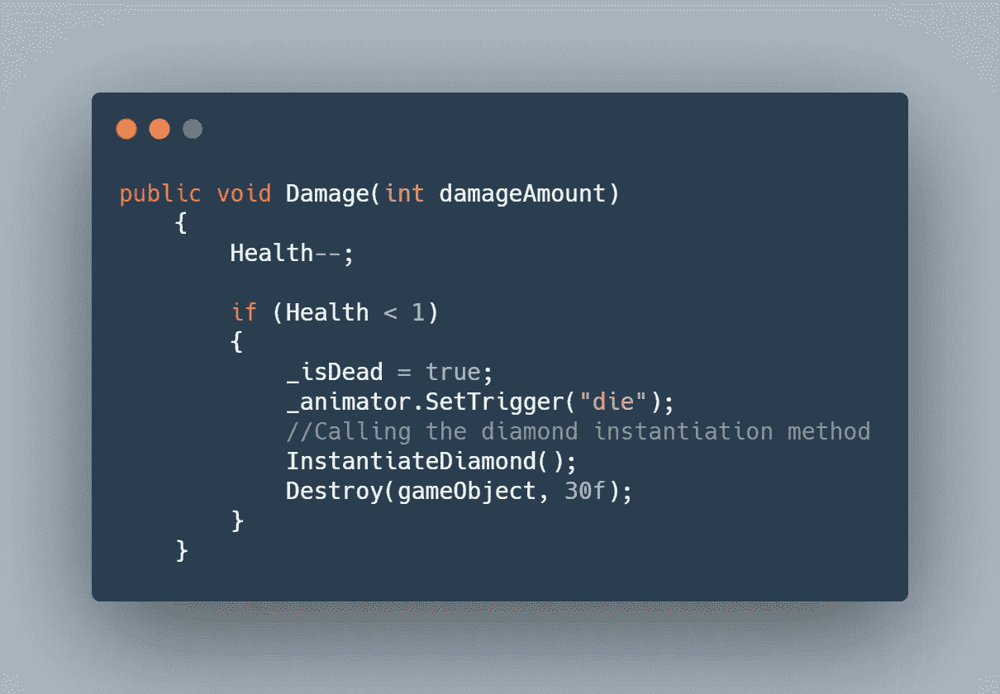
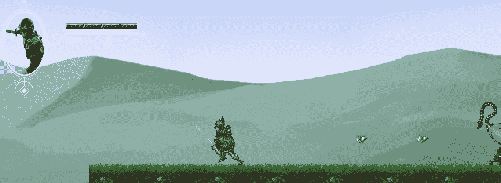

# 日积月累:在 Unity 中洗劫系统 101

> 原文：<https://levelup.gitconnected.com/tip-of-the-day-loot-system-101-in-unity-d5bce6a6291f>

掠夺是当今大多数游戏的核心。从抢劫武器到健康包，甚至抢劫硬币或任何游戏币。

在这篇文章中，我想阐明这个系统，开始了解这个系统的基础。让我们深入一个实际的例子。

> 掠夺系统 101

在我们的移动项目中(点击此处了解进展[移动项目进展报告](https://medium.com/nerd-for-tech/mobile-project-progression-report-new-playable-character-unity-253b21efbf))，货币将是钻石。
在我们的战利品系统中，钻石会散落在世界各地，但我们也希望它们从敌人身上掉落，每个敌人会给我们不同的 ***钻石*** 。所以一个敌人可以给一个 ***钻石*** 数值为 1，另一个数值为 3。

## A.打造钻石

钻石将会有一个触发碰撞器和一个运动学刚体来允许玩家捡起它，我们将会给它添加一个“钻石”脚本。

上述脚本中一个非常重要的方法是 SetDiamondValue(int value)方法。我们将从敌方脚本中调用此方法来确定掉落钻石的价值。

至于触发式动画“反弹”，这会让钻石在被敌人掉落时反弹，但最重要的是，在反弹的持续时间内，碰撞器已经被禁用。这很有用，这样玩家就不会在杀死敌人的第一秒就收集钻石。现在玩家知道有一个钻石要捡。

如你所见，碰撞器在动画播放期间被禁用。

最后，不要忘记预制钻石。

## B.敌方脚本

在敌方剧本中，我们想知道三件事。

1.  每个敌人和钻石预置的钻石价值
2.  将用于实例化菱形的方法
3.  什么时候会调用上面的方法

***钻石值:*** 简单我们将创建一个变量，我们可以在检查器中设置，这样每个敌人将有不同的钻石值。此外，我们将创建一个变量来保存钻石预置。

***钻石实例化方法:*** 该方法将负责实例化钻石预置，然后从钻石脚本中调用 SetDiamondValue 方法。

***何时实例化:*** 所以当敌人死亡的那一刻，我们会调用 InstantiateDiamond 方法。

现在，每个死去的敌人都会掉落一颗有特定价值的钻石。这种方法可以应用到物品上，例如当你打碎一个物品时，你会掉落一颗钻石。

这就是它的作用

这只是一个掠夺系统的皮毛。从这里你可以将钻石换成武器或不同稀有和价值的物品。我们可能会在下一篇文章中讨论这个问题。