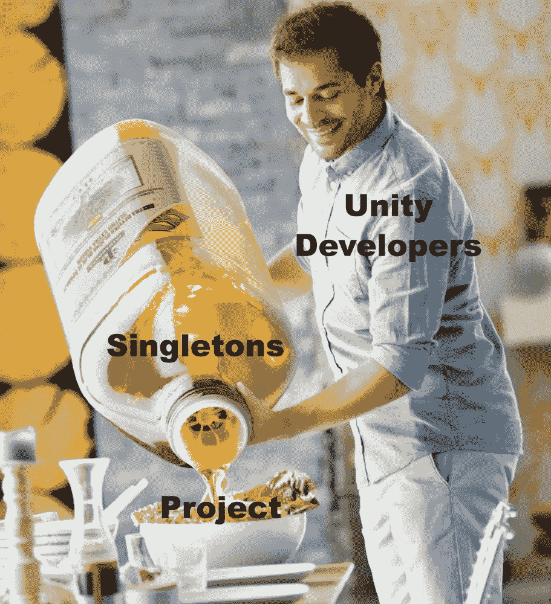

# 日积月累:Unity 中的管理类和单例模式

> 原文：<https://levelup.gitconnected.com/tip-of-the-day-manager-classes-singleton-pattern-in-unity-1bf3aafe9430>

在创建项目时，您会遇到这样的情况:您想要管理不同的玩家状态，控制游戏的音频，或者，例如，控制加载场景或控制 UI。

这些情况中的每一种(以及更多)都可以放在一个单独的管理器类中。比如:GameManager、UIManager、AudioManager 等。


通常这些管理器类在你的游戏中是持久的，它们会想要与游戏中的不同脚本进行通信。你可以让 gameObject 实例在你想使用它们的每个脚本中保存这些管理器，但是这样你会陷入太多的依赖，你的代码可能会容易出错。

为了实现这一点，我们可以使用单例模式。这使得其他类可以很容易地访问 Manager 类，并且它们可以很容易地获得全局变量和方法。



> 单一模式

在 manager 类中，首先创建一个 manager 的私有静态实例，并为该实例创建一个公共 getter。使它成为静态的将会被其他脚本访问。最后，在 Awake 方法中，将私有实例设置为这个 manager 类。


现在，为了从其他脚本访问这个 manager 类，只需调用 public 实例。

```
GameManager.Instance.(your public variable or public method);
```

但是必须为每一个模式输入这个单例可能会很乏味，那么我们如何简化它呢？

我们可以创建一个单独的脚本来保存单例代码，然后管理器类可以继承这个单例类。因此，创建一个 C#单例脚本。


继承时将使用“T”组件来检查脚本组件。

现在，当创建管理器类时，只需继承单例脚本，就一切就绪了，您的管理器类现在是单例的了

```
public class GameManager : Singleton<GameManager>
{
   void Start()
    {
    }
   void Update()
    {
    }
}
```