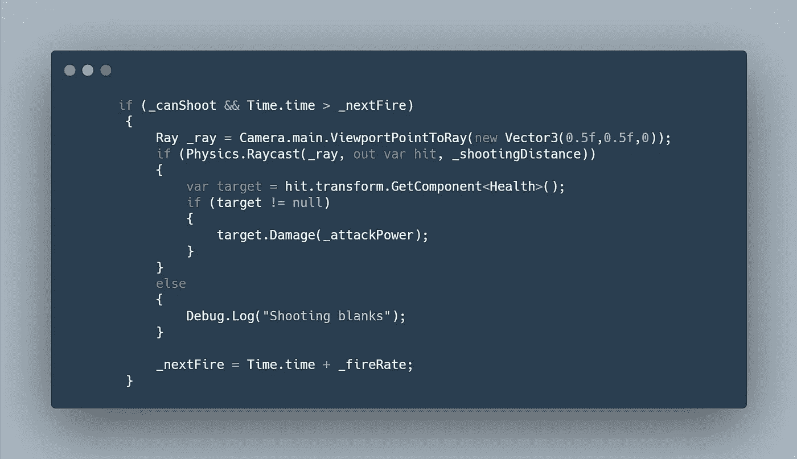
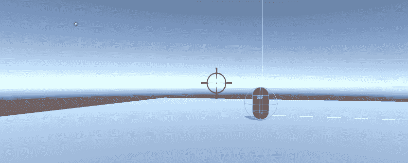

# 日积月累:Unity 中的光线投射

> 原文：<https://levelup.gitconnected.com/tip-of-the-day-ray-casting-in-unity-abcdc8700366>

如果你看过我之前的进度文章([僵尸进度报告:玩家移动&射击 Unity 3D](https://medium.com/geekculture/zombie-progression-report-player-movement-shooting-unity-3d-3e4f2925a4a2) )，那么你就会知道我们为了射击而应用了光线投射。

在本文中，我将更深入地解释这是如何实现的，以及这对 Ray Cast 意味着什么。


> 定义

光线投射是 Unity 物理系统的一部分，它是一种允许你从某个最大距离**长度**的**原点**向某个**方向**发射**光线**(像激光一样)的方法。射线和它碰撞的其他物体之间的确切接触点返回一个**击中信息**，这是非常有用的。

光线投射的默认语法是:

```
**Raycast**([Vector3](https://docs.unity3d.com/ScriptReference/Vector3.html) **origin**, [Vector3](https://docs.unity3d.com/ScriptReference/Vector3.html) **direction**, float **maxDistance** = Mathf.Infinity, int **layerMask** = DefaultRaycastLayers);
```

LayerMask 是可选的，它允许你过滤光线可以碰撞的对象。

> 实际例子

在我们的僵尸射手项目中(本文顶部的链接),我们希望允许玩家射击武器。我们决定使用光线投射，以便从相机的中心(枪十字线)拍摄。

1.  使用新的输入系统，当玩家点击鼠标左键时，我们改变一个布尔值“_canShoot”。
2.  定义一条来自相机中心的光线。Unity 有一个非常方便的方法，叫做“ViewportPointToRay(new vector 3(x，y，z)”，它返回从相机的视口拍摄的光线。视口坐标是标准化的，并且相对于相机。相机左下方是(0，0)；右上方是(1，1)。所以中心是 x=0.5f，y = 0.5f。
3.  利用物理学。Raycast 来检测我们上面拍摄的光线的命中信息。如果射线击中了目标，那么我们会调用目标的伤害方法对他们造成伤害。
4.  用冷却系统封装所有这些。



用光线投射拍摄

这是它在游戏中带血的样子。



用光线投射拍摄

如果你想知道我是如何在射线和敌人之间的撞击点添加血液飞溅的，请在评论中告诉我。