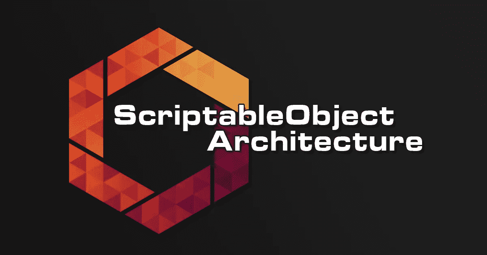
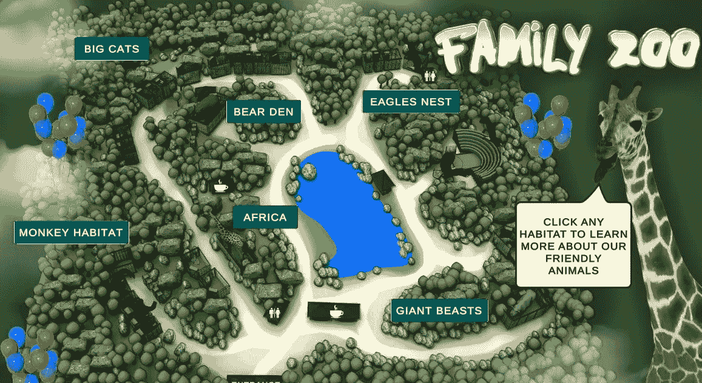
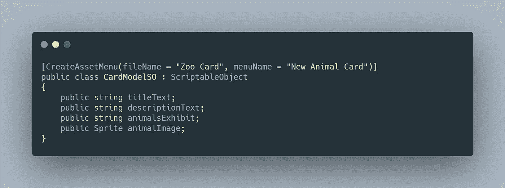
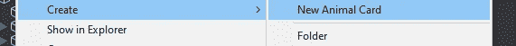
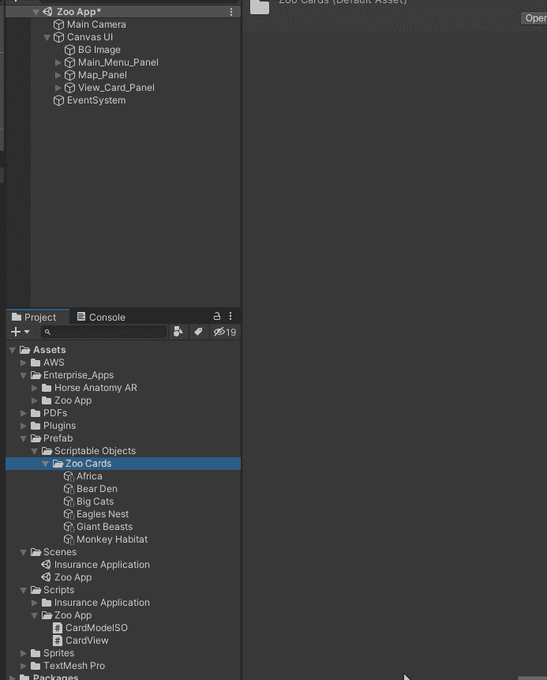
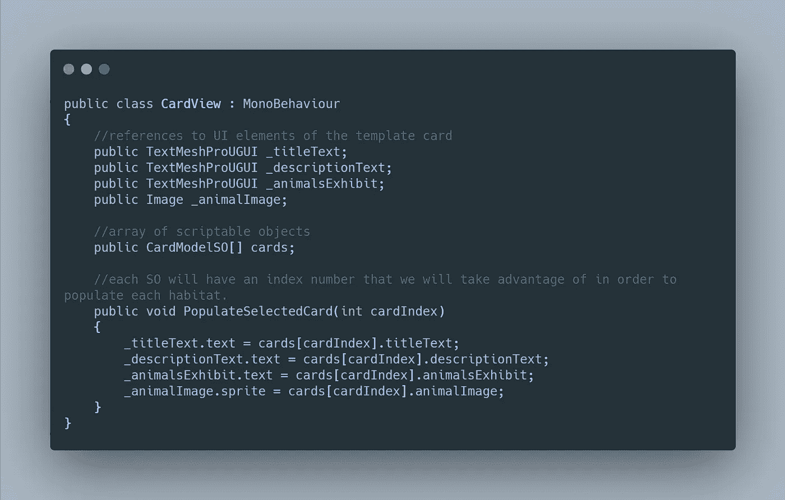
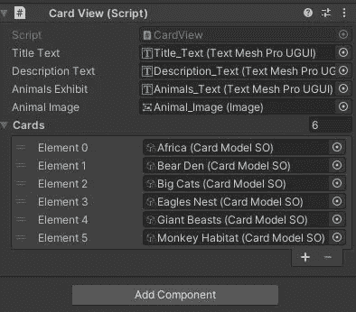
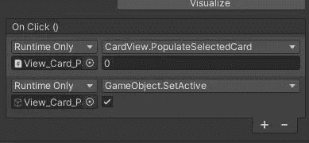
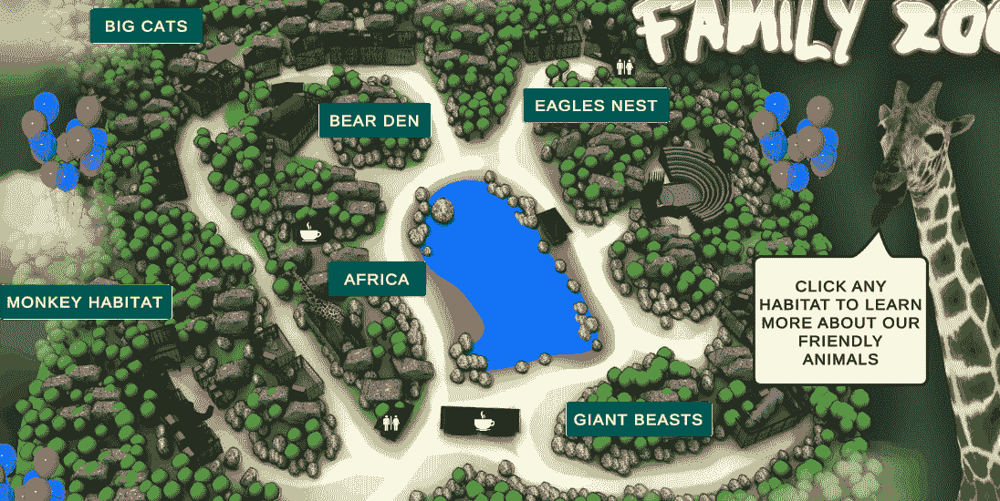

# 日积月累:Unity 中的可脚本化对象 101

> 原文：<https://levelup.gitconnected.com/tip-of-the-day-scriptable-objects-101-in-unity-a1730c911b4d>

在游戏开发过程中，总有一天你会需要在同一个游戏对象数据中添加大量不同的数据。例如，假设您正在制作一个纸牌游戏，您想要使用相同的纸牌模板创建 30 张不同的纸牌。一遍又一遍地同时制作 30 张不同的卡片会让人精疲力尽。空闲的方法是创建一个卡模板和一个数据容器模板。这就是 ***可脚本化对象*** 发挥作用的地方。

[团结论坛](https://forum.unity.com/threads/released-scriptableobject-architecture.591403/)

> 什么是可脚本化对象

可脚本化对象基本上是一个数据容器，可以保存大量数据，独立于类实例。这意味着，现在你可以通过使用可脚本化的对象来节省空间和内存，而不是必须复制和存储许多占用大量空间和使用更多内存的预置实例。

> 如何使用它们

让我们以下面的例子，你需要建立一个移动动物园应用程序与互动地图，每当你点击一个栖息地，你想显示不同的动物卡。

交互式地图

动物卡片

那么现在，如果你有 10 个甚至 50 个栖息地，每个都需要自己的动物卡，那该怎么办呢？你可以制作 50 张不同的动物卡片，并预先制作好它们，存放在你的场景中，但是这样会占用更多的空间和内存。

我认为我们应该使用可脚本化的对象。首先让我们创建一个 C#脚本，名为“CardModelSO”。

1.  将脚本的继承从 MonoBehaviour 更改为 ScriptableObject。
2.  添加您希望存储在 SO 中的变量
3.  使用类上面的属性“CreateAssetMenu”。这将允许我们在编辑器中快速创建不同的可脚本化的对象。

可编写脚本的对象脚本

现在，您可以在编辑器中创建可脚本化的对象。根据需要创建任意数量的对象，并将数据添加到每个可编写脚本的对象中。

我们为销售订单创建的菜单名称

在下面的 GIF 中，您将看到创建一个销售订单并在其中填入您的数据是多么容易。

创建 SO

我们为卡片本身创建了一个单独的 C#脚本，它将受益于我们创建的 so，这样，每次我们单击一个栖息地，它将根据我们的 SO 填充不同的数据。

模板视图卡片脚本

现在，我们将把模板卡的每个 UI 元素分配给这个脚本，并将我们创建的 So 添加到数组中。数组的每个元素都有自己的索引，我们将使用它来让 UI 按钮知道使用哪个。

查看卡片

在交互式地图按钮上，我们将添加两个 On Click()事件，一个事件将打开卡片，另一个事件将调用 PopulateSelectedCard 方法并指定和索引它，以便它知道要打开哪个 so。

点击事件时

这是它在游戏过程中的样子，正如你在下面看到的，它反应超级快，有助于提高游戏性能。每点击一次按钮，卡片就会被新数据填充。

