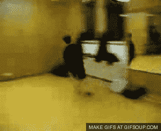
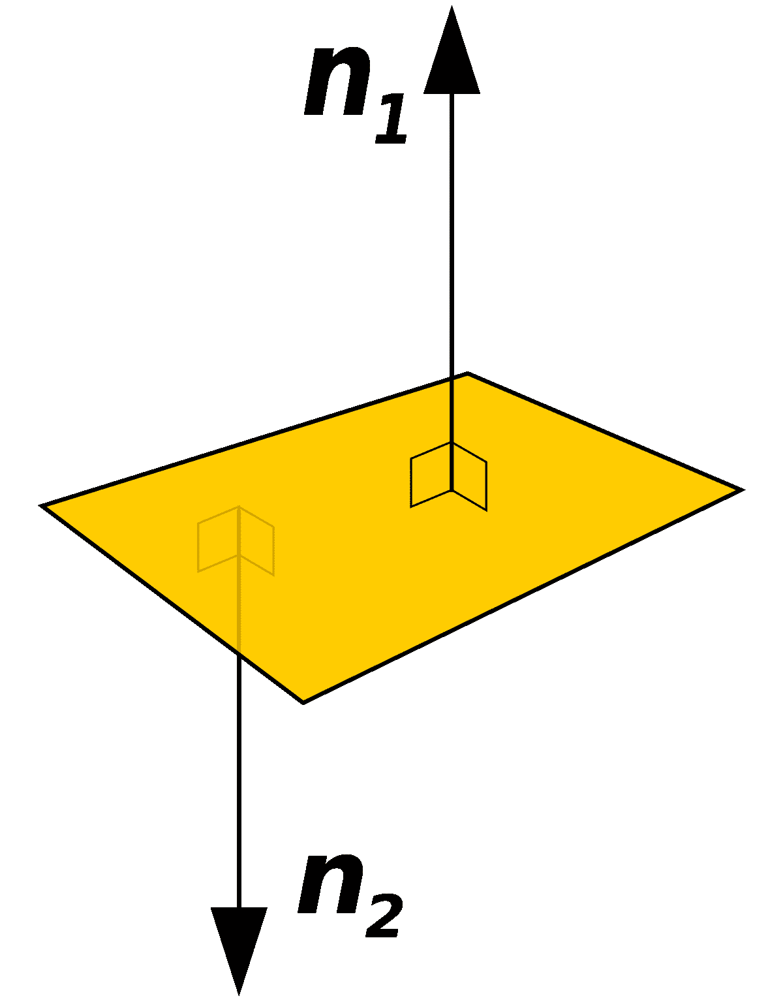
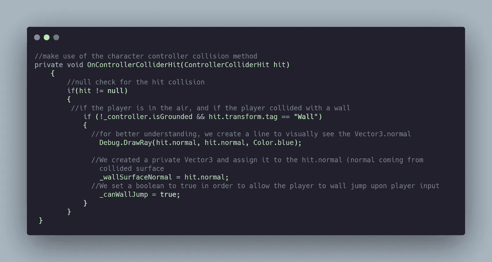
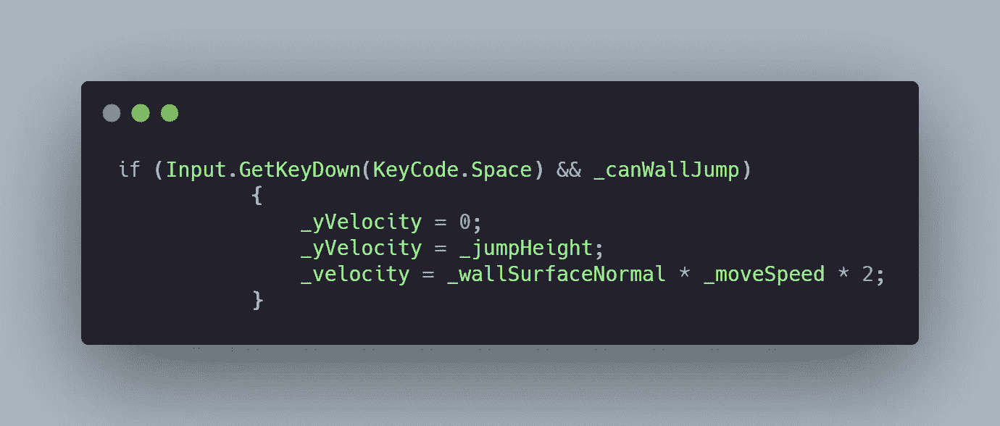
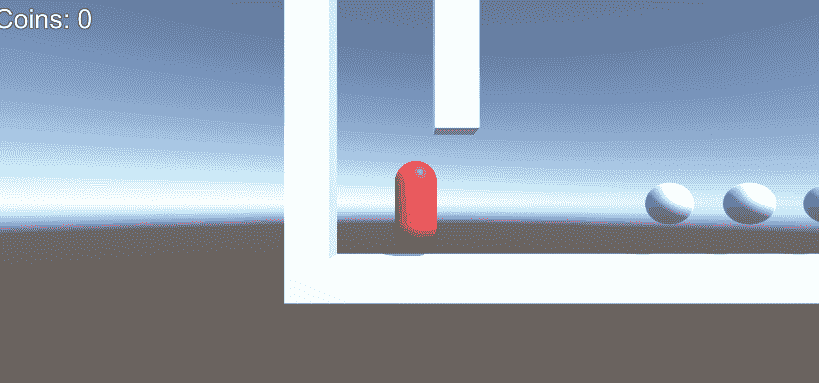

# 日积月累:在 Unity 里翻墙

> 原文：<https://levelup.gitconnected.com/tip-of-the-day-wall-jumping-in-unity-496a4d48f18d>

一个非常有趣的功能，可以增加玩家在游戏中的机动性，并可以为你的游戏增加一个惊喜的因素，这就是跳墙。仅仅拥有跳墙的能力就可以打开许多以前无法进入的新关卡设计选项。

> 这里是使用角色控制器完成的。

“如果你以前没有设置过角色控制器，请阅读我们以前关于如何设置角色控制器的文章。[此处阅读](https://medium.com/codex/tip-of-the-day-character-controller-in-unity-4516644f695)。

角色控制器中一个非常有用的方法是 **OnControllerColliderHit** ，它检测与玩家的碰撞。

这里的逻辑是，当玩家跳跃时，如果玩家撞到了一面墙，那么我们检测到与墙的碰撞，并指定我们碰撞到的那面墙的向量 3 法线。现在我们利用 Vector3.normal，用它来检测跳墙的方向。

这是任何平面的矢量 3 法线。基本上，它是从平面出来的向量，基于平面的角度。

密码

现在我们得到了 Vector3.normal 来检测墙跳方向，并允许玩家进行墙跳，在 *Update()* 方法中，我们监听玩家的输入，只有当 _canWallJump 布尔值为真时，我们才添加玩家的 Y 速度，并计算跳跃的方向和速度。

将这种方法与前面的方法(使用角色控制器移动，双跳，推动物体)结合起来，你将拥有一个非常灵活和强大的角色控制器。

