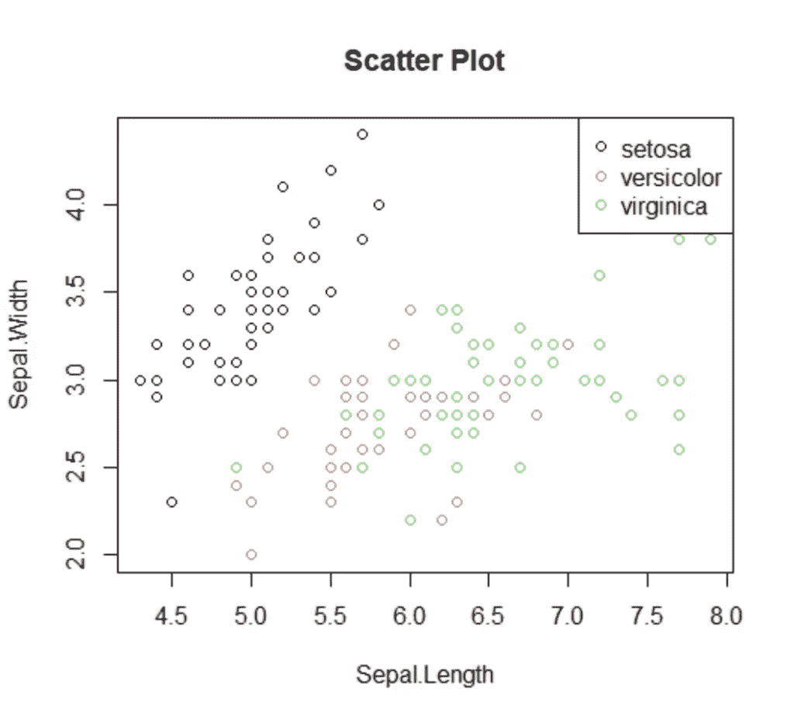
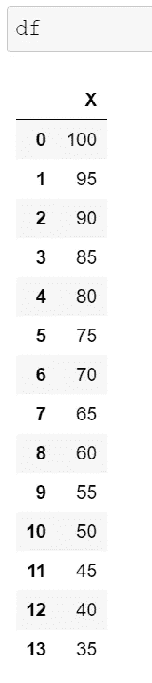
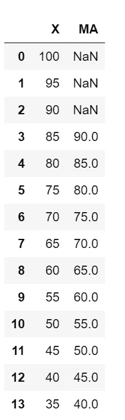
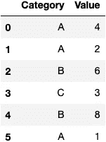
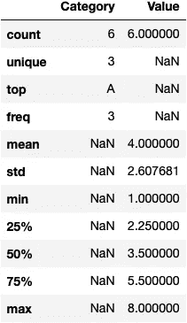
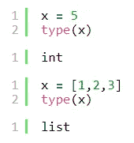

# 数据科学家的提示和技巧(第 8 卷)

> 原文：<https://levelup.gitconnected.com/tips-and-tricks-for-data-scientists-vol-8-1480b433d39>


图片由[预测黑客](https://predictivehacks.com/tips-and-tricks-for-data-scientists-vol-8/)

我们已经开始为数据科学家撰写一系列关于技巧和诀窍的文章(在 **Python** 和 **R** 中)。如果你错过了:

*   [第一卷](https://predictivehacks.com/10-tips-and-tricks-for-data-scientists-vol-1/)
*   [第二卷](https://predictivehacks.com/10-tips-and-tricks-for-data-scientists-vol-2/)
*   [第三卷](https://predictivehacks.com/10-tips-and-tricks-for-data-scientists-vol-3/)
*   [第四卷](https://predictivehacks.com/10-tips-and-tricks-for-data-scientists-vol-4/)
*   [第五卷](https://predictivehacks.com/10-tips-and-tricks-for-data-scientists-vol-5/)
*   [第六卷](https://predictivehacks.com/10-tips-and-tricks-for-data-scientists-vol-6/)
*   [第 7 卷](https://predictivehacks.com/10-tips-and-tricks-for-data-scientists-vol-7/)

# 稀有

## 1.如何从数据框中移除相关变量

当我们建立预测模型时，我们使用删除高度相关的变量(多重共线性)。重点是保持这两个相关变量。让我们以`iris`数据集的独立变量为例，看看如何在 R 中实现它。

获取虹膜数据集 IVs 的相关矩阵:

```
df<-iris[, c(1:4)] cor(df)
```

**输出:**

```
Sepal.Length Sepal.Width Petal.Length Petal.Width
Sepal.Length    1.0000000  -0.1175698    0.8717538   0.8179411
Sepal.Width    -0.1175698   1.0000000   -0.4284401  -0.3661259
Petal.Length    0.8717538  -0.4284401    1.0000000   0.9628654
Petal.Width     0.8179411  -0.3661259    0.9628654   1.0000000
```

正如我们所见，有些变量是高度相关的。假设我们想要移除所有绝对相关性大于阈值的变量，假设我们的情况是 80%。首先，我们需要得到每一对的相关性，但是每一对只计算一次。

```
Var1<-NULL
Var2<-NULL
Correlation<-NULLfor (i in 1:ncol(df)) {
  for (j in 1:ncol(df)) {
    if (i>j) {
      Var1<-c(Var1,names(df)[i])
      Var2<-c(Var2,names(df)[j])
      Correlation<-c(Correlation, cor(df[,i], df[,j]))

    }
  }
}output<-data.frame(Var1=Var1, Var2=Var2, Correlation=Correlation)
output
```

**输出:**

```
Var1         Var2 Correlation
1  Sepal.Width Sepal.Length  -0.1175698
2 Petal.Length Sepal.Length   0.8717538
3 Petal.Length  Sepal.Width  -0.4284401
4  Petal.Width Sepal.Length   0.8179411
5  Petal.Width  Sepal.Width  -0.3661259
6  Petal.Width Petal.Length   0.9628654
```

让我们从每对变量中去掉一个绝对相关度大于 80%的变量。

```
threshold<-0.8 exclude<-unique(output[abs(output$Correlation)>=threshold,'Var2']) reduced<-df[, !names(df)%in%exclude] head(reduced)
```

**输出:**

```
Sepal.Width Petal.Width
1         3.5         0.2
2         3.0         0.2
3         3.2         0.2
4         3.1         0.2
5         3.6         0.2
6         3.9         0.4
```

让我们也得到减少的数据帧的相关性。

```
cor(reduced)
```

**输出:**

```
Sepal.Width Petal.Width
Sepal.Width   1.0000000  -0.3661259
Petal.Width  -0.3661259   1.0000000
```

正如我们可以看到的，我们删除了相关变量，留下了 2 个 iv，而不是 4 个。

## 2.如何更新所有 R 包

您可以按如下方式更新 R 包:

```
# list all packages that you can update
old.packages()# update all packages
update.packages()# update, without prompts
update.packages(ask = FALSE)# update only a specific package 
install.packages("dplyr")
```

## 3.如何向散点图添加类别颜色和图例

假设您想要创建一个散点图，并根据类别添加一种颜色，最后向图表添加一个标签/图例，以显示颜色和类别的映射。让我们看看如何用`base`包来实现它。

```
plot(iris$Sepal.Length, iris$Sepal.Width, col=iris$Species, main="Scatter Plot" , xlab="Sepal.Length", ylab="Sepal.Width") legend(x="topright", legend=levels(iris$Species), col=unique(as.numeric((iris$Species))), pch=1)
```



# 计算机编程语言

## 4.如何在熊猫中应用滚动加权移动平均线

熊猫有内置的滚动窗口功能，使我们能够获得移动平均线，甚至是指数移动平均线。然而，如果我们想要为我们的观察设置自定义权重，则没有任何内置函数。下面我们提供一个例子，说明如何使用滚动窗口应用加权移动平均。

假设我们有下面的数据框架，并且我们想要得到一个带有滚动窗口 **4 个观察值**的移动平均值，其中最近的观察值将比旧的观察值具有更大的权重。

```
import pandas as pd 
import numpy as np df = pd.DataFrame({'X':range(100,30, -5)})
```



我们需要定义权重，并确保它们加起来等于 1。我们的权重可以是[0.1，0.2，0.3，0.4]。

```
weights = np.array([0.1, 0.2, 0.3, 0.4]) 
df['MA'] = df['X'].rolling(4).apply(lambda x: np.sum(weights*x)) 
df
```



注意，前三个观察值是 NaN，因为我们的滚动窗口被设置为 4。第 4 次观察(指数=3)，等于自`100*0.1 + 95*0.2 + 90*0.3 + 85*0.4=90`起的 90°

## 5.如何在 Pandas 中描述具有分类值的列

默认情况下，在 Pandas 中，当您使用 describe 函数时，它只返回数字列。然而，使用下面的“hack ”, pandas 将返回所有列，包括分类。

```
df=pd.DataFrame({"Category":['A','A','B','C','B','A'], 'Value':[4,2,6,3,8,1]})
```



```
df.describe(include='all')
```



## 6.如何检查 If 语句中的数据类型

在 Python 中，我们可以用`type`命令(`type(object)`)获得对象的数据类型。例如:



但是，这种方法在 if 语句中不起作用，我们可以从下面看到:

```
x = [1,2,3]
if type(x)=='list':
    print("This is a list")

else:
    print("I didn't find any list")I didn't find any list
```

因此，我们应该使用`isinstance(object, type)`函数。例如:

```
x = [1,2,3]
if isinstance(x, list):
    print("This is a list")

elif isinstance(x, int):
    print("This is an integer")

else:
    print("This is neither list nor integer")This is a list#####################################################x = 5
if isinstance(x, list):
    print("This is a list")

elif isinstance(x, int):
    print("This is an integer")

else:
    print("This is neither list nor integer")This is an integer#####################################################x = "5"
if isinstance(x, list):
    print("This is a list")

elif isinstance(x, int):
    print("This is an integer")

else:
    print("This is neither list nor integer")This is neither list nor integer
```

*原载于*[*https://predictivehacks.com*](https://predictivehacks.com/tips-and-tricks-for-data-scientists-vol-8/)*。*