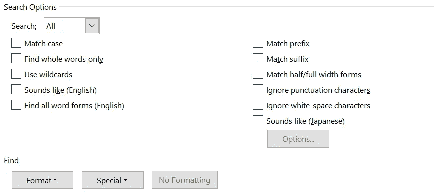
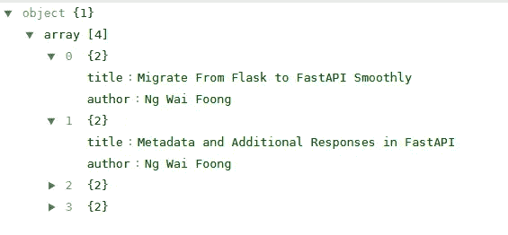

# 集成第三方 API 的提示和技巧

> 原文：<https://levelup.gitconnected.com/tips-and-tricks-for-integrating-third-party-apis-f6aaa82bbc80>

5 个有用的建议，我希望我能早点知道


阿尔瓦罗·雷耶斯在 [Unsplash](https://unsplash.com/?utm_source=unsplash&utm_medium=referral&utm_content=creditCopyText) 上拍摄的照片

通过阅读本文，您将了解到一些重要的技巧，这些技巧有助于在与任何外部第三方 API 集成时管理您的期望。不久前，我在处理外部供应商提供的 API 时经历了一个痛苦的集成过程。我现在聪明多了，并且愿意分享我从中学到的教训。

一些技巧基于使用标准 Python 库的 Python 实现。此外，对于简单的用例，也会有 JavaScript 实现。根据您使用的编程语言对其进行相应的修改。

# 查找/搜索功能

很多时候，对方提供的文档要么是网址，要么是 PDF 等电子文档。强烈建议使用浏览器或您选择的文字处理程序(如 Microsoft Word)打开文档。这只是因为您可以利用高级查找功能来定位丢失的部分。您可以在任何现代浏览器中安全地打开 PDF 和 JSON 文件。

## 浏览器(Mozilla Firefox)

您可以使用 find 功能根据一些关键字搜索文档，而不是通读整个文档来获得您需要的信息。例如，有一个 API 端点需要一个名为`token`参数，但上面没有示例/描述。您可以使用`token`作为关键字搜索文档。下面是 Mozilla Firefox 中查找功能的一个例子。


作者图片

它有以下选项:

*   `Match Case` —搜索启用了区分大小写的文档。
*   `Match Diacritics` —区分带发音符号的字母和它们的基本字母。例如，如果启用此选项，`café`与`cafe`不同。
*   `Whole Words` —使用全字搜索文档。`transport`与`transportation`不匹配。

## 微软 Word

此外，像微软 word 这样的文字处理程序提供了更多的功能。看看下面的图片，它包含了对非英语语言的支持。



作者图片

利用搜索功能快速浏览文档，以便找到您想要的内容。

# JSON 编辑器工具

API 返回的最常见的输出响应是 JSON。利用 JSON 编辑器工具非常有用，因为它可以让您大致了解 JSON 数据的结构以及字段-值对。您可以很容易地在返回的响应中识别出任何形式的异常或例外。

例如，我查询一个 API，它返回以下 JSON 响应。

```
{
  "array": [
    {"title": "Migrate From Flask to FastAPI Smoothly", "author": "Ng Wai Foong"},
    {"title": "Metadata and Additional Responses in FastAPI", "author": "Ng Wai Foong"},
    {"title": "4 Useful Advanced Features in FastAPI", "author": "Ng Wai Foong"},
    {"title": "How to Save Uploaded Files in FastAPI", "author": "Ng Wai Foong"}
  ]
}
```

粗略地看一下，很难准确地确定响应的结构。当你有成百上千的键值对时，情况会变得更糟。让我们在您选择的任何 JSON 编辑器中输入响应。我正在使用 [JSON 在线编辑器](https://jsoneditoronline.org/)来编写本教程。您应该会看到类似这样的内容



作者图片

从上图中，我们可以推断出返回的响应由一个包含四个元素的数组列表组成。每个元素都包含一个具有以下键值对的对象:

*   标题
*   作者

当涉及到输出响应时，这种方法被证明比依赖文档有效得多，因为示例可能已经过时或者包含不准确的信息。

# 哈希里布

出于安全目的，大多数 API 都需要某种形式的认证，无论是通过 IP 白名单还是令牌访问。对于令牌访问，最常见的实现是使用特定的哈希算法对密钥和当前时间的组合进行哈希处理。在本教程中，我将使用 Python 来展示实现。

当前时间输入可以是时间戳的形式，也可以是特定的日期时间格式，如`yyyyMMddHHmmss`。处理它的最好方式是通过`datetime`库。对于特定的日期时间格式，使用`strftime`函数并传入适当的格式代码。以下示例说明了如何生成所需的当前时间字符串。

```
import datetimeint(datetime.datetime.now().timestamp())
# 1602753358datetime.datetime.now().strftime('%Y%m%d%H%M%S')
# 20201015171558
```

接下来，您可以利用`hashlib`模块根据您想要的散列算法生成一个安全散列。默认情况下，它附带以下哈希算法:

*   ha1
*   sha224
*   sha256
*   sha384
*   sha512
*   blake2b
*   blake2s
*   讯息摘要 5

根据您的计算机的操作系统和 OpenSSL 版本，以下算法也是可用的。

*   sha3_224
*   sha3_256
*   sha3_384
*   sha3_512
*   摇一摇 _128
*   摇一摇 _256

让我们用一个简单的模拟键来测试一下`md5`和`sha256`。声明以下导入语句和变量。

```
from hashlib import md5, sha256key = '12345678'
current_time = int(datetime.datetime.now().timestamp())
```

您需要将 key 和 current_time 组合成一个字符串，并通过 encode 函数将其转换成字节。之后，将其作为输入参数传递给您选择的哈希算法。默认情况下，您可以以字节字符串或十六进制数字字符串的形式返回摘要。

*   `digest` —包含范围从 0 到 255 的字节
*   `hexdigest` —对于非二进制环境，仅包含十六进制数字。

```
md5((f"{key}{timestamp}").encode('utf-8')).hexdigest()
```

至于`sha256`，你应该这样称呼它:

```
sha256((f"{key}{timestamp}").encode('utf-8')).hexdigest()
```

调用安全 API 时，输出充当令牌/符号输入参数。

# base64

有时二进制数据或 HTML 格式的数据被存储为`base64`字符串。

## 计算机编程语言

您可以使用`base64`模块轻松对其进行编码和解码。添加以下导入声明和初始化。

```
import base64data = b'<p>Hello World!</p>'
```

我将对这些数据进行编码，然后使用`base64`模块进行解码。正确地说，您只需要在存储数据时关心编码，在提取数据时关心解码。调用`b64encode`函数，该函数接受一个类似字节的对象。

```
encoded_data = base64.b64encode(data)
```

当您打印出变量时，您应该得到以下输出。

```
b'PHA+SGVsbG8gV29ybGQhPC9wPg=='
```

接下来，使用`b64decode`函数解码`encoded_data`变量。

```
base64.b64decode(encoded_data)
```

您应该获得原始的字节字符串数据

```
b'<p>Hello World!</p>'
```

## Java Script 语言

对于 JavaScript 用户，可以依靠内置的`btoa`和`atob`函数进行 base64 编码解码。`bota`以 base-64 编码一个字符串，而`atob`解码编码后的字符串。

```
const text = "<p>Hello World!</p>";
const encodedString = window.btoa(text);
const decodedString = window.atob(encodedString);
```

# 编码

可能会有 URL 或链接存储为字符串的情况。在这种情况下，您可能会得到一个包含空格的链接，如下图所示

```
https://example.com/user/Ng Wai Foong
```

因此，在向用户显示数据时，数据可能会被错误地呈现为无效链接。对此的解决方案是将其编码为 URI 安全字符串。

## 计算机编程语言

您可以选择使用基础`urllib`模块或高级接口(如`requests`模块)来实现它。

对于 urllib，根据您拥有的 python 版本，import 语句略有不同。Python 2.x 应该按如下方式导入它:

```
from urllib import quote
```

至于 Python 3 及以上，现在在`parse`子模块下。

```
from urllib.parse import quote
```

只需通过将链接作为输入参数传入来调用函数。

```
text = 'https://example.com/user/Ng Wai Foong'
quote(text)
```

您应该得到下面的输出，这不是我们想要的。%3A 中引用了:符号。

```
https%3A//example.com/user/Ng%20Wai%20Foong
```

为了解决这个问题，您可以使用`safe`参数。它允许您指定自己的自定义 ASCII 字符，这些字符不应该被引用。默认值为`/`。让我们用下面的代码再试一次

```
quote(text, safe='/:')
```

当您将它打印出来时，您应该在控制台上看到以下输出。

```
https://example.com/user/Ng%20Wai%20Foong
```

对于高级实施，您可以使用`requests`模块，该模块提供标准功能，但定制较少。继续添加以下代码。当您将它打印到控制台时，应该会得到相同的结果。

```
from requests.utils import requote_urirequote_uri(text)
```

## Java Script 语言

同样，您可以通过`encodeURI`函数在 JavaScript 中获得相同的功能。顾名思义，您可以使用它们引用一个字符串作为 URI 安全链接。

```
const text = "https://example.com/user/Ng Wai Foong";
const encodedString = encodeURI(text);
```

# 结论

让我们回顾一下今天所学的内容。

我们首先提醒一下浏览器或任何文字处理程序(如 Microsoft Word)中查找/搜索功能的用处。

接下来，我们进一步探索了如何使用任何 JSON 编辑器工具来帮助我们理解输出响应的结构。

我们还测试了格式化所需的日期时间字符串，该字符串将在为 API 身份验证生成安全散列时用作输入参数。我们尝试了一下`md5`和`sha256`哈希算法。

此外，我们提出了两种编码和解码 base64 字符串的解决方案。它们可以用 Python 或 JavaScript 实现。

最后，我们还创建了简单的代码片段，有助于将字符串引用到 URI 安全链接中。

感谢您阅读这篇文章！希望在下一篇文章中再见到你！

# 参考

1.  [Python hashlib](https://docs.python.org/3/library/hashlib.html)
2.  [Python base64](https://docs.python.org/3/library/base64.html)
3.  URI 的请求
4.  [W3School atob](https://www.w3schools.com/jsref/met_win_atob.asp)
5.  [Mozilla MDN 网络文档](https://developer.mozilla.org/en-US/docs/Web/JavaScript/Reference/Global_Objects/decodeURI)