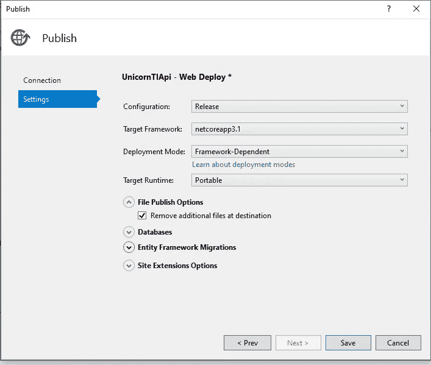

# 提示和技巧，从 Visual Studio 发布应用程序

> 原文：<https://levelup.gitconnected.com/tips-and-tricks-publishing-your-apps-from-visual-studio-d8757fa4a5db>

如果您是从 visual studio 管理应用程序的新手，您可能会遇到一些很晚才发现的错误，而且很少有人谈论这些错误。在这篇文章中，我想收集一些可以作为参考的技巧。

从 visual studio 发布应用程序时最常见的问题之一听起来可能是这样的:

> **“我部署了我的网站，但它不能正常工作”或“我部署了网站，但浏览时仍能看到旧内容。”**

发生这种情况有两种可能性:**部署问题**或**运行时问题。**

## **部署问题**

这些类型的错误导致一组文件无法正确部署，或者通常无法在**站点\wwwroot** 中更新。

作为这个错误的结果，你将经常以一个站点不能运行而告终，这使它看起来像一个**“运行时间”**问题。但核心问题在于实施。当这种情况发生时，你不应该问自己“为什么我的网站不能正常工作？”相反，正确的问题是**“为什么正确的文件不在它们应该在的地方？”**

这可能是一个错误，我们稍后会看到。

## **运行时问题**

当你的 **wwwroot** 文件夹中的文件是它们应该是的样子，但是由于某种原因站点不能正常运行时，就会出现运行时问题。

当这种情况发生时，你用来实现你的网站的技术就不再适用了。唯一重要的是你把文件放在正确的地方。在这种情况下，对您的问题的描述应该集中在您的代码在运行时正在做什么以及它是如何失败的，而不是您如何实现它。

**一些原因可能是:**

1.  您的网站可能配置不正确。例如错误的 PHP 版本。NET 运行时等。
2.  可能存在未正确配置的外部依赖关系，如数据库。
3.  您的代码可能对路径做了无效的假设，比如对只存在于您的机器上的东西进行硬编码。

让我们看看一个常见错误及其解决方案的图片:

**由于文件上传不正确导致部署时出现问题。**

1.  在我们的 Azure 门户中，我们下载我们的发布配置文件，它提供了默认选项，我们最好特别验证一个。

**Azure 门户，app 服务资源**

2.当我们在 Visual Studio 中发布我们的应用程序时，一旦我们导入了我们的配置文件，它就会为我们带来这个带有位置选项的视图。

**在 visual studio 中发布屏幕**

**3。我们点击编辑>文件发布选项>删除目标位置的附加文件检查**

这样，我们将避免在发布时可能出现的冲突，即可能的配置文件没有被正确更新。

# 更多提示

**本地缓存**
Azure App 服务内容存储在 Azure 存储中，并持久地作为内容共享出现。但是，有些应用程序只需要一个高性能的只读内容存储，就可以高可用性地运行。这些应用程序可以受益于本地缓存的使用。

1.  对于像 WordPress 这样的内容管理网站，不推荐使用本地缓存。
2.  如果你的应用程序使用本地缓存，那么你需要重新启动你的应用程序，这样你就可以看到你的变化。
3.  本地缓存有助于防止与存储相关的应用程序重启，但您的应用程序可能会在虚拟机基础架构更新期间重启。

# 结论

当我们遇到某种类型的错误时，要做的第一件事是确定我们是否有部署问题或运行时问题，以便找到最佳解决方案。当[发布您的应用时，您可以继续学习最佳实践。](https://docs.microsoft.com/en-us/azure/app-service/deploy-best-practices)

再见！