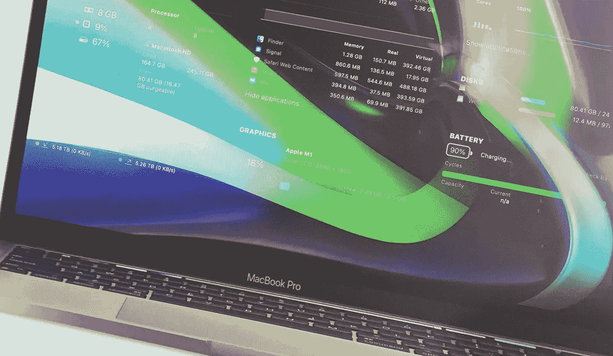
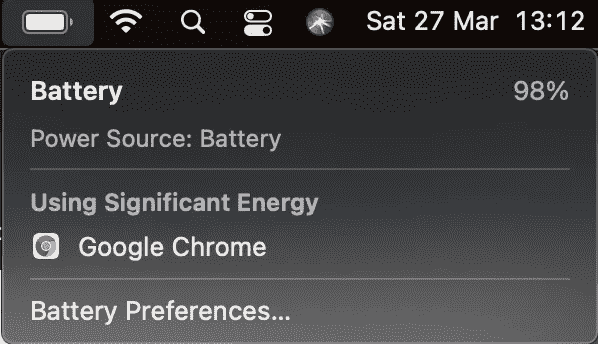
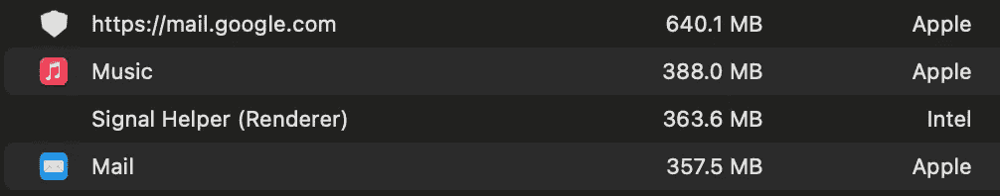

# 充分利用苹果 M1 最低规格机器的技巧和诀窍

> 原文：<https://levelup.gitconnected.com/tips-and-tricks-to-get-the-most-out-of-your-apple-m1-lowest-spec-machines-cfbfc8086fdf>

最低规格的苹果 M1 Air 还是 Pro？太好了！买家后悔了吗？不太好。因为你可能只是用错了！我自己也发现了这一点，通过这样做——错误地使用它。显然，*常识并不那么普遍*——我的一位老经理反复说道，他说得再正确不过了。

得到一个苹果 M1，尤其是最低规格的机器，无论是 Air 还是 Pro，对许多人来说都不像是一个范式转变，最初我也犯了这个错误。然而，在过去的 5 个月里，**我开始重新评估我的用户和开发人员的习惯**，这是我在使用计算机近 20 年以及在各种机器上开发软件约 10 年的时间里获得的，我发现当从英特尔机器过渡到 M1 时，我的常识也不完全符合要求。我希望很多正在阅读这篇文章的人已经发现了这些技巧，并且你的习惯已经改变了，或者可能从来没有像我一样糟糕，并且大多数(如果不是全部)看起来真的像是常识。

正如我在[我的上一篇文章](https://medium.com/codex/the-apple-m1-ssd-swapgate-is-a-massive-overreaction-50002ee23d0)中提到的，我把我的 MacBook Air 换成 M1 MacBook Pro 的主要原因是好奇，并试图最大限度地利用一台入门级机器，看看它与我当时的日常驱动程序(一台两倍规格的 15 英寸 MacBook Pro)相比如何。一些结论是显而易见的，而另一些则不那么明显。毫无疑问，M1 作为一个 CPU 是一个绝对的发电站。这真的令人兴奋，感觉就像彻头彻尾的魔法。然而，物理定律和一般计算机硬件限制起作用的是内存；最终，你如何管理这些内存将会使这台机器成为一个伟大的或令人沮丧的用户体验。

## 谷歌浏览器

多年来，我一直对谷歌产品不满，但谷歌 Chrome 尤其令人恼火。我知道在谷歌工作被认为很酷，但如果 Chrome 是软件质量标准的例子，那么谷歌可能是你最不想写代码的地方。单单 Chrome 就能让你的机器变成一块无用的砖头，拖慢一切或者锁定整个操作系统。最重要的是，只要打开这个该死的东西，就能保证你的笔记本电脑的电池寿命减少至少一半，如果不是 60-70%的话。因为一个叫做 Chrome 的浏览器的空间浪费，你用 M1 获得的所有惊人的电池寿命实际上都被扔出了窗外。谷歌声称他们已经将应用程序的能效提高了 300%左右，但恕我不敢苟同，MacOS 也是如此。

但这甚至不是 Chrome 的唯一问题。它也是一只吞噬记忆的野兽。我真的很想知道为什么谷歌搜索引擎在几乎没有任何插件和标签的情况下仍然使用了总共 320MB 的内存。作为软件开发人员，这根本没有意义。

**为了解决这个问题，我转到了 Safari** ，老实说，差异是显而易见的。更少的内存占用，更好的标签管理，满足了我 95%的 web 开发需求。我仍然安装 Chrome 的唯一原因是进行跨浏览器测试，并偶尔运行 Lighthouse 检查套件。除此之外，Safari 非常可靠，并与 1Blocker 相结合，用户体验非常好。

## 谷歌邮箱

不过，仅靠 Safari 并不能解决所有问题。不幸的是，谷歌粗制滥造的开发实践也普遍存在于他们所有的网络应用中。以 Gmail 为例。当你在 Safari 标签页打开它的时候，**单单 Gmail 标签页就要占用 600MB 到 2GB 的内存**！就为了一串该死的邮件！看看 Safari 标签页中的 Gmail 和苹果邮件应用程序中的 Gmail 账户的对比。

*“你他妈的在开我玩笑吗”*这还不够。一个网页(因为即使是网络应用也是网页，即使这伤害了一些开发者的感情)使用的内存是实际应用的两倍或更多？！？

当我意识到发生了什么事，我觉得我的头撞在墙上。通过在我的任何一台机器上不断地在浏览器中打开 Gmail，我毫无理由地消耗了宝贵的资源。我现在放弃了 Gmail 网络客户端，永久地转移到了苹果的邮件应用程序，它不仅工作出色，而且占用的内存也少了很多。

## 网络风暴

这一次我真的应该踢自己的屁股，因为这是一个如此明显的错误，但我花了 4 个月才意识到。我是 WebStorm 的忠实粉丝，已经成为付费用户 4 年了。虽然 Visual Studio 代码很好，功能也很多，但 WebStorm 感觉更适合我的工作方式，所以很自然地，我一买下 M1，就安装了它。然而，回到 2020 年 11 月，他们只有运行 Rosetta 2 的英特尔版本。它感觉迟钝。我能够使用它，但它与我所习惯的相差甚远。我一直在更新，希望通过更新得到 M1 的支持，但是我一直没有看到任何改进。

四个月后，我恍然大悟。我使用的是英特尔版本，因此我获得了英特尔版本的更新。我完全忽略了一个事实，他们 12 月发布的 M1 版本实际上是一个完全不同的应用程序，我必须下载一个安装程序，而不仅仅是一个更新程序。不用说**M1 版本运行起来非常流畅**，事实上比我的英特尔 Mac 上的英特尔版本还要好！所以，如果你是 WebStorm 用户，确保你已经安装了 M1 优化版！这将带来一个不同的世界。

## 安卓工作室

这可能是我唯一没有锦囊妙计的应用程序，除非你是一个狂热的开发者。**在 M1 上构建原生安卓应用暂时还不行**，除非你享受极其缓慢的体验。对于 Android Studio 正在尝试做的事情来说，所有的 Rosetta 2 翻译真的不够快。

然而，如果你和我一样是一名 Flutter 开发者，你就有点幸运了，因为 **Visual Studio 代码将满足你的大多数(如果不是全部)Flutter 开发需求**。即使是英特尔版本也提供了不错的体验，但如果你深入一点，你会发现**在他们的下载页面** [**上有一个官方的 M1 优化版本。与英特尔的版本相比，它的速度非常快。关于这一点…**](https://code.visualstudio.com/download#)

## 未优化的应用

简而言之，尽可能少地运行它们。我离开了 Photoshop，买了 Affinity Photo，因为他们从第一天起就有了 M1 版本，我不仅节省了硬件资源，还节省了大量资金，因为这是一次性购买。基本上，**如果你不局限于 Adobe 生态系统，你最好使用任何亲和应用**。对于运动图形**我使用了 Apple Motion** ，这也是一次性购买，从第一天起就已经进行了 M1 优化。

现实是，不管我们喜欢与否，在英特尔和 M1 之间的过渡期内，这些新的基于 ARM 的 MAC 电脑的真正潜力不会像我们希望的那样明显和清晰，但你可以非常接近它，通过**尽可能避免更多的英特尔应用**。我发现[isapplesiliconready.com](https://isapplesiliconready.com/for/m1)网站是一个极好的资源，可以让我随时了解我在 M1 优化应用方面的选择。

## 移动应用

作为最后一招，**尝试在 M1** 上使用一些 iOS 应用程序，以防它们已经在 app store 中可用。鉴于移动应用程序往往会进行更多的内存优化，因为它们首先要处理的资源更少，因此可以肯定的是，移动版本的应用程序比桌面或 web 应用程序占用的资源更少。例如，我在 M1 上使用了 PlexAmp——一款出色的音频播放器——移动应用程序，它只使用了微不足道的 120MB，相比之下，Safari 中的 Plex 标签在空闲时使用了 340MB！

改变我使用什么应用程序以及如何使用应用程序的习惯，不仅让我大大改善了我在 M1 上的体验，还解决了一些人过度担心的 [SSD 交换内存问题。**我平均削减了 50–70%的交换内存使用量**，这至少是相当可观的！更好的消息是，许多这些技巧也可以移植到 Intel 机器上，甚至是 Windows 或 Linux 机器上。作为一名十年的 web 开发人员，**我实际上并不认为浏览器是提供卓越用户体验的最有效方式**，是时候重新评估我们的一些用户习惯了。](https://medium.com/codex/the-apple-m1-ssd-swapgate-is-a-massive-overreaction-50002ee23d0)

> 我们都想要高性能的机器，但我们也经常以最低效的方式使用它们。

所以，去吧，改变你的习惯。你可以以后再谢我！😉如果你知道其他的提示和技巧，把它们添加到评论区，我相信很多人会发现它们很有用！

**Attila Vago**——*高级软件工程师打造令人惊叹的 ed-tech 软件。永远的酷呆子，代码和博客的作者。网络无障碍倡导者，乐高迷，黑胶唱片收藏家。喜欢精酿啤酒！*