# 谷歌 Play 商店优化的 17 个技巧

> 原文：<https://levelup.gitconnected.com/tips-for-google-play-store-optimization-14ef095c2790>

## 应用排名的 ASO 和 SEO 策略

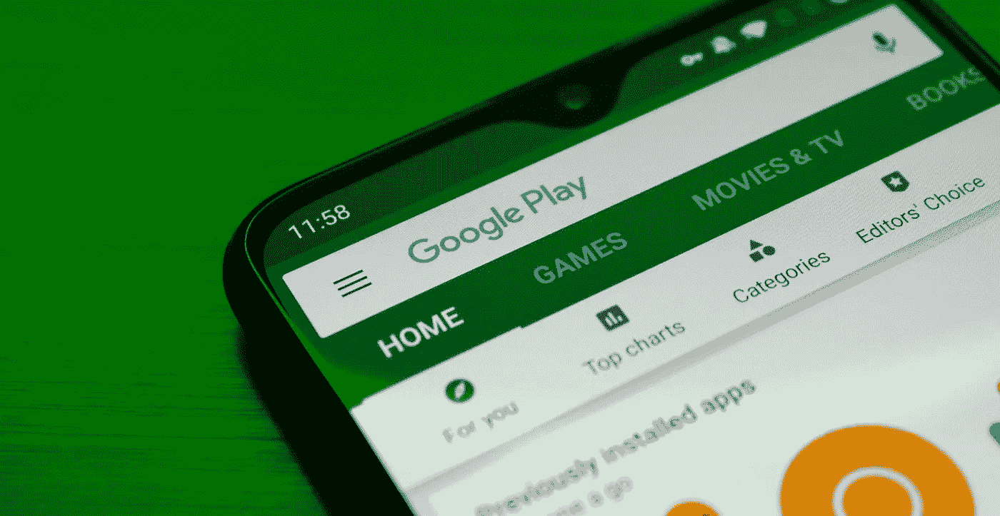

有许多因素决定了市场上一款手机应用的成功。

除了整体 UX 和它提供的价值，它还必须**容易被潜在用户找到**。

如果你运行一个 Android 应用，它的可发现性非常重要，我们可以通过**优化谷歌 Play 商店**的发布并使其在其他可用选项中脱颖而出来达到这一结果，特别是当我们谈论目前在商店上发布的超过*300 万*应用时。

在这篇文章中，我们想和你分享 11 个顶级技巧*可以帮助你**让你的应用程序在谷歌 Play 商店算法和用户之间有所区别**。*

# 1.选择具有正确“点击量”比率的关键词

对于任何开始使用 **ASO，App Store Optimization** 的人来说，在应用页面描述中寻找和使用搜索量最高的关键词是一个普遍的错误。

寻找流行和最热门的搜索词汇当然很重要，但并不是所有的短语都能获得足够的用户点击量(一个被称为 CTR 的因素**—点击率** ) **。**

> 如果你没有获得足够的点击量，一个低点击率的短语可能会损害你的应用列表，Play Store 可能会确定它与用户无关。

知道你应该选择哪个关键词的关键之一是考虑你的**目标用户的搜索意图。**

> 你能指望他们知道你的应用程序是做什么的吗？
> 
> 他们以前是否使用过类似的解决方案，或者他们对该主题是否陌生？

深思熟虑的用户意图策略的一个例子是谷歌地图在 Play Store 的上市。

尽管这款应用非常受欢迎，谷歌还是决定给它起一个描述性的名字: [*地图——导航&探索*](https://play.google.com/store/apps/details?id=com.google.android.apps.maps&hl=en) 。

通过选择关键词**“导航”**和**“探索”**，谷歌确保任何人在搜索导航解决方案时，如果不使用他们的品牌名称，仍然会遇到他们的应用程序。

## ASO 长尾关键词

鉴于 **CTR** 和**用户搜索意图**是如此重要的 **ASO 因素**，获得更多可见性和互动的方式是使用 [**长尾短语**](https://yoast.com/what-are-long-tail-keywords/) **、**，它们更具体，往往具有更高的**CTR**。

根据 Ahrefs 对超过 19 亿个关键词的研究，29.13%的月度搜索超过 10，000 次的短语是由三个或更多单词组成的！

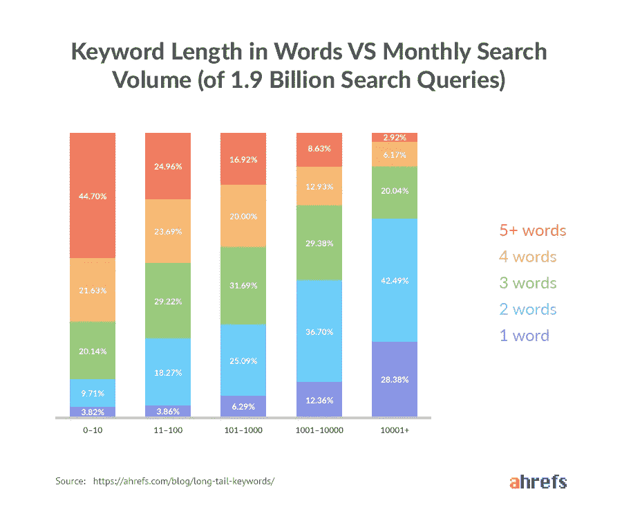

资料来源:[人权参考资料](https://ahrefs.com/blog/long-tail-keywords/)

## 在哪里可以找到你的应用程序的关键字和关键字组合？

为你的应用寻找相关的关键词是非常容易的，你可以通过简单的研究和分析你的竞争对手常用的关键词来做到这一点。

为了更好地工作，使用**应用商店优化关键词规划工具**，它可以帮助你找到最相关的关键词以及其他有用的信息，如排名、其他应用或网站的使用情况、用户的研究等

以下是一些工具:

*   [关键字桶](https://keywordkeg.com/play-store-keyword-tool.html)
*   [AppFollow](https://appfollow.io/)
*   [关键字工具](https://keywordtool.io/app-store)

# 2.将你的品牌名称和你选择的关键词结合起来，制作一个吸引人的标题

在谷歌 Play 商店，应用程序的名称是一个需要记住的重要的非元数据因素。

谷歌允许开发者**在应用标题**(新:[链接](https://twitter.com/Thomasbcn/status/872018947331293184))中包含 50 个字符，所以要明智地使用它们。

> 保持你的品牌名称简短，易于拼写，便于用户记忆。
> 
> 将你最相关的关键词放在你的品牌名称旁边。

> 请记住，您可以在每种语言中添加一个标题来本地化您的应用程序

不要忽视应用标题的本地化——移动世界是全球化的，对你的应用的需求可能来自你从未预料到的国家。

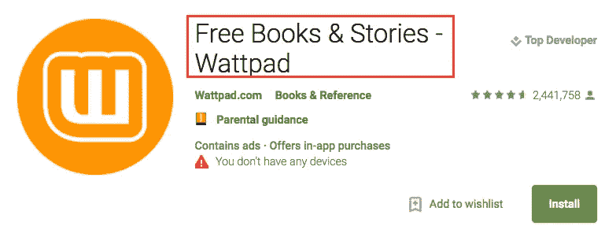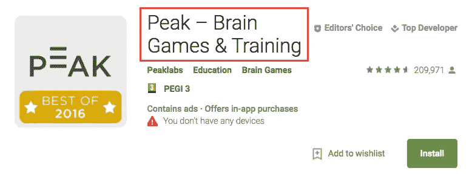

**快速提示:**

> 尝试在你的应用标题中添加表情符号，以便在用户浏览或搜索 Play Store 时吸引他们的注意力。

**完美的标题应该是这样的:**

*   *品牌—关键词*
*   *品牌:关键词*
*   *关键词—品牌*
*   *关键词:品牌*

# 3.不要在你的简短描述中过多使用关键词

**简短描述和详细描述**的不同之处在于它们影响**用户兴趣的方式**。

> 简而言之，关键词不是很相关，你有 80 个字符的限制，所以很难插入许多关键词，同时创造一个引人注目的短语

**你只有几秒钟的时间来吸引潜在客户的注意力**，留下良好的第一印象，并推销你的应用。

当然，**你可以提到一两个关键词**，只要确保它们不会扰乱你想要传达的信息。

Instagram 在这方面做得很好，他们声称:

> “让你更接近你爱的人和事”

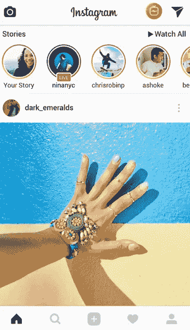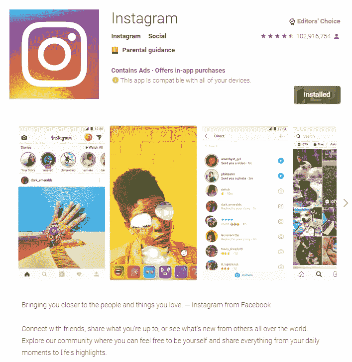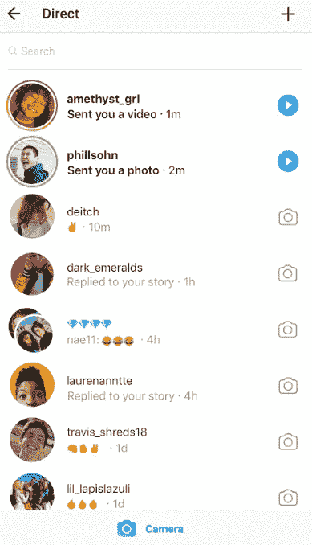

来源:[谷歌 Play 商店](https://play.google.com/store/apps/details?id=com.instagram.android&hl=en)

# 4.在你的详细描述中使用关键词

[与 iOS 应用商店](https://thetool.io/aso-app-store-optimization)不同，

> Google Play 会检查你的应用页面的冗长描述，并寻找相关的关键词

这里是你应该集中精力的地方，并提及**你希望为**和某些行业找到的术语非常重要，并显著影响他们的应用排名。

*营销机构 AppMasters* [*在对长描述进行 ASO 优化后，注意到两个关键词*](https://www.youtube.com/watch?v=Wt_TcEW9vTA) *出现峰值。第一个关键字的位置从 13 上升到 8，第二个从 11 上升到 8。
这意味着该应用程序同时进入了两个短语的前 10 大搜索结果！*

**关于 Google Play 的精彩优化描述的提示:**

*   将所有可用空间用于详细描述(至少 3.000–3.500 个字符)
*   寻找中长尾关键字(关键字组合)添加到您的描述
*   不要用太多的文字来过载你的描述——用短段落来写
*   使用像✔❖➜这样的项目符号或 Unicode 符号(在这里获得[和](https://unicode-table.com/en/))来建立一个清晰的视觉组织
*   包括表情符号🔥或者使用 HTML 和丰富的格式
*   查看谷歌要求，了解哪些事情不应该做😉

# 5.在你的描述中加入社会证据或统计数据

如果有一个你特别引以为豪的数字，或者如果你有一个著名客户的认可，你一定要在你的 Google Play 列表中展示它！

> 提及这些可以提升你的可信度，让你从竞争对手中脱颖而出，尤其是当数字或背书在折叠上方清晰可见的时候。

这是 Expedia 的 Google Play 简介:

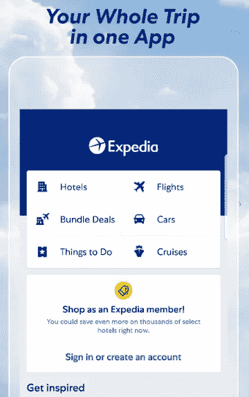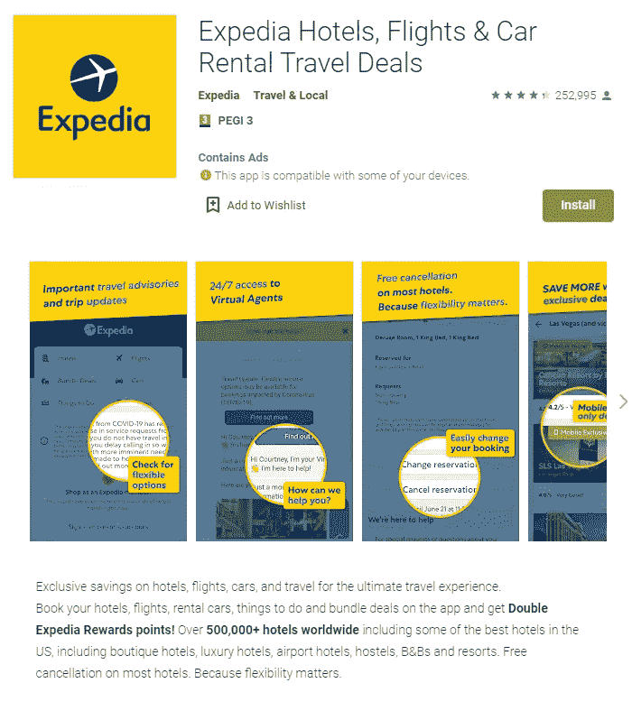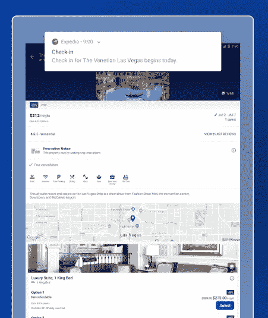

*来源:* [*谷歌 Play 商店*](https://play.google.com/store/apps/details?id=com.expedia.bookings&hl=en)

如你所见，他们指出他们在全球有**超过 50 万家酒店**，并确保任何浏览列表的人都注意到这一点。

你可以通过做一个 **A/B 测试、**一个没有特定号码或客户支持的列表，一个有。

*AppMasters 的 Steve Young 报告称，在他们的简短描述中添加了社交证明后，下载量上升了 14.6%。*

如此显著的下载率峰值也可能导致该应用出现在 Play Store 的**“趋势”列表中**。

# 6.在 URL /包中使用关键字

在谷歌 Play 商店，与谷歌网络搜索一样，域名/ URL 中包含的**关键词是应用搜索的重要排名因素**。

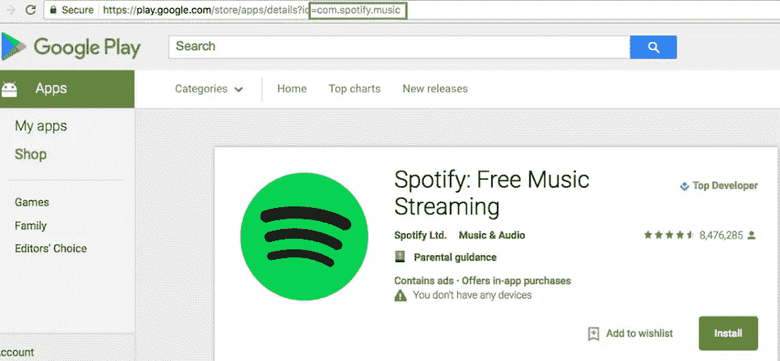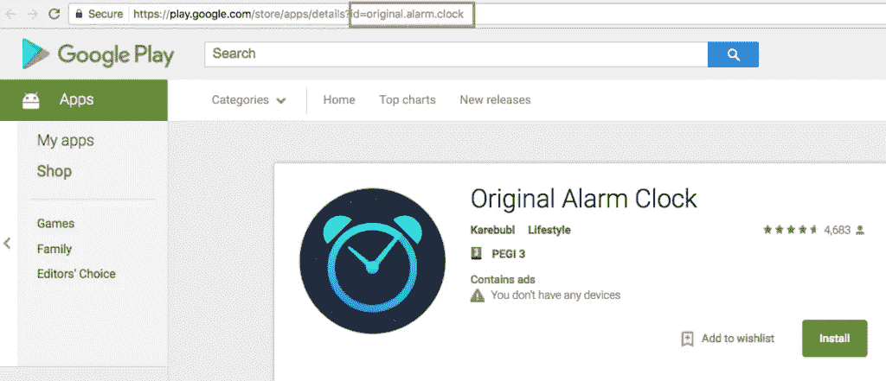

*阅读* [*这个好奇的案例研究*](https://medium.com/@DanielPeris/google-play-aso-url-package-search-ranking-factor-35c4ce938bdc) *关于任天堂的超级马里奥 Run 是如何在包 URL 中包含关键词“zara”的。*

当安装开始时，给予必要的元数据外的推动，游戏开始为这个极具竞争力和高搜索关键词排名。

值得在 URL 中包含一些关键字，对吗？

# 7.在您的开发人员姓名中使用关键字

> 开发者的名字也会帮助你的应用在搜索结果中排名。

除此之外，谷歌更喜欢来自有正面历史的开发者的应用，并且在搜索中排名更高。

尝试在开发者名称中添加**一些关键词**。

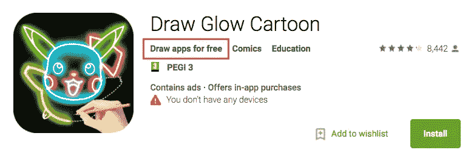

> 例如:“#DeveloperName: keyword + keyword”

# 8.制作原创应用图标

用户被漂亮和吸引人的视觉效果所吸引，这是在谷歌 Play 商店获得更多点击率的最好方法之一。

> 不要从网上挑选图片，如果你不能自己创作，那就值得考虑雇佣一个优秀的设计师来帮助你。

## 一些提示

> 对其他竞争对手的应用程序进行研究，确定它们的原色，你可以通过使用与它们的视觉特征形成对比的颜色来区分自己。

另一种方法是做出大胆的声明，然后**创造一个明确无误、一眼就能认出来的品牌**。

这种方法的一个很好的例子是 **Snapchat** ，其**亮黄色**图标和关键视觉效果:

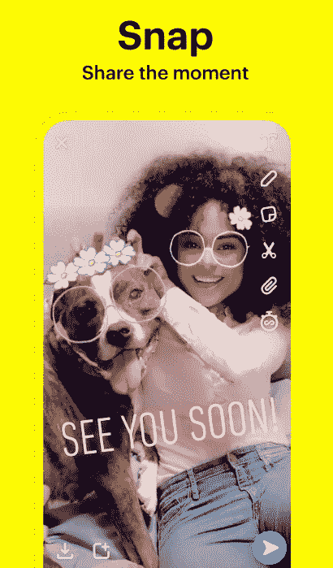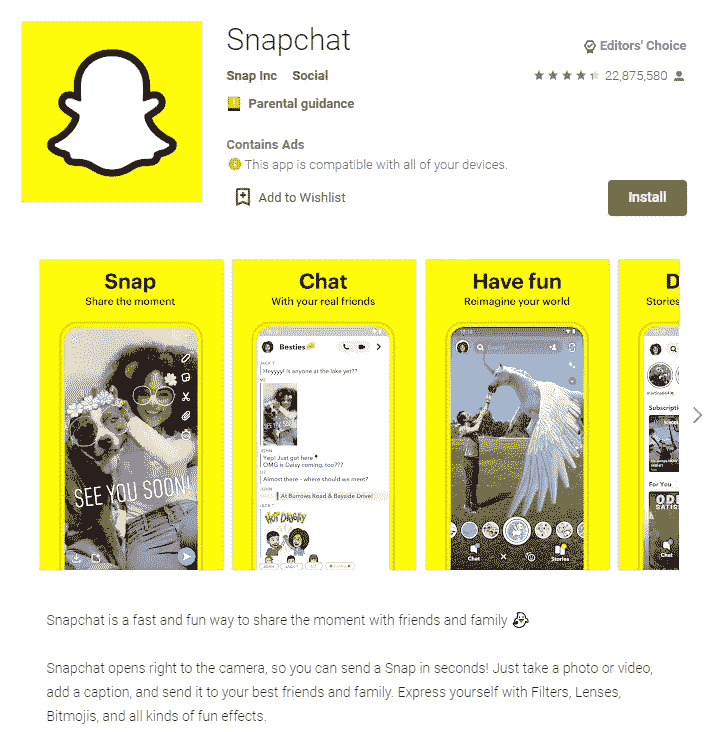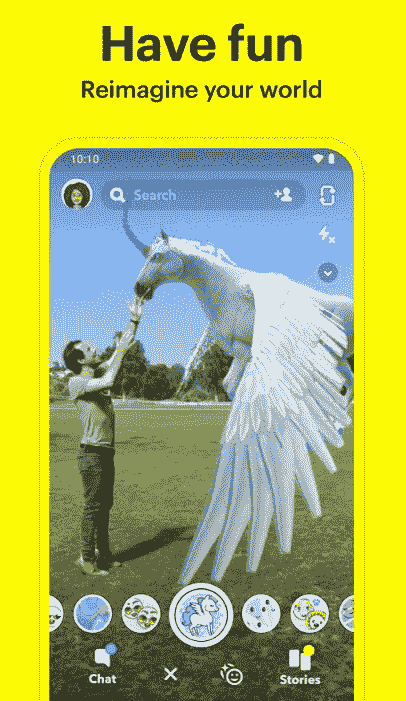

*来源:* [*谷歌 Play 商店*](https://play.google.com/store/apps/details?id=com.snapchat.android&hl=en)

一些关于如何优化你的图标的提示:

*   确保你的图标清楚地反映了你的应用程序的主要目的，不要混淆用户，除非你已经有了一个强大的品牌。
*   找到你的“风格”、颜色、字体等等，并坚持下去，这样你的图标就能和你应用程序的其他元素结合起来。
*   使用鲜艳和谐的颜色和清晰的形状，不要让你的图标有太多的元素。
*   看看你的竞争对手，做点不一样的。
*   尝试为图标添加边框，使其更加醒目。
*   避免在你的图标中出现文本。
*   创新并跟随设计趋势——还记得大家疯狂迷恋平面设计的时候吗？🙂
*   不要试图猜测你的用户会选择什么图标，**使用 A/B 测试工具来准确地知道什么图标表现最好**。

# 9.制作一个视频来增加参与度

你可以创建一个关于你的 Android 应用或游戏的 YouTube 视频。

> 视频是一种非常好的内容类型，人们更有可能观看

在这种情况下，视频预览缩略图将变成一个**特征图形**。
这是它在列表和搜索结果中的样子:

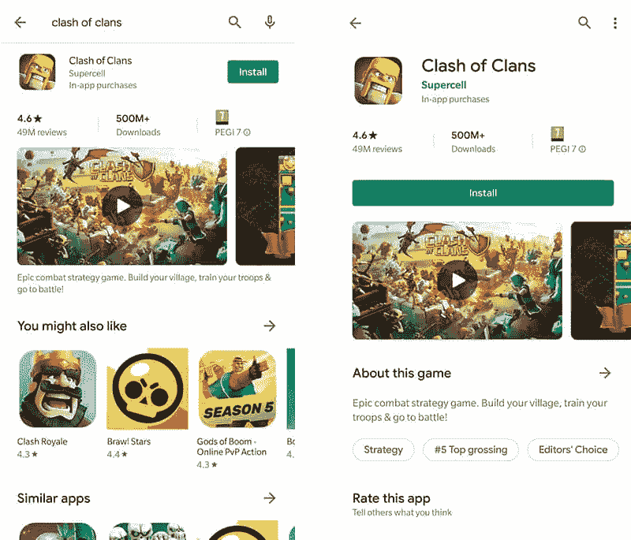

> 要添加视频，只需将 YouTube URL 粘贴到谷歌 Play 商店列表的“推广视频”字段中。

请记住这些要求:

*   *确保使用单个视频的 YouTube URL，而不是 YouTube 播放列表或频道 URL*
*   *不要使用有年龄限制的视频作为你的宣传视频*

您可以**将您的视频本地化为您的应用程序支持的所有语言**。

**每种语言上传一个视频**，或者只使用不同语言的文字记录，谷歌会根据用户位置或设备设置自动显示。

> 将视频添加到你的商店列表中最酷的事情之一就是**Play Store 的浏览量可以算作 YouTube 的浏览量**。这给了你更高的 YouTube 排名，因此，在谷歌网页搜索结果中的位置也更高。

*一定要看看 Apptamin 的* [*视频营销指南*](https://www.apptamin.com/blog/ultimate-guide-video-marketing/) *记住，你也可以在你的谷歌 Play 商店视频上做 A/B 测试实验，找出表现最好的那个。*

# 10.拍摄应用运行时的屏幕截图

像图标和特征图形一样，截图不影响搜索算法，但是**对安装**的转化率有影响。

> 截图展示了你的应用或游戏从内部看起来的样子，并突出了它的最佳功能。

然后由用户决定他是否喜欢他所看到的，以及他是否想要它，所以从第一个截图就抓住用户的注意力是非常重要的。

在谷歌 Play 商店，你可以为每种支持的设备类型添加多达 **8 张截图**，而谷歌要求的最少数量是 2 张截图，具体如下:

*   *JPEG 或 24 位 PNG(无 alpha)*
*   *最小尺寸:320px*
*   *最大尺寸:3840px*
*   *您的截图的最大尺寸不能超过最小尺寸的两倍*

> 显然，不要把自己限制在最少两张截图上，要有创意，展示你的应用程序的最佳功能来吸引你的用户。

截图不必是实际的截图，你可以(也应该)去用**讲故事，并创建一系列丰富的图片**来描述你的应用程序的最佳功能。

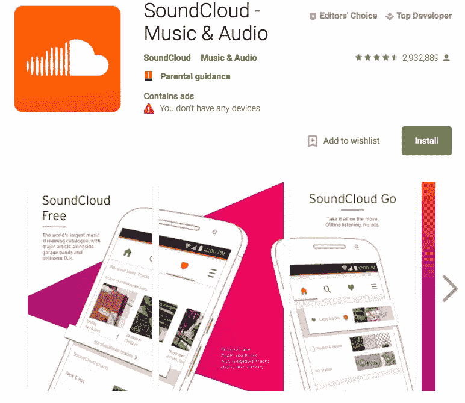

**遵循这些提示来改变你的截图:**

*   为你最重要的信息或者你的应用程序最好的功能保留第一个截图位置
*   不要给出裸露的截图，要对每张幻灯片进行解释
*   为你的截图序列选择一种风格或主题，并遵循它，而不是显示随机的图片
*   不要只是宣称你的应用程序功能，用你的副本挑战用户！
*   如果你在媒体上获奖或被提及！
*   如果你有一个有限的优惠，在你的截图上展示出来
*   本地化截图🌍如果需要
*   测试许多选项，找到最佳转换选项

如果你需要更多的灵感，请阅读这篇文章！

# 11.让您的应用程序出现在 Google 搜索应用程序包中

**并非所有应用的搜索查询都直接发生在 Google Play** 中，有些人只是转向**谷歌搜索**(2019 年[美国 63%的搜索是在移动设备上完成的](https://quoracreative.com/article/mobile-marketing-statistics))。

出于这个原因，谷歌创建了[应用包](https://splitmetrics.com/blog/app-packs-seo-for-apps/)，**一个特殊的片段，出现在搜索结果**的顶部。

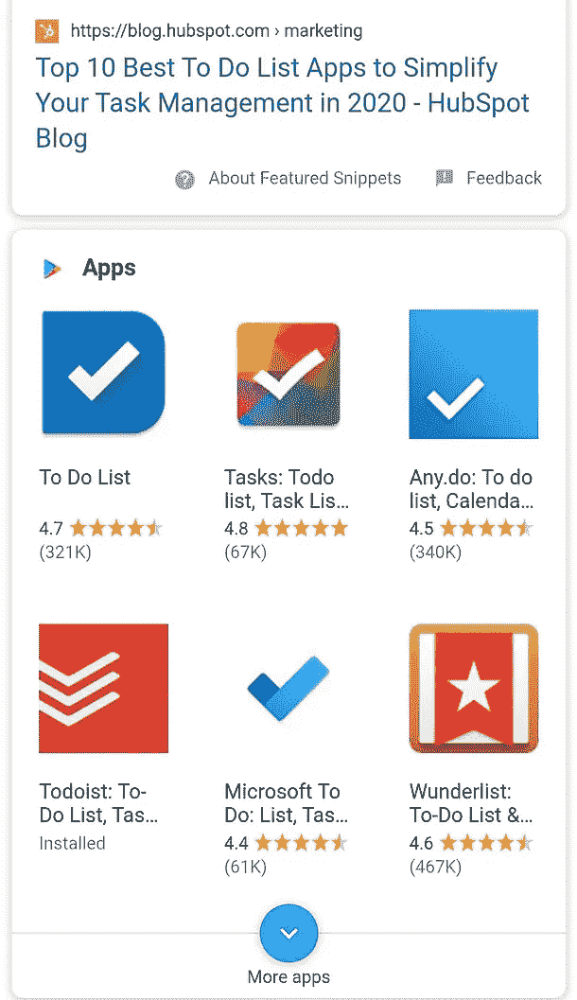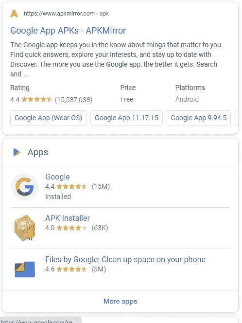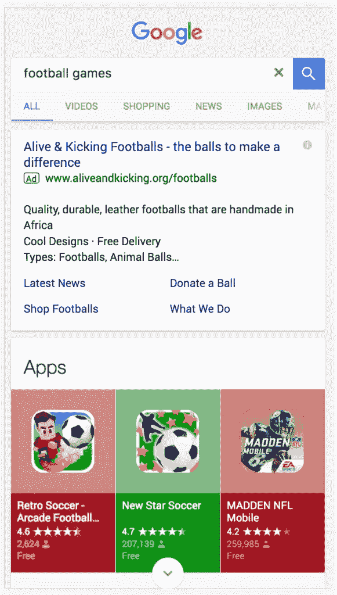

*来源:* [*谷歌搜索结果*](https://www.google.com/)

点击任何图标都会直接将您带到**应用程序的 Play Store 列表。**

> 你不仅要关注 ASO，还要关注 SEO(搜索引擎优化)

幸运的是，**两个实例**的许多基本规则是相似的，因此您可以快速掌握 Google Search 和 Play Store 优化。

# 12.不要使用 Google Play 自动翻译

为了让你更容易快速出现在几个市场上，谷歌提供了自动翻译列表描述的。

> 然而，他们也公开建议你把它们当作一个临时的解决方案，并且雇佣一个人类翻译。

这是因为针对多个市场的优化不仅仅是**翻译、**本地化**。**

本地化你的应用描述意味着你必须对每个市场进行单独的**关键词研究。**

> 一个在一个市场上简单且搜索量巨大的词，在另一个市场上可能不那么容易排名和受欢迎。

*例如，根据 UberSuggest，关键字“床和早餐”在美国的搜索量为* [*110，000，难度分数为 46*](https://app.neilpatel.com/en/ubersuggest/overview?keyword=bed%20and%20breakfast&locId=2840&lang=en) *，而在加拿大的搜索量为* [*18，100，难度分数为 24*](https://app.neilpatel.com/en/ubersuggest/overview?keyword=bed%20and%20breakfast&locId=2124&lang=en) *。这意味着，虽然这个词在美国的流行程度是加拿大的 5 倍，但在美国市场，它的排名难度也是加拿大的两倍。*

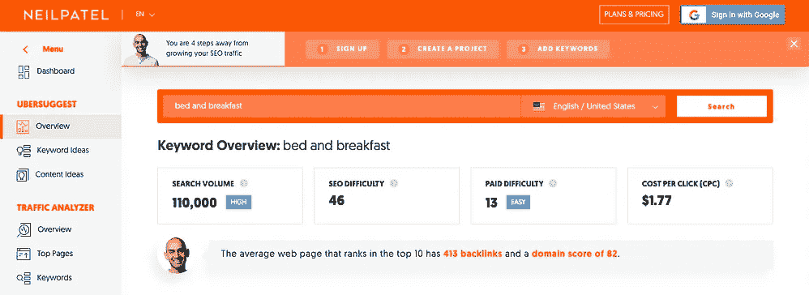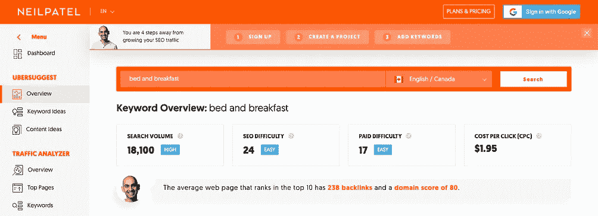

*来源:* [*尼尔·帕特尔的博客*](https://neilpatel.com/)

# 13.优化您的应用程序，以反映不同市场的文化差异

> 我们强烈建议您**不仅要本地化副本，还要本地化应用列表附带的视觉效果**。

这不仅适用于图片上的文字，也适用于宣传片中的音频。

考虑你的应用所在市场的特殊性，**他们的生活方式、价值观或信仰有显著差异吗**？对于 H & M 这样的品牌来说，这可能意味着在欧洲和中东发布不同的泳装快照。

# 14.投资于应用保留策略

谷歌 Play 商店中有两种类型的元数据。

第一种类型是**，称为“基于元数据的”(on-metadata)，**您可以控制和更改的列表内容，例如图像、标题或描述)。

第二个称为**‘非元数据’**，包括安装数量、用户评论或客户评级等信息。

作为应用程序的开发者，你不能修改这些信息。

当 Play Store 算法决定您的应用程序是否应该排名靠前时，它会考虑这两种类型的元数据。

> 如果你的用户评价很差或者你的安装率突然下降，这也会**对你的应用在搜索结果中的位置**产生负面影响。

只有一种方法可以让元数据之外的东西为你所用，确保你的应用对用户有用，他们会留下积极的评价，并且他们会定期返回。

# 15.先于竞争对手对谷歌 Play 商店算法的更新做出反应

我们强烈建议您使用**应用商店算法跟踪工具**，以确保您永远不会成为播放商店更新的受害者。

像这样的工具会提醒你，如果它注意到你的应用程序列表有任何不寻常或突然的关键字排名变化。

AppTweak 是一个免费工具的例子，你可以用它来达到这个目的。

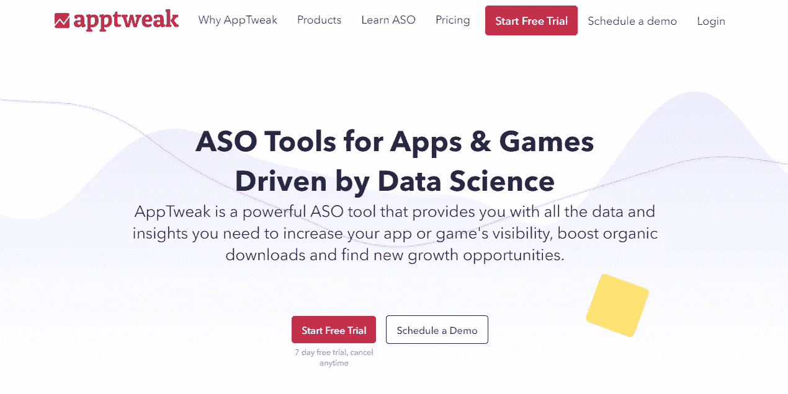

这样，您将能够快速检查它是否是由算法更新引起的。

如果是这样的话，你将能够及时调整你的应用商店内容——也许，甚至在你的竞争对手意识到任何算法变化发生之前。

# 16.使用谷歌安卓系统

> 不久前，谷歌推出了一项名为 [Android vitals](https://support.google.com/googleplay/android-developer/answer/7385505?hl=en) 的新功能，这是一套应用性能指标，可以告诉你你的应用性能是否准确。

就像本文前面提到的元数据之外的情况一样，来自 Android Vitals 的统计数据也可以显著影响你的应用在 Play Store 中的排名。

因此，要确保 Android 的重要功能是你的 ASO 战略不可或缺的一部分。

# 17.应用商店优化是一个正在进行的项目

跟踪任何算法变化或一般 ASO/SEO 指南非常重要，以确保您的**应用在 Google、**Play Store 和搜索结果中排名靠前。

请记住关注**你的应用列表中的所有类型的元数据，**既包括由你控制的元数据，也包括来自用户会话、评论或性能跟踪器的数据。

定期进行市场调查，通过检查你的竞争对手来调整你的策略。

> 最后，人们长期使用应用程序不是因为它们容易找到，而是因为它们带来的真正价值和它们唤起的情感。

感谢阅读！