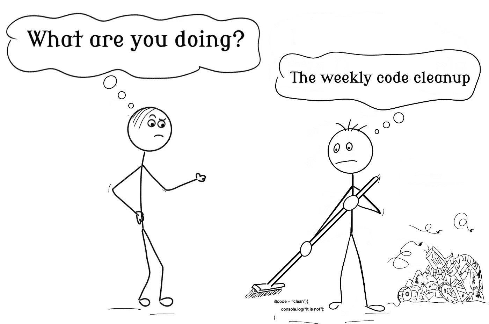

# 提高代码可读性的技巧

> 原文：<https://levelup.gitconnected.com/tips-to-improve-code-readability-fa16a9a9f8dc>

## 任何傻瓜都能写出计算机能理解的代码。优秀的程序员写出人类能理解的代码——马丁·福勒



米海三都

编程语言对人类来说是抽象的。不管你是用 C，Java，Python，还是汇编写代码。都是为了人类。如果人类能够像计算机一样快地理解和书写“0”和“1”的字符串，那么我们就不需要编程语言了。

但是我们不能(或者至少不容易)。所以我们开发了一种方法，在人类逻辑和直觉的帮助下利用所有的计算机能力。

作为程序员，我们应该努力使代码尽可能的可读。这就是为什么我们不断借用现实生活中的术语，比如工厂、堆栈、队列、读者等等。因为他们很熟悉。

作为一名程序员，我也是一名作家。诚然，与小说相比，读者是有限的，但我仍然是一名作家。

现在，代码阅读和故事阅读是不同的。读代码是出于需要，而读小说是出于放松。但如果我必须做一些事情，并不意味着它不能令人愉快。

因此，下面是我列出的编写适合人类的代码的技巧:

## 避免缩写

曾经有一段时间，存储空间是有限的。现在已经不是那个时候了，所以我不会在信上省钱。

我喜欢避免使用甚至是众所周知的缩写，因为它们大多与文化有关。就拿“数字”来说，在欧洲我们用“nr”当美国使用“不”的时候，为什么要让事情变得比它应该变得更难呢？我们现在都有代码自动完成功能，所以短变量名并不能提高我的效率。

这条规则也有一些例外，比如国际标准或一些在我工作的组织中很常见的缩写。但只有当它们被记录下来并为公司内部的每个人所知时。

在所有这些情况下，我更喜欢用我自己的判断。如果我发现自己想知道我是否应该使用一个特定的缩写，那么答案可能是否定的。

## 命名类时避免使用通用术语

如果没有表达意图，使用完整的词语没有任何好处。我经常看到以“管理器”、“助手”、“管弦乐队”等结尾的类名。现在，我明白了，它们很简单。但它们很模糊。

一个 *UserManager* 类可以做各种各样的事情。它可以管理寿命，密码，个人信息，篮子，与其他用户的关系，等等。

我试着用一句话概括全班的意图。如果我做不到，那么我将设法分解其中的方法/属性，并想出一个清晰的名称。

模糊的名称是无限滚动类文件的入口点。所以我不惜一切代价避开他们。

大多数时候，我们的问题是设计，而不是名字。以用户类为例。如果我们需要设置或编辑密码，我们可以简单地在类中添加类似“setPassword()”的方法。为什么要创建“经理”类？

与其他用户的关系、产品偏好等也是如此。如果你觉得这样的课程太大了，你是对的。我将创建 UserSecurity、UserRelations、UserProductPreference 类，并将它们作为属性添加到 User 类中。使用面向对象语言的全部功能。

提示:如果我想不出一个类的名字，我喜欢给它起一个奇怪的名字，比如 TheBonsayTree 或者 BananaMonkey。这个奇怪的名字阻止了我提交代码。这迫使我以后再回来。通常，那时我的潜意识已经为这个类想出了一个名字。如果没有，我使用橡皮鸭技术或者我请求同事帮助我找到一个合适的名字。

## 提取函数

[**神奇的数字 7**](https://en.wikipedia.org/wiki/The_Magical_Number_Seven,_Plus_or_Minus_Two) ，或者说我们可以同时跟踪多少件事情。根据这篇论文，普通人的大脑在短期记忆中的一个点上最多可以容纳 7 个项目(给或拿 2)。

这个数字指导我如何写我所有的方法。如果我必须在一个方法中定义 7 个以上的变量，我会考虑可能的提取，即使提取的方法只使用一次。

看看这个方法:

不难读，但不令人愉快。现在比较一下这个:

我想世界上每个程序员都能说出代码应该做什么。这很容易理解。

诚然，这个例子是琐碎的，但它证明了这一点。这个过程可以应用于每一段代码。将处理相同逻辑或导致单个操作(如 NotifyAccountCreated 方法)的行分组到一个块中，并提取它。

在创建方法时，我至少遵循两个原则:[单一责任](/the-single-responsibility-principle-made-simple-4e1597a44d7d)和 CQS(将在本文后面解释)。

## 避免否定(或让他们可见)

消极的表达是有代价的。它们很难理解和调试。每一个否定都使我的大脑理解代码的工作量加倍。

现在，有时候不管出于什么原因，我都无法避免否定。这样的话，我想让它尽可能的可见。

有一次，我不得不检查一个方法，检查文本中的黑名单和白名单关键字。我和另一个程序员太专注于尽可能高效的算法，而忘记了注意一个“如果”!在里面。

什么更明显？

```
if(!isOpen)
**or** 
if(isOpen == false)
```

我知道== false 写起来不好听，看起来很幼稚，但我从来没有因为错过阅读而为一个 bug 浪费时间。在我眼里，这个“！”变形为括号。

## 避免如果-否则地狱

没有人喜欢阅读多个 if-else 链接在一起。讽刺的是，没有人写它们。它们就像面包上的霉菌一样传播开来。

我认为问题始于我们如何编排代码。我们经常受到截止日期的压力，所以捷径太诱人了。

请看下面的片段:

即使是最初级的程序员也能遵循上述条件。但是，让我们将该功能扩展到美国以外的国家。比如日本。

事情开始变得复杂了。让我们再加入一个变量。在奥地利，16 英镑可以买到某种饮料(比如啤酒)，18 英镑可以买到烈性酒。

每一个新的 if-else 都是随着时间的推移而添加的。直到有一天，我们想知道是谁写了这样一个不可读/不可维护的代码。一切都是耦合和连接的，所以每一个新的变化都会带来许多可能的错误。

一切都从第一个 if-else 开始。这就奠定了基础。所以我不惜一切代价避免使用“else”。有很多方法:

*   if 和早期回报的组合->这可以应用到上面的例子中。
*   应用工厂设计模式或责任链(在应用它们之前查看上下文)
*   使用字典存储一个键和一个调用该键的函数(这里的[就是一个例子)](https://towardsdatascience.com/dictionary-as-an-alternative-to-if-else-76fe57a1e4af)
*   对于 C#来说，使用注释和枚举的组合

还有很多方法可以避免 if-else。谷歌上到处都是。只需寻找适合你情况的东西。

**不要过度。**我不只是开始应用设计模式或反射或其他复杂的东西。我总是看上下文。

如果它只是一个简单的函数，扩展的机会极小，我会尝试应用 If 和早期回报的组合。然后我看字典。这些永远是我的首选。

只有当这两个看起来不可收拾的时候，我才会去寻找更好的东西。记住，保持简单。

回到这个例子，只有当奥地利案例出现时，我才会开始考虑实现工厂模式。为什么？因为如果我从第一个需求开始实现这个奇特的设计，我很容易犯很多错误:

*   我不知道开始时的变量，所以我可能提取出错误的抽象。当实际需求到来时，这导致了代码重写
*   也许我在设计一些永远不会改变的东西。

不到需要的时候不要做。

## **设计模式在解决问题时很有用**

作为一名初级程序员，我渴望向有经验的程序员证明自己。我认为实现大量的设计模式会显示我的价值，但事实上，这证明了我缺乏经验。

我的代码运行得很好，但是我用 300 行代码做的事情用 50 行就可以完成。现在，我不是说设计模式不好。他们解决问题。但是，在某个时间和地点，它们必须得到应用。对于小工具和任务，大多数时候，它们只是过度工程化了。

我发现，在尽可能清晰地表达你的意图时，专注于降低代码圈复杂度比应用扭曲的设计更有助于代码维护。

## **遵循 CQS 原理**

告诉我这听起来是否熟悉:您正在调查一个 bug，并且您隔离了系统中对它负责的部分。开始调试过程，一步一步地遍历代码。然后，进入一个函数，看看那不是原因，继续前进，进入另一个函数，等等，直到找到原因。

如果我们能跳过所有那些不必要的“步入”，能节省多少时间？

CQS 原则(命令查询分离)很简单，它规定我们应该把所有的功能看作命令或查询。

*   命令功能是那些改变系统状态的功能
*   查询函数是检索一些数据的函数。要信任他们，你需要知道，你想怎么叫他们就怎么叫，他们不会改变体制内的任何东西。

如果你有兴趣了解更多的原理，请查看这篇[文章](/how-to-improve-your-code-readability-with-cqs-b54b43ca9fa5)。

**简单需要时间**

在每一个新方法之后，我写道我会休息一会儿，只是看看和思考。这让我能够处理每一件新事物，让我能够寻找更好的方法。如果我写得像要赢得打字比赛一样，命名、提取和设计模式就不能被应用。

这里介绍的技巧虽然琐碎简单，但要真正有效，需要大量的思考。就像史蒂夫·乔布斯曾经说过的那样，“*简单可能比复杂更难:你必须努力让你的思维变得清晰，才能变得简单。”*

慢慢来，节省时间。

# 分级编码

感谢您成为我们社区的一员！在你离开之前:

*   👏为故事鼓掌，跟着作者走👉
*   📰查看[升级编码](https://levelup.gitconnected.com/)中的更多内容
*   🔔关注我们:[Twitter](https://twitter.com/gitconnected)|[LinkedIn](https://www.linkedin.com/company/gitconnected)
*   🚀👉 [**软件工程师的顶级工作**](https://jobs.levelup.dev/)