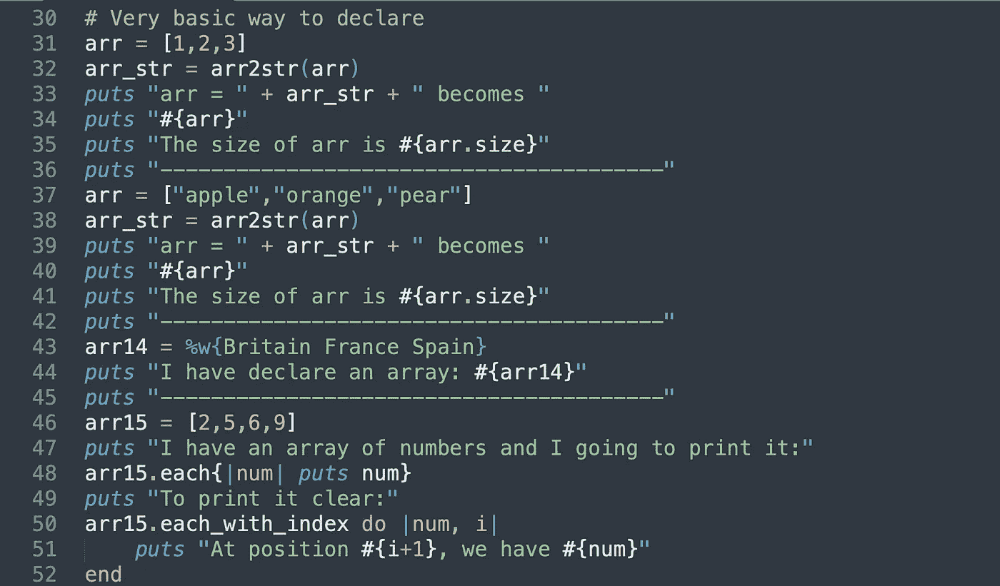

# 使用 Python 背景学习 Ruby 的技巧

> 原文：<https://levelup.gitconnected.com/tips-to-learn-ruby-with-a-python-background-2ca806a891ba>



我在循环上的示例 Ruby 脚本

在我开始在现在的公司工作后，我意识到我需要学习用 Ruby 编程。由于我从大学就开始使用 Python，学习一门新的编程语言对我来说并不太难。Ruby 的语法和风格与 Python 不同并不奇怪，但是如果你想学习 Ruby 并有 Python 背景来加速你的学习曲线，我想给你一些提示！

**理解字符串的双引号**
在 Ruby 中粘贴字符串中的变量非常简单，就像在字符串中粘贴“#{variable}”，类似于 Python 中的 f 字符串。例如，如果你有一个年龄= 10 的变量，我可以用下面的代码打印一个人的年龄。

然而，我第一次感到困惑，为什么它有时工作，但有时我得到一个错误。然后，我发现你“#{variable}”只对带双引号的字符串有效。作为一个新的 Ruby 程序员，我不知道使用单引号和双引号的字符串有什么区别。显然，您只能在双引号中粘贴“#{}”和转义序列，如果在单引号字符串中粘贴，任何一种语法都会抛出错误。

```
# To print a person's age
age = 10
puts “The person’s age is #{age}”
```

最佳实践是始终用单引号定义字符串，除非您需要粘贴“#{}”或转义序列。

**习惯 Ruby 语法——尤其是 Nil**当你用 Ruby 编码时，试着暂时忘记 Python 风格的语法吧！在第一个脚本中，当用 Ruby 编码时，我的脑袋总是在想如果变量是 None 的话，我会怎么想。Null 在很多编程语言中都有自己的关键字，它在 Ruby 中的语法是 *nil* ，use *。零？*证明变量是否为空/

**缩进替换为“end”**
缩进是 Python 的东西！Ruby 里没有这样的规则，你用关键字 **end** 来关闭一个函数。它类似于 Java 中使用的括号。除了周末后心不在焉，我忘记在函数后放关键字 **end** 的一个常见原因是有太多的函数需要我放一个 **end** 来关闭一个函数。我从编写 Java 中得到的一个好习惯是在一个封闭的括号后放一个注释来表示我正在关闭什么函数，我把这个好习惯带到 Ruby 来放一个 *end func* 或 *end if* 的注释。

```
def some_func(num1, num2)
    if num1 > num2
        then puts "#{num1} is greater than #{num2}"
    else
        puts 'num1 is a small number!'
    end # end if
end # end func
```

放一个注释来关闭一个函数对你调试有很大帮助！虽然缩进不是 Ruby 中的一个规则，但是您仍然应该尽最大努力让您的代码更具可读性。Python 这个东西不是必需的，但它绝对是一个好习惯，让你在调试脚本时更轻松。

**布尔不是数据类型**
一个惊人的事实是 True 和 False 在 Ruby 中是两种不同的数据类型！它的意思是 Boolean 在 Ruby 中不作为数据类型存在。True 本身是一种数据类型；false 本身是另一种数据类型。在 Ruby 中否定 true 或 false 与将变量从一种类型转换为另一种类型是一样的。

Ruby 中另一个与 true 或 false 相关的独特语法是 unless 语句，它是 if 语句的否定。如果你想证明某个条件是真还是假，这是很有帮助的。

```
# Let's pretend we want to print if num is not 0
unless num == 0
   then puts num
end # end unless
```

使用 unless 语句不像一个 Rubyist 新手那么直接，因为它涉及到你头脑中大量的“否定思维”，如果你一开始就感到困惑，不要难过！

说到 unless 语句，如果你想证明一个变量是否不为 null，你应该有一个习惯，用 unless 语句来证明，如下图:

```
# Python way
if var is not None:
    print('Variable is null')# Ruby way
unless var.nil?
    then puts 'Variable is null'
end # end unless
```

**Ruby 风格而非 Python 习惯**
虽然 Ruby 采用了 Python 风格的语法来迭代数组中的元素(some_array style 中的 *for i)，但是最好习惯 each()函数的 Ruby 风格。*

```
# some_array is an array with numbers
# This is the Python style
for i in some_array do
    puts i
end # end for
# It works but not very Rubyist# Try to write this instead
some_array.each{|i| puts i}
```

我试图避免在开始时使用 each 函数的原因之一是，我认为每个函数在每次迭代中只能执行一次操作，因为括号中没有空间来放置多个操作。直到几个月后，我才意识到只需稍微修改一下语法就可以进行多种操作！只需用“do”关键字替换括号，并用“end”结束每个函数。当你需要放一个 if 语句时，它特别有用:

```
# If you have multiple operations within each function
some_array.each do |i|
   if i>=0 
       then puts i
   else 
       puts "#{i}" is a negative number
   end # end if
end # end each
```

如果您采用 Ruby 风格的语法，作为 Ruby 专家，不仅您的代码更可信，而且它还能帮助您理解和习惯在其他功能中使用管道作为参数。您可能要做的另一个常见任务是用 CSV gem 将数据保存在 CSV 文件中，它使用管道接受参数来打开文件并将数据写入其中。

```
CSV.open(filename,"w") do |csv_file|
        some_array.each{|i| csv_file << i}
end # Close csv
```

了解什么是符号对于许多像我一样的新 Ruby 爱好者来说，符号是最大的困惑，尤其是当他们学习如何用 Ruby 编写一个类的时候。用 Ruby 编写一个类非常方便，因为你可以将属性评估器作为“getter”和“setter”函数的组合来获取或设置类对象的属性:

```
class person
	def initialize(age) # Constructor
		@age = age
	end

	# Setter + Getter function
	attr_accessor :age
end
```

但是，当冒号和 attribute 的语法出现时，我感到非常困惑，并错误地认为它是一种特殊类型的变量。原来 Ruby 中的一个符号是一个不可变的字符串，允许多次引用，而不需要额外的内存来提高效率。它既不是一个变量，也不是一个字符串，而是一个特殊的 Ruby 实例，在为 Ruby 初学者编写类时要记住使用它。

我的另一个符号用例是使用 Sequel，一个 Ruby gem 来查询关系数据库。当使用 Sequel 查询时，它需要符号中的列名才能执行。一个例子是，当我们有一个股票价格的表，我们希望苹果公司的股票价格按时间顺序排列:

```
# This is same as select * from fund_price where ticker='AAPL' order by pricedate
result = ds.select(:ticker, :pricedate, :price).order(:pricedate).where(ticker: 'AAPL').all
```

如果您有一个字符串形式的列名列表，请使用*。to_sym* 将字符串转换成符号。

**结论**
对于一个 Python 爱好者来说，学习 Ruby 是一件有趣的事情，如果你了解 Python 的话，学习 Ruby 并不需要太多时间。但是不要像在 some_array 中为 I 编码*那样用 Python 思维来编码 Ruby，试着用它的原生语法来编码 Ruby，就像使用 each 函数一样！*

[](https://www.linkedin.com/in/jacquessham/) [## Jacques Sham -数据工程师- GoodData | LinkedIn

### 查看雅克·沙姆在全球最大的职业社区 LinkedIn 上的个人资料。雅克有 5 个工作列在他们的…

www.linkedin.com](https://www.linkedin.com/in/jacquessham/)