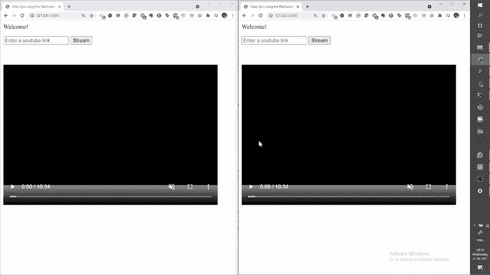
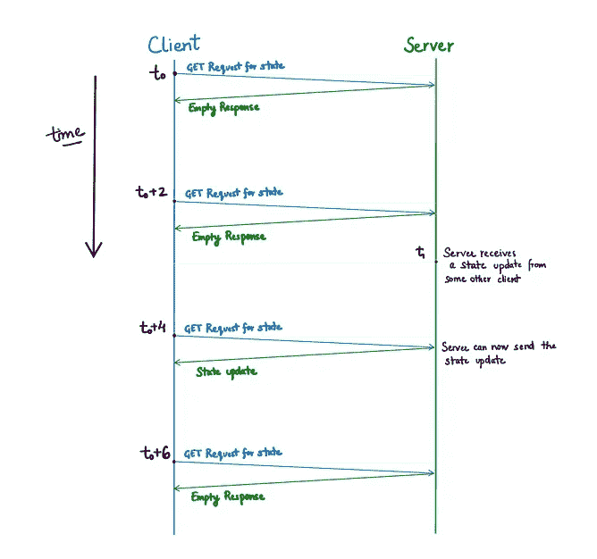

# 同步视频流

> 原文：<https://levelup.gitconnected.com/tired-of-making-to-do-list-applications-acce875fe617>

## 你的第一个 web 开发项目的新东西

演示:在 Chrome 中打开四个标签页的视频同步器。GIF 作者，视频来源:[大巴克兔](https://www.youtube.com/watch?v=aqz-KE-bpKQ&t=60s)

在本文中，我将讨论如何创建我的第一个同步视频流的 web 应用程序。像 [twoseven](https://twoseven.xyz/) 和 [Teleparty](https://www.netflixparty.com/) 这样的服务使用户能够在网飞等热门平台上观看电影和电视节目，同时与朋友保持同步。作为一名普通用户，我对它们是如何工作的非常着迷和好奇。我为 YouTube 视频流创建了自己的版本。我解释了我在不同算法、技术和技巧上的发现，我用这些算法、技术和技巧来实现多个远程用户的同步播放。我还回顾了我在寻找解决方案时遇到的令人讨厌的错误。(这是 Git 回购

演示:界面和功能。GIF 作者，视频来源:[大巴克兔](https://www.youtube.com/watch?v=aqz-KE-bpKQ&t=60s)

我有机器学习和竞技编程背景。当我开始这个项目时，我不知道 web 应用程序的后端和前端之间的区别。如果你和我一样是新手，我已经在[中加入了一些有用的视频和文章链接](#87ba)来帮助你入门。关于技术栈，我用 Vanilla JS 创建了前端，用 Python 创建了 Flask 后端。讨论的大部分内容与提到的技术堆栈无关。最好的跟进方式是花时间阅读不熟悉的概念；请自行搜索或浏览提供的链接。每一部分可能都与你无关，不按顺序阅读甚至跳过几部分也没关系。让我们直接跳进来吧！😃

1.  [概述](#9d7c)
2.  [通信](#4267)
3.  [状态管理](#5d58)
4.  [时钟同步](#37d9)
5.  [异步 JS](#00ec)
6.  [并行计算](#b10d)
7.  [我发现的有趣的 bug](#7e88)
8.  [免责声明](#f408)
9.  [进一步](#6c4a)
10.  [资源](#87ba)

# **概述**

每当用户改变状态时——播放、暂停或搜索视频，我们都希望每个人都能实时看到准确的变化。为此，我们需要有人在用户中协调这些更新。服务器负责这种状态管理和协调。每当用户进行任何更改时，更新后的状态都会被发送到服务器，服务器会将这个新状态传播到其余的客户端，使每个人都保持同步。

# 沟通

只要用户(您)通过简单的 HTTP POST 请求做出任何更改，客户机(浏览器)就可以通知服务器。然而，服务器如何将更新后的状态传播给其他用户并不简单。 [HTTP](https://developer.mozilla.org/en-US/docs/Web/HTTP/Overview) 是一种请求-响应协议，意思是请求由客户端发起，由服务器响应。服务器不能随心所欲地向客户机发送信息。那么我们如何解决这个问题呢？

**短轮询**

规避这一限制的一种方法是短轮询。这个想法是，客户端将在固定的时间间隔重复向服务器发出请求。因此，举例来说，在我们的应用程序中，客户端可以每两秒钟询问服务器是否有其他人进行了更改。

对于我们的用例来说，这种方法有两个主要问题—

1.  在最糟糕的情况下，一个更改会晚两秒钟到达另一个用户，破坏用户的浏览体验。
2.  看起来我们可以任意缩短这个时间段，以便更快地在网络中传播变化，但是我们增加轮询频率是有限度的。频率越高，消耗的网络和计算资源越多。即使状态没有改变，所有的客户机仍然向服务器发出不必要的、浪费的请求，这是不希望的。

演示:延迟与轮询同步(轮询时间为 5s)。GIF 作者，视频来源:[大巴克兔](https://www.youtube.com/watch?v=aqz-KE-bpKQ&t=60s)

演示:中间状态因轮询而丢失(轮询时间段为 5s)。GIF 作者，视频来源:[大巴克兔](https://www.youtube.com/watch?v=aqz-KE-bpKQ&t=60s)

在上面的两个演示中，您可以看到由于轮询而产生的延迟。在第一种情况下，到达另一个客户端的状态更新会有明显的延迟。在第二个演示中，由于客户端每 5 秒轮询一次，因此它将只获得最新的状态，而不知道中间是否发生了多次更改(这不是一个缺点，只是一个观察)。

[**长轮询**](https://en.wikipedia.org/wiki/Push_technology#Long_polling)

只有当请求的资源已经从上次发送的版本更新时，服务器才响应客户端请求。它保持请求开放，并在发生更改时立即响应。这样，客户端可能要等待服务器很长时间，因此得名。客户端一收到响应，通常会立即创建另一个请求，通过这种方式，长轮询会模拟一个[服务器推送](https://en.wikipedia.org/wiki/Push_technology)。

[**WebSocket**](https://en.wikipedia.org/wiki/WebSocket)

来自官方 IETF(互联网工程任务组)RFC(征求意见稿)， [RFC 6455](https://datatracker.ietf.org/doc/html/rfc6455) ，

> WebSocket 协议旨在取代使用 HTTP 作为传输层的现有双向通信技术，以受益于现有的基础设施(代理、过滤、身份验证)。这样的技术被实现为效率和可靠性之间的折衷，因为 HTTP 最初并不打算用于双向通信。

这个协议让客户机-服务器建立一个全双工通道，这意味着一旦连接建立，任何一方都可以随时发送消息。服务器不需要来自客户端的打开请求来发送信息，这与长轮询的情况不同。

演示:WebSockets 的实时变化。GIF 作者，视频来源:[大巴克兔](https://www.youtube.com/watch?v=aqz-KE-bpKQ&t=60s)

[**SSE(服务器发送的事件)**](https://en.wikipedia.org/wiki/Server-sent_events)

来自维基百科，

> 服务器发送事件是一种服务器推送技术，使客户端能够通过 HTTP 连接从服务器接收自动更新，并描述一旦建立了初始客户端连接，**服务器如何能够** **向客户端发起**数据传输。

对 SSE 的支持内置在最新的 HTTP 版本中，并且比使用 WebSockets(一种单独的专用协议)简单得多。一个问题是服务器不能使用 SSE 向客户机发送二进制数据。另外，注意 SSE 只是从服务器到客户端。客户端仍然以同样的方式发出请求，使用普通 HTTP。

**对比**

说明:短轮询、长轮询和 WebSockets 如何在相同的情况下工作。作者提供的图片

在选择要使用的协议时，需要考虑许多错综复杂的实际问题，例如最大连接数、可扩展性等。因为这不是本文的目的，所以我没有讨论这些。如果你感兴趣的话，我链接了一些栈溢出的答案和博客帖子。我最终使用了 WebSocket 协议，因为我发现它最容易用于实时同步(使用[套接字)。客户端的 IO 库](https://socket.io/)和服务器端的[烧瓶插槽](https://flask-socketio.readthedocs.io/en/latest/)。

# 状态管理

现在，假设所有机器的时钟都是同步的(稍后会有更多[)。我们需要存储两件显而易见的事情:当前的视频时间戳和视频是否正在播放。需要存储的两个不太明显的东西是最后一次更改的全局时间戳和记录视频时间戳的全局时间戳。这两者分别对于处理无序数据包和解决网络延迟都是必不可少的。](#37d9)

对于这里讨论的所有例子，假设客户机 1 和客户机 2 在全局时间戳 t_0 之前已经同步。在 t_0，用户 1 暂停视频(可能是任何变化)，不久之后，在 t_1，用户 2 寻找视频。由于 user2 的更改发生的时间较晚，所以这应该是最终状态，但是这些消息可能会因为几个原因而无序地到达服务器。如您所见，如果我们不记录在用户端实际发生更改的时间，服务器不会忽略过时的更新。

插图 1:无序消息。作者图片

只要记录了视频的当前时间戳，就必须记录全球时间。例如，考虑用户从最初同步的暂停状态播放视频的情况。由于网络延迟，该消息将在一些延迟之后到达其他用户，并且他们将总是在做出改变的人的后面。如下图所示。请注意，如果从运行状态更改为暂停状态，将不会有任何问题。

插图 2:需要记录全局时间戳和相对视频时间戳。作者图片

演示:不记录全球时间时网络延迟的影响(在服务器端引入了 500 毫秒的人为延迟)。GIF 作者，视频来源:[大巴克兔](https://www.youtube.com/watch?v=aqz-KE-bpKQ&t=60s)

上述问题导致客户端不同步。这与我们在投票的例子中看到的不同。如果轮询是用全局时间戳完成的，那么同步将被延迟，但是当它开始时，它将是正确的。

# 🕑时钟同步🕔

我花了很长时间才发现这个错误。在所有的状态管理讨论中，我们假设网络上的每个系统都可以访问对每个人都相同的全局时间。实际上，任何编程语言中的所有时间库都使用系统时间来计算全局时间。这个时间是由计算机系统中的实际硬件计时器来维护的。当然，两台机器上的时间不同步有很多原因——时钟可能在很长一段时间里偏离了几秒钟，或者有人故意更改了它。关键是我们需要在开始前同步所有的时钟；否则，我们根本不能指望视频同步器工作。

由于每个客户端都与服务器对话，因此似乎每个人同步时间的最佳方式是在建立连接后独立地与服务器同步他们的全球时间。

现在，你可能已经意识到还有另一个根本问题。为了与服务器同步，首先，你要询问它的全球时间。然后，一旦您得到响应，您将把它与您当前的全球时间进行比较，并查看差异，随后您将使用差异来校正您的时间估计。问题是，从服务器测量时间到您实际收到时间并测量您的时间，已经过去了一段时间。这种网络滞后会一直存在。因此，我们永远不可能有完美的同步，除非你把你的机器放在服务器旁边，并设置好两个时间(或者使用其他一些预同步时钟进行协调)。那么我们能做的最好的是什么？

插图 3 —时钟同步。作者图片

算法说明，[点击此处](https://drive.google.com/file/d/1jIkYK5FDB5TN1VXIDIGJ94w1VxvVfAKV/view?usp=sharing)查看更高分辨率。图片作者。

这种寻找时间校正的方法是受这里描述的时钟同步算法的启发。在不同的机器上用服务器和客户机测试我的方法时，我发现修正估计值相差不到 100 毫秒。当我在同一台机器上运行服务器和客户机时，真正的修正应该是 0，因为它们使用相同的时钟。在这种情况下，我的估计是大约 2 毫秒。

# 异步 JavaScript

在我的整个大学生活中，我都在使用同步代码，我的第一个主要概念错误是将我的 JS 代码视为同步的。即使在看了关于回调和承诺的视频后，我也只是复制了用于 HTTP 请求的“fetch”和“dot then”语法，而没有完全理解承诺在 JS 中的真正含义。我发现 [MDN 文档](https://developer.mozilla.org/en-US/docs/Learn/JavaScript/Asynchronous)非常有助于消除我的大部分误解和疑虑。

当我们用 JS 中的“fetch”发出 HTTP 请求时，它会立即返回一个承诺。我们不需要等回应回来；我们可以继续我们自己的处理。通过指定回调函数，我们可以告诉它在结果返回时做什么。相反，如果 fetch 调用被阻塞，除了浪费宝贵的时间等待调用返回之外，web 界面还会冻结，不能注册用户点击，等等。注意，承诺和异步的概念并不局限于网络调用。我强烈建议在继续本节之前，先看一下 [Philip Robert 对 JS](https://www.youtube.com/watch?v=8aGhZQkoFbQ&ab_channel=JSConf) 中事件循环的水晶般清晰的解释(看完视频后你应该能回答下面的问题)。

试着猜测一下 [JS 片段](https://gist.github.com/jayantjain100/3af75eb44554760dc678b177ca4f13fc)的输出。

代码片段的输出。图片作者。

# **并行计算**

类似于 JS 需要异步，服务器不能只运行一个进程或线程。如果是这样的话，那么它一次只能处理一个客户端的请求，其他的请求将会排队等待，或者更糟，被拒绝。

目前，我在 python 脚本中使用全局变量进行状态管理。然而，这不是线程安全的，因为我可能有两个线程同时覆盖状态，导致意外的行为。此外，如果运行多个进程，每个进程都有自己的状态变量副本。理想的解决方案是使用一些数据库管理软件，它将为我们处理所有这些，但这似乎有点大材小用，因为我有一个非常小的状态，它不特定于任何用户。一个简单的解决方案是将状态写入文件，并在写入该文件时使用锁定机制。我相信这可以在多线程/进程中正常工作，尽管这可能不是最有效的方式。到目前为止，我只使用了 Flask 提供的内置开发服务器，它用单线程运行一个进程。这就是为什么这个重大问题没有回来咬我。我计划在这个项目的[下一个版本中修复这个问题，如果有的话。](#6c4a)

请注意，默认情况下，内置的开发服务器在参数“host”设置为“127.0.0.1”的情况下运行，这意味着只有您能够访问该应用程序。来自[烧瓶的文件](https://flask.palletsprojects.com/en/1.1.x/quickstart/)

> 如果您运行服务器，您会注意到服务器只能从您自己的计算机访问，而不能从网络中的任何其他计算机访问。这是默认设置，因为在调试模式下，应用程序的用户可以在您的计算机上执行任意 Python 代码。

因此，如果您禁用了调试器，或者信任网络上的用户，则可以通过将“host”参数设置为“0.0.0.0”来使服务器公开可用。

# 我发现了有趣的虫子🐛

我将讨论一个具体的实现(也许？)的问题，直到最后我也无法妥善解决。我使用 HTML5 视频播放器来显示视频，并让用户播放/暂停/搜索视频。这个元素有对应于这些用户动作的[事件](https://developer.mozilla.org/en-US/docs/Web/HTML/Element/video#events)，我为每个事件编写了一个事件处理程序(每当事件触发时调用的函数)。每当用户进行更改时，相应的事件处理程序就会被触发，并通知服务器有关更改的信息，通知其他所有连接的人。听起来不错，对吧？问题是我找不到任何可靠的方法来区分用户引起的事件和脚本引起的事件。这意味着每当客户端从服务器接收到状态更新时，它将在本地进行更改，这将触发事件处理程序，事件处理程序将再次通知服务器这些更改，从而导致无限循环。除此之外，当你试图寻找一个已经播放的视频时，它会引发 3 个事件；首先，它暂停，然后寻找，然后播放，导致 3 个请求发送到服务器，而我们只需要发送最后一个。我想到的解决办法是，一旦服务器收到请求，它会在一段时间内(比如 1 秒)忽略来自所有其他客户端的请求。期望是，在这个时间框架内，新的状态将到达每个人；每个客户端将实现这些更改，并尝试将其新状态发送回服务器，但服务器会忽略这些更改，从而结束冗余传播。这不是一个完美的解决方案。这里的一个主要问题是，如果某个实际的用户在这段时间内进行了真正的更改，那也会被忽略。

另一种解决方案是创建自己的播放/暂停/搜索控件。这将使您能够更好地控制何时触发视频播放器事件，以及何时调用服务器的状态更新。在当前的方法中，这两者纠缠在一起，导致了几个问题。如果您要创建自己的控件，另一件有趣的事情可能会发生。目前，如果您在自己的终端播放视频，并且此状态更新消息在 0.5 秒后到达您朋友的系统，那么他们的视频将从比暂停时间晚 0.5 秒的时间戳开始播放(最初同步)。这种时间上的跳跃确保了同步，但也让他们错过了视频的一小部分。对于这个问题，我的朋友提出了一个有趣的解决方案。当用户点击播放按钮，而不是立即播放他们的视频，消息将发送到服务器，并为每个人决定一个全球时间开始播放。这个全球时间会延迟足够长的时间，让每个人都能接收到服务器的消息，并做好准备，但希望足够短，不会打扰到实际播放视频的用户😅。

# 放弃

所以…这个项目使用了 python 库 [Pafy](https://pypi.org/project/pafy/) ，它在后台使用 [youtube-dl](https://github.com/ytdl-org/youtube-dl) 库将 youtube URL 转换为直接的流链接。使用该应用程序传输媒体可能违反 Youtube 的服务条款，使用这个库或我的网络应用程序从 youtube 下载受版权保护的内容绝对是非法的❌.这个项目是为了学习📚，如果没有人滥用它，我会非常感激。谢谢！

# **进一步**

我将提到我对这个项目下一个版本的一些想法。截至目前，当用户的视频开始缓冲时，web 应用程序不会处理这种情况。应该为每个人暂停视频，还是应该让视频被缓冲的用户跳到其他人所在的位置？在状态更新之后，来自其他用户的更改会在短时间内被忽略，这可以通过[实现我自己的控件](#3c2f)来避免。可以添加对上传个人视频的支持。可以添加独立房间的功能，以便不同的人群可以同时使用该服务，而不会相互干扰。与 twoseven 类似，可以添加一个聊天框和连接每个用户的网络摄像头视频的功能。通过类似于 Teleparty 的 chrome 插件来实现这种同步功能，而不是有一个单独的应用程序，这将是一种探索。接下来的步骤肯定包括将 web 应用程序部署到像 AWS 这样的云平台，并从开发服务器转移到生产服务器。我们将不得不使用合适的数据库管理系统来使我们的状态管理在保持效率的同时是线程安全和进程安全的。此外，我想研究并写一篇文章，介绍 Teleparty 和 twoseven 是如何工作的，以及可能实现相同功能的其他技术。

# **资源**

1.  [网络如何工作——MDN](https://developer.mozilla.org/en-US/docs/Learn/Getting_started_with_the_web/How_the_Web_works)
2.  [前端和后端解释](https://www.youtube.com/watch?v=eCUeoPp-5do)
3.  [Javascript 介绍— MDN](https://developer.mozilla.org/en-US/docs/Learn/Getting_started_with_the_web/JavaScript_basics) (也可参见 HTML 和 CSS 介绍)
4.  [使用 Flask 在 Python 中构建 Web 应用程序— Youtube 播放列表](https://www.youtube.com/playlist?list=PLzMcBGfZo4-n4vJJybUVV3Un_NFS5EOgX)
5.  [短轮询 vs 长轮询 vs WebSockets 概述—堆栈溢出](https://stackoverflow.com/a/28197906)
6.  [深度 WebSockets vs 长时间投票——博文](https://ably.com/blog/websockets-vs-long-polling)
7.  [什么是服务器发送的事件—会议对话](https://www.youtube.com/watch?v=71hId_-Iwqc)
8.  [JS](https://www.youtube.com/watch?v=8aGhZQkoFbQ&ab_channel=JSConf)中事件循环的清晰解释
9.  [“放大镜”工具，用于观察调用堆栈](http://latentflip.com/loupe/?code=JC5vbignYnV0dG9uJywgJ2NsaWNrJywgZnVuY3Rpb24gb25DbGljaygpIHsKICAgIHNldFRpbWVvdXQoZnVuY3Rpb24gdGltZXIoKSB7CiAgICAgICAgY29uc29sZS5sb2coJ1lvdSBjbGlja2VkIHRoZSBidXR0b24hJyk7ICAgIAogICAgfSwgMjAwMCk7Cn0pOwoKY29uc29sZS5sb2coIkhpISIpOwoKc2V0VGltZW91dChmdW5jdGlvbiB0aW1lb3V0KCkgewogICAgY29uc29sZS5sb2coIkNsaWNrIHRoZSBidXR0b24hIik7Cn0sIDUwMDApOwoKY29uc29sZS5sb2coIldlbGNvbWUgdG8gbG91cGUuIik7!!!PGJ1dHRvbj5DbGljayBtZSE8L2J1dHRvbj4%3D)
10.  [为什么全局变量在 Flask 中不是线程安全的](https://stackoverflow.com/a/32825482)
11.  [HTML5 视频播放器事件](https://developer.mozilla.org/en-US/docs/Web/HTML/Element/video#events)
12.  [**GitHub 资源库**](https://github.com/jayantjain100/video-synchronisation)