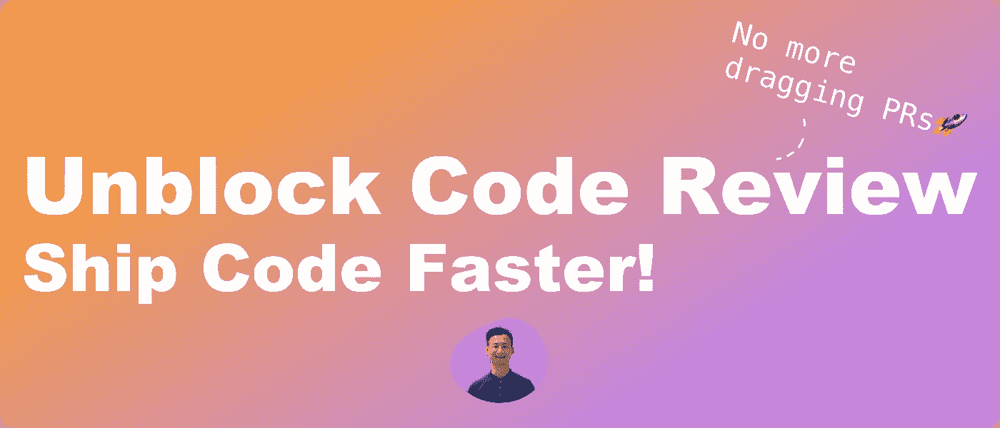
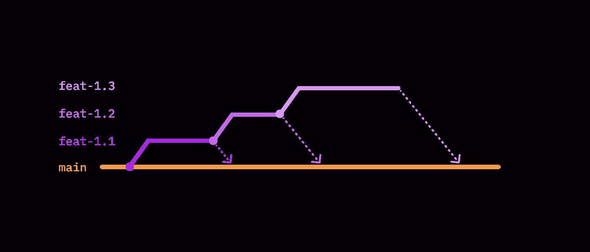

# 厌倦了缓慢的代码审查？读读这个

> 原文：<https://levelup.gitconnected.com/tired-of-slow-code-reviews-read-this-1a26b3e4539a>

## 一个前技术领导者的指南，创建一个健康的代码评审文化，帮助你更快地交付你的代码。



# TL；速度三角形定位法(dead reckoning)

*   🏎了解如何加速代码审查过程，以最大化您的生产力
*   🔬了解我遇到的代码审查者的最佳实践
*   ✏️学习我遇到的拉式请求作者的最佳实践

想象一下。

您刚刚实现了一个特性，并编写了所有的测试用例。你对代码感觉很好，所以你打开了一个拉取请求，并让你的同事知道。几天过去了，你的拉请求看起来和以前一模一样。貌似没动过。无可奉告。没有更改请求。您再次要求您的同事进行代码审查，他们同意了。又一周过去了，什么也没发生。你再次询问，他们告诉你，他们需要更多的时间，因为这不是一个小的公关，有很多要考虑的。

最后，你看到了一个关于变更请求的通知，你马上就去做了。在解决了合并冲突并修复了边缘案例之后，您请求再次进行审查，并等待。几天后出现了另一个变更请求，您再次重复这个过程。经过一次又一次的修改，你得到了批准，PR 最终被合并到主干中。

在你打开采购申请的 4 周后。

如果你能感同身受，你并不孤单。许多团队都经历过如此缓慢的代码审查过程。事实上，这是开发周期中的主要障碍之一。所以我想和你分享我学到的代码审查的最佳实践，以加快开发速度，帮助你更快地交付代码。

我们走吧。

# 对于拉取请求作者

我学到的提高代码评审效率的第一件事是作为一个作者要有思想。除了生成干净的代码，你还可以做很多小事来帮助你的评审者主动理解你的拉请求。

## 当司机

你，作者，是速度的驱动者。知道你在代码审查过程中依赖于你的同事，你可以清楚地传达**什么时候**和**什么时候**来符合期望。

**when** 是最重要的沟通方式，因为它告诉你的评审有多紧急。评审者可以相应地计划他们的工作。这是为评估过程设定时间表的好方法，也是尊重同事时间的好方法。

为了传达**什么**，确保你包括一个 PR 描述，该描述着重于帮助你的评审者理解你的改变的目的和代码设计。不要罗列功能，而是以一个开篇段落来解释背景和为什么需要这个 PR 来帮助评论者建立他们的[心智模型](https://jamesclear.com/mental-models)。我发现其他非常有用的描述是:

*   **代码设计图**:你的高层代码结构的[截图帮助评审人员](https://github.com/getappmap/vscode-appland)[评审整体设计](https://github.com/google/eng-practices/blob/master/review/reviewer/looking-for.md#design)并对你的拉取请求做出快速反应。
*   **接受标准**:一系列简单的句子，如[“提交表单后，会向用户发送一封确认电子邮件。”](https://www.boost.co.nz/blog/2010/09/acceptance-criteria)帮助评审寻找缺失的功能和测试用例。

## 保持简洁

小型的、激光聚焦的拉式请求是最容易阅读的。有多小？谷歌工程实践说[“做不到足够小”](https://github.com/google/eng-practices/blob/master/review/developer/small-cls.md)。[一项研究](https://smartbear.com/learn/code-review/best-practices-for-peer-code-review/)表明，随着代码变更的增加，代码审查质量会下降。你的评审员一次评审的时间越长，他们发现的缺陷就越少。所以重要的是保持你的拉取请求小，并专注于一件事。如果您正在开发的特性太大，您可以考虑使用[“堆叠拉请求”](https://www.michaelagreiler.com/stacked-pull-requests/)技术将它分成多个拉请求。



堆叠拉取请求可视化

它用一系列小的拉请求代替了一个大的拉请求。这有助于评审人员在同一时间专注于一件事情，并且与[持续集成和持续交付](http://localhost:3000/articles/ex-principal-engineers-guide-to-design-thinking-and-continous-delivery#what-is-continuous-deliver)的原则非常一致。

# 对于代码审查者

## 小心偏见

谷歌在 2022 年发表的一项研究发现，拉请求的作者面临不同程度的抵制，这取决于作者的人口统计数据。根据资料显示，他们[发现](https://cacm.acm.org/magazines/2022/3/258909-the-pushback-effects-of-race-ethnicity-gender-and-age-in-code-review/fulltext)那

> -女性遭遇拒绝的几率比男性高 21%
> 
> -黑人+开发人员比白人+开发人员面临的几率高 54%
> 
> - Latinx+开发人员比 White+开发人员面临高 15%的可能性
> 
> -亚裔+开发人员比白人+开发人员面临高出 42%的可能性
> 
> -年长的开发人员比年轻的开发人员面临更大的阻力

我们应该更加注意无意的偏见，尤其是在多元化的工作场所。意识到这一点，我们可以避免代码审查中不必要的推诿，并有助于加速过程。

# 这是学习的好地方，不是势利的地方

不管你的经验水平如何，作为一名开发人员需要不断学习。拉式请求是开发者交流和交换反馈的一个无价的“市场”。因此，确保这是一个尊重的地方，并始终以知识共享为目标。

对我来说，这一直是一个学习领域知识的好机会。就拿我在 [Airbnb JavaScript 风格指南](https://github.com/airbnb/javascript/pull/2535)的 PR 来说，我从一个 [Ecma TC39](https://github.com/tc39) 成员那里学到了很多关于 [ECMAScript 语言规范](https://tc39.es/ecma262)的知识。如果他拒绝了我的请求[而没有建设性的反馈](https://www.reddit.com/r/cscareerquestions/comments/9hakaz/getting_ripped_apart_in_code_reviews_is_this/)，教学的时刻就不会存在。

# 无所作为是不好的

一年前，我在 Instagram 上读到一篇名为[“激进的代码审查”](https://blog.devgenius.io/aggressive-code-review-e5f8869f3967)的博客文章。他声称有效的代码审查包括

*   尽快采取果断行动
*   旨在降低错误的成本
*   要求拉动要求小，移动速度快

我发现在他的方法中令人耳目一新的是**对拉请求不采取行动不是一个选项**。它最大限度地缩短了审查的准备时间，对我和我的团队非常有益。我们之所以能够快速交付，是因为我们对代码审查采取了积极的行动。我们不会让未决的拉取请求停留不动，而是在考虑业务案例的情况下进行审查。

# 最后的想法

回顾拉式请求和代码审查的最佳实践，以加速您的开发周期

*   建立清晰的沟通关于**什么时候**和**什么时候**的拉动请求
*   创建专注于一件事小型独立的拉式请求
*   小心偏见
*   尊重作者和其他评论者
*   尽快采取决定性的审查行动

# 参考

*   种族、民族、性别和年龄在代码审查中的反作用
*   [利用研究使代码审查更加公平](https://developers.googleblog.com/2022/06/Using-research-to-make-code-review-more-equitable.html) — Emerson Murphy-Hill，研究科学家，中央产品包容性、公平性和可访问性
*   [代码评审的最佳实践](https://smartbear.com/learn/code-review/best-practices-for-peer-code-review/) — SMARTBEAR
*   [小 CLs](https://github.com/google/eng-practices/blob/master/review/developer/small-cls.md) —谷歌
*   [堆叠拉取请求:让代码审查更快、更容易、更有效](https://www.michaelagreiler.com/stacked-pull-requests/)——米凯拉·格雷勒博士
*   [代码审查成为一个阻碍者](https://www.reddit.com/r/ExperiencedDevs/comments/oo4ds0/code_reviews_becoming_a_blocker/) — Reddit
*   [代码评审瓶颈](https://www.reddit.com/r/agile/comments/e6gffn/code_review_bottleneck/) — Reddit
*   [时间拳击](https://en.wikipedia.org/wiki/Timeboxing) —维基百科
*   心智模式:学习如何更好地思考，获得心智优势
*   [vs code 的应用扩展](https://github.com/getappmap/vscode-appland) — GitHub
*   在代码评审中要寻找什么
*   https://www.boost.co.nz/blog/2010/09/acceptance-criteria——内森·唐纳森
*   [前首席工程师设计思维与持续交付指南](http://localhost:3000/articles/ex-principal-engineers-guide-to-design-thinking-and-continous-delivery#what-is-continuous-deliver) —刘道智
*   [添加类私有标识符](https://github.com/airbnb/javascript/pull/2535) — GitHub
*   [ECMAScript 2023 语言规范](https://tc39.es/ecma262) — Ecma 国际
*   [Ecma TC39](https://github.com/tc39) — GitHub
*   [在代码评审中被撕裂，这正常吗？](https://www.reddit.com/r/cscareerquestions/comments/9hakaz/getting_ripped_apart_in_code_reviews_is_this/) — Reddit
*   [激进的代码审查](https://blog.devgenius.io/aggressive-code-review-e5f8869f3967) —毕博
*   [现代代码审查:谷歌案例研究](https://storage.googleapis.com/pub-tools-public-publication-data/pdf/80735342aebcbfc8af4878373f842c25323cb985.pdf)——凯特琳·萨多夫斯基，艾玛·索德伯格，卢克·丘奇，迈克尔·西普科。谷歌公司。

```
Want to Connect? This article was originally posted on [Daw-Chih’s website](https://dawchihliou.github.io/articles/tired-of-slow-code-reviews).
```