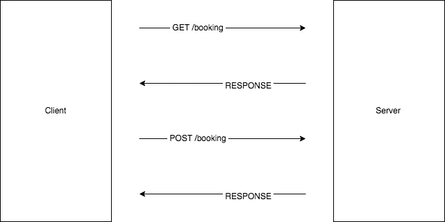
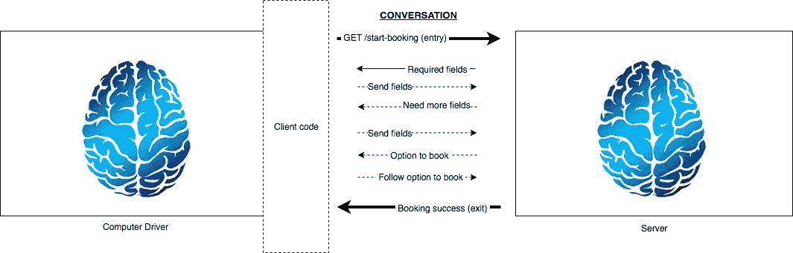
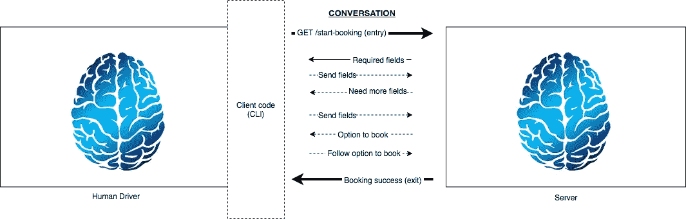

# 要创建一个可进化的 API，不要再考虑 URL 了

> 原文：<https://levelup.gitconnected.com/to-create-an-evolvable-api-stop-thinking-about-urls-2ad8b4cc208e>

## API 设计的基础

一只雄性[孔雀](https://en.wikipedia.org/wiki/Peafowl)站在草地上的照片。那只鸟正在扇动尾巴，展示所有的羽毛。羽毛巨大，有眼点。[根据 Charles Darwin](https://en.wikipedia.org/wiki/Peafowl#Evolution_and_sexual_selection) 的说法，孔雀发展出这种设置来吸引雌性。

一个可进化的 API 是一个不用[推测或过度工程](https://hackernoon.com/how-to-accept-over-engineering-for-what-it-really-is-6fca9a919263)就能以最少的努力改变的 API。这是一种以**对话**的形式模拟两台计算机之间通信的方式。大多数 API 可以利用可进化性的力量。然而，由于没有[银弹](https://medium.com/@fagnerbrack/how-to-reject-the-belief-on-the-silver-bullet-1d86b686acbb)，一个简单的[远程过程调用](https://en.wikipedia.org/wiki/Remote_procedure_call)可能就足够了。

这篇文章描述了可进化 API 的基础。它展示了如何在客户端和服务器之间建立会话模型，以使用网络请求的有效负载来维护会话的状态。它还讨论了统一接口对于分离客户机和服务器以及允许独立的系统发展是多么重要。

想象一下一个诊所的网站，患者可以在那里预约医生。你需要开发一个 API，让第三方开发者可以和这个诊所的预约系统集成。API 应该能够随着新业务需求的出现而改变。

对于这篇文章，让我们忽略认证，只关注业务需求。

如今，一个常见的解决方案是创建一个端点，在一个`/booking`端点中接受 HTTP `POST`请求。该请求有两个参数，分别表示患者用户名和预期的医生。此外，还需要另外两个参数来表示他们想要预订的时间和预订的内容。

下面是上午 10:20 预约请求的代码:

[伪代码](https://gist.github.com/FagnerMartinsBrack/5cce211a3a21a83e1dc848c910b8cc78)显示了使用 JavaScript“fetch”API 的 HTTP 请求，该请求使用方法“post”指向 URL“clinic . example . com/booking”请求正文包含字段“用户名”为“mary.doe”，字段“日期时间”为“2018 年 5 月 1 日上午 10:20”，格式为[ISO8601](https://en.wikipedia.org/wiki/ISO_8601)，字段“预定医生”为“jane”，字段“预约”为“咨询简医生”

一周后，商业规则改变了。现在医生“简”只工作 15 分钟而不是 30 分钟，工作日从上午 10 点开始。上午 10:20 的时间现在无效。

处理这种变化的一个常见解决方案是向端点引入新版本。如果客户试图预订一个无效的日期，新版本会用一个验证状态代码`422 Unprocessable Entity`来响应，而不会中断使用旧版本的客户。

另一种方法是创建一个`GET /booking`端点。响应返回医生 Jane 可用的时间段，以便客户可以分析并选择他们喜欢的时间段。

下面是第二种方法的客户端代码:

[伪代码](https://gist.github.com/FagnerMartinsBrack/99888db9392ae5945f0724ff82ee90af)显示了使用 JavaScript“fetch”API 通过“get”方法对 URL“clinic . example . com/booking”的 HTTP 请求。查询字符串的参数“预期医生”为“jane”该代码从响应中提取“本周可用时隙列表”。在下一条语句中，有与上一个示例相同的“post”HTTP 请求，只是现在“date time”字段是函数调用的结果。该功能的名称是“选择可用时间”该函数以 [ISO8601 格式](https://en.wikipedia.org/wiki/ISO_8601)接收“2018 年 5 月 1 日上午 10:20”的“日期时间”作为第一个参数，并以可用时间段列表作为最后一个参数。

左侧显示客户端，右侧显示服务器的图表。客户端向“/booking”端点发出 GET 请求，查看响应，然后同步向同一个端点发出 POST 请求。

这个例子展示了人们在 API 上犯的一些关键错误:

*   客户端代码拥有 URL 和方法。服务器无法控制客户端发出下一个请求的位置。因此，服务器不能更改它们的 URL 或方法，因为这些更改可能会破坏其他人。
*   服务器中的业务逻辑变化很可能会导致客户端发生重大变化。这迫使服务器创建一个严格的响应体，并实现 URL 版本控制以保持向后兼容。
*   客户端需要准确地找出服务器在每个端点上接受哪些参数。他们需要通过网站“开发者”部分的 Swagger 文档或代码示例来搜索这些参数。

这里的主要问题是，业务需求中的大多数变化都有更高的几率破坏每个人。

客户机可以向服务器询问完成一个操作需要什么，服务器可以提供，而不是强迫客户机事先知道所有的 URL、字段和 HTTP 方法。客户端需要编写的唯一代码是解释消息的代码。

记住这一点，让我们重新想象一下同样的预订系统。

不过，与其从代码开始，不如让我们先了解一下人们在没有技术的情况下是如何预约的:

> *顾客到达诊所*
> 
> 顾客:嗨，我想预约。
> 
> **接待员:**你叫什么名字？
> 
> 顾客:玛丽。
> 
> 接待员:您想预约什么样的服务？
> 
> 顾客:我想和简医生商量一下。
> 
> 接待员:我们有这些时间段，你喜欢哪一个？
> 
> **顾客:**那个。
> 
> *对话结束*

作为服务器，你可以询问客户他们需要哪些信息。如果你是现实生活中的接待员，你会怎么做。在你理解了人们如何在没有技术的情况下预约之后，你会很早就从商业中学习到一些微妙的规则。比如每个医生都有一套不同的工作时间；因此，接待员需要在提供可用时间段之前而不是之后了解预期的医生。

服务器不知道你想要什么；它只知道字段的描述，默认情况下是空的。想要预约的客户有能力填写这些字段并向服务器提供必要的信息:

[来自服务器的两个响应的示例](https://gist.github.com/FagnerMartinsBrack/ff27e58fae538e86bf25d577cb7319b1)。服务器在第一个响应中返回“用户名”和“预定医生”字段。每个字段都有一个名为“只读”且值为“假”的属性服务器在第二个响应中返回“用户名”和“预定医生”字段以及它们各自的**值**，并将“只读”属性返回为“真”。另外，服务器在第二个响应中返回字段“available time slots”和“booking ”,它们的“只读”属性包含值“false”

`/start-booking`路径是“入口点”“入口点”是客户端发起对话所需的唯一 URL。这很有意义，因为在现实生活中，你还需要知道该联系哪家**诊所**和**接待员**；你需要知道**主机**和**路径**。客户机知道服务器何时询问这些问题，并有一些逻辑来相应地填充每个字段的值。

在前面的例子中，查看`value`中`read-only`属性为`true`的字段。客户机将这些字段放入请求体，服务器在下一次响应中返回它们。您可以开发一个契约，告诉客户不要用值`true`填充具有`read-only`属性的字段的值。

这就是你在网络中存储状态的方式。

客户端或服务器都不需要成为状态的永久规范源。状态在对话中。您可以编写一些代码，使用如下递归策略将有效负载发送回每个后续请求:

[伪代码](https://gist.github.com/FagnerMartinsBrack/e37d8961472b98702514c4f45b574fe8)，显示 API 的客户端实现。该函数的名称是“运行”代码在最后调用函数，并将返回值记录为“退出点”该函数有 3 个参数。一个参数名为“method”，默认值为“get”，一个参数名为“url”，默认值为“clinic . example . com/start-booking”，一个参数名为“fields”，没有默认值；最后一个参数是可选的。“run”函数中的代码使用参数“method”和“url”执行 HTTP 请求。然后，它从响应正文中查询 id 为“必填字段”的“操作”。如果它有那个动作，它调用一个名为“填充字段”的函数来为那个动作设置字段的值。然后，代码递归地执行函数“run ”,将字段传递给下一个请求，直到“必填字段操作”不再存在。如果 HTTP 请求返回的响应没有客户机支持的动作，那么函数将返回服务器返回的任何响应体。

这样，服务器可以改变时隙，客户端代码不会中断。在上面的代码示例中，有一个名为“填充字段”的函数这个功能代表了客户的大脑，即“司机”它具有消耗字段和选择时隙的域逻辑。大脑可以智能地选择最佳时间段来满足他们的需求，就像人类会做的那样。

> 可进化的 API 是一种不同的架构风格，一种思考两台计算机如何通信的方式。

左边是显示机器驱动程序和客户端代码的图表。服务器在右边。每个服务器和驱动程序都有自己的大脑。司机使用客户机代码向服务器发起 GET 请求，并请求预订；服务器返回这些字段，以便驱动程序可以填充它们。服务器最终返回 book 选项，驱动程序遵循该选项。作为对话的最后一步，即“退出点”，服务器可能会返回成功或不成功的预订。

有可能是机器司机不够聪明，无法选择最佳的可用时间段。毕竟他们的大脑只是由电路板和电路组成的。在这种情况下，您可以使用一个用户界面，这样每个字段的值都可以由人工输入，只需提供一个列表供用户选择，并输入文本。代替作为大脑执行智能的机器，司机是订票的人:一个**人脑**！

[伪代码](https://gist.github.com/FagnerMartinsBrack/0fef5db5d87cd875fabd7d41143ad6fb)显示了 API 的 CLI 实现。代码和以前一样；只是现在“运行”函数接受名为“使用 CLI”的函数“使用 CLI”功能提示用户输入字段名，以便系统可以接收输入值。

在这种风格中，服务器定义动作、URL 和方法。此外，服务器定义哪些字段是完成对话所必需的，驱动程序可以编写代码来查找这些字段。在对话的每一步，客户端总是将状态发送回服务器。

左边是人类驾驶员的示意图。客户端代码是一个 CLI。服务器在右边。每个服务器和司机都有自己的大脑。司机使用 CLI 向服务器发起 GET 请求，要求预订；服务器返回这些字段，以便用户可以使用命令提示符的界面来填充它们。服务器最终返回预订选项，CLI 显示为用户可以选择的可选选项。作为对话的最后一步，服务器可能会将预订返回为成功或不成功，CLI 可能会以自己的方式来表示。

这些是使 API 可进化的关键方面:

*   你将对话的**状态**存储在**网络**中。如果服务器希望跟踪预订交易，并且客户端总是发回这些字段，那么服务器可以创建一个新字段，其值包含交易 ID。您不需要在客户端修改任何代码。一切正常。
*   你不需要版本控制。您可以在任何请求的响应中添加或删除数据，客户端知道如何对其做出反应。例如，如果服务器返回验证错误，CLI 可能不会显示启动预订的选项；服务器决定该选项是否可见。如果客户端不知道如何解释来自服务器的新功能，比如为某些类型的字段添加掩码，他们可以忽略该功能，继续使用旧方法。
*   服务器拥有包含 URL、方法和字段值的“动作”。这样他们可以控制客户去哪里继续对话。例外是第一次调用，即“入口点”“入口点”需要硬编码在客户机中。有许多方法来模拟这个想法；你不需要像这篇文章中的例子那样使用“动作”这个术语。

以下是在服务器中控制 URL 非常重要的原因:

*   服务器可以运行 A/B 测试，并将客户端定向到运行同一应用程序实例的不同服务器，而无需更改客户端。
*   服务器可以决定实现轮询功能来异步跟踪预订的状态，而无需更改客户端。
*   服务器可以更改中间的 URL、方法或响应，不需要在客户端进行任何向后兼容的更改，只需要向前更改。

可演化 API 方法和 RPC 方法之间的区别在于，它使得新的业务需求更容易实现。这也迫使你**思考**你领域内的系统和团队是如何沟通的。权衡是一个小的设计投资。

没有魔法。如果客户端或服务器决定用“下划线”填充`user_name`,而不是没有“下划线”的`username`,并且该字段是强制的，那么显然服务器将永远不会完成对话。如果代码进入一个无限循环，它可能会报错一个 API 速率限制。有些事情，比如字段名，两个系统需要达成一致，这就是 API 契约。

> 开始考虑功能，而不是 URL。

如果你想设计可进化的 API，首先你需要明白的是，除了“入口点”，URL 是一个无意义的实现细节如果你花时间讨论 URL 应该是单数`/restaurant/:id`还是复数`/restaurants/:id`，那么这意味着你没有创建可进化的 API。此外，如果您使用 id 对 URL 建模，您可能会无意中暴露敏感数据，从而影响应用程序的安全性。

对于同一主机的每个请求，不管 URL 是什么，客户机都应该能够解释响应的内容，并填充服务器需要的数据。服务器可能会在第一个请求中请求所有字段，或者他们可能会确认一些字段并在另一个请求中请求剩余的字段。

这里最重要的一点是，服务器用相同的**统一的** [**接口**](https://codeburst.io/why-do-you-need-to-know-interface-fundamentals-a129ac6ab0c3) 来响应每个交互。这样，您为一个响应编写的代码适用于同一主机中的任何类型的响应，只要主机以约定的格式发送响应。

这样，特定的 URL 和响应之间就没有耦合。一个团队可以开发客户端，另一个团队可以开发服务器；他们只需要就通信格式达成一致。不需要按照特定的顺序同时部署客户端和服务器[！](https://medium.com/@fagnerbrack/front-end-separation-and-the-irrational-love-for-curly-braces-b6472f48bde7)

> 您编写的所有代码都应该能够解释来自 API 的任何 URL 的任何响应。

想象你在现实生活中预约医生。当您打电话或到达诊所(主持人)时，您搜索接待员以询问您需要什么来进行预约(“入口点”的路径)。接待员给你一个可能时间的列表，你选择一个(作为客户)。如果列表没有显示一整天，您需要更多(分页)。

你和诊所都知道“可用时间列表”或“预约”是什么意思，这是**领域词汇**。服务器的响应来自于 [JSON API](https://jsonapi.org/format/#document-structure) 规范，包含“数据”属性作为第一级文档结构。JSON API 规范是两个系统用来通信的**语言**。两个系统只用一种语言是无法相互理解的；他们需要理解领域词汇。

对话的当前状态在双方的相互理解中。接待员知道你正在挑选时间；你知道你正在选择你喜欢的时间。没有人使用一张纸来存储对话的状态；双方都知道状态。状态是在网络中，而不是在数据库中。

> 要进行有效的对话，仅有通用语言是不够的。当你设计一个 API 时，开发领域词汇表是程序员的工作。

在领域驱动设计中，你用你的业务人员如何操作来建模代码的架构。有了可进化的 API，也是一样的。你精确地模拟机器之间的通信，就像你的企业中的人如何通信一样。

想一想，如果没有技术，人们将如何解决业务问题，并使用技术来提升业务。

如果您编写代码来解释服务器的消息，并且服务器提供了一个可演化的 API，那么随着时间的推移，您将会发现您能够以最少的努力满足许多业务需求。这意味着更少的代码更改和更少的不受您控制的代码损坏。

这里有一个问题:这不是一个新的想法。

如今，大多数设计 API 的开发人员都在努力解决别人在 15 年前就已经解决的问题。鉴于这篇文章越来越大，我不会告诉你这个想法从何而来，也不会告诉你那个“别人”是谁。这是另一篇文章的主题。

现在，我只能说你和我该休息了。

如果你的团队从我关于这篇文章或我正在进行的任何其他项目的谈话和/或问答中受益，请在`contact at fagnermartins.com`给我写信。

感谢阅读。如果您有任何反馈，请通过 [Twitter](https://twitter.com/FagnerBrack) 、[脸书](https://www.facebook.com/fagner.brack)或 [Github](http://github.com/FagnerMartinsBrack) 联系我。

感谢**丹尼尔·西服**、**塞巴斯蒂安·阿鲁、**、[迈克·阿蒙森](https://twitter.com/mamund)、[瓦尔·艾马拉](https://twitter.com/wael_emara)、**拉塞尔·范·伯特**和[古伊列梅·特拉蒙蒂娜](https://twitter.com/gtramontina)对这篇文章的深刻见解。

想当面聊聊吗？你可以在 [**悉尼软件工匠聚会**](https://www.meetup.com/Software-Crafters-Sydney/) 找到我。

**编辑 2019 年 2 月 28 日:** [Phil Sturgeon](https://medium.com/u/63d3c9a9b3be?source=post_page-----2ad8b4cc208e--------------------------------) 在 Twitter 上指出[他在自己的](https://twitter.com/apisyouwonthate/status/1100551083569676288) [RPC、REST 和 GraphQL](https://blog.apisyouwonthate.com/understanding-rpc-rest-and-graphql-2f959aadebe7) 帖子上提出了非常相似的例子。这证明了可演化 API 的概念是一个[发现，而不是一个发明](https://keydifferences.com/difference-between-discovery-and-invention.html)。