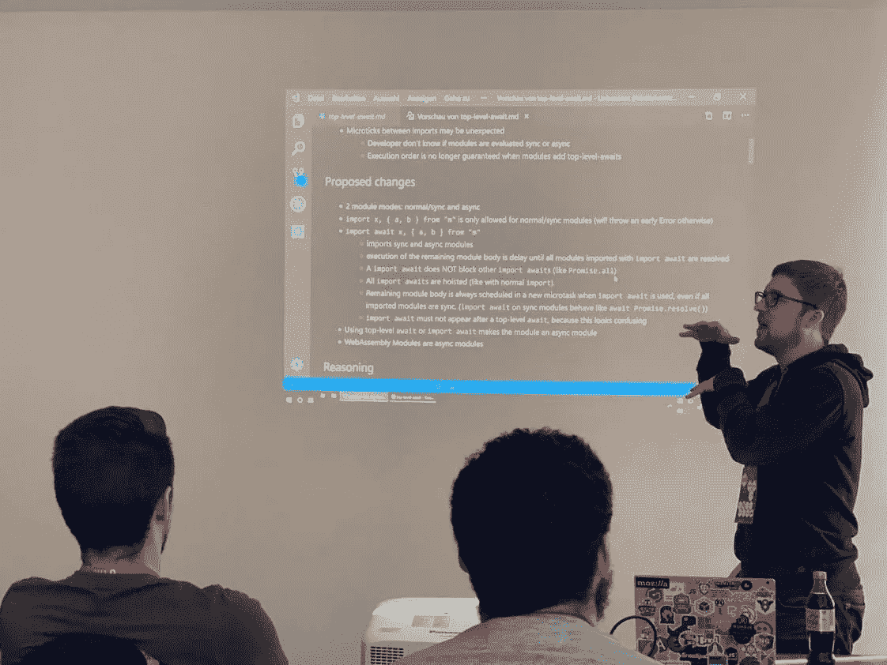
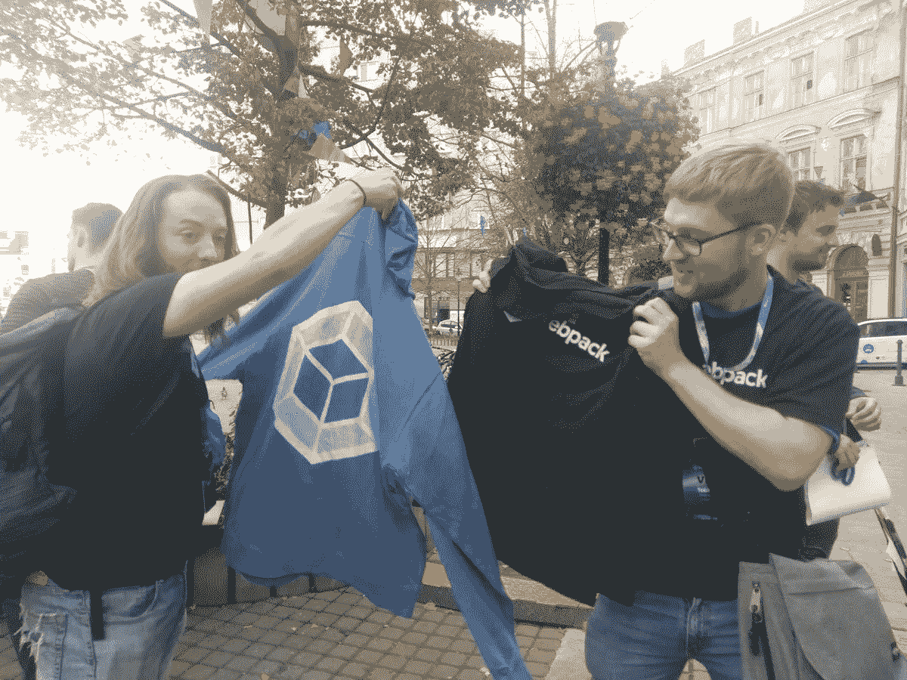
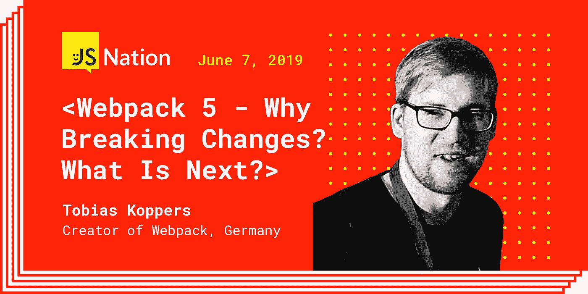

# Tobias Koppers 谈到即将到来的 Webpack 更新:我们的改变并不仅仅是为了惹恼用户

> 原文：<https://levelup.gitconnected.com/tobias-koppers-on-upcoming-webpack-changes-we-are-not-changing-just-to-annoy-users-11c0b234d7b3>

迈克尔·杰斯

## *我们采访了 Webpack* 的创始人 Tobias Koppers

*在这次采访中，Tobias Koppers 分享了 Webpack 背后的故事，以及他是如何在 OSCON 与 Pete Hunt 合作开发 Webpack 的；预测多前端解决方案的未来；并给了我们一些他目前正在研究的东西的提示。Tobias 将于 2019 年 6 月 6 日至 7 日在阿姆斯特丹举行的 JSNation 大会* *上发表演讲。*

## ***托拜厄斯你好，欢迎来到 JS Nation 访谈！给我们介绍一下你自己。***

你好。我很小的时候就对编程感兴趣。我在家看我爸用 C++编程，也开始学了。所以学习计算机科学的决定很容易做出。

## ***你和 Webpack 的故事要追溯到 2016 年。告诉我们这一切是如何开始的？***

大学期间，很多项目都是用 Java 做的。我还尝试用 GWT (Google web Toolkit，Java-to-JavaScript-Compiler)构建一个 Web 应用程序。我在我的学士论文期间开始为开源做贡献。对于演示，我使用了一个名为 jmpress.js 的项目(是的，它是一个 jquery 插件)。我开始发送拉请求，并最终成为维护者。所以我对开源产生了兴趣。

在写硕士论文时，我创建了一个内部 web 应用程序。我在寻找一种方法来优化应用程序(也许我过度优化了，但这是为了论文，我有时间)。我偶然发现了一个名为“modules-webmake”的工具，并尝试使用它。GWT 有一个很好的功能叫“代码分割”，允许按需加载应用程序的一部分。我真的很喜欢它，并希望它在“模块-webmake”中可用。

所以我开了一个议题来讨论这个想法。反馈很好，几天后我就黑出了一个原型。我最初计划将它贡献回项目中，但是我的原型导致了一个完整的重写，带来了新的限制，并且很难合并回来。所以我基本上是把它作为一个单独的项目来创建的。它最初被命名为“modules-webpack ”,但后来我将其重命名为“webpack”。

Webpack 当时只有几个用户，但我根据这几个用户的反馈继续改进它。我相信 webpack 是唯一支持代码分割的捆绑器，这对于大型应用程序来说是一个重要的特性。我想我是幸运的，但 Instagram.com 开始使用它，皮特·亨特在 OSCON 特别提到了它。在那个时候，它变得非常流行。

## ***维护 Webpack 并帮助社区发展的其他核心贡献者是谁？***

我们有太多的贡献者，无法在此一一列举，事实上，我并不真正了解他们所做的工作。我们正试图建立独立的团队来减少团队间的交流(因为时区和不同的可用性)。因此，我正在进行 webpack core repo 的工作，我们有团队负责 CLI、文档、加载器、插件等。

如果你问的是所谓的“核心团队”:这个团队涉及管理和一般事务，但这里发生的事情比你想象的要少。我认为说出几个名字对我们社区中的其他贡献者和维护者来说是不公平的。我没有确切的数字，但我们有大约 20 名定期捐款的贡献者。

Kees Kluskens

## ***说说你最近的项目吧，Rewact。是关于什么的？***

它是 React 应用程序的预编译器的原型，用于改善启动时间和大小。但事实证明，它也有局限性，这可能是个问题。毕竟我不确定这个好处是否值得，所以目前已经停产了。

## ***前端有各种捆绑器和任务运行器，需要不同的开发人员技能，尤其是初级人员。前端解决方案会合并，变得过时，或者彼此激烈竞争吗？***

我认为还会有多个相互竞争的解决方案。我认为这是一件好事。比赛将会带来创新和新的想法。请注意，webpack 也是作为另一个捆扎机的竞争解决方案开始的。

## 你目前还在做其他项目吗？

我在业余时间做一些较小的私人项目。这里有几个关键词:相机、音乐、派对、家庭自动化。

## 在你看来，网络发展的前景如何？

我认为 web 开发的未来看起来非常好。我认为在“web 开发”中开发的技术和技能将会扩展到其他领域。已经开始了。桌面应用程序可以用“网络技术”来开发。是的，还有物联网设备。汽车。咖啡机。我认为，在未来，这些技术将会应用到更多的领域。

这意味着 web 开发人员将能够做更多的事情，但也可能意味着前景变得更加复杂。工具和库必须能够处理更广泛的范围，即对于 webpack，这可能意味着它有望编译到物联网设备，这带来了新的挑战。反正未来会很有意思！

## ***人们如何支持你的项目？***

Webpack 可以在 [OpenCollective](https://opencollective.com/webpack) 上支持。捐款是根据捐款来分配的。它还涵盖了我在 webpack 上的全职工作。

## 近年来，你已经做了许多公开演讲。你最后一次谈的是什么？

我实际上不怎么说话。我不喜欢经常出差，只参加附近的会议。我想我最后一次演讲是在德国鲁尔区，我谈到了 webpack 中的 WebAssembly 集成。

## ***你对 Webpack 的未来有什么预测？***

很难说，尤其是因为我有点偏心。我会尽全力让 webpack 在未来保持相关性。有许多即将到来的规范添加将影响捆绑器(即 WASM/CSS/HTML 模块，顶级-等待)。我看到浏览器试图将规范推到一个捆绑器变得不那么相关的点，但我认为在实践中它们将保持相关。至少对于更大规模的 web 开发来说是这样。

## ***除了 OSS，你还有其他的兴趣爱好吗？***

我喜欢玩棋盘游戏。我也喜欢和我的两个孩子在一起。在过去的一年里，我花了很多时间建造房子，为孩子们提供空间。

## ***对于今年即将在阿姆斯特丹举行的***[***JSNation 大会***](https://jsnation.com) ***，你是否感到兴奋？***

我以前从没去过阿姆斯特丹，所以我认为那里会很棒。我希望能在会议上找到一些人，带我看看这个城市的一些地方。

我将谈论即将到来的 webpack 5，并尝试解释一些突破性变化背后的原因。人们经常抱怨迁移到新的主要版本，所以我想告诉一点我们改变背后的动机。我会试着说明我们并没有随意添加破坏性的改变来烦扰用户。

> 预订座位观看 Tobias 在 JSNation 的演讲

【Soshace.com**的文案玛丽娜·沃龙索娃协助准备了这次采访。Soshace 是一个面向 web 开发者的招聘平台:* [*招聘*](https://soshace.com/for-clients) *一个开发者或者* [*应聘*](https://soshace.com/for-developers) *一个远程工作。**